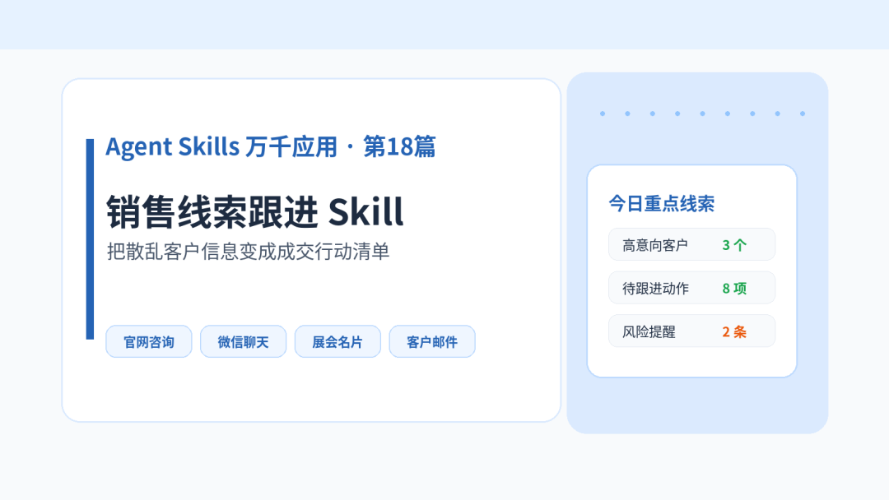
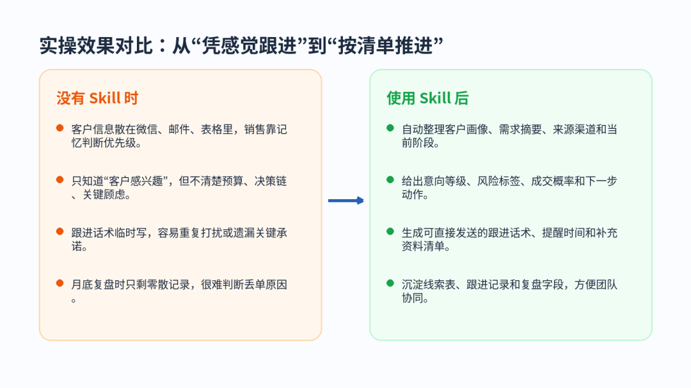
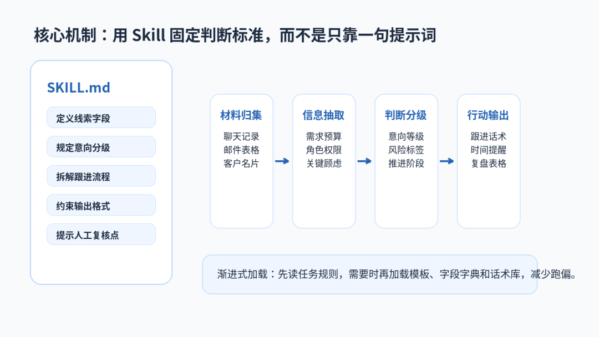
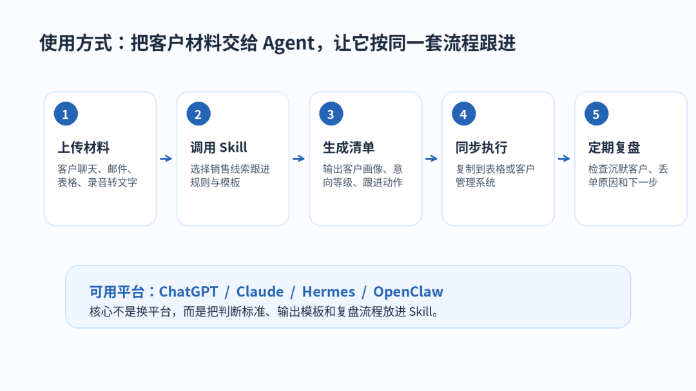

> 📎 来源: [厚国兄](https://mp.weixin.qq.com/s?__biz=Mzk1NzM1MTI1Ng==&mid=2247490487&idx=1&sn=cf4ad64acaba371771eac0dbd8d496d8&chksm=c2b7fab0ca3523adfac76e11c028748239cdff0bb6628d2c96ef885718599bdd34159a9ba28d&mpshare=1&scene=1&srcid=0530iEMbPFdInn1vZjy38Z02&sharer_shareinfo=d62bc5e7d1fd1b7d50a8b2a7887acc5f&sharer_shareinfo_first=d62bc5e7d1fd1b7d50a8b2a7887acc5f) | 时间: 2026-05-30 22:33

---

Agent Skills 万千应用 · 第18篇

销售线索跟进 Skill：把散乱客户信息变成成交行动清单

很多团队不是没有客户，而是客户信息太散。这个 Skill 的目标，是把客户来源、需求、预算、决策链、风险点和下一步动作统一整理出来，让每一条线索都能继续推进。

▌ 1、场景痛点开场

最常见的情况是：客户信息在多个地方出现，但没有形成真正的跟进资产。

销售在微信里记录一句“有兴趣”；客服在表格里写一句“已咨询价格”；老板在群里追问“这个客户还能不能跟”；运营又不知道该给对方发哪个资料。

结果就是，真正高意向客户被拖慢，低意向客户反复消耗时间，团队复盘时也说不清楚为什么丢单。

这个 Skill 的价值，是把“聊天记录”变成“可执行的销售动作”。它不会替代销售判断，但会帮团队先把信息整理清楚、风险标出来、下一步排出来。

▌ 2、Skill 实操效果

案例 1：B2B 软件团队处理展会线索

没有 Skill 时：展会结束后，团队手里有几十张名片、微信聊天截图和一份简单表格。销售只能按印象标记“重点客户”，但客户真正关心的是预算、部署方式、是否支持私有化、谁是决策人，都没有统一记录。

使用 Skill 后输出：

|  |  |  |  |  |
| --- | --- | --- | --- | --- |
| 客户 | 当前阶段 | 关键需求 | 风险等级 | 下一步动作 |
| 华东某制造企业 | 初步评估 | 希望把内部知识库接入客服系统 | 中 | 发送私有化部署方案，约技术负责人演示 |
| 华南某设备商 | 价格比较 | 关注账号数和年度费用 | 高 | 补充报价阶梯，确认是否有预算窗口 |
| 西南某集成商 | 渠道合作 | 想代理行业解决方案 | 中 | 发送合作政策，确认客户资源类型 |

 

同时生成跟进话术：上次您提到更关注私有化部署和内部数据安全，我整理了一份部署说明和实施周期。您这边方便本周安排 30 分钟，我们把技术接入方式和预算范围一起确认一下吗？

这个输出不只是摘要，而是把客户画像、成交阻力、优先级、话术和时间点都放到同一张行动清单里。

  

案例 2：本地服务团队处理抖音和小红书咨询

没有 Skill 时：客户从评论区、私信、微信群、电话里咨询，问题包括价格、位置、预约时间、能不能优惠。运营每天都在回复，但没有沉淀谁是真需求、谁只是随便问问。

使用 Skill 后输出：

|  |  |  |  |  |
| --- | --- | --- | --- | --- |
| 客户来源 | 意向等级 | 推荐动作 | 运营执行清单 | 待复核事项 |
| 小红书私信 | 高 | 推荐体验套餐并引导预约 | 发送价格卡片，确认到店时间 | 是否需要儿童陪同政策 |
| 抖音评论 | 中 | 引导私信补充需求 | 回复标准话术，收集预算 | 是否重复咨询过 |
| 老客户转介绍 | 高 | 直接安排顾问跟进 | 发送专属优惠说明 | 是否需要开票 |

 

Skill 还会把沉默客户单独列出：哪些客户超过 48 小时未回复，哪些客户已经问过价格但没有预约，哪些客户需要二次提醒。这样团队每天看一张表，就知道先跟谁、怎么说、什么时候再追。

▌ 3、Skill 简介

销售线索跟进 Skill 是一个面向销售、客服、运营和小团队老板的 Agent Skill。

它负责把散乱客户材料整理成结构化线索表，并输出跟进计划、话术建议、风险提示和复盘字段。

本篇已配套生成 Skill 包，包含 SKILL.md、scripts、references、templates 和 assets。

目前通用平台上很少有完全贴合中文销售场景的现成 Skill，所以本篇直接生成一个可复用版本，适合后续继续按行业扩展。

典型目录结构：

sales-lead-follow-up-skill-zh-v1/

├── SKILL.md

├── scripts/

├── references/

├── templates/

└── assets/

  

▌ 4、核心机制

普通提示词的问题是：这次让模型“帮我整理客户”，下次让模型“帮我判断意向”，输出字段和判断标准可能完全不一样。

Skill 的作用，是把销售跟进中的关键规则固定下来。第一层是字段标准，客户来源、联系人角色、核心需求、预算信号、决策链、异议点、下一步动作都必须稳定出现。

第二层是判断规则。不是看到客户说“有兴趣”就标高意向，而是要结合预算、时间窗口、决策人、明确需求和回复频率一起判断。

第三层是输出模板。最终不是给一段散文，而是输出线索表、行动清单、跟进话术和复盘建议。第四层是人工复核点，价格承诺、合同条款、特殊优惠都必须提醒人工确认。

这就是为什么 Agent 不能只靠普通提示词。真正稳定的业务执行，需要把流程、模板、边界和复核点沉淀到 Skill 里。

  

▌ 5、使用方式

在 ChatGPT 中，可以把 Skill 包上传或把 SKILL.md 与模板一起作为项目资料，让模型按 Skill 规则处理客户记录。

在 Claude 中，可以把 Skill 放进项目知识库，后续上传聊天记录、客户表格或邮件内容，让 Claude 按固定字段输出线索分析。

在 Hermes 或 OpenClaw 中，可以把 Skill 放到本地技能目录，让 Agent 在处理销售线索任务时自动读取规则、模板和参考资料。

实际使用时，不需要写复杂指令。可以直接说：请使用销售线索跟进 Skill，分析这批客户记录，输出线索分级、跟进动作、风险提醒和话术建议。

更适合团队的方式，是每天固定把新增客户记录丢给 Agent，生成一份“今日线索跟进清单”。

  

▌ 6、避坑指南

第一，不要让 Agent 自己编客户信息。

客户预算、决策人、采购时间，如果材料里没有出现，就必须标记为“待确认”，不能为了表格完整而虚构。

第二，不要只看意向等级。

高意向不等于马上成交。有些客户需求强，但预算没确认；有些客户回复快，但只是比价。必须结合风险等级和下一步动作一起看。

第三，不要把话术写得太激进。

销售跟进需要推进，但不能过度承诺价格、效果、交付时间。Skill 应该提醒哪些话术需要人工确认。

第四，不要忽略沉默客户。

很多线索不是明确拒绝，而是聊着聊着断了。Skill 要单独输出超过 24 小时、48 小时、7 天未回复的客户，并给出不同提醒方式。

第五，不要把所有行业用一套模板。

软件、门店、教育、咨询、跨境电商的线索字段不完全一样。通用模板只能作为底座，最好按行业继续扩展字段和话术库。

▌ 7、下期预告

下一篇我们继续做一个非常实用的办公场景：客户访谈洞察 Skill。它会把访谈录音、会议纪要、用户反馈整理成需求洞察、痛点优先级和产品改进建议，帮助团队从“听了很多客户声音”变成“知道下一步该改什么”。

▌ 配套资源

本篇配套 Skill 包：

sales-lead-follow-up-skill-zh-v1.zip。

链接：https://pan.quark.cn/s/c0fb8d0aa0af
