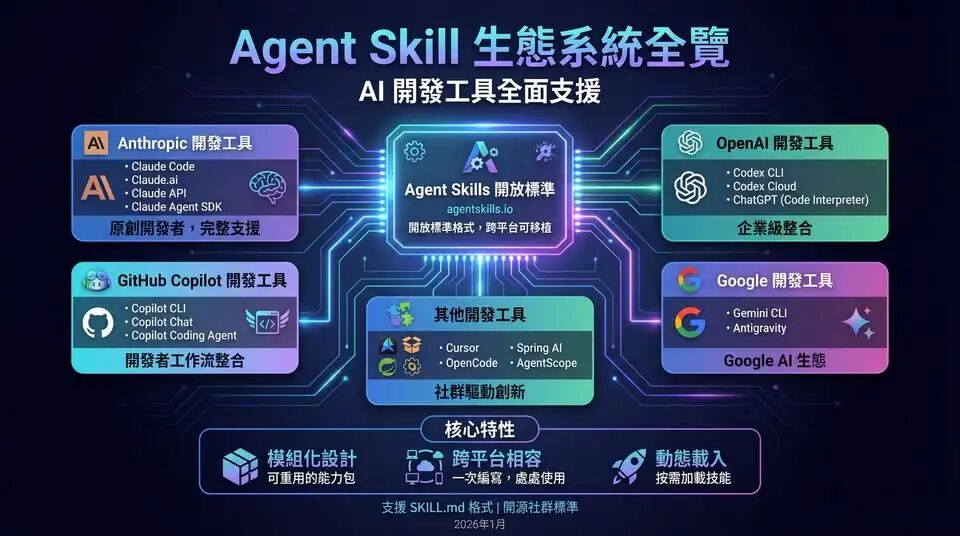
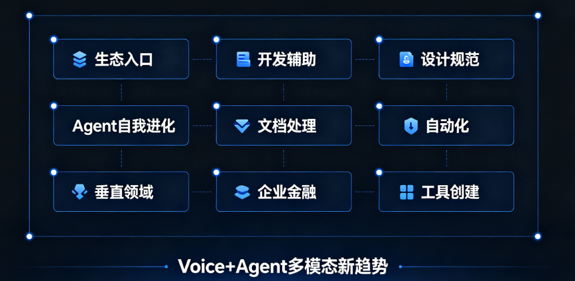
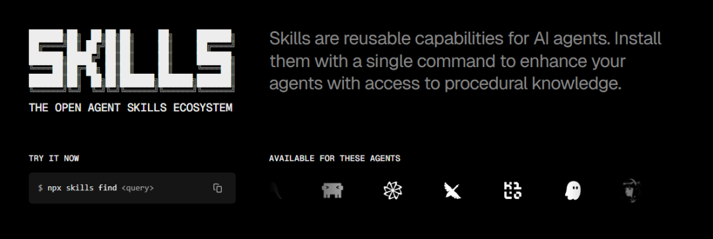

> 📎 来源: [牛码架构](https://mp.weixin.qq.com/s?__biz=MzI5MDEwNTYxNw==&mid=2649430017&idx=1&sn=3f208e36866c3545f68668e81bc5e5d3&chksm=f56289f6350baf4f5631af489372e29bcc996d5ac43f752abcdf7fb1d76addaa326b8834e9d7&mpshare=1&scene=1&srcid=05188W4DVByvf14QRFaIKSQP&sharer_shareinfo=349f6ac7b8943b3263d6e8d2bd5e0925&sharer_shareinfo_first=349f6ac7b8943b3263d6e8d2bd5e0925) | 时间: 2026-05-18 01:57

---

> 2026年5月，Skills 正在取代 MCP 成为 AI Agent 开发的新标准。 Karpathy 的 Skills 一周突破 10 万星，Matt Pocock 的 Skills 集合稳坐 Trending 头部，整个 AI Agent 生态正在围绕 Skills 构建。本篇文章将系统梳理当前最火的 Skills，从为什么火、怎么选、怎么用三个维度给出一份可操作的完整指南。

---

## 一、为什么 Skills 在 2026 年 5 月彻底爆发

## 

### 1.1 从"问 AI"到"用 AI 做事"——范式转移

2025 年之前，大多数人用 AI 的方式是：打开对话框，问一个问题，AI 给一个答案，结束。

2026 年，这个模式正在崩塌。AI 的定位正在从"对话助手"变成"数字员工"——它不再只回答问题，而是开始**动手做事**：订票、查数据、写代码、自动化流程、自动交付结果。

这个转变催生了一个核心需求：**AI 需要携带"工具包"，而不是每次从零开始摸索**。这就是 Skills 爆发的根本原因。

### 1.2 Skills vs MCP：一个更聪明的竞争者

MCP（Model Context Protocol）在2025年曾是 Agent 扩展的主流方案——它定义了 AI 如何调用外部工具。但 MCP 有个根本性问题：**它定义了"怎么连接"，但没有定义"装什么技能"**。

Skills 则更进一步：它不仅是工具协议，更是一套完整的**经验封装体系**。一个 Skill 可以包含：

- 工具定义（Tool Schema）
- 使用规范（最佳实践）
- 提示词模板（System Prompt）
- 执行工作流（Step-by-Step）

换句话说：**MCP 解决的是"手"的问题，Skills 解决的是"能力"的问题。** 一个 Agent 有了 MCP，可以伸手；但有了 Skills，才真正拥有了技能。

> 本周 GitHub Trending 最显著的信号：Skills 正在取代 MCP 成为 AI Agent 开发的新标准。

### 1.3 数据说话：Skills 生态有多热

| 指标 | 数据 |
| --- | --- |
| find-skills 安装量 | **579K+** （全生态最高） |
| GitHub Trending 上榜次数 | Skills 类项目连续 8 周占据前 5 |
| 新增 Star 速度 | mattpocock/skills 单周 +4K stars |
| karpathy-skills | 10 万星仅用一周 |
| Superpowers | 160K+ stars，Claude Code 技能库之王 |

---

## 二、2026年5月热门 Skills 完整排行榜

> 数据来源：Skills 中文站 (cc-ai.cn)、GitHub Trending（2026年4月27日-5月11日）、CSDN 热门文章

> **筛选标准**：安装量 10K+ / 经过社区验证 / 维护活跃 / 文档完善 / 覆盖不同场景

### 🏆 第一梯队：必装基础技能（生态入口级）

#### 1. find-skills（安装量 579K+，全生态第一）

```
定位：探索和发现其他优质Skills的入口
```

**为什么是第一？**

find-skills 是整个 Skills 生态的搜索引擎。它能让你从 20 万+ Skills 中精准筛选、推荐、安装——把找工具的时间从数小时缩短到几分钟。

本质上，它是 **Skills 生态的"应用商店搜索框"**。任何使用 AI Agent 的人都应该第一个装它。

---

#### 2. Superpowers（⭐ 160K+，Claude Code 技能库之王）

```
定位：ClaudeCode核心技能库
```

**核心功能（五合一）：**

1. **自动代码审查** — 每次提交自动检查代码质量
2. **智能重构** — 识别可优化点并自动重构
3. **语义重复检测** — 找"功能相同但写法不同"的代码（不是语法重复，是语义重复）
4. **Git 工作流优化** — 自动处理 rebase、merge、冲突解决
5. **上下文理解** — 理解整个项目结构，而不只是当前文件

Superpowers 是 2026 年 Claude Code 生态最受欢迎的 Skills。它的语义重复检测是亮点——不是找语法一样的代码，而是找功能一样但写法不同的代码，这个能力在大型代码库中极其实用。

---

#### 3. andrej-karpathy-skills（⭐ 100K+，方法论之王）

```
定位：Karpathy的 LLM 编程四原则精华
```

**核心价值：**

这个仓库本身没有多少代码——核心价值是 Karpathy 提炼的 Prompt 工程方法论。把这个 CLAUDE.md 直接 drop 进任何 Claude Code 项目，就能显著改善 Agent 的行为质量。

适用于：希望 AI 给出更精准、更可靠回答的开发者。

---

#### 4. mattpocock/skills（⭐ 60K+，TypeScript 教育者出品）

```
定位：跨 IDE 的TypeScript/React/Node/Python/Rust标准Skills
```

Matt Pocock 是过去 5 年最大的 TypeScript 教学品牌。他在 2026 年把自家 

```
.claude/skills
```

 目录开源，成为 Skills 框架的事实标准模板。

覆盖语言：TypeScript / React / Node / Python / Rust / Vue / Go

---

#### 5. Frontend Design（Anthropic 官方出品）

```
定位：干掉 AI 生成网页的"AI味"
```

**核心设计理念（反直觉）：**

AI 生成网页质量差，不是因为模型不够强，而是因为没有给 AI 一个**明确的美学方向**。Frontend Design 的解决思路是：

1. **先定方向，再写代码** — 极简主义 / 复古未来风 / Art Deco / 解构主义，必须明确
2. **硬性禁止**：

- ❌ 禁止 Inter / Roboto / Arial（烂大街字体）
- ❌ 禁止紫色渐变配白底（经典 AI 审美）
- ❌ 禁止千篇一律的卡片布局

1. **方向驱动所有决策** — 排版、留白、字体、动效全部围绕既定方向展开

如果你用 Claude Code 生成过网页，试一下 Frontend Design，感受会很明显。

---

### 🥈 第二梯队：垂直领域高价值技能

#### 6-9. 文档四件套（docx / xlsx / pdf / pptx）

```
定位：文档处理的工业标准
```

**解决的问题：**

不装这些 Skill，Agent 处理文档的输出质量看运气。装了之后，最佳实践被固化，输出稳定可预期：

| Skill | 核心能力 |
| --- | --- |
| **docx** | 统一 Word 样式系统、页眉页脚、目录结构 |
| **xlsx** | 规范表格格式、公式处理、样式标准化 |
| **pdf** | 格式保持的转换流程、质量保真 |
| **pptx** | 幻灯片母版、配色方案、批量生成 |

> 💡 **为什么这四个重要**：大部分人的 AI 使用场景，80% 涉及文档处理。这四个 Skill 把文档输出质量稳定在一个高水平线上，大幅降低"看运气"的概率。

---

#### 10-13. 自动化技能全家桶

| Skill | 功能 | 安装量 |
| --- | --- | --- |
| **ai-web-automation** | 全场景浏览器自动化 | 高 |
| **web-form-automation** | 表单自动填写与提交 | 高 |
| **web-pilot** | 复杂网页任务全流程自动化 | 中高 |
| **desearch-web-search** | 新一代实时互联网搜索 | 快速增长 |

这四个 Skill 共同构成了"让 AI 真正动手"的工具链——从搜索信息，到操作网页，到填写表单，到执行完整任务。

---

### 🥉 第三梯队：Agent 自我进化类（最前沿）

#### 14. capability-evolver（自我进化引擎）

```
定位：Agent的"自我进化引擎"
```

**工作原理：**

1. Agent 完成一个任务
2. 从任务执行过程中提取经验和方法论
3. 在沙箱环境中对模型做微调（Fine-tuning）
4. 把优化后的能力同步给下一个任务
5. 循环往复 → Agent 越用越强

**类比**：这相当于 Agent 每干一件事，就比之前干得更好一点。不是记住答案，而是学会方法。

---

#### 15. self-improving-agent（强化学习优化执行逻辑）

```
定位：优化Agent拆解任务和执行步骤的方式
```

capability-evolver 优化的是**模型层**（AI 变得更聪明），self-improving-agent 优化的是**执行逻辑层**（AI 做事的方式变得更对）。

它通过强化学习，持续打磨 Agent 拆解任务、执行步骤、回退重试的策略。

**特别值得关注**：这是整个 TOP20 Skills 里**唯一零差评记录**的 Skill，星级评分最高。

---

#### 16. skill-creator（37.4K 安装）

```
定位：创建自定义Skill的核心工具
```

把个人经验和重复流程封装成 AI 能力。安装后，重复性工作自动化率提升 80%。

如果你有自己独特的工作流程，skill-creator 是打造个人工具库的必备入口。

---

### 🎙️ 特别提及：Voice + Agent 崛起

2026年5月的 GitHub Trending 出现了一个新趋势：**Voice + Agent** 类项目异军突起。

代表性项目：

- **语音备忘录转文字 + AI 分析**（Termux 环境下的 Hermes Agent 语音功能）
- **实时语音对话**（GPT-4o 发布，实时语音+视频交互延迟 < 500ms）
- **多语言语音 Agent**

这意味着 Skills 生态正在从"文字+代码"扩展到"语音+多模态"——预计未来 3 个月会有大量语音类 Skills 上榜。

---

## 三、Skills 生态全景地图（2026年5月）



##

## 四、Skills 快速上手指南



### 4.1 安装顺序建议（按优先级）

```
第一步：安装 find-skills（生态入口，必须）
```

### 4.2 三大 Skills 市场

| 市场 | 地址 | 特点 |
| --- | --- | --- |
| **Vercel Skills** | https://skills.sh | 官方市场，量大 |
| **SkillsMP 中文站** | https://skillsmp.com/zh | 中文友好，本地化 |
| **MCP Market** | https://mcpmarket.com/daily/skills | MCP + Skills 双支持 |
| **Skills 中文站 TOP100** | https://cc-ai.cn/skills-cn/frontend/index.html | 排行榜单，直观 |

### 4.3 IDE 兼容一览

| IDE | 兼容 Skills | 说明 |
| --- | --- | --- |
| **Claude Code** | ✅ 全面支持 | Superpowers、karpathy-skills 首发平台 |
| **Cursor** | ✅ 全面支持 | mattpocock/skills 兼容 |
| **VS Code** | ✅ 全面支持 | Vercel 官方支持 |
| **JetBrains (IDEA/PyCharm)** | ✅ via ACP 集成 | Hermes Agent 支持 |
| **Zed** | ✅ via ACP | Hermes Agent 支持 |
| **OpenClaw** | ✅ 兼容 Skills 生态 | 支持 OpenClaw → Hermes 迁移 |

---

## 五、一个有趣的现象：Harness Engineering（马鞍工程）

Anthropic 工程师团队在 2026 年 5 月提出并实践了一种新方法——**Harness Engineering（马鞍工程）**。

**核心思路：**

AI Agent 不再是"单枪匹马的野马"，而是被一套完整系统"套上了马鞍"：

```
Planner（规划器）→拆解为200+个结构化任务
```

**效果：**

任务完成率大幅提升，错误率显著下降。

这个方法的出现，意味着 AI Agent 正在从"让 AI 自己摸索"走向"给 AI 配一套工作系统"——这正是 Skills 的价值所在：把最佳实践固化成可复用的工具包，而不是每次都让 AI 从零开始。

---

## 六、结语：Skills 是 2026 年 Agent 领域最重要的创新

> **简单理解：模型是大脑，Agent 是躯体，Skills 是双手。**

> 现在只是学会怎么"问"AI，其实已经有点不够了。

> 2026年5月的 Skills 生态，正在让 AI 从"能回答"进化到"能做事"，从"聪明"进化到"可靠"，从"单兵"进化到"团队协作"。

如果你还没有开始使用 Skills，建议从 find-skills 开始——它本身就是用来找 Skills 的工具。用它探索整个生态，找到最适合自己的技能组合。

关注牛码架构免费领取AI教程

相关阅读：

[Claude Code 最值得装的 10 个 Skills：不用不知道，一用直接离不开](https://mp.weixin.qq.com/s?__biz=MzI5MDEwNTYxNw==&mid=2649429645&idx=1&sn=1765b1edba8a3c1eb0d945c69ffee24e&scene=21#wechat_redirect)

[Claude Code 最值得装的 10 个 Skills：翻遍全网总结，好用到让生产力翻 10 倍！](https://mp.weixin.qq.com/s?__biz=MzI5MDEwNTYxNw==&mid=2649429580&idx=1&sn=fd6c9c1310bb0c033d2975ec0a1ec4ae&scene=21#wechat_redirect)

[GitHub 23.8k Star, ClaudeSkills开源项目2026年最值得关注的AI玩法](https://mp.weixin.qq.com/s?__biz=MzI5MDEwNTYxNw==&mid=2649428774&idx=1&sn=494ba347fda334231f54d0bb01adb0c9&scene=21#wechat_redirect)

[分享：一个人公司 OPC 必备的 10 个 Skill](https://mp.weixin.qq.com/s?__biz=MzI5MDEwNTYxNw==&mid=2649429869&idx=1&sn=7681eabac3f9544972ee39b4da2dc6ab&scene=21#wechat_redirect)
