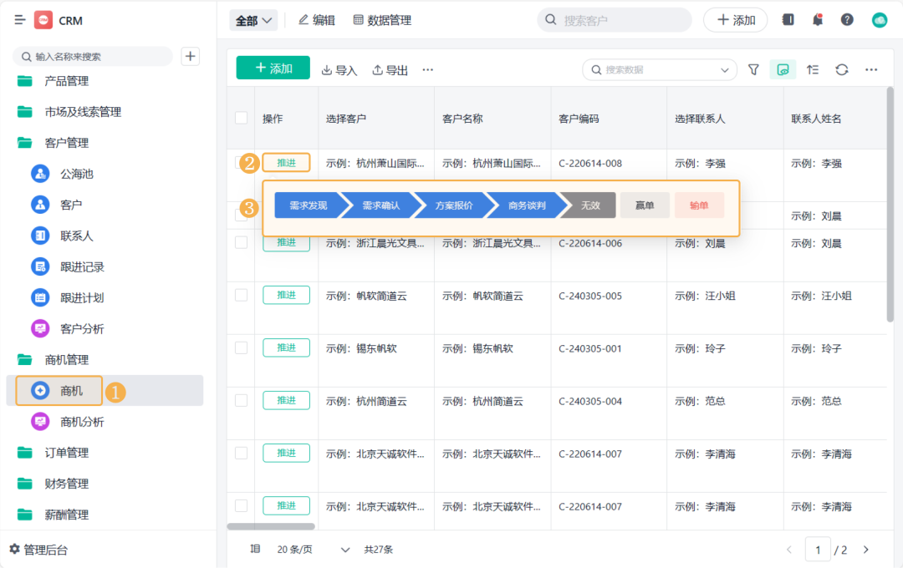
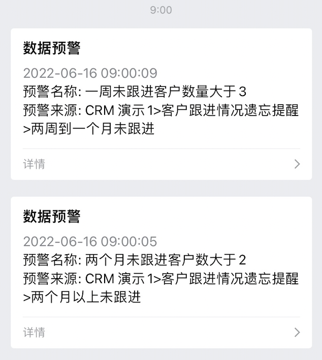
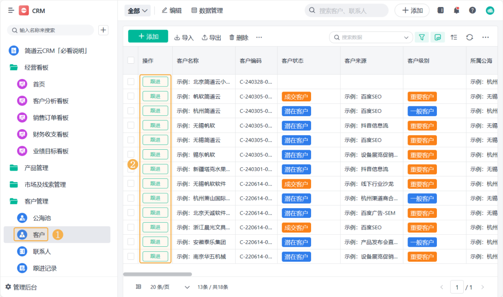
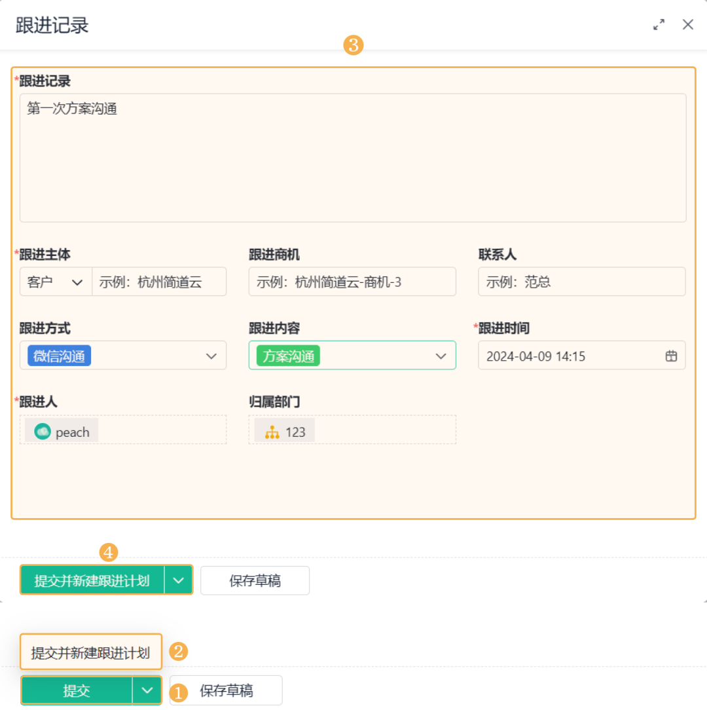
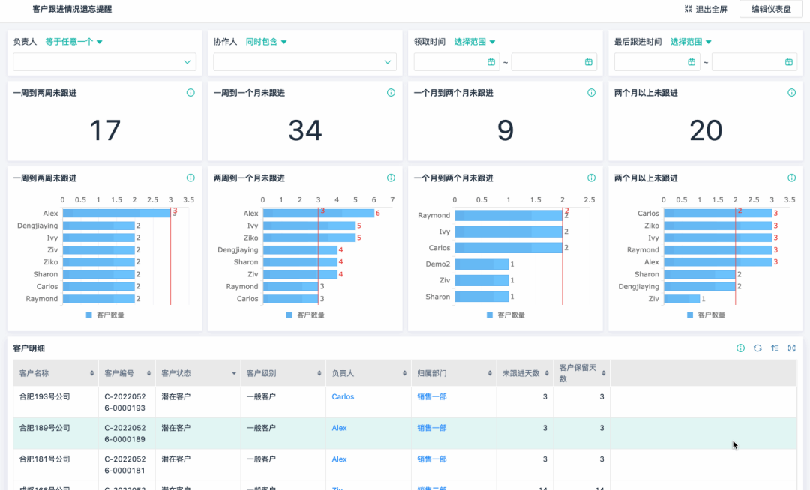

> 📎 来源: [ziko聊销售管理](https://mp.weixin.qq.com/s?__biz=MzYyMzE0MzE4OQ==&mid=2247486410&idx=1&sn=48af3a82d305afdb01b33cda1fe0d475&chksm=fe2f6a2306c58640d06a8a3c52c93f6737e2bb864665222985a2344761090e4ed16bf1dfb5bf&mpshare=1&scene=1&srcid=0509ZemXfqNpGrNcyDthftnj&sharer_shareinfo=00dec29b5bb6713a462d9e13a77a583c&sharer_shareinfo_first=00dec29b5bb6713a462d9e13a77a583c) | 时间: 2026-05-09 14:08

---

**ziko**——**简道云**旗下的数字化解决方案研究专家，专为中小企业量身打造高性价比的数字化转型路径！

文中涉及到的**所有系统都做成了模板**，文末戳**【阅读原文】**自取即可！

**点击蓝字**

**关注我们**

很多公司做客户管理，表面看起来很忙：客户加了一堆、销售每天在聊，CRM也有。但一到月底复盘就很尴尬：

- 有些客户聊着聊着就没了
- 有些客户明明有意向但没人跟
- 有些报价发出去就石沉大海

问题其实不复杂：**不是客户不行，是跟进没有系统。**

今天这套东西，就解决一个问题——让客户自动被跟进，而不是靠销售记忆去跟进，目标就两个：

- **不漏客户（自动提醒）**
- **不乱跟客户（自动节奏 + 自动话术）**

文中示例CRM系统——简道云CRM

模板可直接使用>>**https://s.fanruan.com/ulhqw**

**一**

**这套系统最终长什么样（先看结果）**

你先别管怎么做，先看做完之后是什么状态：

**1**

**每个客户都有一个状态**

系统里客户只分5类：

- 线索客户
- 意向客户
- 跟进客户
- 报价客户
- 成交客户

没有模糊状态。

**2**

**每个客户都有下一次跟进时间**

不是有空再联系，而是：

- 2026/05/08 必须跟进
- 2026/05/12 必须跟进

时间是确定的，不是感觉。

**3**

**系统自动做3件事**

到时间自动：

- 提醒销售（待办/消息）
- 告诉你这个客户该做什么动作
- 给你一段可以直接复制的跟进话术

**4**

**销售的工作变成这样**

以前是“我今天要不要联系这个客户？”

现在是“系统告诉我今天该联系谁 + 怎么说”。

**二**

**整套系统其实就3层结构**

不用复杂，所有客户系统都可以拆成3层：

**1**

**第一层：客户分层（解决“跟谁”）**

核心只有一句话：客户必须清楚属于哪一类，直接用这5个阶段：

- 线索客户（刚进来）
- 意向客户（有需求）
- 跟进客户（在沟通）
- 报价客户（推进中）
- 成交客户（或流失）

**关键规则：**

- 一个客户只能属于一个阶段
- 阶段变化必须有触发动作

**2**

**第二层：跟进节奏（解决“什么时候跟”）**

这是系统的核心，我们直接给一套可执行标准：

**【意向客户标准节奏】**

- D0：首次沟通
- D3：二次触达
- D7：重点推进
- D15：强化跟进
- D30：最后唤醒

**关键点：**所有客户都按时间节点走，不允许销售自由发挥节奏

**3**

**第三层：触达内容（解决“说什么”）**

很多系统死就死在这里：只提醒，不告诉你说什么，所以必须补上动作库：

**三类标准话术**

1）破冰类（首次/初期）

用于建立联系：“上次聊到你们这个需求，我整理了一版更具体的思路，可以帮你快速看一下…”

2）推进类（中期）

用于推动需求：“这个问题我帮你拆了一下，其实可以先从三个点切进去解决…”

3）促单类（后期）

用于成交：“这个方案本周可以帮你锁资源，如果后面再调整，成本会更高一些…”

**系统的作用就是：到时间 + 推送提醒。**

**三**

**2小时搭建步骤**

这一步就是核心实操，不讲废话。

**1**

**第1步：建客户基础表**

不需要复杂系统，先把数据结构搭出来。字段就这些：

- 客户名称
- 联系方式
- 当前阶段
- 负责人
- 上次跟进时间
- 下次跟进时间
- 跟进备注

这一张表就是整个系统的数据库

**2**

**第2步：设计自动跟进规则**

这是系统能不能跑的关键，逻辑很简单：当客户进入某个阶段时，自动生成节奏。举例：

**如果客户进入“意向客户”，系统自动生成：**

- 第3天 → 跟进提醒
- 第7天 → 跟进提醒
- 第15天 → 跟进提醒
- 第30天 → 唤醒提醒

本质是什么？**把销售判断变成系统规则**

**3**

**第3步：做自动提醒（核心功能）**

这里分两种做法：

**方式1：轻量工具（推荐）**

比如用类似简道云这种工具，实现逻辑：到“下次跟进时间” ，自动生成待办任务，自动推送给销售

**方式2：Excel+日历（最低配）**

- Excel记录客户
- 手动填“下次跟进时间”
- 用日历提醒

能用，但无法规模化。

**关键点：**不管哪种方式，本质都是“时间到了 → 系统提醒你做事”

**4**

**第4步：加上自动触达内容**

这一步决定系统有没有价值感。

**做一件事：建立话术库**

只需要三类模板：

**破冰模板** “上次你提到XX问题，我这边有个补充思路…”

**推进模板** “这个需求可以拆成三个步骤来推进，我帮你整理了一下…”

**促单模板** “目前这个方案可以帮你锁定资源窗口，后面调整成本会增加…”

系统逻辑：到时间提醒 + 自动提示用哪类话术

**四**

**系统运行逻辑**

整套系统其实就是一条链：

1. 客户进入系统
2. 自动打标签（阶段）
3. 自动生成跟进计划（时间点）
4. 到时间自动提醒
5. 推送话术模板
6. 销售执行跟进
7. 记录结果反馈系统

然后进入下一轮优化，这套系统最终带来的真实变化

**1**

**客户不会再“忘”**

因为所有跟进都被系统安排好了

**2**

**跟进节奏完全统一**

不会再出现有人天天跟，有人一个月不动，全部按规则走

**3**

**销售不用再想今天联系谁**

系统直接告诉你联系谁、为什么联系、怎么说

**4**

**转化效率提升（核心结果）**

原因很直接：

- 跟进更及时
- 节奏更合理
- 触达更标准

**五**

**最后总结一句话**

这套系统的本质不是工具，而是三件事：

- 把客户分清楚
- 把节奏定死
- 把动作标准化

文中涉及到的**CRM模板**

点击文末「阅读原文」即可体验！
