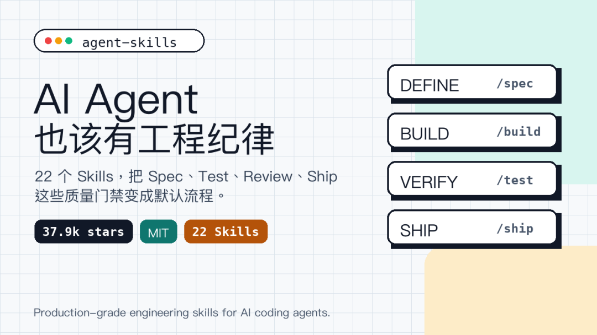
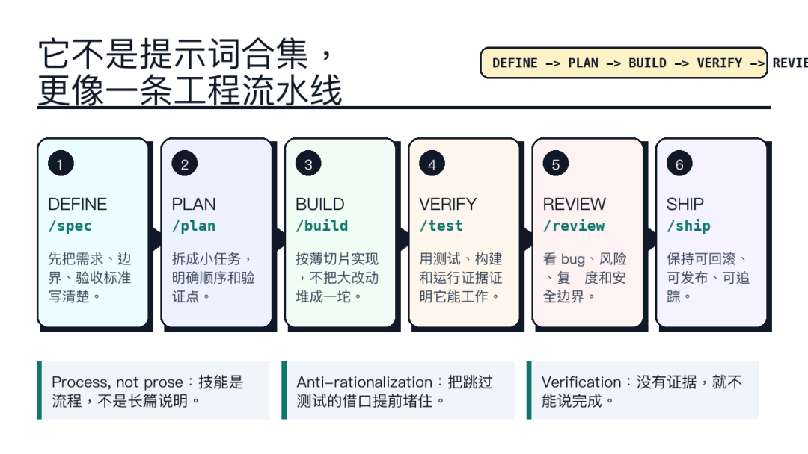

> 📎 来源: [梦飞来晚了](https://mp.weixin.qq.com/s?__biz=MzI1OTY4OTYwNw==&mid=2247484177&idx=1&sn=fb09aa8528c04aa34fb0ab767c46f9f5&chksm=eb8877a259cd00bef2481b4dbc06f94020a1a4a9fbab06a696ea63d3cdb2808c6a9f776ac3b4&mpshare=1&scene=1&srcid=0512NR7LeIP51Sk4FoKxKS9x&sharer_shareinfo=e83c8f4d048dc5ff4418f29b6f6f582c&sharer_shareinfo_first=e83c8f4d048dc5ff4418f29b6f6f582c) | 时间: 2026-05-12 10:56

---

# agent-skills不是又一个提示词合集。它把需求澄清、计划拆解、增量实现、测试验证、代码评审和发布交付写成一组可加载的SKILL.md，让 AI coding agent 不只会写代码，还要按工程流程收尾。

我又来晚了。

这次补的是 Addy Osmani 最近开源的一个项目：agent-skills。

它在 GitHub 上的官方 tagline 是：

Production-grade engineering skills for AI coding agents.

翻成大白话，就是：给 AI coding agent 用的生产级工程技能包。

截至 2026-05-11，GitHub API 显示addyosmani/agent-skills已经有 37,915 stars、4,221 forks、85 open issues，许可证是 MIT License，默认分支是main。

这个热度不奇怪。

过去一年，大家已经习惯让 Claude Code、Cursor、Codex、Gemini CLI 这类工具写代码。问题也随之变得很明显：Agent 写得很快，但也很容易跳过需求澄清、测试、评审、回滚边界这些工程动作。

agent-skills想解决的就是这个问题。



agent-skills 头条封面

# 它不是提示词合集

很多人一看到 skills，会以为这只是“更长的提示词”。

但agent-skills的设计重点不是让 Agent 说得更聪明，而是让它按流程做事。

README 里写得很清楚：Skills encode the workflows, quality gates, and best practices that senior engineers use when building software.

也就是说，它把资深工程师平时会做、但 Agent 经常偷懒跳过的动作拆成了流程。

比如：

- 需求不清楚时，先走 spec-driven-development，把目标、命令、目录结构、代码风格、测试策略和边界写清楚；
- 写功能时，用 incremental-implementation，按薄切片实现，不把一堆改动堆到最后；
- 改逻辑时，用 test-driven-development，先写能失败的测试，再实现，再重构；
- 收尾时，用 code-review-and-quality 和 git-workflow-and-versioning，看风险、看复杂度、看提交是否原子。

这些听起来都不新。

但对 AI Agent 来说，问题恰恰不在“知道不知道”，而在“会不会稳定执行”。

# 7 个命令，串起一条交付线

agent-skills给 Claude Code 准备了 7 个 slash commands：

```
/spec
```

这 7 个命令基本对应一条开发生命周期：定义要做什么，拆计划，写代码，跑验证，做评审，简化代码，最后发布。

仓库里的示意图也很直白：

```
DEFINE -> PLAN -> BUILD -> VERIFY -> REVIEW -> SHIP
```

这就是它和普通 prompt pack 的区别。

普通 prompt pack 往往教 Agent “怎么回答”。

agent-skills更像是在给 Agent 装一套工作规程：什么时候停下来确认假设，什么时候写测试，什么时候拒绝“看起来差不多”，什么时候不能碰无关文件。



agent-skills 生命周期结构图

# 最有价值的是反借口表

我翻了几个具体 skill，最有意思的不是步骤，而是它们都在防 Agent 给自己找借口。

比如test-driven-development里有一张 Common Rationalizations 表。

里面专门写了几类常见偷懒方式：

- “我可以等代码写完再补测试”；
- “这个太简单了，不需要测”；
- “我手动试过了”；
- “这是原型，不用那么严格”。

每一条后面都给了反驳。

这很贴近真实使用体验。

AI Agent 最大的问题不是不会讲最佳实践，而是很会在上下文压力、时间压力、工具失败时，把最佳实践放到一边。它会说“看起来没问题”，会说“应该可以”，会说“我已经验证过”，但实际可能只是读了一遍代码。

agent-skills把这些借口写进 skill 里，就是在逼 Agent 回到证据上。

没有测试输出，就不要说测试通过。

没有构建结果，就不要说构建没问题。

没有看 diff，就不要随便提交。

# 支持的不止 Claude Code

虽然 README 里 Claude Code 是推荐安装方式，但这个项目不只服务 Claude。

Claude Code 可以这样装：

```
/plugin marketplace add addyosmani/agent-skills
```

如果 SSH clone 有问题，也可以用 HTTPS 方式添加 marketplace。

其他工具也有对应接法。

Cursor 可以把SKILL.md放进.cursor/rules/；Gemini CLI 可以用gemini skills install；Windsurf、OpenCode、GitHub Copilot、Kiro 也都有说明。至于 Codex 或其他 agent，本质上只要能加载 Markdown 指令，就能使用这些 skill。

这点很重要。

它不是绑定某一个模型能力，而是把工程流程写成可迁移的 Markdown。模型会换，IDE 会换，但 spec、test、review、ship 这些动作不会很快过时。

# 它适合谁

我觉得agent-skills最适合三类人。

第一类，是已经重度使用 AI coding agent 的开发者。

如果你每天都让 Agent 改代码、跑测试、写 PR，那你需要的不是更多“神奇提示词”，而是让它少跳步骤、少乱改文件、少在没证据时宣布完成。

第二类，是团队里的工程负责人。

Agent 进入团队以后，真正难管的不是它能不能生成代码，而是它生成的代码怎么进入现有工程制度。agent-skills这种流程包，至少提供了一个可以讨论的起点。

第三类，是想给自己项目沉淀 rules / skills 的人。

这个仓库可以当模板看：一个好 skill 不只是“请你认真一点”，而是要写清楚触发场景、步骤、验证方式、常见偷懒借口和红旗信号。

# 也别把它想成魔法

当然，它不是装上就自动变强。

第一，流程会增加显式步骤。小改动如果也完整套一遍 spec、plan、review，可能会显得重。

第二，skills 不能替你理解业务。它能提醒 Agent 问清楚边界，但不能替团队决定什么才是正确需求。

第三，加载太多 skill 也会占上下文。README 自己也提醒，应该按任务选择相关 skill，而不是一次把所有内容塞进去。

第四，它默认强调工程质量。如果你只是做一次性 demo，可能会觉得它太保守。但如果你要把 Agent 产出的代码放进长期维护的仓库，这种保守反而是优点。

# 梦飞的判断

agent-skills真正值得看的地方，不是 37.9k star。

星标只能说明大家对这个方向有兴趣。

它有价值的地方，是把 AI coding agent 的讨论从“怎么写出更多代码”拉回到“怎么把代码交付得更稳”。

过去我们夸 Agent，常说它写得快、会改 bug、能补测试、能生成文档。

但工程里最麻烦的部分，经常不是写第一版代码，而是需求有没有说清、变更有没有边界、测试有没有证据、提交能不能回滚、评审能不能看懂。

agent-skills把这些动作写成了 skill。

这不是很炫的方向，但很实用。

如果你已经在项目里用 AI Agent，建议先别急着全量安装。可以从三个基础 skill 开始看：spec-driven-development、test-driven-development、code-review-and-quality。

这三个能先补上最常见的坑：需求靠猜、测试靠嘴、评审靠感觉。

热点来晚了，但瓜更熟。梦飞帮你补错过的全网热事。

原文链接

https://github.com/addyosmani/agent-skills
