> 📎 来源: [土木工程Ai](https://mp.weixin.qq.com/s?__biz=Mzk0MTYzNTg2NA==&mid=2247487156&idx=1&sn=c3bec5eea2923d947ad1b6132fa6bd1a&chksm=c314fe91712db6d46563920b7116a9155d17255d43c3235ce4d97a858336f7f0726fdbc453b5&mpshare=1&scene=1&srcid=0522n4BOthfAlWp1C0UeBnv9&sharer_shareinfo=2aa8e7b58bae56a926bb5c30b97c3e28&sharer_shareinfo_first=2aa8e7b58bae56a926bb5c30b97c3e28) | 时间: 2026-05-22 22:24

---

关注公众号，掌握全球最前沿工程AI咨询

第一款：text-to-cad

https://www.cadskills.xyz/

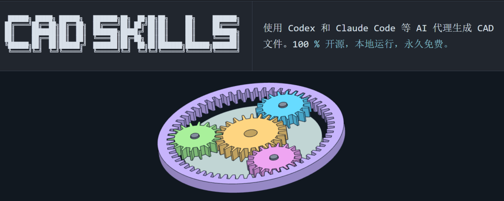

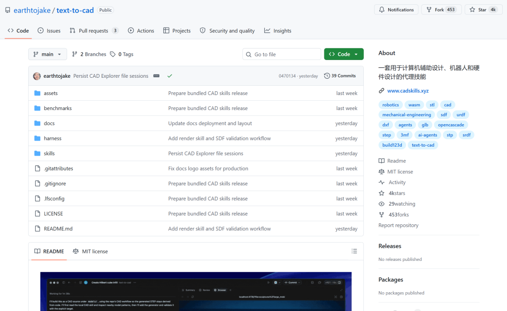

## ✨ 特点

- **生成**

  - 使用 Codex 和 Claude Code 等编码代理创建受源代码控制的 CAD 模型。
- **导出**

  - 生成 STEP、STL、3MF、DXF、GLB、拓扑数据和 URDF/SRDF/SDF 机器人描述。
- **浏览**

  - 在 CAD Explorer 中检查生成的几何图形、展开图和机器人描述文件。
- **来源**

  - 从托管的 step.parts 目录中查找和下载现成的 STEP 部件。
- **参考**

  - 复制稳定的 `@cad[...]` 参考，以便代理可以进行精确的后续编辑。
- **复习**

  - 在迭代循环期间渲染快速复习图像以进行快速检查。
- **复现步骤**

  - 先编辑源文件，然后重新生成显式目标。
- **本地运行**

  - 在本地运行工具、技能和渲染查看器，无需后端托管。

## 🧰 技能

- **CAD**

  - STEP、STL、3MF、DXF、GLB/拓扑结构、渲染图像和 `@cad[...]` 几何体引用。 捆绑技能 · 独立仓库
- **渲染**

  - 启动或重用 CAD Explorer，返回可视化查看链接，并为生成的 `.step`、`.stp`、`.glb`、`.stl`、`.3mf`、`.dxf`、`.urdf`、`.srdf`和`.sdf`文件创建快照。 捆绑技能
- **step.parts**

  - 从 step.parts 查找、评估和下载常用的现成 STEP 模型，包括螺钉、螺母、垫圈、轴承、支架、电子元件、电机和连接器。 捆绑技能
- **URDF**

  - 生成的 URDF XML、机器人链接、关节、限制、验证、网格参考以及 CAD Explorer URDF 可视化。 捆绑技能
- **SRDF**

  - MoveIt2 SRDF 语义、SRDF 到 URDF Explorer 的直接链接、逆运动学、路径规划，以及可选的针对现有 URDF 的 MoveIt2 服务器测试。 捆绑技能
- **SDF**

  - 生成的 SDFormat/SDF XML 文件，包含模拟器模型/世界结构、验证信息、网格 URI、插件以及模拟器特定的元数据。 捆绑技能
- **SendCutSend**

  - SendCutSend.com 提供针对特定 DXF 和 STEP/STP 上传的预检报告，并可使用其订购指南、产品目录和规格说明，涵盖选定的材料、SKU、服务和二次加工。 捆绑式技能

## 🧩 安全带

`harness/` 目录包含可选的仓库级指令文件，用于大型 CAD 项目，这些项目将由编码代理进行编辑。这些文件确保项目行为可预测：在生成衍生工件之前编辑源文件，重新生成明确的目标文件，避免广泛的仓库扫描，将 CAD 输出视为 LFS 密集型文件，并将可重用的工作流程细节保留在技能本身中。

要在另一个 CAD 项目中使用该线束，请将 `harness/AGENTS.md` 和 `harness/CLAUDE.md` 复制到该项目的根目录。

## 💻 安装

使用 Skills CLI 安装 CAD Skills：

```
npx skills add earthtojake/text-to-cad
```

如果新安装的技能没有显示，请重启代理。访问 skills.sh 了解更多关于技能命令行界面和支持的代理的信息。

## 🔁 工作流程

1. **描述**

   - 告诉你的代理人你想要的零件、组件、夹具、机器人或机械装置。
2. **编辑**

   - 让您的编码代理更新仓库本地 CAD 源文件。
3. **重新生成**

   - 创建明确的 STEP、STL、3MF、DXF、GLB、URDF、SRDF 或 SDF 目标。
4. **检查**

   - 打开 CAD Explorer 查看生成的模型。
5. **参考**- 当您需要进行几何感知编辑时，请复制 `@cad[...]` 句柄。
6. **提交**

   - 模型准备就绪后，将源代码和生成的工件一起保存。

## 产品案例

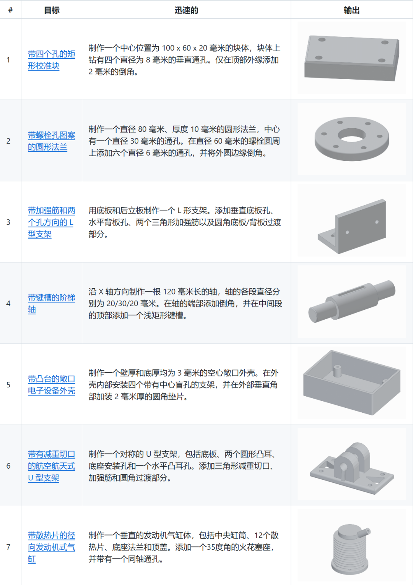

第二款：cad-skill

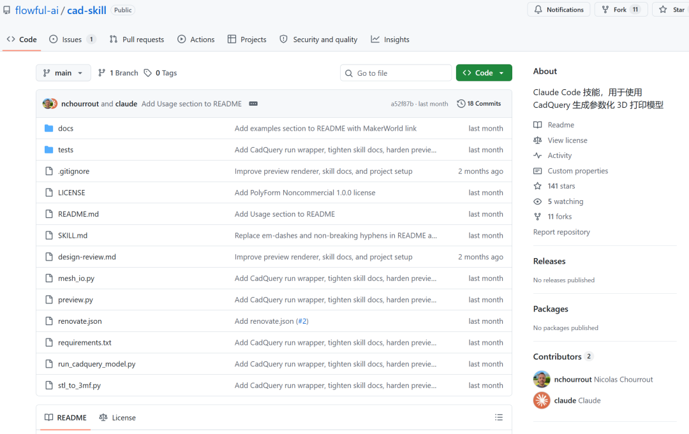

## 安装

```
mkdir -p ~/.claude/skills git clone https://github.com/flowful-ai/cad-skill ~/.claude/skills/parametric-3d-printing
```

## 用法

安装完成后，该技能在 Claude Code 中可通过两种方式激活：

- **自动触发。**

  描述你想打印的零件（“为 Arduino Uno 设计一个壁挂支架”、“我需要一个卡扣式盒盖”），Claude 会根据触发关键词（3D 打印、STL、CadQuery、外壳、支架等）识别出相应的技能。
- **显式斜杠命令。**

  输入 `/parametric-3d-printing` 可直接调用该命令，当您的请求不包含明显的关键字时，此方法非常有用。

然后 Claude 将引导您了解需求，分阶段构建模型（基本形状、功能、表面处理），并交付 STL 文件和渲染预览。

## 依赖关系

需要 **Python 3.10-3.12** （CadQuery 的 OCC 内核没有 3.13 及更高版本的 wheel 文件）：

```
python3.12 -m venv .venv &&source .venv/bin/activate pip install -r requirements.txt
```

## 文件

| 文件 | 目的 |
| --- | --- |
| `技能.md` | 克劳德的技能定义和工作流程说明 |
| `预览.py` | 无头 STL 到 6 视图 PNG 渲染器（trimesh + pyrender）。使用 `--strict` 可使非封闭网格渲染失败。 |
| `run_cadquery_model.py` | 子进程包装器，运行 CadQuery 脚本，捕获错误，可选地渲染预览，并发出 JSON 结果，以便 Claude 可以在循环中进行自我纠正。 |
| `mesh_io.py` | 带验证功能的 STL 加载（不依赖 pyrender）。供封装器和转换器使用。 |
| `stl_to_3mf.py` | 适用于 Bambu Studio / PrusaSlicer 的独立 STL 转 3MF 转换器。 |
| `设计评审.md` | 视觉检查清单和可印刷性分析 |
| `requirements.txt` | 已锁定的依赖项版本 |

# 第三款：Image2CAD

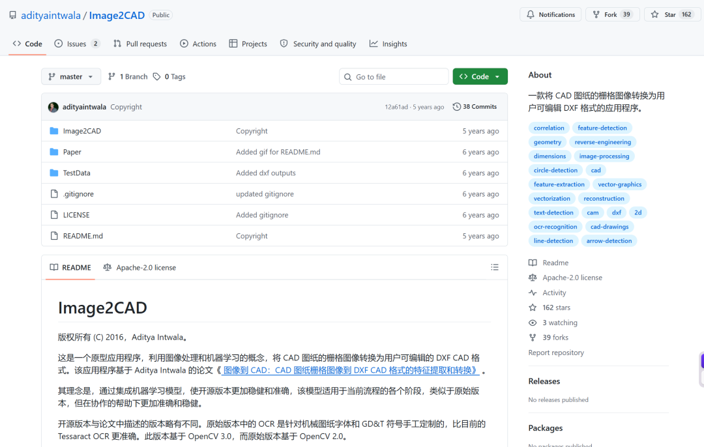

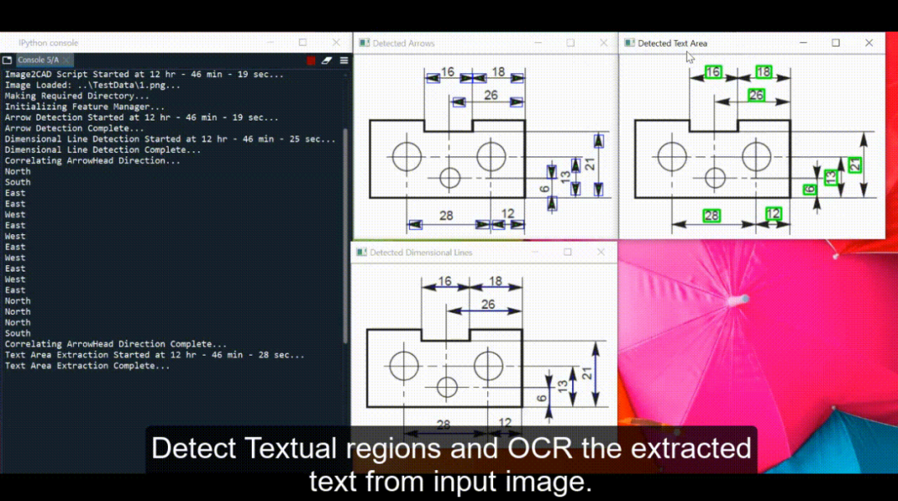

## 介绍

CAD 图纸包含多种绘图特征，例如实体线、尺寸线、尺寸箭头、尺寸标注、支撑线、参考线、圆、GD&T 符号以及图纸信息元数据。从二维 CAD 图纸的栅格图像中自动或半自动识别特征实体在各种场景下都有着广泛的应用。本研究探索了从二维 CAD 图纸栅格图像中提取实体信息的方法，并建立了一个自动化或半自动化的工作流程。我们使用一组能够代表实际 CAD 图纸的测试 CAD 图像对算法和工作流程进行了测试和改进。对于给定的测试图像样本，所提出流程在全自动模式下的总体成功率达到了 90%。该原型系统能够从 CAD 图纸的栅格图像生成用户可编辑的 DXF CAD 文件，用户随后可以使用 CAD 软件包在需要时更新/编辑 CAD 模型。目前的工作是论文中提出的原始工作的简化版本。虽然这可能无法复现与论文完全相同的结果，但其工作流程与原始流程高度相似。简化后的版本不具备原始版本的通用性、鲁棒性和稳定性。

## 用法

''' python Image2CAD.py ..//TestData//1.png '''

### 输入

该脚本需要一个位置参数和几个可选参数：

- image\_path - CAD 图纸图像文件的完整路径。

### 输出

脚本的输出结果将是多个文件：

- \*.I2C - 一个自定义的 Image2CAD 文件，其中包含提取和关联的特征信息，然后可以将其处理成 DXF 文件。
- \*.png - 检测到的各种单独特征的多张输出图像。

## 箭头特征检测

| 输入图像 | 检测到的箭头输出图像 |
| --- | --- |
|  |  |
|  |  |

## 尺寸线特征检测

| 输入图像 | 检测到的维度线输出图像 |
| --- | --- |
| 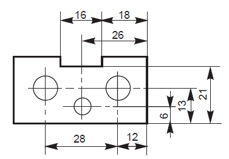 | 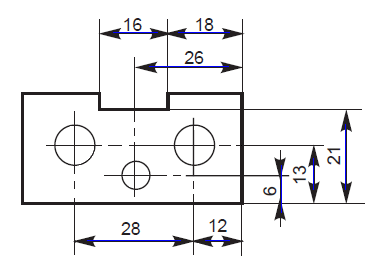 |
| 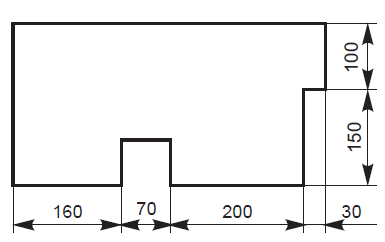 | 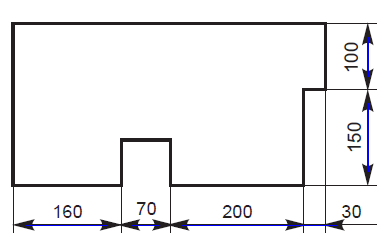 |

RAN BING LUAN

如果CAD不好用,

不如直接AI-TO-BIM

2022年就有了。

请看视频

这个比较早期的22-23年的

5月工程AI研发交流学习/群

更新日期：2026年5月15日 


近期十篇内容推荐 

[国内外16个AI审图和AI审BIM模型平台介绍](https://mp.weixin.qq.com/s?__biz=Mzk0MTYzNTg2NA==&mid=2247486919&idx=1&sn=8a4f2857061f133893462509f39c633b&scene=21#wechat_redirect)

[2026年建筑人工智能报告：AI自动审图最佳平台排名](https://mp.weixin.qq.com/s?__biz=Mzk0MTYzNTg2NA==&mid=2247486851&idx=1&sn=6bac07f36fee3fcbe183f8248db01cc4&scene=21#wechat_redirect)

[4月建筑工程AI岗位招聘信息汇总](https://mp.weixin.qq.com/s?__biz=Mzk0MTYzNTg2NA==&mid=2247486836&idx=1&sn=7f98f3292613264abada404672bdfcff&scene=21#wechat_redirect)

[一分钟快速了解全球24篇AI-BIM专题研究论文](https://mp.weixin.qq.com/s?__biz=Mzk0MTYzNTg2NA==&mid=2247486826&idx=1&sn=2b190d4768115c99c845335cfe583805&scene=21#wechat_redirect)

[清华大学牵头《基于人工智能的BIM应用研究》共研单位的通知](https://mp.weixin.qq.com/s?__biz=Mzk0MTYzNTg2NA==&mid=2247486813&idx=1&sn=ab03239606e967eaba2b1ff26bed6dd7&scene=21#wechat_redirect)

[全球近两年24篇建筑工程类AI-BIM专题研究论文汇总](https://mp.weixin.qq.com/s?__biz=Mzk0MTYzNTg2NA==&mid=2247486770&idx=1&sn=e20c0249ccac8c661b6a949bc31ce9f6&scene=21#wechat_redirect)

[基于深度学习框架的全自动合成 BIM 数据集生成【日本大阪大学】](https://mp.weixin.qq.com/s?__biz=Mzk0MTYzNTg2NA==&mid=2247486733&idx=1&sn=cc1de3d3dba9234aaff9e6a9185bf487&scene=21#wechat_redirect)

[清华同济武大等22篇土木工程AI前沿研究论文](https://mp.weixin.qq.com/s?__biz=Mzk0MTYzNTg2NA==&mid=2247486679&idx=1&sn=543a871e2f764379393785a1c79a45cd&scene=21#wechat_redirect)

[清华大学土木工程系林佳瑞团队的Qwen-BIM基于设计的AI大语言模型](https://mp.weixin.qq.com/s?__biz=Mzk0MTYzNTg2NA==&mid=2247486628&idx=2&sn=253364f4fea690f8839b55ff17857b56&scene=21#wechat_redirect)

[一位建筑央企20年经验的专家对工程AI的总结](https://mp.weixin.qq.com/s?__biz=Mzk0MTYzNTg2NA==&mid=2247486604&idx=1&sn=6994e449bda1b2652f5096f5b88aa0e5&scene=21#wechat_redirect)

———— end————

如有侵权违规，请联系我们删除

[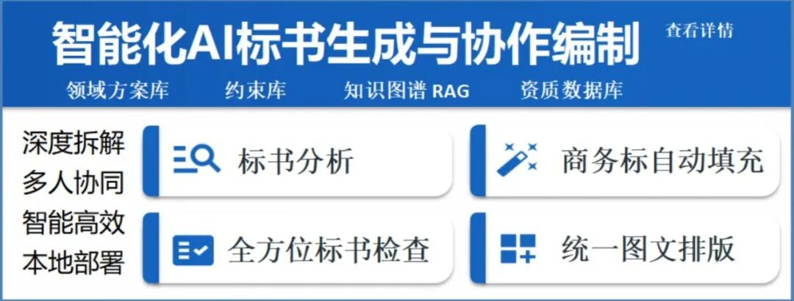](https://mp.weixin.qq.com/s?__biz=Mzk0MTYzNTg2NA==&mid=2247485603&idx=1&sn=22619de8edd1743efeb4e26dbda7f398&scene=21#wechat_redirect)

---


聚焦工程行业AI大模型应用研究。从2012年安卓建筑App开发，2017年智慧工地平台开发，2019年智能建造监测设备研发生产。于2023年底，开始组织了二十余次工程行业AI应用直播讲课与AI应用分享，线上会议，以及两场线下工程行业AI交流会，获得了工程行业人工智能，全产业领域的智慧建造与AI大模型应用的7000位粉丝。                 

****以下是部分过去报名的粉丝。****

中建系\中铁系\建工系\城投建投\研究院\智慧建造软件公司\ 华为\腾讯\百度\阿里\品茗\广联达\研究院\科大讯飞\ 清华智谱\  海康威视\高校博导教授\水利研究院\土木硕博\Ai产品经理\Ai工程师\建筑科技公司\GPU芯片算力公司\AI公司\ 智慧城市研究院\绿色建筑研究院\ 中建科技\中建技术院\产研院\铁道研究院\建研院交通院勘测院\   

---

更多工程行业AI应用文章（2026年之前已删）

1、[一分钟了解春节期间，全球百件AI大事（2.9-2.16）](https://mp.weixin.qq.com/s?__biz=Mzk0MTYzNTg2NA==&mid=2247486351&idx=1&sn=6d54bd910b1f86f2c15d8cc8ca8d3a27&scene=21#wechat_redirect)

2、[2026 年建筑设计必备的 17 款 AI 工具](https://mp.weixin.qq.com/s?__biz=Mzk0MTYzNTg2NA==&mid=2247486362&idx=1&sn=80f99b307c809510f86739a7df1803de&scene=21#wechat_redirect)

3、[中交—交融大模型高质量数据集平台成果发布](https://mp.weixin.qq.com/s?__biz=Mzk0MTYzNTg2NA==&mid=2247486369&idx=1&sn=47052bc32afa168abcc9907eb74ecf67&scene=21#wechat_redirect)

4、[央企“AI+”具身智能产业共同体成立](https://mp.weixin.qq.com/s?__biz=Mzk0MTYzNTg2NA==&mid=2247486376&idx=1&sn=d5638086682e7611b3f6564e1fb7a821&scene=21#wechat_redirect)

5、[深圳住建局发布“人工智能+”工作方案](https://mp.weixin.qq.com/s?__biz=Mzk0MTYzNTg2NA==&mid=2247486382&idx=1&sn=c4c8938188dbcf569e96af2c6add23ec&scene=21#wechat_redirect)

6、[中建集团召开“人工智能+”专项行动2026年第一次专题推进会](https://mp.weixin.qq.com/s?__biz=Mzk0MTYzNTg2NA==&mid=2247486386&idx=1&sn=e405ba8674ffccdc371e7be0bdb41e33&scene=21#wechat_redirect)

7、[2026新春开工，汇总全国20场“人工智能+”专项 会议](https://mp.weixin.qq.com/s?__biz=Mzk0MTYzNTg2NA==&mid=2247486393&idx=1&sn=3b68546e6b6fb0534828a01b87ea3157&scene=21#wechat_redirect)

8、[五场住建厅（局）召开住建领域“人工智能+”工作研讨会](https://mp.weixin.qq.com/s?__biz=Mzk0MTYzNTg2NA==&mid=2247486402&idx=1&sn=717d1de6d93cb0f6f7dd03855d9f289b&scene=21#wechat_redirect)

9、[16家工程+AI相关招聘信息汇总（近一周）](https://mp.weixin.qq.com/s?__biz=Mzk0MTYzNTg2NA==&mid=2247486421&idx=1&sn=de4dbe7c796124d5480ecc5cd273cf1a&scene=21#wechat_redirect)

10、[清华大学:OpenClaw发展研究1.0报告+完全使用手册/16本研报下载](https://mp.weixin.qq.com/s?__biz=Mzk0MTYzNTg2NA==&mid=2247486441&idx=2&sn=5e7753f5ee7808f1d74ef44a11cb5dd8&scene=21#wechat_redirect)

11、[2026建筑企业人工智能高层战略课](https://mp.weixin.qq.com/s?__biz=Mzk0MTYzNTg2NA==&mid=2247486441&idx=1&sn=b5426875b274651d9e0dfbda02df07bf&scene=21#wechat_redirect)

12、[龙虾OpenClaw,腾讯Qclaw,字节ArkClaw,阿里copaw,六款国产平替](https://mp.weixin.qq.com/s?__biz=Mzk0MTYzNTg2NA==&mid=2247486459&idx=1&sn=cadb841aa0c916b1bcf14a155440c84a&scene=21#wechat_redirect)

13、[某高校土木院筹建工程AI人工智能实验室，供应商开始报名](https://mp.weixin.qq.com/s?__biz=Mzk0MTYzNTg2NA==&mid=2247486490&idx=2&sn=0b68a1fcee1391b513a1a95c371faf39&scene=21#wechat_redirect)

14、[深智城集团3项行业大模型,AI智能体开发平台/知识库平台](https://mp.weixin.qq.com/s?__biz=Mzk0MTYzNTg2NA==&mid=2247486500&idx=1&sn=af1d14e2b3490708f6a0998d631f7681&scene=21#wechat_redirect)

15、[全球 AEC 行业的完整技能本体300个Skills与完整图谱【工程大脑】](https://mp.weixin.qq.com/s?__biz=Mzk0MTYzNTg2NA==&mid=2247486508&idx=1&sn=849b16c13f4c08a5661c79971700cdd8&scene=21#wechat_redirect)

16、[手机拍照—AI图像分析对建筑裂缝定位与测量【论文】](https://mp.weixin.qq.com/s?__biz=Mzk0MTYzNTg2NA==&mid=2247486524&idx=1&sn=0337ae6ee25232d2a13fd2a39cb69d8f&scene=21#wechat_redirect)

17、[最近一周建筑土木工程AI相关20个招聘岗位信息](https://mp.weixin.qq.com/s?__biz=Mzk0MTYzNTg2NA==&mid=2247486537&idx=1&sn=780dcdb4798486dc4dfa01a1142bc6a5&scene=21#wechat_redirect)

18、[3月16日中国能建在京召开“人工智能+”专项行动深化部署会暨“融光”大模型发布培训会](https://mp.weixin.qq.com/s?__biz=Mzk0MTYzNTg2NA==&mid=2247486550&idx=1&sn=5cdf556ae042197e3e53dc2aafd5e2e5&scene=21#wechat_redirect)

19、[建筑行业OpenClaw,正在内测...中国交建—交融大模型/交融龙虾](https://mp.weixin.qq.com/s?__biz=Mzk0MTYzNTg2NA==&mid=2247486557&idx=1&sn=fc6e4736f7ec0712c3993b80ddfba762&scene=21#wechat_redirect)

20、[中国能建“融光”大模型及16家子公司AI应用场景汇报【多图】](https://mp.weixin.qq.com/s?__biz=Mzk0MTYzNTg2NA==&mid=2247486572&idx=1&sn=e0cf2d0c4e92f2fc7c24a0618d2b6c74&scene=21#wechat_redirect)

21、
