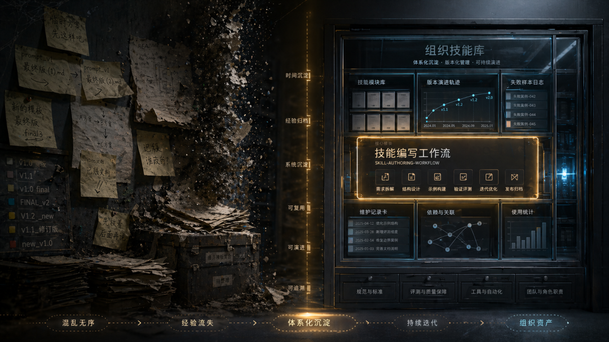
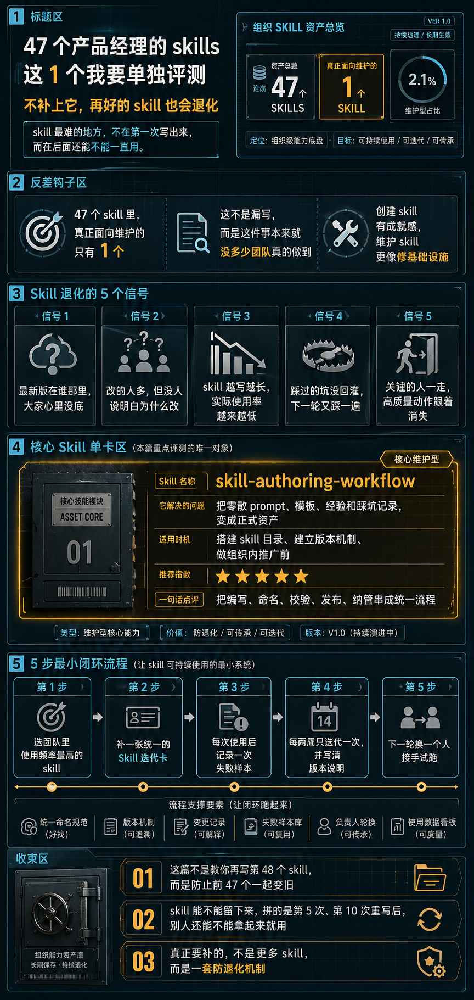

> 📎 来源: [产品AI力学](https://mp.weixin.qq.com/s?__biz=MzY5MTIxNDA0MQ==&mid=2247484230&idx=1&sn=341ef80c53e00ec5ac796a95e6eb2803&chksm=f5f210a2f043ef95def8e2955e076acac549758a044e80c5353bedcff25265e032606a56826f&mpshare=1&scene=1&srcid=0502HCDVoCUPFePpqwTYLwFW&sharer_shareinfo=bf9b171187031001ac17b9e4c1471768&sharer_shareinfo_first=bf9b171187031001ac17b9e4c1471768) | 时间: 2026-05-02 00:55

---

前面几篇，我把 

```
product-manager-skills
```

 的实用性skills（20个）分成了工作层、推进层和战略层三大类做了评测。

[为什么产品越做心越虚？这 6 个 Skill 专治产品经理自嗨](https://mp.weixin.qq.com/s?__biz=MzY5MTIxNDA0MQ==&mid=2247484210&idx=1&sn=24be605609f8de5760fbd6d36e19b351&scene=21#wechat_redirect)

[把战略熬成一锅浆糊的，是中层不是老板——看看这8个skills还能抢救几个](https://mp.weixin.qq.com/s?__biz=MzY5MTIxNDA0MQ==&mid=2247484170&idx=1&sn=63626a80f16e339a8007047ca1def2c8&scene=21#wechat_redirect)

[需求总返工、PRD总跑偏？产品经理最该补的是这8个Skill](https://mp.weixin.qq.com/s?__biz=MzY5MTIxNDA0MQ==&mid=2247484133&idx=1&sn=fee528067d853835fda4209f0967a023&scene=21#wechat_redirect)

加上我平时使用的20来个skills，Codex已经提示我：安装的skill过多，已经导致它分配给skills初始化加载的最大限额了（2%），它会截断skills的自述文件。

如果单纯为了评测，没问题；但如果真要发挥效果，我现在的.agent/skills只是个杂物间，更多skills更可能是负优化。

这实际上揭示了一个问题：

**skill 最难的地方，不在第一次写出来，而在后面还能不能一直用。**

所以今天只说 1 个：

```
skill-authoring-workflow
```

评完以后，我会用它来做skills的清理。

创建 skill 有成就感，维护 skill 没有。前者像做新功能，后者更像修基础设施。

少了这层基础设施，只要时间一拉长，很多团队和个人几乎一定会遇到这些问题：

- 没人知道最新版在哪
- 大家都在改，但改法彼此冲突
- skill 越写越长、越来越多，却越来越没用
- 踩过的坑没回灌，下一轮又踩一遍
- 老同事一走，很多高质量动作也一起消失

这些问题最后都会汇到一件事上：**没人把 skill 维护成资产，而是被当作了一次性产出。**



## 从个人技巧到组织资产的 5 步最小闭环

如果你现在已经安装了多个skills，或者正在和团队共享一批标准化 skill，先别急着铺开，先把这 5 步跑通。

### 第 1 步：选一个使用频率最高的 skill

不要从“最完整”或“最酷”的 skill 开始，先挑最常被用的那一个。高频意味着暴露问题最多，也最值得回灌。

**这一步走偏会怎么样：** 如果你一上来就拿一个低频 skill 试水，改完也没人用，闭环根本跑不起来，后面 4 步全白干。

### 第 2 步：补一张统一的  ``` Skill 迭代卡 ```

这张卡至少要写清：触发条件、必填输入、输出格式、使用场景、已知坑、版本号、上次修改人、修改原因。

参考：[实操手册：产品经理的Skills如何迭代？](https://mp.weixin.qq.com/s?__biz=MzY5MTIxNDA0MQ==&mid=2247484184&idx=1&sn=50f938d312b849bf1a0a7d331d90eb08&scene=21#wechat_redirect)

### 第 3 步：每次使用后记录一次失败样本

不记“好像还行”，只记失败样本。失败样本才是最有回灌价值的原料，因为它定义了“这个 skill 最容易在哪里翻车”。

**这一步走偏会怎么样：** 如果你只收集“用得挺好”，skill 就会在一种虚假的稳定感里越写越长、越写越偏。

### 第 4 步：每两周迭代一次，并写清版本说明

迭代节奏太快，skill 会抖；太慢，失败样本会堆成山。两周通常是一个比较稳的节奏。版本说明不是写给今天的自己，而是写给下一个接手的人和未来的自己。

**这一步走偏会怎么样：** 没有版本说明，半年后连你自己都看不懂当时为什么这么改。

### 第 5 步：下一轮换一个人接手试跑

这一步最重要。如果换一个人接手也能跑起来，这个 skill 才算开始脱离“个人技巧”，进入“组织资产”阶段。

**这一步走偏会怎么样：** 你永远是这个 skill 的唯一使用者——它看起来是组织资产，其实只是你个人的收藏。


