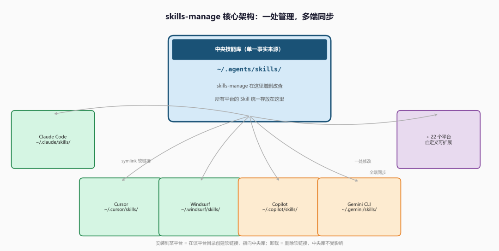
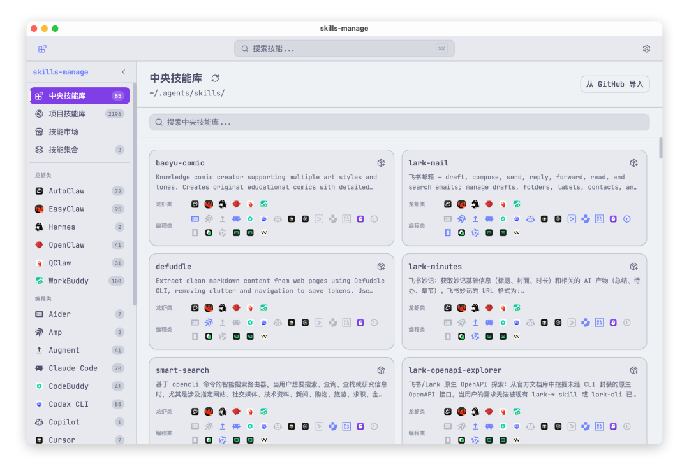
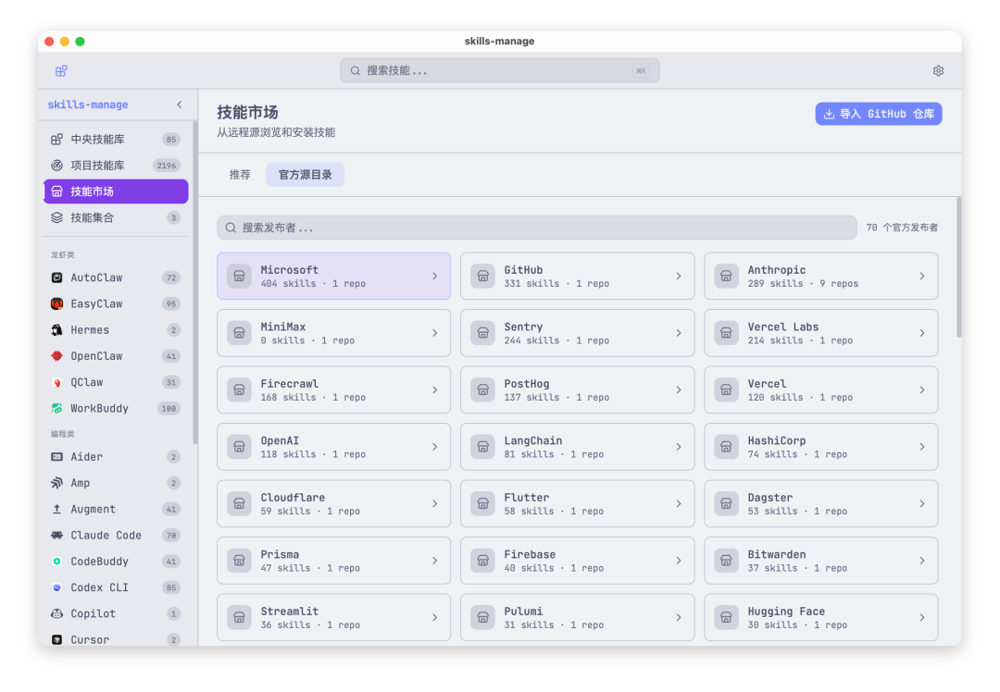
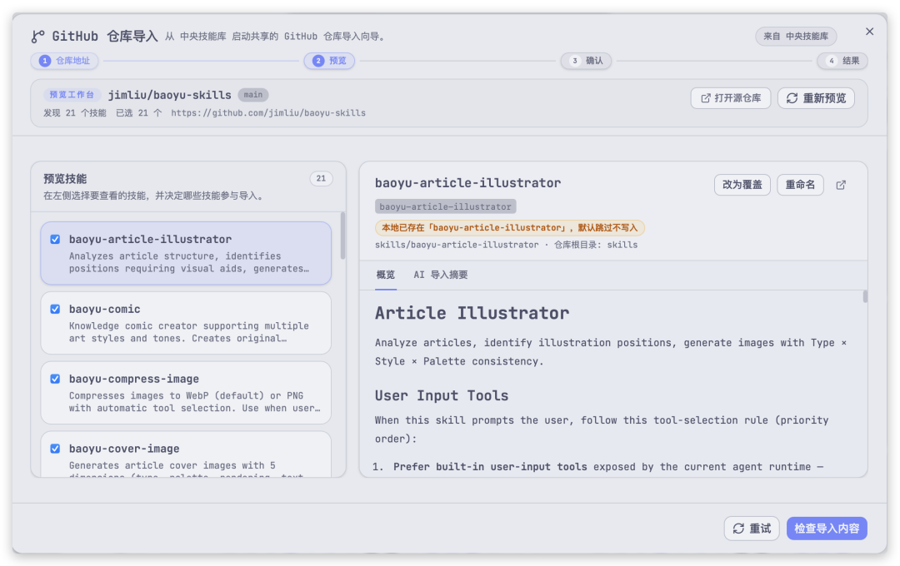

> 📎 来源: [零壹界点](https://mp.weixin.qq.com/s?__biz=MzIxMzk1MzQ0Ng==&mid=2247483789&idx=1&sn=07df8e95841cf8087b98e90da5efb7b2&chksm=969718384b6d718c1992160a1d7cc58f48eba483a6383806dfd4355798b6109be863855b14ae&mpshare=1&scene=1&srcid=0424twXpqNODJQdpRYcRIdJc&sharer_shareinfo=00aa8e0558cddf6f20062601e17f951d&sharer_shareinfo_first=00aa8e0558cddf6f20062601e17f951d) | 时间: 2026-04-24 15:15

---

> 本文从**重度 AI 工具用户的视角**出发，拆解 skills-manage 的核心设计逻辑、六大功能模块的实际价值，以及它背后那个正在成形的 Agent Skills 开放标准。

## 一、你用了多少 AI 工具，你的 Skill 就碎了多少份

你花了一下午写了一个好用的 Skill——某个处理代码审查的提示模板，或者一套调试 SQL 的操作流程。然后你发现，它只在 Claude Code 里有。打开 Cursor，没有。切到 Windsurf，没有。换 Copilot，还是没有。你开始手动复制，改路径，粘贴，保存。第二天你优化了这个 Skill，又来一遍。

这不是极端情况，这是今天同时使用多个 AI 工具的用户每天都在面对的现实。

`skills-manage` 是经过独立开发者志辉打磨两周后于 2026 年 4 月 20 日开源的一个 Tauri 桌面应用，核心思路只有一句话：**以 `~/.agents/skills/` 为单一事实来源，通过软链接把技能分发到所有平台**。你在中央库里写一次，它帮你装到你指定的每一个工具里；你改一次，所有平台同步更新；你卸载某个平台，只删软链接，中央库丝毫不动。



目前它支持的平台有 27 个，从 Claude Code、Cursor、Windsurf、Copilot、Gemini CLI，到 OpenClaw、Hermes、OpenCode、Augment，乃至 Kiro、OB1、Amp 这些新兴工具，全在列表里，还可以在设置里自定义新增。

> **重点**：skills-manage 解决的不是"技能怎么写"的问题，而是"写好的技能如何在多个工具之间不重复劳动地维护"——这个问题在平台碎片化加剧之前几乎不存在，现在已经是真实的日常摩擦。

## 二、它不只是个 GUI，关键是这套设计哲学

把 skills-manage 理解成"AI 工具技能的文件管理器"是准确的，但只理解了表面。它真正值得关注的，是它遵循的底层标准：Agent Skills 开放模式。

这个模式由 Anthropic 提出，约定了 `~/.agents/skills/` 作为规范的中央 Skills 目录，各 AI 工具厂商可以选择接入这一标准，通过软链接从这里同步技能，而不是各建各的孤岛。skills-manage 不是在发明轮子，它是在把这个标准变成普通用户可以使用的桌面工具。

这个区别很重要。如果未来主流 AI 编程工具都对接 `~/.agents/skills/` 标准，skills-manage 就不只是一个好用的小工具，而是这个生态里的管理层基础设施。如果各家继续各建各的，它就只是一个能多平台同步的 GUI 工具——仍然有用，只是价值上限不同。

另一个值得关注的设计决策是技术选型：**Tauri v2 + React 19 + Rust 后端 + SQLite 本地数据库**。不是 Electron，不是 Web 应用，不是 CLI——是真正的跨平台原生桌面应用，轻量、本地优先、数据不出机器。元数据、集合、扫描结果、AI 解释缓存全部存在 `~/.skillsmanage/db.sqlite`，没有遥测，没有云同步，网络请求只在你主动触发 Marketplace 同步或 GitHub 导入时发生。



> **重点**：选择 Tauri 而不是 Electron，选择本地 SQLite 而不是云服务，这两个决策定义了 skills-manage 的产品气质——给在意本地隐私和轻量化的开发者用，而不是追求功能全面的那类用户。

## 三、六个模块，哪些最值得关注

功能列表里有六个主要模块，按实际使用价值排一下：

**中央库 + 平台安装**是核心流程。左侧显示中央库里的所有技能，右侧可以选择要安装（创建软链接）或卸载（删除软链接）的目标平台。界面逻辑清晰，批量操作支持得不错，管理几十个技能不会显得混乱。

**Skill 详情视图**比想象中有用。每个技能打开后有三个标签页：Markdown 渲染预览、原始源码、以及 AI 解释生成（需要配置 AI API Key）。"AI 解释"这个功能对于从 Marketplace 下载的别人的技能特别有价值——你不需要读完完整的 Prompt 才能知道这个技能是干什么的。

**Marketplace** 是目前最有争议的模块，也是未来可能最有价值的模块。



目前 Marketplace 里有官方推荐和社区发布者，支持按标签筛选、浏览发布者页面和批量下载。作为才开源两周的工具，内容积累还在早期，但框架已经搭好了——它的价值取决于未来有多少开发者往里发布优质技能。

**GitHub 仓库导入**是 Marketplace 的补充路径。如果你知道某个 GitHub 仓库里有一批好技能，可以直接粘贴仓库地址导入，支持认证请求和失败重试。这个功能对于现阶段 Marketplace 内容还不够丰富的情况是个很好的过渡方案。



**本地项目技能扫描**是被截图展示得最少、但实际上挺有用的功能。它会扫描你本地磁盘上的项目目录，找到那些项目级别的技能库（比如 `.claude/skills/` 或类似的项目内技能目录），让你把它们纳入统一管理视图，不用手动一个个去找。

\*\*Collections（技能集合）\*\*适合有多个不同工作场景的用户——把一批相关技能打包成一个集合，一键安装到指定平台，切换工作场景时不用逐个选择。

> **重点**：六个模块中，中央库 + 平台安装和 GitHub 导入是现阶段最稳定可用的；Marketplace 是长期价值最大但现在内容还在积累期的部分——预期管理要做好。

## 四、开始之前，有几件事值得提前知道

**目前只有 macOS Apple Silicon 的预构建包**。README 说得很直接：其他平台需要从源码构建。如果你用的是 Intel Mac、Windows 或 Linux，需要自己跑 `pnpm tauri dev`，前置依赖是 Node.js（LTS）、pnpm 和 Rust stable 工具链。不是特别复杂，但不是一键安装。

**macOS 会弹 Gatekeeper 警告**，因为当前的公开构建没有签名认证。应对方式是移到 `/Applications` 后执行：

```
xattr -dr com.apple.quarantine "/Applications/skills-manage.app"
```

这不是 app 损坏，是 macOS 对未签名包的标准拦截，解除后正常使用。

**GitHub PAT 和 AI API Key 以明文存在本地 SQLite 里**。README 里有这条声明："Credentials stored locally — not encrypted at rest by the app"。如果你在共享机器上用，或者对本地密钥安全有要求，这一点需要自己权衡。对于个人开发机来说这通常不是问题，但值得知道。

**Marketplace 内容处于早期积累阶段**。如果你期望装完就能找到各种现成的优质技能直接用，可能会有落差。目前它更像是一个已经搭好架子、内容在慢慢进来的广场。GitHub 导入能弥补一部分——你可以把 Anthropic 官方的 `agent-skills` 仓库或者社区里知名的技能仓库直接导进来。

这几件事搞清楚之后，实际日常使用没什么特别的门槛。工具本身的逻辑是自洽的，onboarding 流程有引导，上手不难。

> **重点**：非 Apple Silicon macOS 用户在现阶段需要从源码构建，这是最主要的使用门槛；如果你是 M 系列 Mac 用户，基本可以直接用。

## 五、更大的意义：这不是一个孤立的工具

skills-manage 在一个很特定的时间窗口出现。

2024 年末到 2025 年，AI 编程工具迎来爆发式增长。Claude Code、Cursor、Windsurf、Copilot、Gemini CLI、OpenCode……用户开始把多个工具混用，每个工具的 Skills 系统也在各自发展。这种碎片化在短期内不会收敛——各家工具都在快速迭代，统一标准的动力还不够强。

但 Anthropic 提出 `~/.agents/skills/` 这个规范是一个信号：至少有人在认真想"如何让技能在 AI 工具之间可复用"这件事。skills-manage 押注的是这个标准会被越来越多的工具接受——这也是它为什么不只是"一个文件管理器"，而是"一个基于 Agent Skills 标准构建的管理层"。

27 个平台的列表本身也说明了现实：这个领域正在形成生态，而不只是几家大公司的产品。OpenClaw、QClaw、EasyClaw、WorkBuddy、Hermes——这些名字两年前大多不存在，现在已经有了各自的用户群和 Skills 目录路径。

对普通用户来说，这意味着一件很实际的事：**现在开始认真管理自己的 Skills 资产是值得的**。Skills 是你在 AI 工具上积累的知识和工作流，它们不应该因为你换了一个工具就全部丢失。skills-manage 提供了一个把这些资产统一管理起来的方式，不管未来生态怎么变化，中央库里的内容始终是你的。

> **重点**：skills-manage 的真实价值与 Agent Skills 标准的普及程度强相关——它现在有用，未来可能更有用；而你在中央库里积累的技能资产，不会随工具迁移而消失。

---

**[skills-manage GitHub 仓库]**：https://github.com/iamzhihuix/skills-manage

**[Agent Skills 开放标准]**：https://github.com/anthropics/agent-skills
