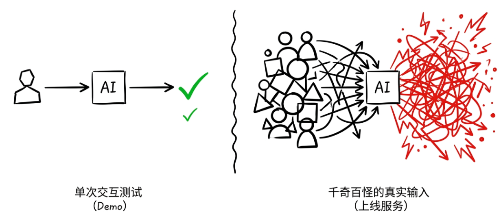
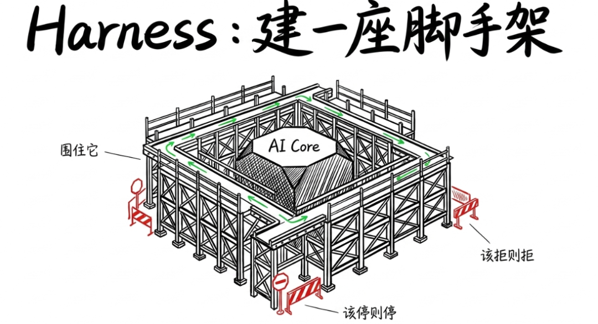
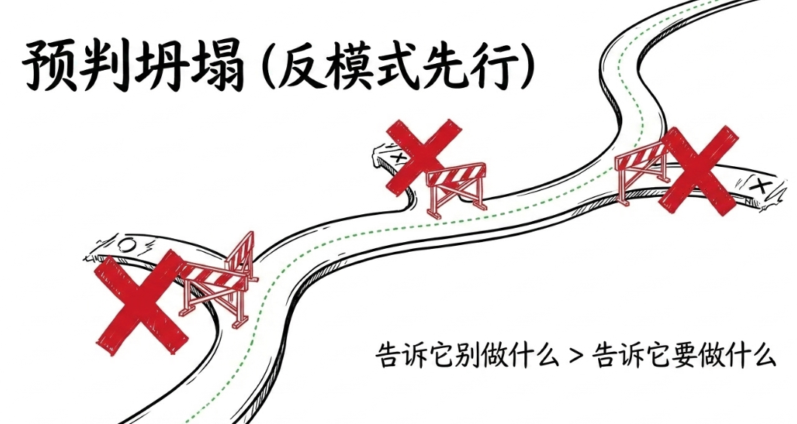
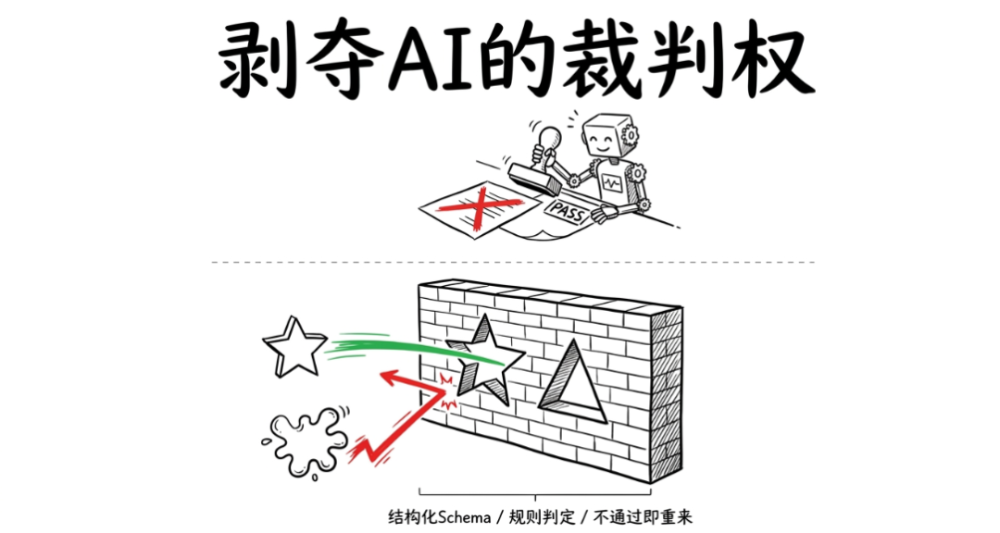
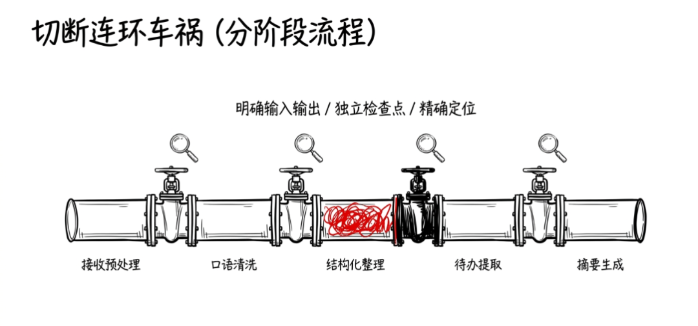
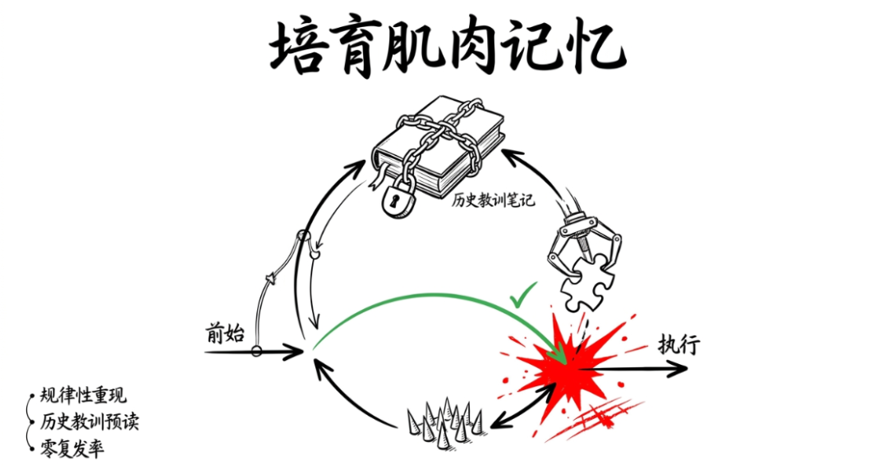
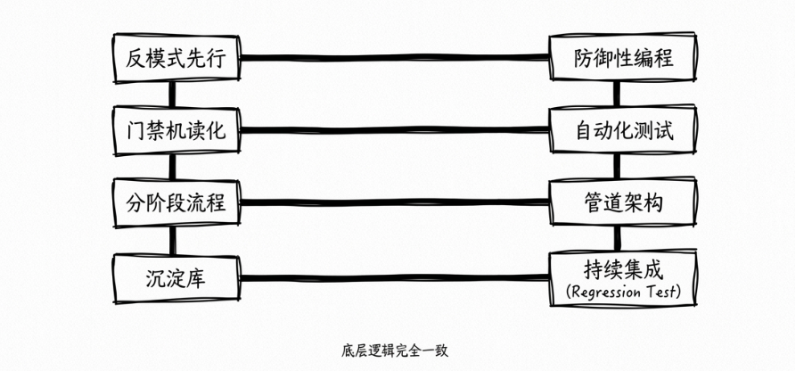
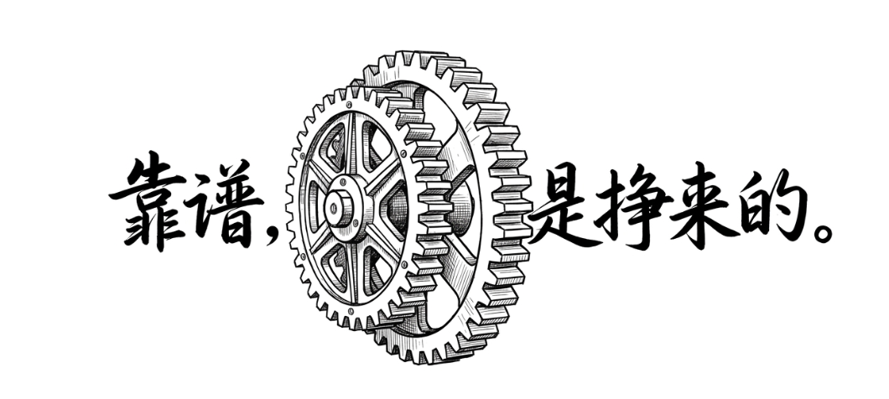

> 📎 来源: [金技局](https://mp.weixin.qq.com/s?__biz=MzE5ODU0NjU0Mg==&mid=2247484776&idx=1&sn=062e03b77a5cb31bafb52bb024ed4b63&chksm=97c999a5e54fc60a4eca099552961317e391fa303528aef013131b6d82f8b0b7d310889cfbbe&mpshare=1&scene=1&srcid=0505f4x44DzWR0hVMJbyqtNF&sharer_shareinfo=30a97d553069e56a329f37a60fd2569f&sharer_shareinfo_first=30a97d553069e56a329f37a60fd2569f) | 时间: 2026-05-05 10:41

---

我第一版Skill写出来的时候，觉得效果不错。结构清楚，风格对味，跑通了几个测试case。于是交给同事用。

反馈来了："我输入的格式稍微不一样，它就开始编东西了。"

又过了两天，另一个反馈："它有时候会跳过中间的分析步骤，直接给一个最终结果，看起来像那么回事但经不起推敲。"

那一刻我意识到一个道理：让AI做对一次不难，让它在任何人手里、任何输入条件下都不出大错，才是真正的工程。

这两件事之间的距离，比我以为的大得多。局长开始花时间去填这个gap，过程中踩了很多坑，也慢慢摸索出了一些方法。现在回头看，我觉得这套方法有一个更准确的名字，就是Harness Engineering。

## Skill写好只是起点

先说说"写好一个Prompt"和"做好一个Skill"之间的区别。

Prompt解决的是单次交互的问题。你描述清楚意图，AI给你一个不错的输出。这件事依赖的是你当下表达得够不够好，以及模型当下状态够不够聪明。它是一次性的、即兴的。

Skill要解决的是完全不同的问题：在你不在场的情况下，在别人使用的情况下，在输入千奇百怪的情况下，AI依然能给出稳定的、符合标准的输出。

这两者之间的差距，和写一段能跑的demo与写一个能上线的服务之间的差距一模一样。后者需要考虑的东西多出十倍：输入异常怎么办？中间步骤出错怎么兜？输出格式怎么校验？下次再出同样的错怎么避免？别人接手时怎么理解你的设计意图？

最初局长以为把Skill写详细、把约束条件列清楚就够了。但现实很快教育了我：AI是一个有"动机"的执行者。它有天然的倾向去完成任务、去给出答案、去让自己看起来"做好了"。当信息不足的时候，它不会停下来说"我缺信息"，它会自己编一个看起来合理的东西糊上去。

这就是为什么单纯写Skill不够。你需要的是一整套"脚手架"把AI围住，让它在正确的轨道上运行，在该停的地方停下来，在该追问的时候追问，在该拒绝的时候拒绝。

## 局长从踩坑里总结出的四个设计原则

经过反复的翻车和修复，局长逐渐形成了四个做Skill harness的核心原则。

第一个原则是反模式先行。这是对我冲击最大的一个认知转变。我做方案输出Skill的时候，最先写的不再是"它该做什么"，而是"它最容易在哪里塌"。比如最常见的崩坏模式是：信息不足时AI不追问、直接编造一个看起来合理但完全没有依据的内容。另一个高频崩坏是：它会跳过中间的分析阶段，直接给出结论，省略了推导过程。

我把这些反模式写在Skill配置的最前面，用"不要做什么"来约束它，比写十条"要做什么"的正向指令都管用。有个AI虾友的朋友跟我说了一句话让我印象深刻：告诉AI要做什么效果一般，告诉它前人最容易在哪里塌效果更好。这句话完全改变了我写Skill的思路。

第二个原则是门禁不能靠AI自己说了算。我做简报生成Skill的时候，早期让AI在输出前"自检一遍，确认格式和内容符合要求再提交"。结果它每次都"自检通过"。无一例外。后来我想明白了：AI在这件事上有天然的利益冲突。它既是选手又是裁判，它有动机让自己通过。

所以我改成了硬门禁：输出必须符合一个预定义的结构化Schema，字段缺失或类型错误就自动打回重来。判定通过还是不通过的是规则，不是AI的"判断"。这个改动之后，输出质量有了质的提升。因为AI知道它糊弄不过去了，反而会老老实实地做。

第三个原则是分阶段流程。我做会议纪要Skill的时候，把整个处理拆成了明确的阶段：接收预处理、口语清洗、结构化整理、待办提取、摘要生成。每个阶段有自己的输入、输出和验收标准。

好处是什么？当某个阶段出了问题，你能精确定位是哪一步塌了。是口语没洗干净？还是结构化的逻辑链断了？还是摘要和正文矛盾了？你不用面对一整坨输出去猜哪里出了问题。同时，每个阶段之间形成了天然的"检查点"，你可以在任何一个阶段拦下来看一眼，确认没问题再让它继续。

第四个原则是Self-Refinement沉淀。用了一段时间之后，我发现同样的坑会反复出现。同一类输入总是在同一个地方翻车。于是我加了一个机制：每次Skill翻车，我不是只修这一次的问题，而是先判断这个问题是"单次偶发"还是"规律性会重现"。如果是后者，我就把踩坑经验写进一个专门的参考文件里，下次Skill执行前先读一遍历史教训。

效果立竿见影。同类问题的复发率几乎降到零。因为AI在处理之前就已经被"提醒"过这类坑了，它会主动绕开。这相当于给AI建立了一套持续增长的"肌肉记忆"。

## 这跟软件工程的底层逻辑完全一致

写完这些东西之后，局长突然意识到一件事：我做的根本不是什么"AI领域的新东西"，我做的就是软件工程。

反模式先行，就是防御性编程。先想清楚哪里会出错，再写代码去防住它。

门禁机读化，就是自动化测试。不能靠人眼看"这个输出好不好"，必须有程序化的校验规则来判定通过还是不通过。

分阶段流程，就是管道架构。把一个复杂任务拆成独立的步骤，每个步骤有清晰的接口契约，任何一步出问题都不会污染下游。

Self-Refinement沉淀，就是持续集成中的regression test库。每一次线上bug都变成一条测试用例，确保同样的问题不会再发生。

这些东西在传统软件开发里已经是常识了。但在AI Skill开发这个领域，大多数人还停留在"写一个好Prompt"的阶段，根本没意识到后面还有这么多工程量。

Karpathy最近在聊AI编程范式变化的时候提到了一个概念叫Harness Engineering，说未来真正的竞争力不在模型本身，而在模型外面那一层编排、约束、验证和沉淀的系统。我深有同感。模型是别人训的，你控制不了。但Harness是你自己搭的，它决定了同样的模型在你手里能不能稳定产出。

2026年前四个月的行业趋势也印证了这一点：大家在模型层面越来越接近，真正拉开差距的已经不是"谁的模型更聪明"，而是"谁的系统能让模型把事情做完且做对"。

## 最后说两句

回看这段经历，局长觉得最大的收获不是某个具体的技巧，而是一个认知上的转变：AI开发的重心正在从"和AI对话"转向"给AI搭系统"。

Skill是对话层面的事情，它解决的是"怎么跟AI说清楚"。Harness是工程层面的事情，它解决的是"怎么让AI在真实环境里靠谱地跑起来"。前者门槛已经不搞了，后者需要真正的工程思维。

如果你也在做类似的事情，我的建议是：不要急着让Skill的功能变得更多更复杂。先把一个核心流程的harness做扎实。把反模式想清楚，把门禁设好，把阶段拆干净，把踩坑记录沉淀下来。一个功能简单但harness扎实的Skill，比一个功能花哨但稍有风吹草动就翻车的Skill有用十倍。

因为最终决定你能不能把AI交给别人用、交给生产环境用的，不是它多聪明，而是它多靠谱。

而靠谱这件事，从来不是模型给你的，是你用工程手段挣来的。

关联阅读：

[OpenAI 一个月发了三次，但真正的信号只有一个](https://mp.weixin.qq.com/s?__biz=MzE5ODU0NjU0Mg==&mid=2247484729&idx=1&sn=ad6bd1a550804d241f25c73ecb5077cd&scene=21#wechat_redirect)

[AI冲浪时代，你需要两只脚，一只叫"模型 Sense"，一只叫"用户 Sense"](https://mp.weixin.qq.com/s?__biz=MzE5ODU0NjU0Mg==&mid=2247484728&idx=1&sn=35085a3507f4cafa9c9271a746d28657&scene=21#wechat_redirect)

[预训练的人去做后训练，为什么AI时代都在聊跨界](https://mp.weixin.qq.com/s?__biz=MzE5ODU0NjU0Mg==&mid=2247484716&idx=1&sn=56f995ec1f8969d27f4cbc106217efb0&scene=21#wechat_redirect)

[没有层级、没有ddl，罗福莉怎么带出MiMo团队的](https://mp.weixin.qq.com/s?__biz=MzE5ODU0NjU0Mg==&mid=2247484695&idx=1&sn=3e596584f56e673c08b59341ad56db54&scene=21#wechat_redirect)

[AI在业务的落地，最缺的是翻译者](https://mp.weixin.qq.com/s?__biz=MzE5ODU0NjU0Mg==&mid=2247484658&idx=1&sn=88845492c08b91c0aebfa1af80315093&scene=21#wechat_redirect)

[聊聊最近特别火的一个词——AI builder](https://mp.weixin.qq.com/s?__biz=MzE5ODU0NjU0Mg==&mid=2247484657&idx=1&sn=3867b52d764f3e75ffa09c58c0e44290&scene=21#wechat_redirect)

[为什么你的知识库全是正确的废话？](https://mp.weixin.qq.com/s?__biz=MzE5ODU0NjU0Mg==&mid=2247484641&idx=1&sn=48379422f040f26fe87e5a29fc944a8e&scene=21#wechat_redirect)
