> 📎 来源: [酌沧](https://mp.weixin.qq.com/s?__biz=Mzk0ODY4Nzc0Ng==&mid=2247487787&idx=1&sn=1e4a3287dd62962a79bac8223025c0ef&chksm=c2904e357975f4cf89e48efeb0912e30758568f58585d395532385d0b8808068e5b0dd920fdc&mpshare=1&scene=1&srcid=0501J6MvxEqf2jO5rnDpxSKG&sharer_shareinfo=fcd8275c9d09d7a4b4a20f6de5c1e546&sharer_shareinfo_first=fcd8275c9d09d7a4b4a20f6de5c1e546) | 时间: 2026-05-01 02:34

---

这是一套把 Agent 拉回真实工程现场的Skills。把资深工程师每天隐性执行的判断流程显性化：先澄清需求，再理解代码；先设计接口，再拆分任务；先定义行为，再写实现；先加护栏，再扩大 Agent 自主性。

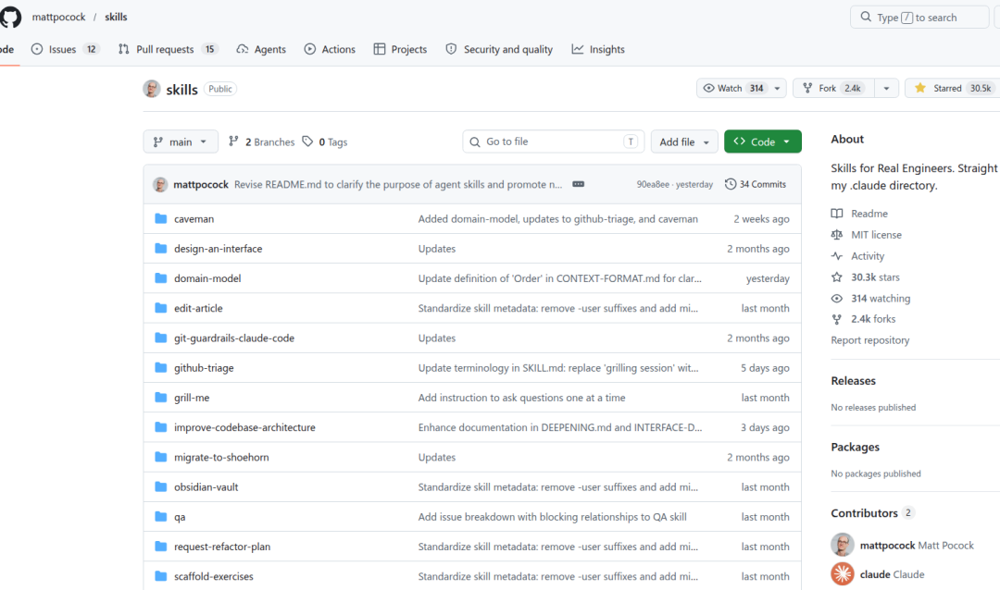

 

# 1 产品规划的skill

 

 

## 1.1 PRD生成

 

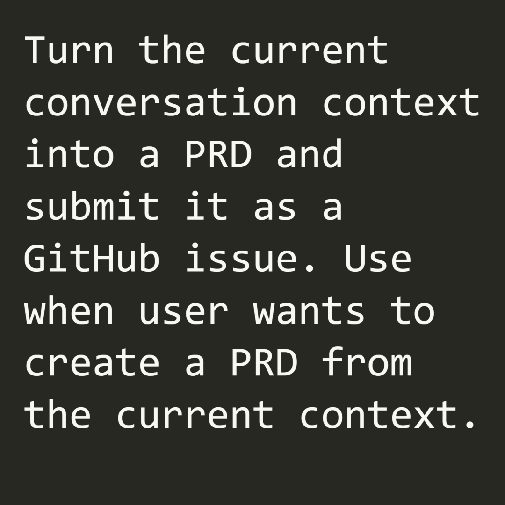

✅使用说明

to-prd 用来把已经讨论过的上下文整理成产品需求文档，并提交为 GitHub Issue（工程项目里的任务单 / 问题单 / 需求卡片）。它不继续追问用户，而是基于当前对话和代码仓库理解，合成问题陈述、解决方案、用户故事、实现决策、测试决策和非目标。

它体现的工程思想是：需求不能只停留在聊天里。真实项目中，口头共识很容易丢失，尤其当Agent、开发者、reviewer和未来维护者不在同一时间参与时。PRD的作用是把模糊愿望变成可追踪、可讨论、可验收的协作对象。

✅工程启发

好的 Agent 不应该急着实现功能，而应该先帮助团队把想做什么和为什么做写清楚。to-prd的价值在于把 AI 从执行层前移到产品澄清层，让后续代码生成有明确目标，而不是凭感觉补全一个看似合理的功能。

 

## 1.2 拆分任务的skill

 

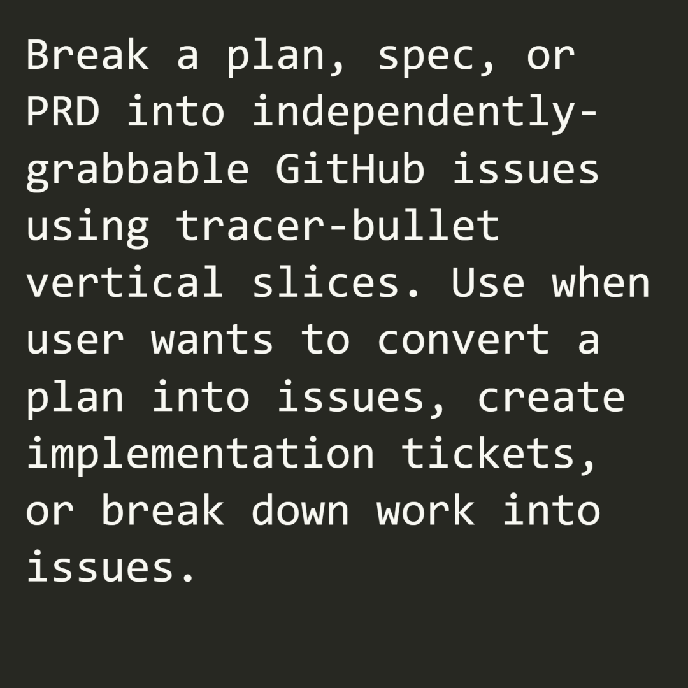

✅使用说明

to-issues 把计划、规格或 PRD 拆成可独立领取的 GitHub Issues。它强调细而完整的垂直切片。每个 issue 都应该穿过必要的集成层，形成一个端到端可验证的行为路径，而不是只完成某个技术层。

✅工程启发

垂直切片是 AI 编程里非常关键的复杂度控制手段。AI很容易在局部写出漂亮代码，但系统行为没有闭环。to-issues逼迫每个任务都对用户可见行为负责，避免项目陷入数据库、API、UI都做了80%，但没有一个功能能用的状态。

 

## 1.3 重构计划

 

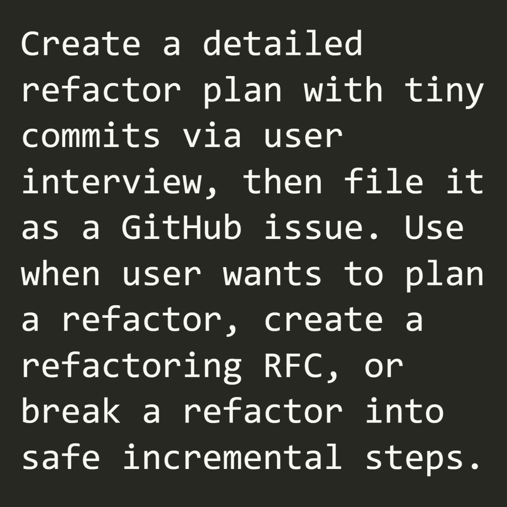

✅使用说明

request-refactor-plan 用于重构前的设计和风险控制。它会先让用户描述问题，再探索代码仓库验证判断，然后讨论替代方案，明确实现范围，检查测试覆盖，最后拆成非常小的提交计划。

这个技能的关键是安全地重构。它要求每个提交都足够小，并尽量让代码库始终保持可工作状态。这一点特别适合Agent，因为 Agent 一旦在大范围重构中失去反馈，很容易制造难以 review 的巨大 diff。

✅工程启发

真实工程里的重构是风险管理。request-refactor-plan把 Martin Fowler 的小步重构思想变成 Agent 工作流：每一步都应该可验证、可回退、可解释。

 

## 1.4 设计拷问

 

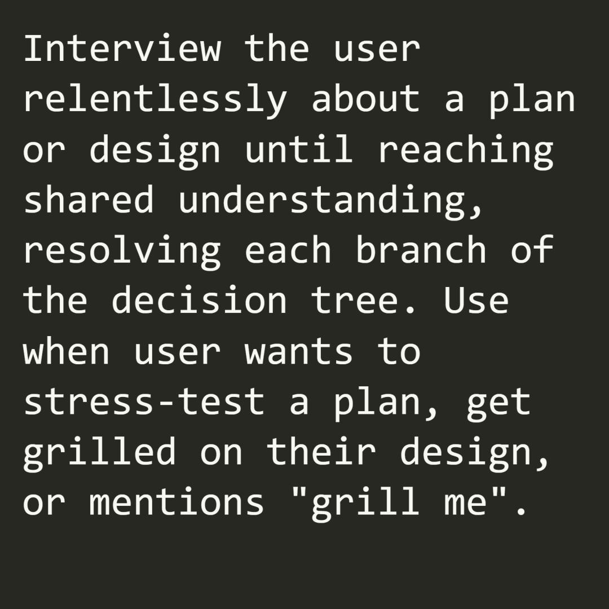

✅使用说明

grill-me 是设计压力测试技能。它不会直接给答案，而是沿着设计决策树持续追问：目标是什么、约束是什么、边界在哪里、替代方案是否考虑过、哪些问题能从代码库里验证。

它的工作方式接近资深工程师做 design review：把隐含前提显性化。很多技术方案失败，并不是实现能力不足，而是早期没有把关键决策问清楚。

✅工程启发

Agent 最危险的能力之一，是能快速补全你没有说清楚的部分。grill-me反过来要求 Agent 暂停补全，先暴露模糊性。这让 AI 从迎合需求转向保护设计质量。

 

## 1.5 接口设计

 

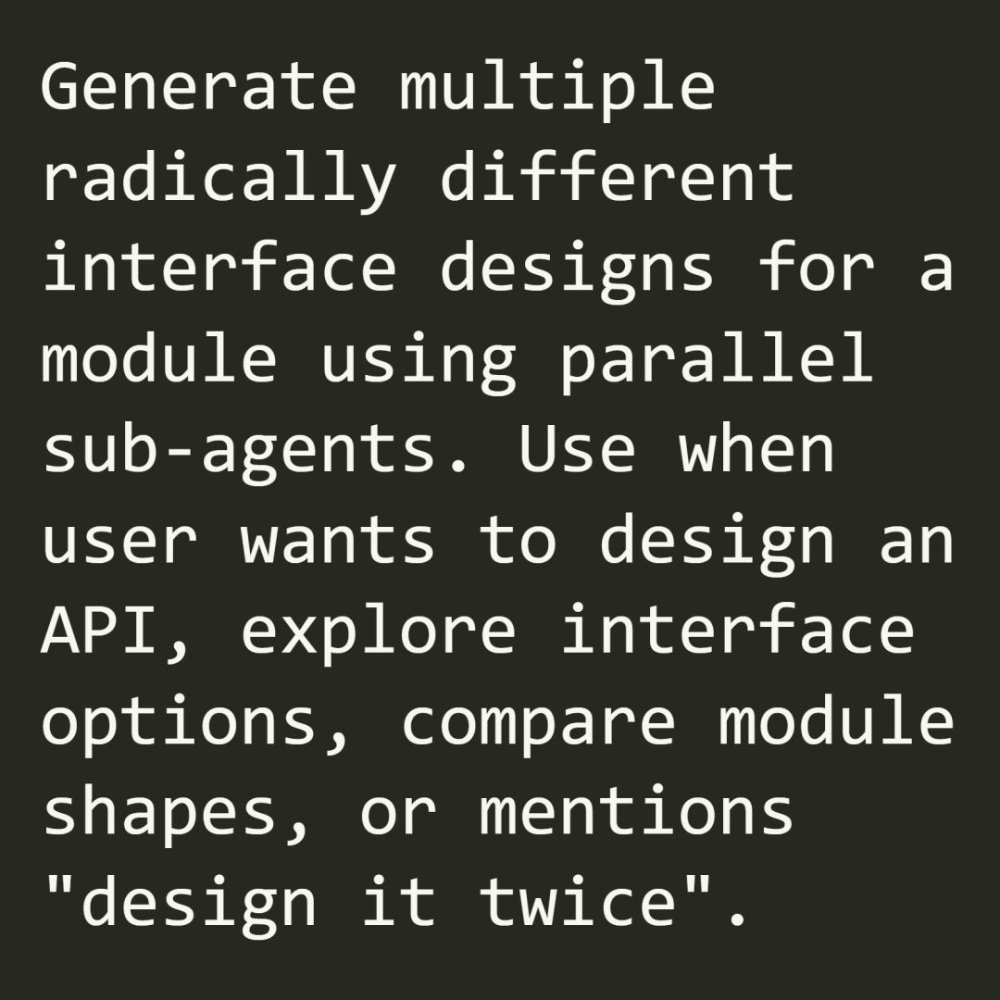

✅使用说明

design-an-interface 基于 Design It Twice 思想：第一个设计通常不是最好的。它会并行生成多个差异明显的接口方案，再比较接口简单性、通用性、实现效率、模块深度以及误用风险。

它强调先设计模块形状，而不是立刻写实现。一个好的接口应该让调用方学得少、得到多，把复杂度藏在模块内部。一个坏接口即使实现正确，也会把大量知识泄漏给调用方。

✅工程启发

AI 很擅长实现一个已经确定的接口，但不一定擅长质疑第一个接口是否值得实现。design-an-interface的意义在于给设计留出分叉时间，让 Agent 先探索多种模块形状，再收敛到更深、更稳定的接口。

 

# 2 架构建模的skill

 

 

## 2.1 通用语言

 

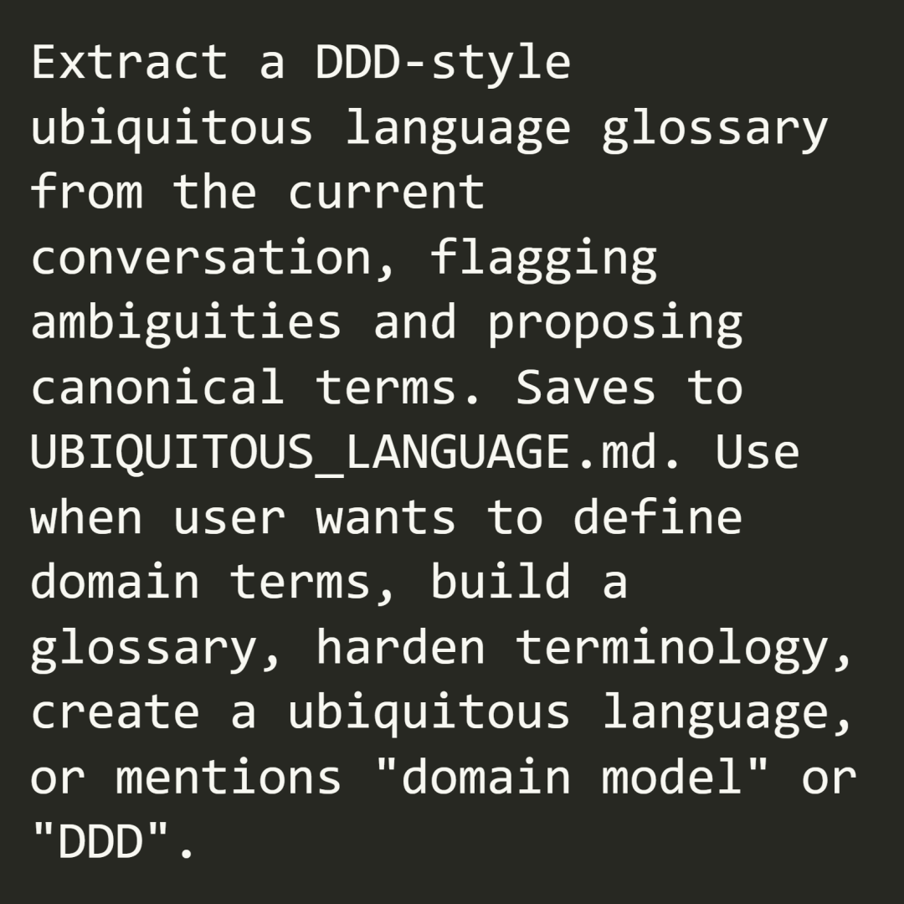

✅使用说明

ubiquitous-language 从对话中提取领域术语，识别一词多义、同义词混用、模糊概念，并输出UBIQUITOUS\_LANGUAGE.md。文档包含术语定义、避免使用的别名、关系说明、示例对话和歧义列表。

它要求 Agent 有主见：当多个词描述同一个概念时，要选择一个标准术语，并明确其他词不要再用。这样做的目的是降低沟通成本和模型误判概率。

✅工程启发

未来 AI 参与维护的代码库，语言资产会变得越来越重要。清晰的领域词汇不仅帮助人理解系统，也帮助 Agent 更稳定地检索、推理和修改代码。

 

## 2.2 架构深化

 

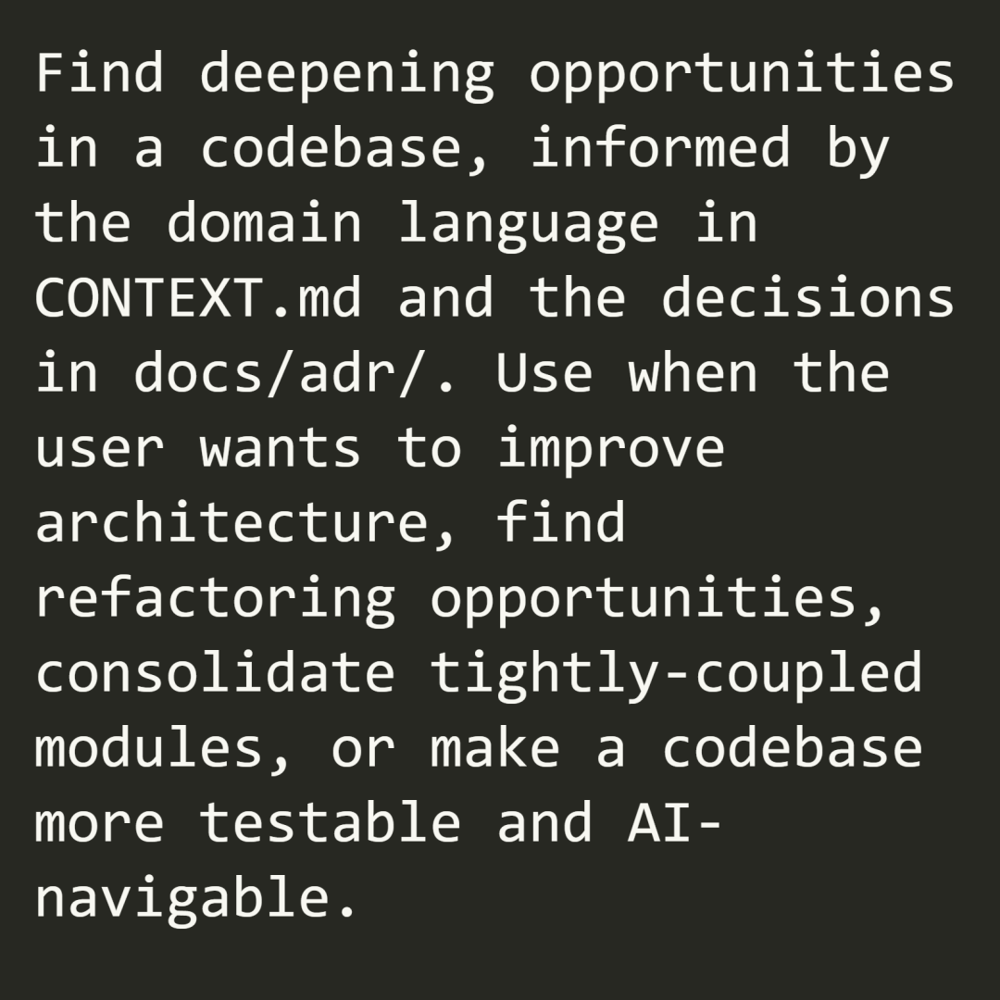

✅使用说明

improve-codebase-architecture 用于发现浅模块，并提出把它们变深的机会。它使用一套明确词汇：模块、接口、实现、深度、缝合点、适配器。

它的核心判断工具是删除测试：想象删除一个模块，如果复杂度消失，说明它可能只是无意义包装；如果复杂度扩散到多个调用方，说明它确实在隐藏复杂度，值得保留或深化。

✅工程启发

AI 很容易制造新抽象：helper、service、manager、adapter。但抽象不等于架构改进。真正有价值的模块能把知识、变化和测试集中起来。improve-codebase-architecture提醒我们：不要问能不能抽一层，要问这层有没有创造杠杆。

 

## 2.3 拉远视角

 

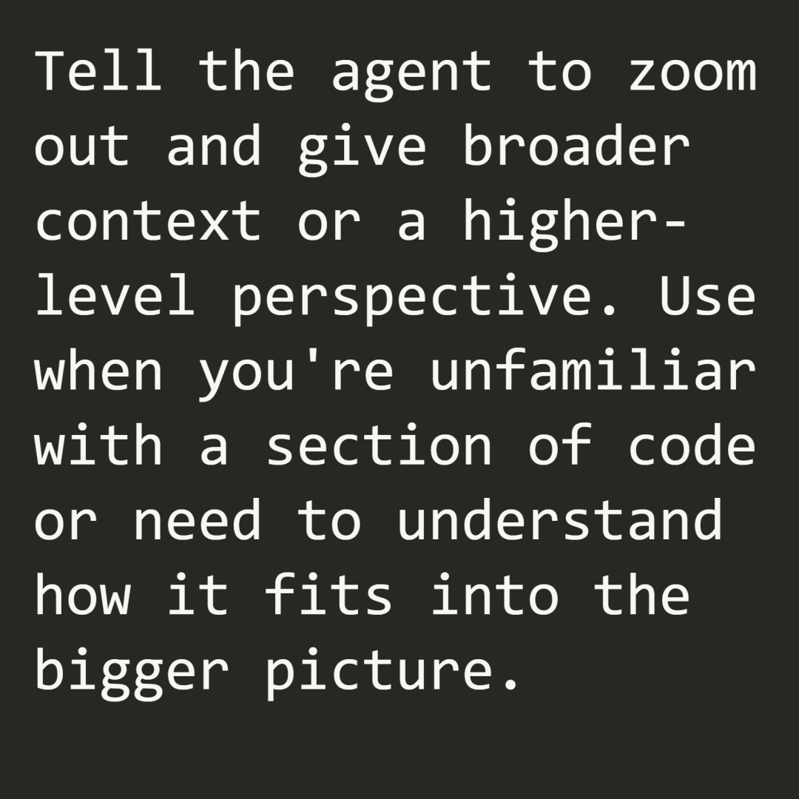

✅使用说明

zoom-out 是理解陌生代码时的抽象层切换工具。当某个局部看不懂时，不继续在细节里打转，而是要求 Agent 上升一层，解释相关模块、调用方和整体关系。

它适合接手新项目、排查跨模块bug、理解某个文件为什么存在。它不直接解决问题，而是帮助你建立地图。

✅工程启发

很多 Agent 失败不是因为不会改代码，而是因为过早进入局部。zoom-out让 Agent 先获得全局感，再回到局部动手，减少改对了一行，破坏了一片的风险。

 

# 3 开发验证的skill

 

 

## 3.1 测试驱动

 

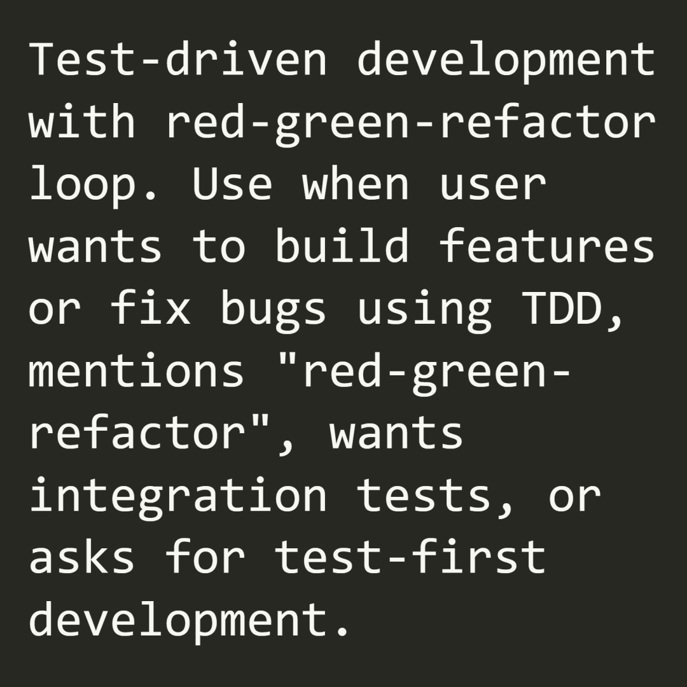

✅使用说明

tdd 强调通过公开接口验证行为，而不是测试实现细节。它反对一次写完所有测试再写所有实现的水平切片，要求使用垂直循环：一个失败测试，一个最小实现，再进入下一个行为。

✅工程启发

TDD 在 Agent 场景里不是仪式，而是反馈机制。AI的生成速度很快，如果缺少测试反馈，就会快速偏离真实行为。tdd把 Agent 的输出节奏压回可验证的小步循环，让每次实现都有行为锚点。

 

## 3.2 问题诊断

 

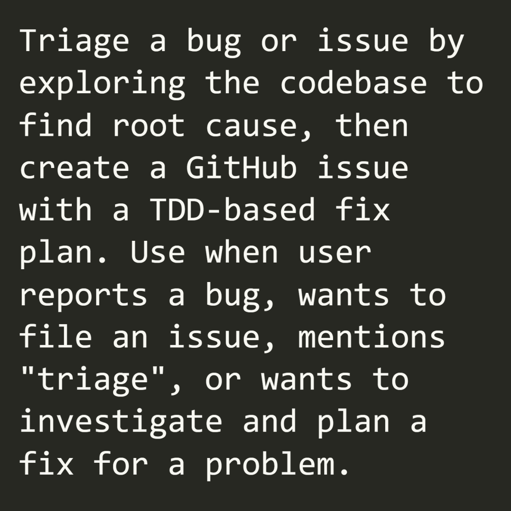

✅使用说明

triage-issue 用于 bug 调查和修复计划生成。它先捕获问题，再探索代码库，找出 bug 表现位置、涉及路径、根因、相关测试和相似实现，最后创建一个带 TDD 修复计划的 GitHub Issue。

它要求 issue 描述行为和契约，而不是绑定到当前文件路径和行号。因为 issue 可能几天或几周后才被处理，代码结构可能已经变化。

✅工程启发

真实工程里，修 bug 最重要的是找准根因。triage-issue把 Agent 从修症状拉回诊断系统行为，并用 TDD 计划保证修复路径可验证。

 

# 4 工具流程的skill

 

 

## 4.1 提交钩子

 

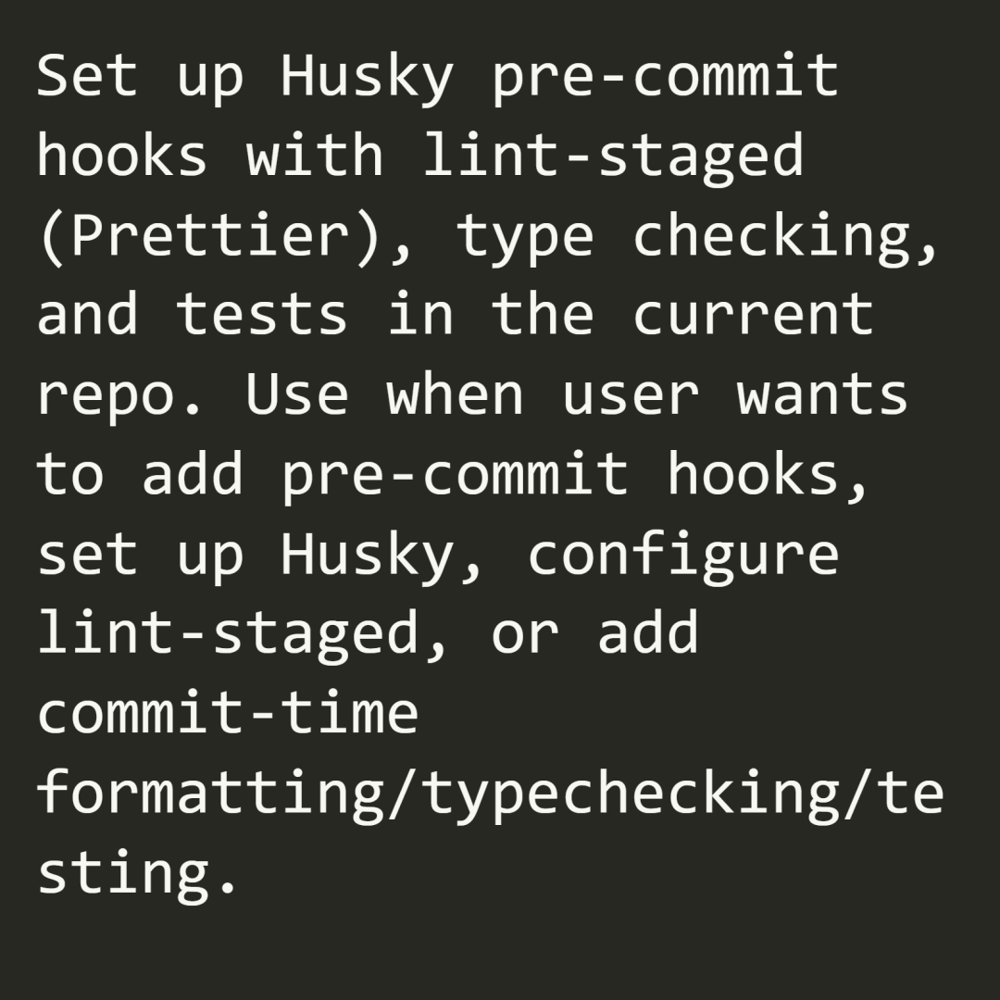

✅使用说明

setup-pre-commit 用于给仓库添加提交前质量门禁。它会检测包管理器，安装Husky、lint-staged、Prettier，并根据仓库已有脚本决定是否加入 typecheck 和 test。

它是把格式、类型和测试检查前移到提交阶段。对 Agent 来说，这是一层非常重要的自动反馈。

✅工程启发

不要靠 Agent 自觉保持质量。格式化、类型检查和测试应该成为工具层护栏。越是让 AI 自主工作，越需要把质量检查自动化。

 

## 4.2 Git护栏

 

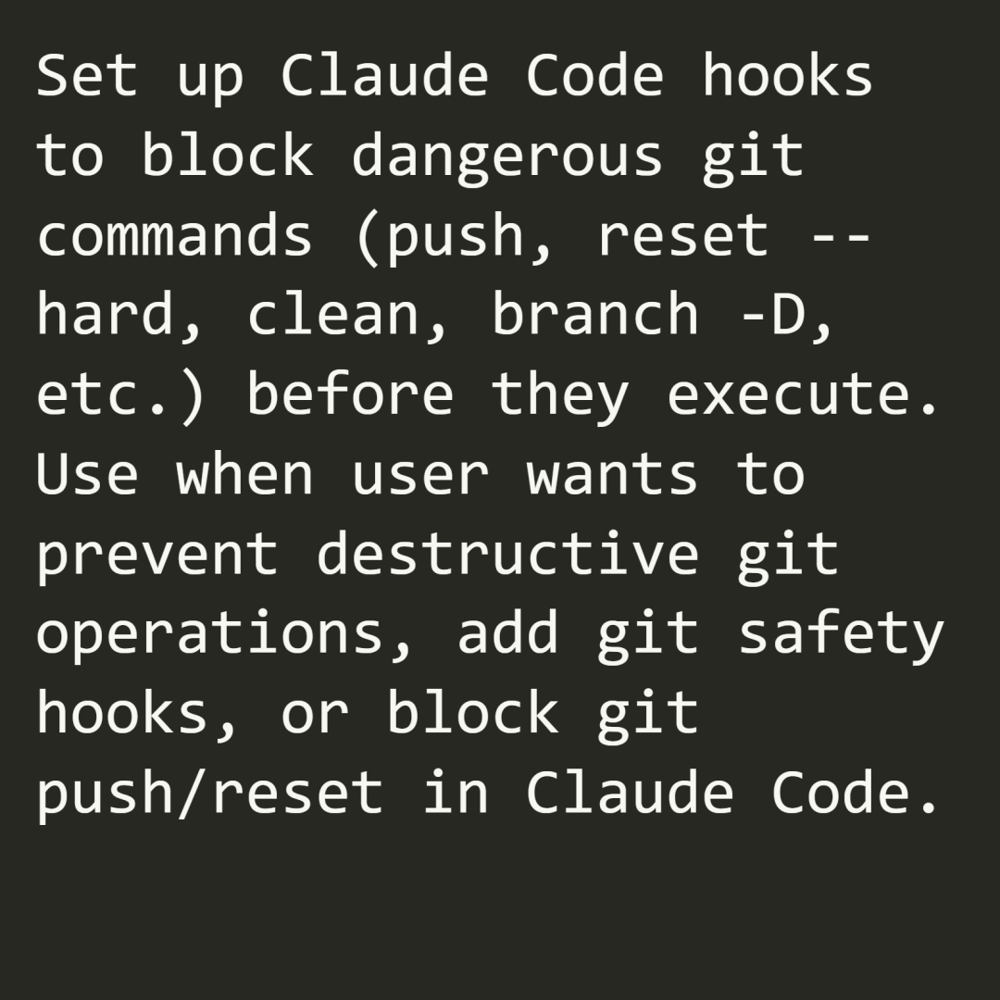

✅使用说明

git-guardrails-claude-code 通过 Claude Code 的 PreToolUse hook 拦截危险 Git 命令，例如 git push、git reset –hard、git clean -f、git branch -D、git checkout . 等。

它先询问安装范围，再复制 hook 脚本，合并配置并测试拦截是否生效。它强调不要覆盖已有设置，而是合并到现有 hooks 中。

✅工程启发

安全感不应该来自我相信 Agent 不会乱来，而应该来自系统边界。Git护栏不是降低 Agent 能力，而是让 Agent 的自主性在可控范围内发生。

 

# 5 知识表达的skill

 

 

## 5.1 写技能

 

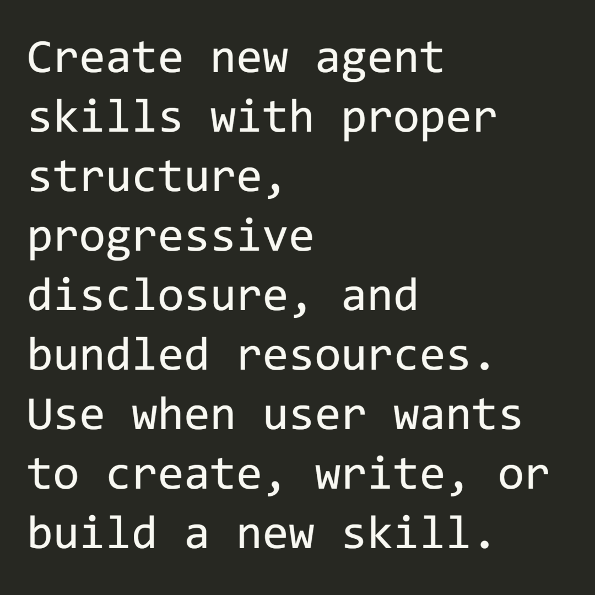

✅使用说明

write-a-skill 用于创建新的 Agent Skill。它要求先收集任务领域、具体用例、是否需要脚本、是否需要参考资料，再创建SKILL.md、额外参考文件或工具脚本。

最关键的是 description。Agent 决定是否加载技能时，首先看到的就是描述，所以描述必须说明能力是什么，以及什么时候触发。一个坏描述比如帮助处理文档，几乎没有区分度；一个好描述会明确任务类型、触发关键词和使用上下文。

✅工程启发

技能化的本质，是把经验变成可调用能力。过去资深工程师的工作流藏在脑子里，现在可以写成结构化协议，让 Agent 在合适时机复用。

 

## 5.2 编辑文章

 

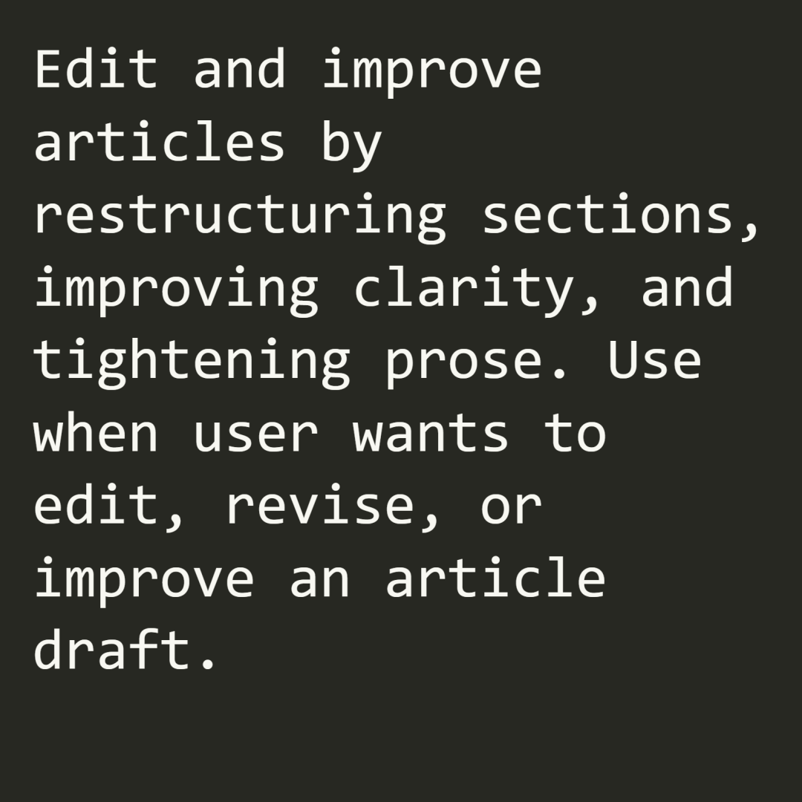

✅使用说明

edit-article 用于重构文章。它先按标题划分章节，再检查信息之间的依赖关系，确保前文提供理解后文所需的概念。之后逐节改写，提升清晰度、连贯性和节奏。

它把文章视为有向无环图：信息有前置依赖，读者必须先获得基础概念，才能理解后续观点。这个视角比单纯润色更工程化。

✅工程启发

技术写作是安排认知路径。edit-article的思路也适用于代码文档、RFC、ADR和issue：先让读者拿到必要上下文，再让他们理解决策。

 

## 5.3 笔记库

 

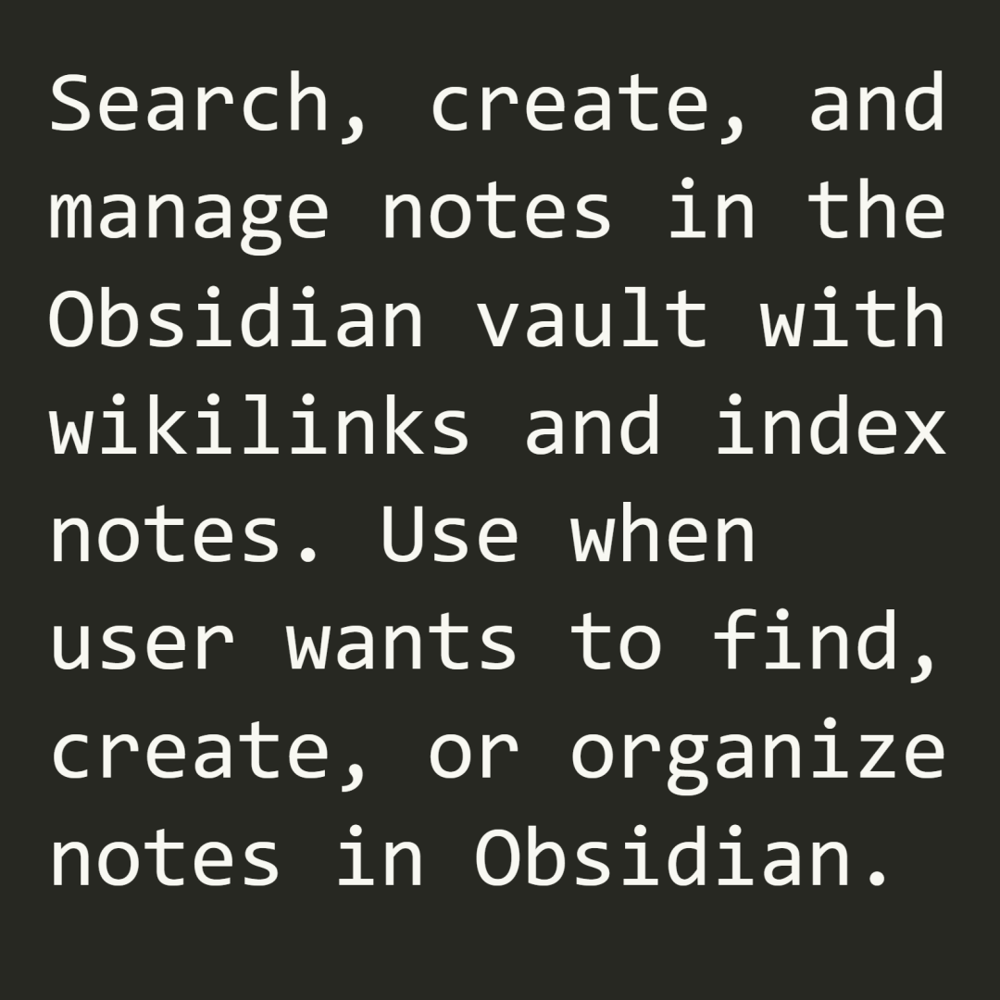

✅使用说明

obsidian-vault 用于管理 Obsidian 知识库。它采用扁平目录、标题大小写命名、[[wikilinks]]链接和 Index note 聚合。工作流包括搜索笔记、创建新笔记、查找反向链接和维护索引。

它适合把工程学习、研究材料、技能总结和项目经验沉淀成可检索、可链接的知识网络。

✅工程启发

AI 协作会产生大量上下文，如果不沉淀，很快就会消散。笔记库让临时洞察变成长期资产，也让未来的 Agent 能更快进入同一条知识链路。

 

# 6 总体启示

 

这套skill的开源地址是https://github.com/mattpocock/skills。它把需求澄清、方案拷问、接口设计、任务拆分、测试驱动、issue流转、知识沉淀这些过去依赖个人经验的活动，转成可以反复调用的能力。Agent可以在不同阶段扮演不同角色：

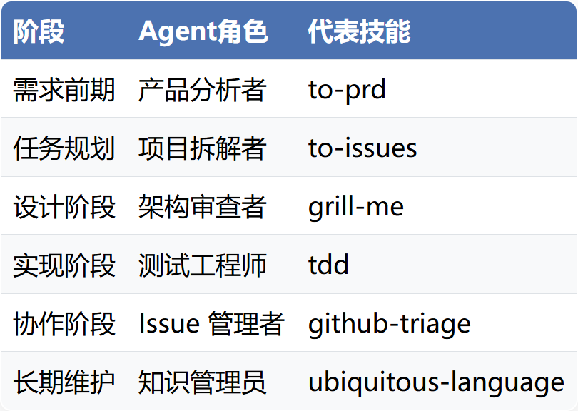
