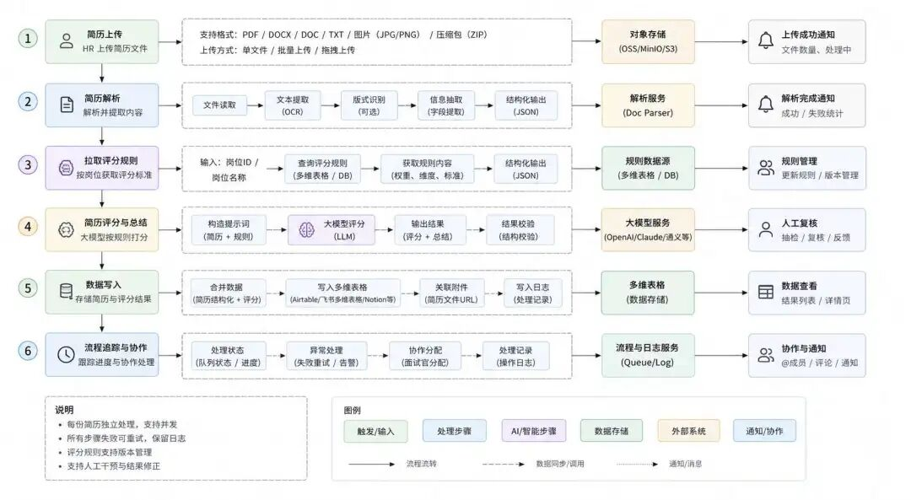
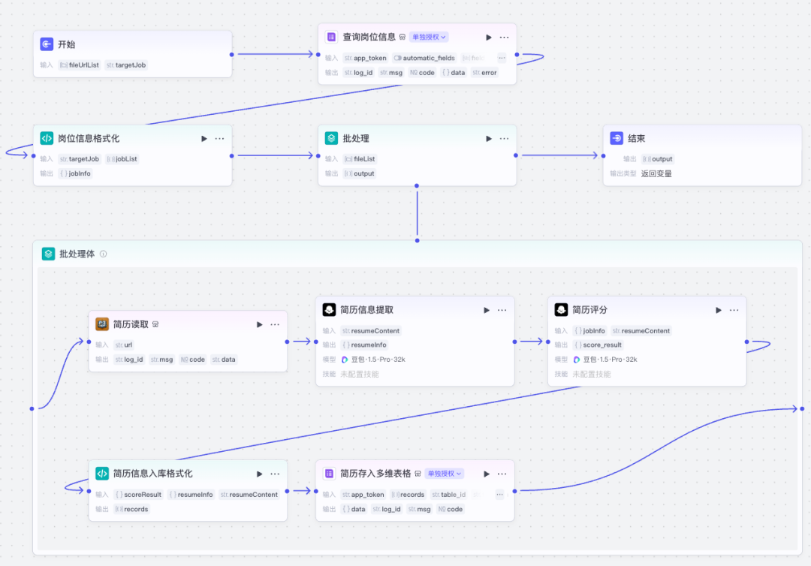
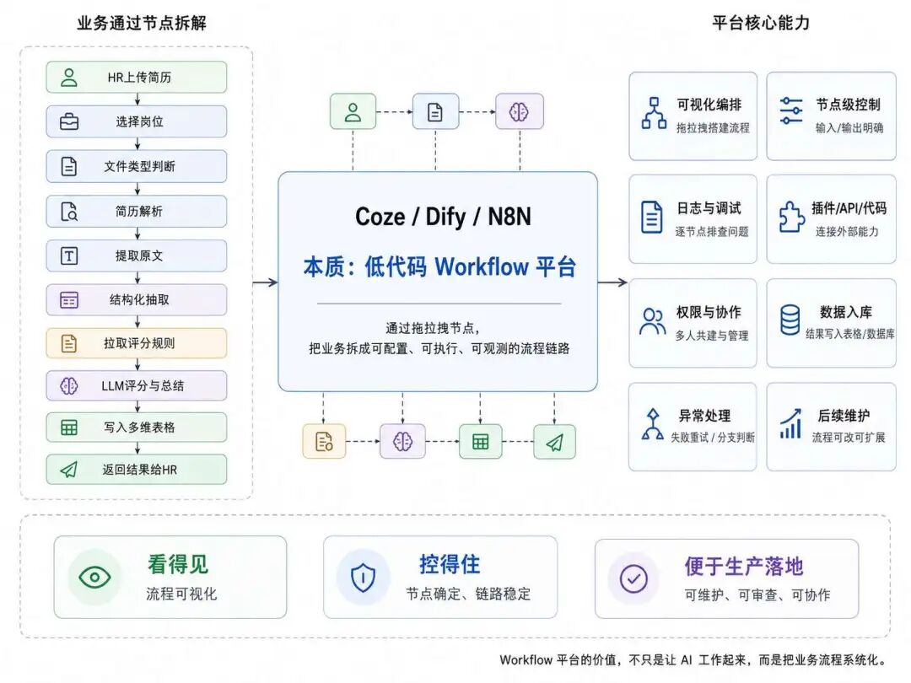
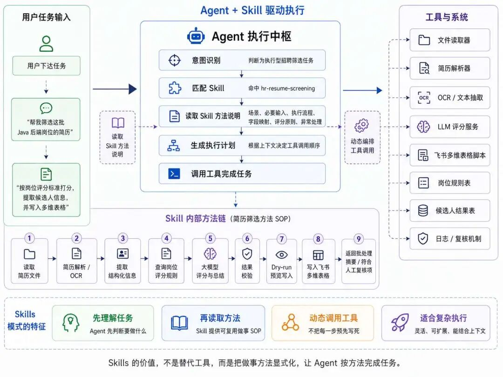
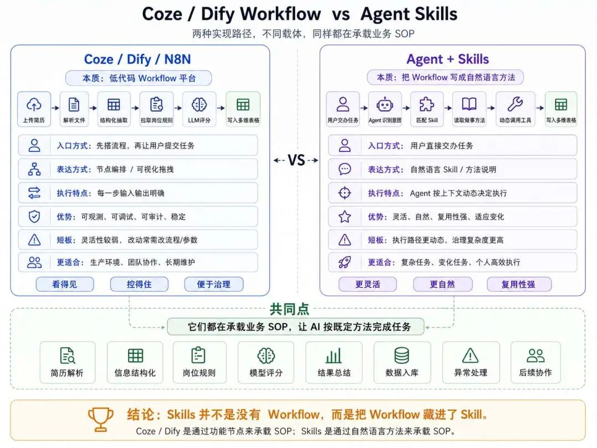
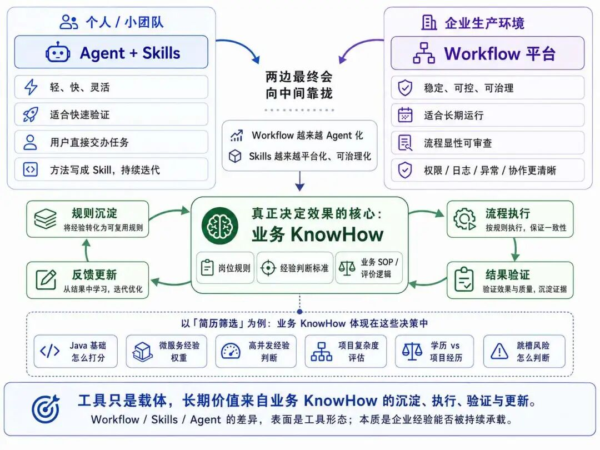
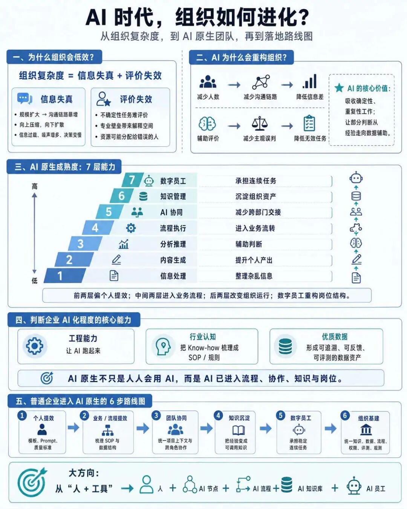

> 📎 来源: [叶小钗](https://mp.weixin.qq.com/s?__biz=Mzg2MzcyODQ5MQ==&mid=2247501435&idx=1&sn=642af5904bb631485301a3acfd90d00f&chksm=cf59e3e422bfdc6dbdda56ed615bb479351d7e15002c550da7de0ac18e632d23dbb6e7525b87&mpshare=1&scene=1&srcid=0520FcjmBrNCPJXETnS1vqPM&sharer_shareinfo=0c40a3fe00936f2838752be6dbe6636c&sharer_shareinfo_first=0c40a3fe00936f2838752be6dbe6636c) | 时间: 2026-05-20 20:36

---

> AI训练营**10期**，**6月底**开班，欢迎咨询

最近在聊 AI 应用开发平台选择的时候，会被高频问到的一个问题：

> Agent 可以通过 Skills 学会一套做事方法，那会不会导致Coze、Dify、N8N 这种靠 Workflow 编排的平台死掉？

关于这个问题，我们之前就做过探讨：[《OpenClaw 会不会淘汰 Coze、Dify 这类平台？》](https://mp.weixin.qq.com/s?__biz=Mzg2MzcyODQ5MQ==&mid=2247499385&idx=1&sn=d29ddecd0b73840842deef1df0f118dd&scene=21#wechat_redirect)

这次为了把这个问题说清楚，我找一个大家都熟悉的业务场景，用两种方式都实现一遍，再看它们到底有什么差异。

这里我们用 HR 简历筛选为案例，假设现在公司有一个需求：

```
HR 上传一批简历系统解析简历内容，提取结构化信息根据岗位拉取评分规则，让大模型按标准打分并输出总结最后把简历信息和评分存储到多维表格中
```

案例虽然简单，但是它**包含完整业务链路**，有文件解析、信息提取、模型判断、数据写入、多人协作和后续追踪。既需要 AI 的认知能力，也需要系统的执行能力；既有灵活判断，也有稳定流程：



下面我们展开来看两种方式的实现路径：

## 用 Coze/Dify 会怎么做？

如果用 Coze、Dify 这类平台来做 HR 简历筛选，那肯定是通过拖拉拽节点，编排一条 Workflow。

这条 Workflow 大概会长这样：

1. HR 上传一批简历；
2. 选择对应岗位；
3. 判断简历文件类型；
4. 对 PDF、Word、图片简历做解析；
5. 提取简历原文；
6. 从原文中抽取结构化信息；
7. 根据岗位 ID 拉取评分规则；
8. 将简历信息和岗位规则一起交给大模型；
9. 让模型按规则打分并输出总结；
10. 将候选人信息、评分、总结、风险点写入多维表格；
11. 返回处理结果给 HR。



这就是典型 Workflow 平台的做法，他的本质是**低代码平台**。

它会先把任务拆成若干个明确节点，再为每个节点配置对应的模型、插件、代码逻辑或接口能力。

比如第一个节点是上传简历，第二个节点是解析文件，第三个节点是结构化抽取，第四个节点是拉岗位评分规则，第五个节点是模型评分，第六个节点是**写入多维表格。**

可以看出，这类Workflow平台的核心特征是：**每个节点的输入和输出都是确定的，整体执行流程非常可控，我们能看见整个链路运行逻辑、也可以追踪运行日志**。

并且，还能对每个节点做**精细控制**，如果运行过程中出现问题，我们能够清晰的定位出是哪一个节点出了问题。

比如候选人手机号没写进表格，到底是简历解析没提取出来，还是结构化字段没映射，还是表格字段权限出错？

***Workflow 能很清楚地排查。***

对于企业而言，在真实生产环境，更需要的是一套能够***长期稳定运行、可维护、可审查***的系统。

所以从 Coze/Dify 的角度看，它追求的是：

1. 流程看得见；
2. 节点控得住；

3. 异常能处理；
4. 结果能入库；

5. 权限能管理；
6. 团队能协作；

7. 后续能维护。

这也是 Workflow 平台的最大价值：



## 用 Skills 怎么做？

现在我们换一种方式，用 Skills 的方式来做。

这里需要先定义一个 HR 简历筛选 skill，把这件事应该怎么做写清楚，然后让 Agent 在需要时读取这个 skill，再调用相关工具完成任务。

用户可以直接对 Agent 说：

```
帮我筛选这批 Java 后端岗位的简历按岗位评分标准打分，提取候选人信息并写入多维表格
```

Agent 接到任务后，会先进行意图识别，判断这是一个执行型任务，需要：

1. 读取简历文件；
2. 解析简历内容；
3. 提取候选人结构化信息；
4. 拉取岗位评分规则；
5. 调用大模型评分；
6. 生成总结；
7. 写入多维表格。

接着它会去匹配相关 skill，比如：HR 简历筛选 skill，这个 skill 可能会这样写：

```
---name: hr-resume-screeningdescription: 当用户要求批量筛选简历、解析候选人信息、按岗位评分规则打分、生成总结，并写入飞书多维表格时使用本 skill。适用于 HR 简历筛选、招聘初筛、候选人评估、岗位匹配、面试推荐和飞书多维表格入库任务。---# HR 简历筛选## 使用场景当用户要求“筛选一批简历、按岗位规则评分、写入飞书多维表格”时使用本 skill。不要用于单纯简历润色、求职建议或不涉及候选人评估的任务。## 必要输入- 简历来源：文件、文件夹或可访问链接。- 岗位信息：岗位名称或岗位 ID。- 候选人结果表：飞书多维表格链接，或 `app_token` + `table_id`。- 岗位规则表：默认也是飞书多维表格，通过岗位名称或岗位 ID 查询。- 写入策略：权限或字段不明确时，先预览再写入。不要写死飞书 token、app token、table ID、API key 或凭证。优先读取环境变量或用户通过安全方式提供的信息。## 飞书脚本使用 `scripts/feishu_bitable.py` 调用飞书多维表格。凭证读取顺序：1. `--tenant-access-token`2. `FEISHU_TENANT_ACCESS_TOKEN`3. `FEISHU_APP_ID` + `FEISHU_APP_SECRET`常用命令：```bashpython3 scripts/feishu_bitable.py parse-url "$BITABLE_URL"python3 scripts/feishu_bitable.py fields --bitable-url "$CANDIDATE_TABLE_URL"python3 scripts/feishu_bitable.py search --bitable-url "$RULE_TABLE_URL" --filter-file rule-filter.jsonpython3 scripts/feishu_bitable.py batch-create --bitable-url "$CANDIDATE_TABLE_URL" --records-file candidate-records.jsonpython3 scripts/feishu_bitable.py batch-create --bitable-url "$CANDIDATE_TABLE_URL" --records-file candidate-records.json --dry-run````candidate-records.json` 可以是字段对象数组，也可以是飞书原生 `{ "fields": {...} }` 结构。## 执行流程1. 确认上下文：简历数量、岗位名称/ID、候选人结果表、岗位规则表。2. 用 `fields` 检查候选人结果表字段，发现缺字段或类型不匹配时先提示。3. 解析简历：PDF/Word 提取文本，图片或扫描件在可用时走 OCR；解析失败则标记人工复核，不编造内容。4. 提取候选人字段：姓名、手机号、邮箱、城市、学历、学校、专业、年限、最近公司/职位、核心技能、项目摘要、简历来源、附件链接。5. 用 `search` 按岗位名称或岗位 ID 查询评分规则；没有规则时停止评分并提示补充规则。6. 按岗位规则评分：输出总分、维度分、推荐等级、优势、风险点、关键证据、信息缺失项、建议追问问题。7. 校验输出：总分/维度分应为数字；模型输出格式错误时重试一次，仍失败则标记人工复核。8. 生成 `candidate-records.json`，用 `batch-create --dry-run` 预览；确认后用 `batch-create` 写入飞书。9. 返回批处理摘要、候选人结果、飞书写入结果和待人工处理事项。## 字段映射候选人字段：- 候选人姓名- 手机号- 邮箱- 当前城市- 最高学历- 毕业院校- 专业- 工作年限- 最近公司- 最近职位- 核心技能- 项目经历摘要- 简历来源- 简历附件链接筛选字段：- 应聘岗位- 岗位 ID- 总分- 维度评分- 推荐等级- 候选人优势- 风险点- 建议追问问题- 评分规则版本- 关键证据- 信息缺失项- 处理状态- 复核原因- 处理时间推荐取值：- `处理状态`：已评分、待人工复核、评分规则缺失、解析失败、写入失败。- `推荐等级`：强烈推荐、推荐、待定、不推荐。默认分数段仅作展示：80 分及以上推荐或强烈推荐，60 到 79 分待定，60 分以下不推荐；岗位规则有阈值时以岗位规则为准。## 评分原则- 只按岗位评分规则打分，不凭通用印象评分。- 评分必须给出简短证据，不能只给分。- 不因关键词堆砌给高分，要看项目证据、职责和结果。- 证据不足时明确标记不确定性或待人工复核。- 不做最终录用决定，只提供第一轮筛选辅助。- 避免歧视性或法律敏感判断，只评价岗位相关经历、技能、资质和证据。## 异常处理- 简历解析失败：`处理状态 = 解析失败` 或 `待人工复核`，保留文件名、附件链接和失败原因。- 评分规则缺失：停止评分，报告缺失的岗位名称或岗位 ID。- 模型输出不合规：重试一次，仍失败则标记 `待人工复核`。- 飞书写入失败：保留结构化结果，报告权限、表格 ID、字段名、字段类型、附件字段或 API 问题。- 批处理中部分失败：继续处理其他简历，并分开返回成功、待复核和失败记录。## 输出格式```markdown## 批处理摘要- 简历总数：- 成功评分：- 已写入飞书：- 待人工复核：- 失败：## 候选人结果| 候选人 | 岗位 | 总分 | 推荐等级 | 核心理由 | 处理状态 || --- | --- | ---: | --- | --- | --- |## 飞书写入结果- 成功记录数：- 失败记录数：- 失败原因：## 需要人工处理- 规则缺失：- 解析失败：- 字段/权限问题：```
```

从这个 skill 的实现可以看出，这里面其实也是 Workflow，只不过是把 Workflow 变成了用自然语言描述，把这套业务方法封装成 Agent 可以理解、可以复用的能力包。

用户只要启用这个 skill，Agent 就知道这件事要按什么逻辑处理：



## 孰优孰劣？

从使用体验上看，skill 会比 Workflow 更加灵活。

Workflow 的入口通常是先搭好流程，再让用户按流程提交任务；skill 的入口更像是用户直接交办任务，然后 Agent 根据任务内容去匹配合适的方法。

比如 HR 临时强调

```
重点看 B 端 SaaS 经验，80 分以上推荐面试
```

在 Workflow 里可能要改参数、调规则；但在 skill + Agent 的模式下，Agent 可以先理解这次任务的具体要求，再结合 skill 里的做事方法动态执行。

> **但也正因为 Skill 更灵活，它的治理难度会更大**

个人使用时，这种灵活性很方便；但放到企业生产环境，问题就会变复杂

1. 评分标准怎么统一？
2. 执行路径不稳定怎么办？
3. 简历文件、多维表格、候选人联系方式这些权限怎么控制？

skill 一旦承载真实业务，就不能只看**能不能完成任务**，重点就要回归***长期稳定性***了，而所谓的长期稳定性，又要回到 Coze、Dify、AI 表格最核心的特点：**能不能被审计、被观测、被治理。**

但是 skill 的优势确实很令人向往，灵活、自然、复用性强，短板是治理复杂度更高，这块需要进一步想办法。

其实，大家也不用将 Agent Skills 和 Coze/Dify 等 Workflow 低代码平台完全切割开。 因为从本质上看，它们其实都在做同一件事：**承载业务 SOP，并让 AI 按照这套 SOP 去执行任务**。

HR 简历筛选这个案例，无论我用 Coze/Dify，还是用 Skills，最终都要解决这些问题：

1. 简历怎么解析
2. 信息怎么结构化

3. 岗位规则从哪里来
4. 模型按什么标准打分

5. 输出哪些总结
6. 结果写到哪里

7. 异常怎么处理
8. 后续如何协作

这些问题不会因为换了实现路径就消失。

只不过 Coze/Dify 通过编排功能节点实现，Skills 通过自然语言描述实现。

> 但它们底层都在承载业务 SOP

这也是很多人容易忽略的点：Agent 这类 Skills 体系并不是没有 Workflow，它只是把 Workflow 藏进 skill 里了，**大家应该想想没有 Skills 这套工程机制前，Agent 的稳定性是更加糟糕的**。

比如 HR 简历筛选 skill 里写着：先解析简历，再提取字段，再拉岗位规则，再评分，再写入多维表格。

这是不是 Workflow 吗？当然是!



> **所以，skill 只不过是 Workflow 的另一种表达方式，新瓶装旧酒，载体不同了而已。**

## 企业怎么选？

如果是个人使用，或者小团队快速验证， Skills 会更有优势。

> 因为它轻、快、灵活，交互方式也自然

比如一个创业公司 HR，只想快速处理一批简历，看看哪些候选人值得约面。

这个时候，用 Skills 可能比搭一整套 Workflow 更快，先把业务方法写成 Skills，让 Agent 先跑起来，再根据结果不断调整。

如果放到企业真实生产环境，我会更倾向于 Workflow 平台，原因也很简单：**企业生产环境最需要的是系统稳定可控和治理。**

比如HR 简历筛选在生产环境里，会涉及很多严肃问题：

1. 候选人隐私如何保护；
2. 简历附件如何存储；

3. 谁能查看联系方式；
4. 岗位评分规则谁来维护；

5. 不同岗位是否使用不同规则；
6. 模型评分有没有解释依据；

7. 筛选结果能不能追溯；
8. 数据是否进入统一系统；

9. 面试反馈能不能回流；
10. 规则变更后如何版本管理。

这些问题更适合用显性 Workflow 来处理，因为 Workflow 更容易被审查，也更容易做权限控制、日志记录、异常处理和团队交接。

所以我的判断是：

> **Skills 不会让 Coze、Dify 这类 Workflow 平台死掉**

但是会给到它们一些压力，这会倒逼 Coze、Dify 这类平台升级，并且结合目前 Coze 这边变化来看，已经做了很大的变化，不再是定位为工作流搭建平台，而是通过 AI Coding 的方式来实现 Workflow 的搭建，不再需要手动去拖拉拽这些节点来实现流程编排。

以后的 Workflow 平台大概率也会往这个方向变化，同时也会越来越 Agent 化；而 Skills 系统可能也会越来越平台化、可治理化。

两边最后会向中间靠拢：



## 最重要的是 Knowhow

讲到这里，我们再更近一步。

**无论用 Coze/Dify，还是用 Agent + Skills，最终决定 HR 简历筛选效果的，都不是工具形态，而是岗位评价标准，也就是业务 KnowHow。**

比如高级 Java 后端岗位，到底应该怎么打分？

Java 基础占多少？

微服务经验占多少？

高并发经验占多少？

项目复杂度怎么看？

简历里只写熟悉 Redis、Kafka，但没有项目细节，要不要给高分？

候选人学历一般，但项目经历很扎实，要不要推荐？

候选人两年换了三家公司，风险怎么计算？

这些判断标准，才是最有价值的。

如果没有这套标准，Coze/Dify 也只是把流程跑起来；Skill 也只是让 Agent 看起来会干活。

但如果有了这套标准，无论它被写进 Workflow 节点，还是被写进 Skill，AI 才真正开始承载业务能力。

所以我认为，AI 应用的竞争表面上是 Workflow、Skills、Agent 的竞争，本质上是业务 KnowHow 承载方式的竞争。

谁能把企业里的经验、规则、判断标准沉淀下来，并让它们在流程里执行、在结果里验证、在反馈里更新，谁才有长期价值。

## 结语

最后总结一下：Workflow、Skills、Agent Runtime，本质上都只是 AI 应用的承载层。

它们解决的是：一件事应该按什么步骤做、什么时候调用模型、什么时候调用工具、结果应该写到哪里、异常应该怎么处理。

这些能力很重要，但它们还不是 AI 应用最难的部分。真正难的是：**企业到底有没有一套可被 AI 调用的知识/SOP系统。**

HR 简历筛选这个案例里，流程并不复杂。解析简历、抽取字段、拉取规则、模型打分、写入表格，这些步骤无论用 Coze/Dify，还是用 Skills，最终都能跑起来。

但问题是，跑起来以后，系统真的会判断吗？这里的逻辑是当 SOP 被写出来以后，更难的问题马上就来了：**知识怎么办？**

比如：客服系统不是只会按步骤回复，而是要知道哪些问题能答、哪些问题不能答、哪些承诺不能给、哪些场景必须转人工。

这里又可以回归我们昨天的 AI 原生话题的研究了，讨论 Skills/Coze/Dify 其实还在讨论**业务/流程如何接入 AI 的问题**，这其实挺前期的：



所以，讨论 Skills、Coze、Dify、N8N，本质上还不是在讨论**谁会淘汰谁**，而是在讨论一个更前期的问题：

> 企业到底如何让 AI 进入自己的业务流程？

SOP 如何被模型调用，工具如何被系统编排，如果把视角再往上提一层，你会发现这只是企业 AI 化的第一步。

换句话说，今天我们讨论 HR 简历筛选用 Workflow 还是 Skills，表面上是工具选择，实际上是在回答一个更大的问题：

> 你的企业有没有能力，把业务 KnowHow 变成可执行、可观测、可迭代的 AI 系统？

如果没有这个能力，换什么平台都只是 Demo。

如果有这个能力，Coze、Dify、N8N、Skills、Agent Runtime，都只是不同阶段的承载层。真正值钱的不是平台，而是企业把流程、知识、数据、评价体系持续沉淀下来的能力。
