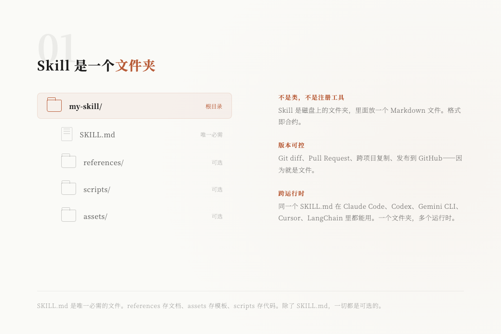
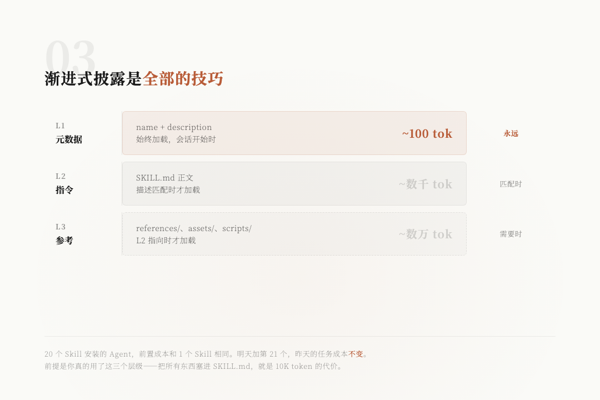
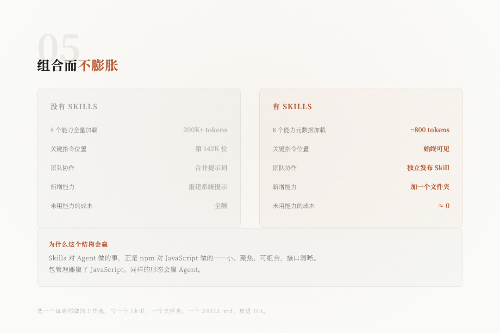

> 📎 来源: [老郑的AI工具箱](https://mp.weixin.qq.com/s?__biz=MzkxNjYyMzIwNQ==&mid=2247484414&idx=1&sn=615907d2caf070b652a63d7d812b8ccd&chksm=c03147c0e19c760f34c5ae934744d18351f06a623dccefc735ddb88ff580dc5fc01e84d0c8ae&mpshare=1&scene=1&srcid=0429mnOTMSsRdRblGwpOfzTu&sharer_shareinfo=062895b16c37f1129a563be2fb0415e8&sharer_shareinfo_first=062895b16c37f1129a563be2fb0415e8) | 时间: 2026-04-29 03:41

---

> 作者：Shubham Saboo (@Saboo\_Shubham\_)

> 你的 Agent 有 200K token 的上下文窗口。它真正需要的指令只有 400 token。但它还是忽略了。

> 那 400 token 被埋在第 142K 的位置——六个工具定义、四份参考文档、一份没人要求它读的品牌指南下面。

> 这是 Agent 在生产环境中最常见的失败原因。不是因为模型，不是因为框架。而是提示词太大了，正确的信息被淹没了。

> Skills 是这个问题最干净的解法。不需要更大的模型，不需要更大的窗口，不需要更聪明的检索器。只需要一组关于上下文住在哪里、何时加载的设计决策。

> 五个部分构成整个系统。以下是每个部分如何衔接的。

---

## 1. Skill 是一个文件夹



Skill 不是 Python 类，也不是注册的工具。它是磁盘上的一个文件夹，里面放一个 Markdown 文件。

**SKILL.md** 是唯一必需的文件。references 存放 Agent 按需读取的文档。assets 存放模板和品牌文件。scripts 存放 Agent 可以执行的代码。除了 SKILL.md，一切都是可选的。

因为 Skill 就是文件，你可以用 Git 做版本控制。用 Pull Request 做 diff。在项目间复制。发布到 GitHub。**格式即合约**。

同一个 SKILL.md 在 Claude Code、Codex、Gemini CLI、Cursor、Agent Development Kit、LangChain 以及越来越多 Agent 工具和框架中都能用。**一个文件夹，多个运行时**。

---

## 2. 前两行是搜索索引

打开任何一个 SKILL.md，你首先看到的是 YAML frontmatter 里的两个字段。这两个字段不只是元数据——**它们是搜索索引**。

会话开始时，Agent 加载每个已安装 Skill 的 name 和 description。大约每个 Skill 100 token。正文、参考文档、脚本——全都留在磁盘上。

当请求进来时，模型读取自己的目录，决定打开哪个 Skill。**description 就是它匹配的依据**。写一个模糊的 description，Skill 永远不会被触发。写一个带有具体触发词的精准 description，Skill 就会在该激活的时候精准激活。

**这一行是整个 Skill 中最重要的文字**。人们花几个小时写正文，十秒钟写 description，然后奇怪为什么 Skill 从来没被用过。

**把那个比例反过来。**

---

## 3. 渐进式披露是全部的技巧



单个 Skill 可以容纳数万 token 的指令和参考材料。20 个 Skill 的 Agent 可能携带数十万 token——在用户还没打字之前，就已经是多个完整上下文窗口的死重。

**渐进式披露**通过三个加载层级来防止这个问题：

**L1 元数据**：名称和描述。会话开始时始终加载。每个 Skill 大约 100 token。

**L2 指令**：SKILL.md 的正文。只有当描述匹配用户任务时才加载。通常是几千 token。

**L3 参考**：references/、assets/、scripts/ 中的文件。只有当 L2 指令明确指向时才加载。

安装了 20 个 Skill 的 Agent，前置成本和安装 1 个的一样。明天加第 21 个，昨天任务的代价不变。

**但前提是你真的用了这三个层级。** 把所有示例塞进 SKILL.md，正文膨胀到 10K token。现在每个触发该 Skill 的任务都要付出这个代价。

**保持 SKILL.md 简短。把边缘情况、长示例、参考表格推到 references/ 里。Agent 只在需要时才拉取。**

---

## 4. Agent 路由查询


当请求进来时，模型做的事和你看着工具箱做的事一样：读标签，挑对的，打开它。

用户说「清理这个 CSV 并去重」。模型扫描描述目录：pdf-forms，低匹配。brand-voice，低匹配。data-clean：CSV 清理、去重、空值处理，**强匹配**。data-clean 的正文加载。工作开始。

两个细节很重要：

**匹配不是向量检索。** 模型直接从自己上下文中的描述做决定。没有嵌入步骤，没有相似度分数，没有独立的路由层。**LLM 就是路由器。**

**匹配是排他的。** 每个任务只激活一个 Skill。其他的停在 L1。它们的正文永远不进入上下文窗口。你不需要的 Skill 的成本本质上为零。

这就是 Skills 和 MCP 工具或函数调用的本质区别。工具始终加载、始终可见、始终付费。**Skills 只在相关时加载。**

---

## 5. 组合而不膨胀



把这个规模放大。一个 Agent，安装了 8 个 Skill。一个会话中来了三个不同的任务。

Agent 没用到的 Skill 停在 L1。每个大约 100 token，没有正文，没有参考。正文成本只在需要它的任务上支付。

**这个模式的意义超越了上下文经济学：**

团队可以**独立发布 Skill**。数据团队拥有 data-clean 和 sql-runner。设计团队拥有 brand-voice 和 deck-build。平台团队接线 Agent。没有人需要协调。没有人合并提示词。每次新能力落地时，没有人重建系统提示。

**Skills 对 Agent 做的事，正是 npm 对 JavaScript 做的。** 小、聚焦、可组合的单元，背后是清晰的接口。

包管理器赢了 JavaScript。**同样的形态会赢 Agent。**

---

## 有了 Skills vs 没有 Skills

把五个部分放在一起，用 Skill 构建的 Agent 和不用 Skill 构建的 Agent 之间的差距，足以画在一张纸上：

| 维度 | 没有 Skills | 有 Skills |
| --- | --- | --- |
| 8 个能力全量加载 | 200K+ tokens | ~800 tokens |
| 关键指令位置 | 第 142K 位 | 始终可见 |
| 团队协作 | 合并提示词 | 独立发布 Skill |
| 新增能力 | 重建系统提示 | 加一个文件夹 |
| 未用能力的成本 | 全额 | ≈ 0 |

---

## 结语

如果你在构建 Agent，还没写过 Skill——选一个你每周都做的工作流。为它写一个 Skill。一个文件夹，一个 SKILL.md，放进 Git。看 Agent 如何激活它。

格式只是文件。杠杆是巨大的。

**今天就动手。一个 Skill，一个工作流。看看会改变什么。**

---

> 参考：Shubham Saboo 的 Anatomy of Agent SKILLS[1]

#### 引用链接

```
[1]
```

 Anatomy of Agent SKILLS: *https://x.com/Saboo\_Shubham\_/status/1916143799619148219*
