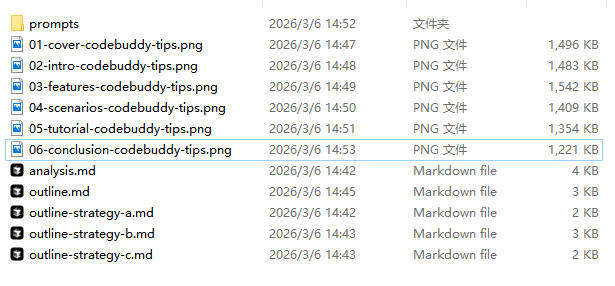
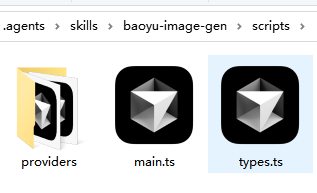
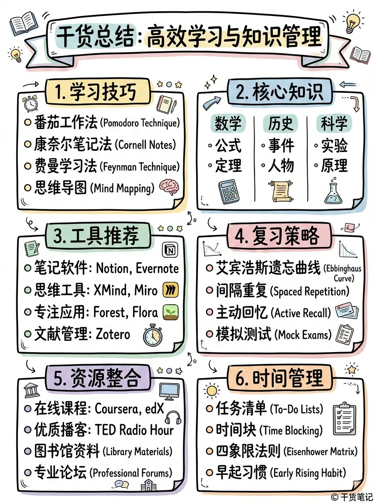
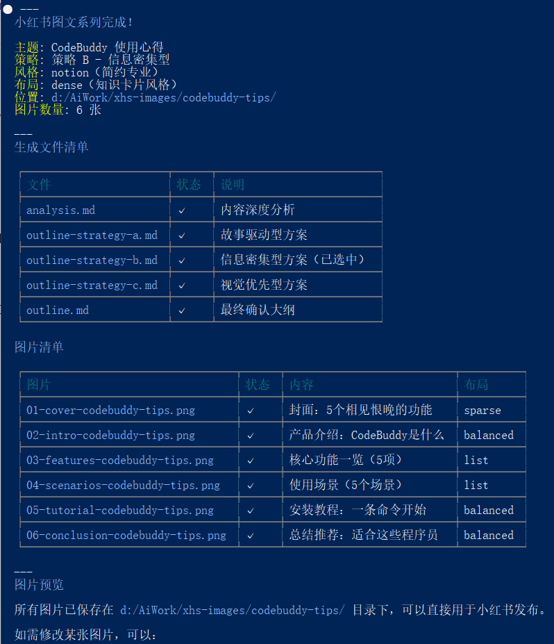

> 📎 来源: [业余草](https://mp.weixin.qq.com/s?__biz=MzIyODE5NjUwNQ==&mid=2653387166&idx=1&sn=3cfc3ea88e8ea5176608508cac3100a4&chksm=f24ec39f70dfc78e5a6d681f99c560308f4f70c66f8dedd1998f2c2853c155c23d11f8d4c533&mpshare=1&scene=1&srcid=0424D0srlK3NNTZplUy7suNg&sharer_shareinfo=4a0d1604c670016516fcce74722d926d&sharer_shareinfo_first=4a0d1604c670016516fcce74722d926d) | 时间: 2026-04-24 15:10

---

## 你知道的越多，不知道的就越多，业余的像一棵小草！

你关注，我们一起精进！你星标，我们便有了更多故事！

业余时间 Java 种草！

## 编辑：业余草

推荐：https://t.zsxq.com/fpUJC

[OpenClaw 爆出高危漏洞 CVE-2026-25593，NanoClaw 500 行代码替代它](https://mp.weixin.qq.com/s?__biz=MzIyODE5NjUwNQ==&mid=2653387151&idx=1&sn=17a7e2da898a28544a81c42cf73e321b&scene=21#wechat_redirect)

[1 个 JEP，3 大特性，N 个 bug 消失！JDK 26 模式匹配支持原始类型了](https://mp.weixin.qq.com/s?__biz=MzIyODE5NjUwNQ==&mid=2653387144&idx=1&sn=51f74a09637943acdbebf46eb1f1e74a&scene=21#wechat_redirect)

[阿里QoderWork，下载两小时，安装两秒失败](https://mp.weixin.qq.com/s?__biz=MzIyODE5NjUwNQ==&mid=2653387112&idx=1&sn=19566997f71c561910d40cabdfac4d5f&scene=21#wechat_redirect)

[Java final 字段重大安全漏洞被 JDK 26 的 JEP 500 特性修复了](https://mp.weixin.qq.com/s?__biz=MzIyODE5NjUwNQ==&mid=2653387075&idx=1&sn=a23f3a3c006613faba5e3c9b0322815b&scene=21#wechat_redirect)

[Spring 7.0.5 发布，修复 Multipart 上传内存泄漏等 bug，性能提升 15%](https://mp.weixin.qq.com/s?__biz=MzIyODE5NjUwNQ==&mid=2653387041&idx=1&sn=9d6aa50f6e9f311ff4a9313cd3f38295&scene=21#wechat_redirect)

CodeBuddy Cli + skills 实现小红书信息图系列生成器！

Claude Code 现在应该没有人不会用了吧。前段时间，也就是今年开工的第一天，我在用它的时候，突然间就把我给封了。于是，我就重新搞了一个账号。

后来，为了[防止再次失联的情况](https://mp.weixin.qq.com/s?__biz=MzIyODE5NjUwNQ==&mid=2653386935&idx=1&sn=030333f2e1944a7f1ed0780d8f168a5f&scene=21#wechat_redirect)，我也试了试国内的 DeepSeek、Kimi 等大模型，虽然比不上 Claude，总比不能用强吧 🤣。

我看了下，国内的 AI 厂商，也都搞了 cli 模式，比如 Trae Cli、Qoder Cli、CodeBuddy Cli 等。这其中，当属 CodeBuddy Cli 实战，有免费体验时间。不像其它两家，太抠门了。

刚好各大 AI 现在都支持图片生成了，我看到不少好看的图片，真的很惊艳。比如下面这张。


类似的，小红书上还有不少，差不多都是使用 baoyu-skills 来实现的。不过，大多数人都是使用 Claude Code 或 Codex 这两个工具，再加 Gemini 来一键生成内容信息转信息图的形式，再发布小红书的。

这里，我就不演示这两种实现过程了。我就拿可以免费试用的 CodeBuddy 来给大家讲讲如何搞定小红书信息图系列生成器！

## CodeBuddy Cli 安装

这个工具的安装，大家应该都会吧！

打开官网

```
https://www.codebuddy.ai/
```

，找到 Cli 工具，直接下载或者安装官方的教程进行安装，应该不难的。不会的可以评论区留言哈。

## skills 安装

有了 CodeBuddy Cli，安装 skills 应该也是不在话下的。我们今天用的这个 skills 是开源的，

```
https://github.com/JimLiu/baoyu-skills
```

，是知名大佬宝玉老师制作的。

根据 CodeBuddy Cli 的官方文档

```
https://www.codebuddy.ai/docs/zh/cli/plugins
```

，可以很快的学会 skills 安装。

一种是，输入

```
codebuddy
```

进入 cli 后，输入

```
/plugin
```

进入插件市场进行安装，这种需要注意网络问题。即使是小白，也可以直接对着 cli 输入：

> 请帮我安装 github.com/JimLiu/baoyu-skills 中的 Skills

如果网络没问题的话，很快就能安装好了。即使是网络有问题，没法代理，也可以通过手动下载到你的工作目录，然后配合 CodeBuddy Cli，也可以完成这个 skill 的安装。

## 实现小红书信息图系列生成

skills 安装好了之后，就是使用了。用法超级简单，比如输入下面的信息。

> /baoyu-xhs-images 给我推荐一些效率工具 --style notion --layout balanced

然后，CodeBuddy Cli 就开始工作了。接下来，就是耐心等待，按照它的提示选择它生成的内容，最终生成类似下面这样的图片。


生成的图片也可以是多张的，多个图文或多张图片，最终都会在

```
xhs-images
```

子目录下的。



如果不满意，你还可以微调你的要求和提示词的，直到你满意为止。

## 配置 hunyuan-image 模型

要想生成高质量的图片，必须要有优秀的模型。

在进行上面那一步生成图片前，需要先配置一下我们要使用的模型。这些 skills 之所以会自动去生成照片，是因为在

```
skills\baoyu-image-gen\scripts
```

目录中，有专门的 ts 脚本文件对接大模型。

默认的，提供了 dashscope、google、openai、replicate 4 种模式。但这 4 种模式对应的 apikey 都是需要充值的。刚好腾讯的

```
hunyuan-image-v1
```

有免费试用的调用额度。

所以，我直接就在腾讯云上

```
https://console.cloud.tencent.com/hunyuan/settings
```

开通了腾讯混元大模型 API 服务，免费的就能用，没必要充钱，咋只是玩，够用的。

这个过程也很简单，就不细说了，直接获取到对应的 apikey 即可。

然后，我就通过 CodeBuddy Cli 让它帮我改造

```
skills\baoyu-image-gen\scripts
```

目录下的脚本文件，使其支持混元大模型。



注意，这里我推荐大家使用 openai 的兼容模式，不如得传递 apiId 和密钥等，这种太麻烦了，不推荐哈。

改造好了之后，可以重启 CodeBuddy Cli，然后直接进行你想要的图片生成。比如，下面这个

```
干货总结
```

。



首次使用过程中，就会让你配置 apikey，直接按照提示选择你的混元大模型和输入对应的 apikey 即可。

整个过程可以说是非常的丝滑，完成之后还会给你生成清单等。



然后直接拿这些图片就可以发小红书了。

## 总结

总的来说，使用起来不是太难。中间可能会遇到一些小坑，但结合 CodeBuddy Cli 本身，所有问题都会迎刃而解的。

最后，AI 很强大，CodeBuddy 虽说不是最强的，但它的有个好“爸爸”，财大气粗，免费体验这种基操不会谁都有的。祝大家玩的开心，周末愉快吧！


