> 📎 来源: [code秘密花园](https://mp.weixin.qq.com/s?__biz=Mzk0MDMwMzQyOA==&mid=2247505960&idx=1&sn=ac72488e0c5841a949bb139ece4cb746&chksm=c38c477d875a462f38ff4e208148c4e4696d680d077cd8ed67f86db3bbaf21f7b5cf2c0d6960&mpshare=1&scene=1&srcid=0509sNKRnPlbgf4n2Dnibja4&sharer_shareinfo=739eb4f780e1c70ded6564100f74e8dd&sharer_shareinfo_first=739eb4f780e1c70ded6564100f74e8dd) | 时间: 2026-05-09 14:08

---

大家好，欢迎来到 **code秘密花园**，我是花园老师。

前段时间我发了几条技术讲解视频，评论区好多同学问：这个视频效果是怎么做的？


趁着五一假期，我把整套流程封装成了一个 Skill，让大家也能低成本复刻这种效果。

今天这期内容信息量很大，我们要讲三件事：

第一，我的视频到底是怎么做的；

第二，背后这个 Skill 是怎么设计的；

第三，手把手带大家走一遍完整的实战流程 — 从一篇文章丢进去，到最后出来一个精美的知识讲解视频。

---

## 一、视频到底咋做的

先声明一下：我之前的视频，不是用视频生成模型做的，也没有用 NotebookLLM。

其实就是网页。我自己 Vibe Coding 出来的网页。

肯定有人会问 — AI 视频生成模型已经很强了，为什么还要折腾网页？

答案就俩字：**可控**。

字体、配色、每一步停留几秒、某一帧要不要出现一个精确的数字 — 这些东西在网页里改几行代码就搞定。

比用视频模型抽卡要稳定得多，成本也更低。

NotebookLM 我也试过，它做不了动画演示效果，出来的都是静态图。

Remotion 这种框架，我觉得它反而限制了模型本身的发挥，有时候还不如直接写来得好。

### 1.1 上期视频

拿我上期发出的视频举个例子。那期视频完全由 AI 生成，就是我为了这次教程专门做的一个演示。

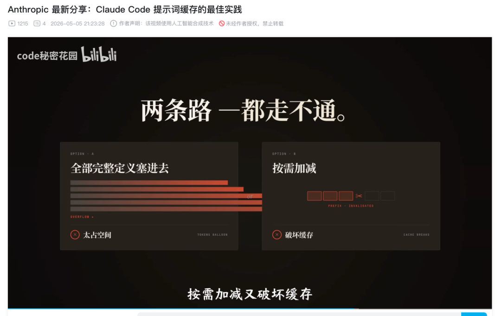

而我的输入，就只是一篇 Anthropic 最新发布的文章：

https://claude.com/blog/lessons-from-building-claude-code-prompt-caching-is-everything

输出就是这样一个网页：

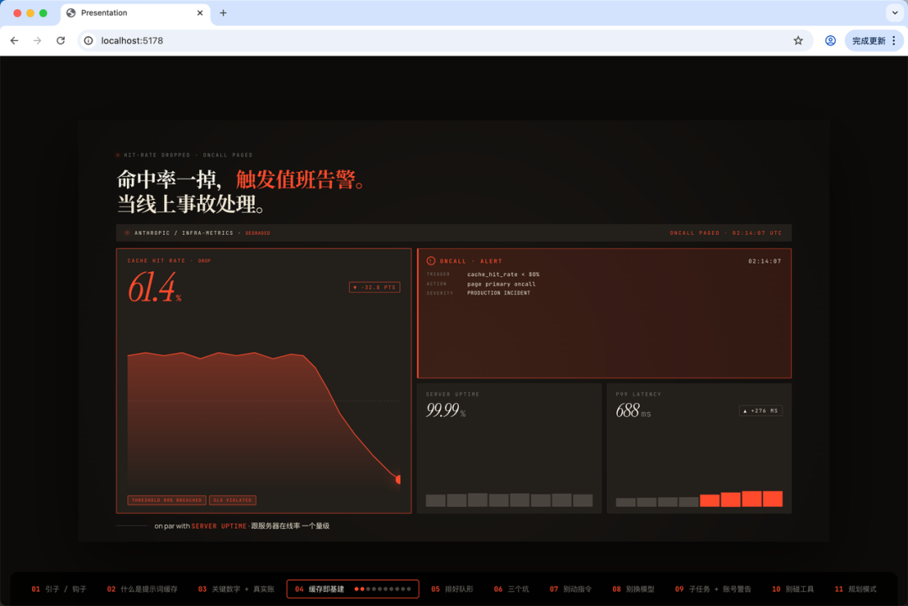

它把原始文章拆成了 **13 个章节、100 多个细粒度的讲解步骤**，每一步都有完整的视觉演示效果。

画布固定在 16:9，可以适配任意大小的显示器。

底部有一个隐藏的进度条，鼠标悬浮到底部才出现，你可以自由跳转到任意章节的任意步骤。

画面里没有页眉、没有页码、没有品牌标识。

录屏时观众看到的就是一块干净的画面，让它看起来更像视频，而不是网页。

### 1.2 关键流程

想要做出这样的效果，有几个关键要点：

- **把文章变成口播稿：**

一般原始技术文章的句式会比较书面 —

比如 "该工具旨在提供高效的解决方案" 这种话术是没办法直接在视频里年出来的？

如果是 "这玩意儿是干嘛的呢？ "短句、口语、第二人称，就像跟人聊天一样。

- **把口播稿拆成开发大纲。**

每段话都应该对应一个画面步骤，每几个步骤组成一个章节，每章聚焦一个话题。

因为整个开发任务会非常复杂，做好大纲是保持后续开发稳定性的关键。

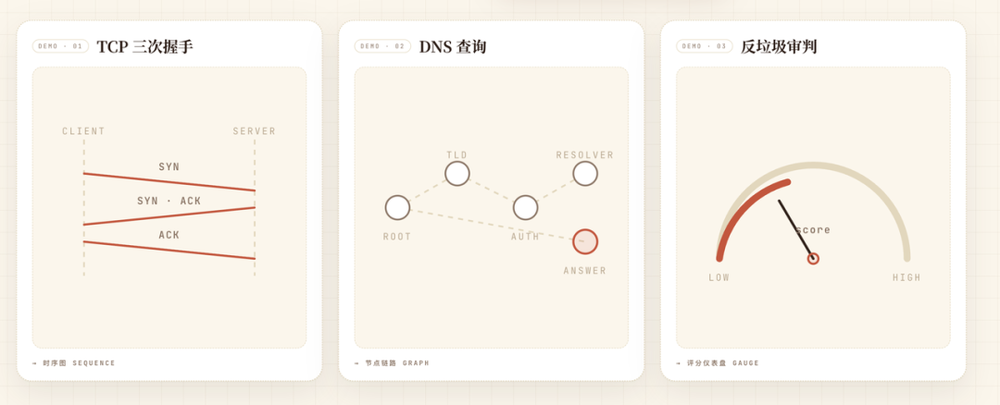

- **给每步做视觉演示。**

不是把文字糊上去就完事。

TCP 三次握手要画时序图，DNS 查询要画节点链路，反垃圾审判要画评分仪表盘。得把抽象概念"演"出来。

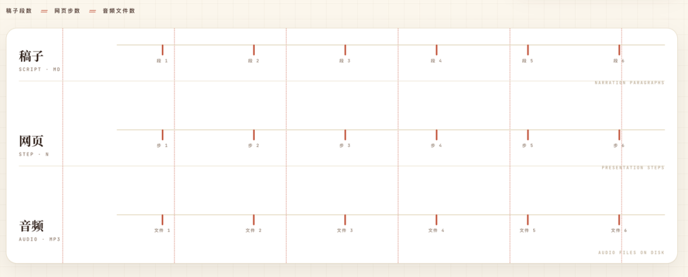

- **让步骤和口播对齐。**

网页的关键演示步骤一定要跟随口播稿的节奏走，这样做出的视频效果才能显得非常自然。

---

### 1.3 为什么要做成 Skill

上面这些事情，你全部都可以交给 Agent 一步步去做，也确实能做出来。

模型并不缺能力。但问题是：

- 怎么让它每次都做得出来？
- 怎么让不同的人、不同的文章、不同的主题，都能稳定产出？
- 怎么让开发效率不依赖运气？

你直接跟 Agent 说 "帮我做个视频网页"，它可能做得不错，也可能跑偏。

比如稿子和画面对不上了，章节数和音频数不一致了，后面章节的风格突然跟前面完全不搭了。这些都是有可能发生的

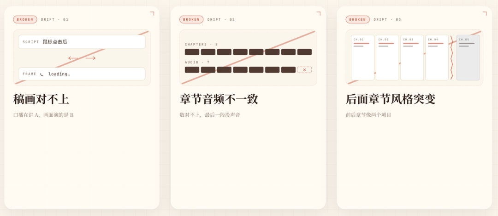

模型有能力，但你需要一套系统来驾驭这个过程 — 划定边界、管理状态、设立检查点、在关键节点拦住错误。

这就是 Harness 要负责的事情。所以我做了这个 Skill。

---

## 二、web-video-presentation Skill

Skill 是 Agent 通用的扩展能力标准，你可以理解为一份 "操作手册" — 它告诉 AI 什么时候该做什么、做到什么标准、哪些红线不能碰。

AI 加载 Skill 后按里面的规则干活，你不用每次重述这些规矩。

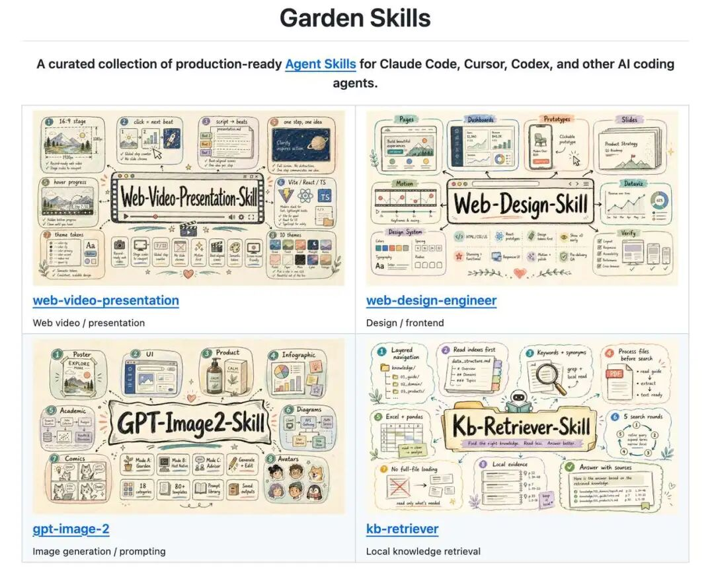

我们这个做视频的 Skill 和花园老师其他开源 Skill 一起托管在 garden-skills (https://github.com/ConardLi/garden-skills) 仓库里。

---

在我们之前的教程中有讲到，一个成熟的 Harness，通常至少包含下面六个核心部分：

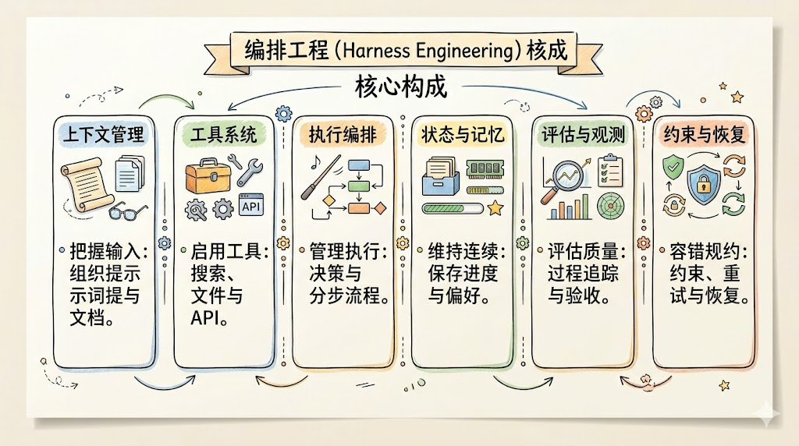

| **核心部分** | **它解决的问题** | **典型作用** |
| --- | --- | --- |
| 上下文管理 | 模型到底看到了什么 | 组织系统提示词、项目文档、历史对话、任务状态、外部资料 |
| 工具系统 | 模型到底能做什么 | 搜索、读写文件、调用 API、执行代码、操作浏览器 |
| 执行编排 | 模型下一步该做什么 | 决策、分步执行、工具调用、结果回写 |
| 状态与记忆 | 系统如何跨步骤保持连续性 | 保存任务进度、中间结果、长期偏好 |
| 评估与观测 | 系统怎么知道自己做得对不对 | 结果验收、过程追踪、指标监控、质量评估、错误归因 |
| 约束与恢复 | 出错了怎么办，怎么避免跑偏 | 权限控制、格式约束、重试机制、回滚与校验 |

下面，我们就从 Harness 的角度拆解下这个 Skill 的核心设计。

---

### 2.1 执行和编排

执行和编排解决的是让模型知道 **“下一步该做什么”**的问题。

整个 Skill 把 "从一篇文章到视频" 切成了四个阶段，中间卡了两个人工检查点。

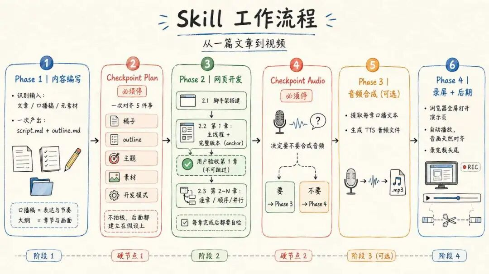

- **阶段一：内容编写。** AI 同时产出两样东西 — 口播稿和开发大纲。口播决定信息的描述方式以及整体节奏，大纲决定每章做几步、每步屏幕上放什么信息。
- **检查点 Plan。**Agent 走到这里会被强制停下来。人一次性对齐五件事：稿子要不要改、大纲要不要改、用哪套主题、真素材谁准备、后续章节是逐章做还是并行做。这五件事不拍板，后面的工作全建立在假设上。
- **阶段二：开发。** 第一章必须经人验收，确认视觉气质和节奏都对了，它才成为后续章节的基准。之后的章节可以顺序做，也可以开多个子进程并行写。每章写完都要逐项对照清单自检，不过关不准说"做完了"。
- **检查点 Audio。** 再停一次。决定要不要合成音频。要的话走阶段三，不要的话跳到阶段四用人声录。
- **阶段三：音频合成。** 从每章的口播文本里提取合成清单，调 TTS 逐段生成音频文件。
- **阶段四：录屏。** 浏览器全屏打开演示页，开自动播放模式，音频和画面天然对齐，录完裁头尾。

工作流程很清晰，重点是怎么让 Agent 在每个环节里不跑偏。

---

### 2.2 上下文管理

上下文管理要回答的核心问题是：**模型到底看到了什么**。

这个 Skill 的链路跨了四个 Phase，涉及多个复杂流程（口播稿规范、outline 格式、章节开发指引、主题 token、音频合成流程、录屏指南……）。如果在 Skill 启动的时候就把所有文档一股脑灌进去，模型注意力会被严重稀释。

所以我把所有的信息拆成了多份文档，每份文档只在指定的阶段读取：

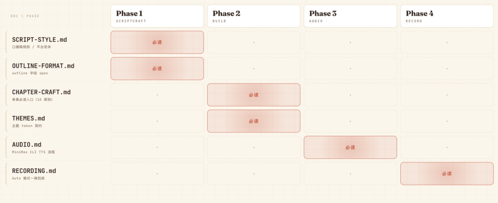

- ```
  SCRIPT-STYLE.md
  ```

  : Phase 1.2 必读：文章 → 口播稿规则、平台变体（双层自检：形式/风骨/念出来）
- ```
  OUTLINE-FORMAT.md
  ```

  : Phase 1.2 必读：outline.md 字段 spec、命名约定、章节切分、信息池规则
- ```
  CHAPTER-CRAFT.md
  ```

  : Phase 2.4 每章单一必读入口：Part 0 十条原则 / Part 1 开工 5 问 / Part 2 关系→动作决策树 / Part 3 视觉工具箱 / Part 4 时长参考 / Part 5 反 AI 味反模式 / Part 6 代码硬规则 / Part 7 完工自检 / Part 8 反馈速查
- ```
  THEMES.md
  ```

  : 选/造/切主题时读：完整 token 契约 + 内置主题清单 + 创作新主题流程
- ```
  AUDIO.md
  ```

  : Phase 3 才读：MiniMax CLI TTS 合成流程、增量合成、故障排查
- ```
  RECORDING.md
  ```

  : Phase 4 才读：录屏工具推荐、Auto 模式一镜到底、后期合成

---

### 2.3 状态与记忆

状态与记忆要回答的问题是：**系统如何跨步骤保持连续性**。

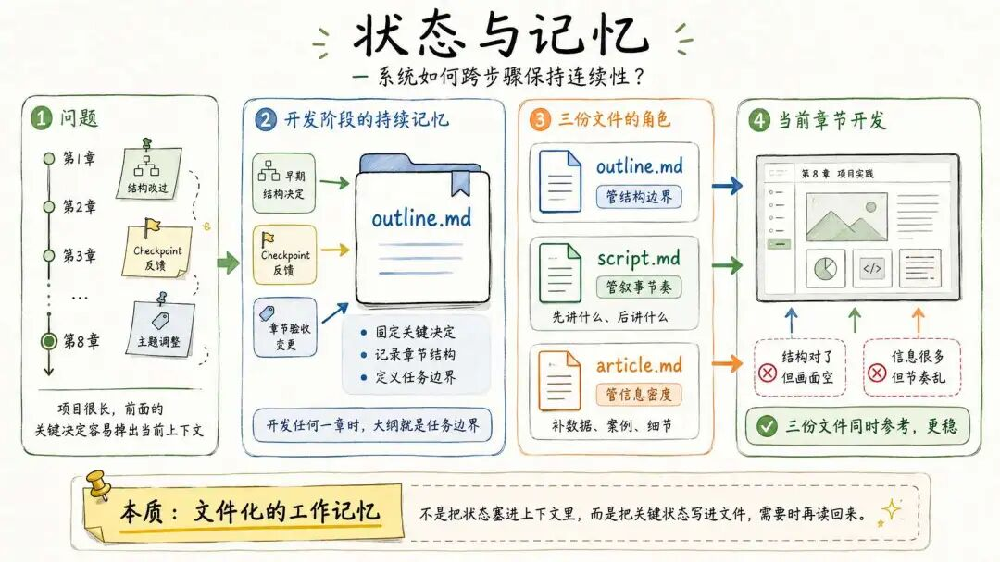

在这个 Skill 里，最重要的 “记忆” 就是 

```
**outline.md**
```

**（开发大纲）**。

一个项目十几章、几十个步骤，Agent 写到第 8 章时，前面章节定过什么结构、用户在 Checkpoint 里改过什么方向、某一章验收时调整过哪些主题，很可能已经不在当前上下文里了。

大纲的作用，就是把这些关键决定固定下来，成为开发阶段的持续记忆。

**Agent 开发任何一章时，大纲就是任务边界。**

在真正开发的阶段，Skill 还会让 Agent 每轮强制关注下面两个文件：

- ```
  **script.md**
  ```

  **（口播稿）负责节奏**：先讲什么、后讲什么，画面要跟着口播走。
- ```
  **article.md**
  ```

  **（原文章）负责信息密度**：口播稿通常更精简，画面里需

要的数据、案例、可以从原文里补。

这三份文件各有分工：**大纲管结构边界，口播稿管叙事节奏，原文章管信息密度**。

Agent 开发每一章时同时参考它们，就不容易出现 “结构对了但画面空” 或者 “信息很多但节奏乱” 的问题。

本质上，这是一种**文件化的工作记忆**：而是把关键状态写进文件，需要时再读回来。

---

### 2.4 工具系统

工具系统要回答的问题是：**模型到底能做什么**。

这个 Skill 中并没有特殊的工具，所以我们的目标就是让模型把 Agent 本身的文件读写工具用好。

在章节的具体开发流程中，支持并行开发的模式。

但并行开发有一个致命问题：**多个 Agent 同时改同一个项目，会不会互冲突？**

Skill 的为此设计了严格的隔离机制：

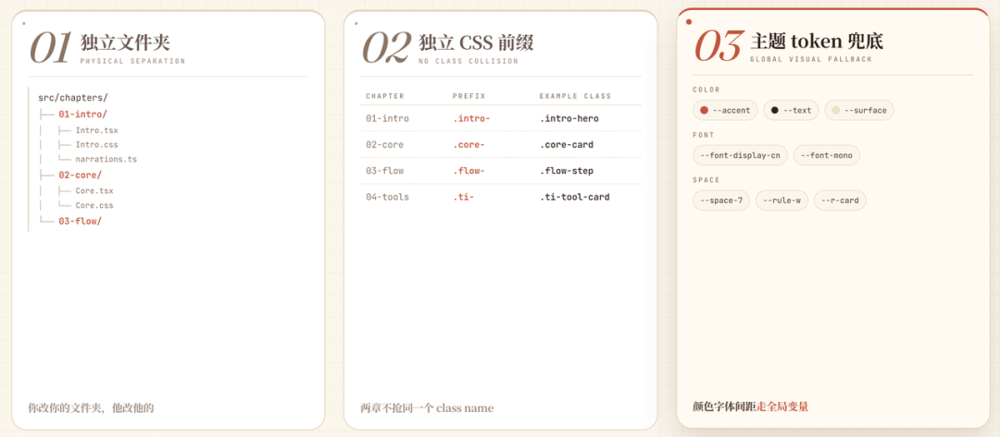

1. **每章独立文件夹**：

   ```
   src/chapters/01-intro/
   ```

   、

   ```
   src/chapters/02-core/
   ```

   ……物理分离，你改你的文件夹，他改他的文件夹。
2. **每章独立 CSS 前缀**：

   ```
   .intro-hero
   ```

   、

   ```
   .core-card
   ```

   ……不会出现两个章节抢同一个 class name 的情况。
3. **主题 token 兜底视觉统一**：颜色、字体、间距走全局 CSS 变量，所以即使每个 subagent 独立开发，最终画面在色彩和排版上不会跑偏。
4. **但风格不强求一致**：每章的动画、节奏、视觉演示方式允许不一样。

---

### 2.5 约束与恢复

约束与恢复要回答的问题是：**出错了怎么办，怎么避免跑偏**。

在这个 Skill 里，"出错"最常见的形式不是代码报错，而是**用户觉得不对**。

比如"这一章节奏太快了"、"这个动画太 AI 味了"、"这步信息太薄了"。

面对这类反馈，Agent 的本能反应是：**重做整章**。

毕竟重新生成对 Agent 来说成本不高，而且能保证 "把你说的问题都解决了" 。

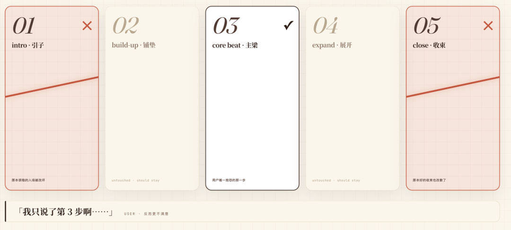

但重做整章的问题是：**它会把已经对的部分也改掉**。

用户说"第 3 步节奏太快"，你重做整章，结果第 1 步和第 5 步原来很好的动画效果也变了 — 用户反而更不满意。

所以 Skill 里有一条原则叫**反馈修复的最小切片**：

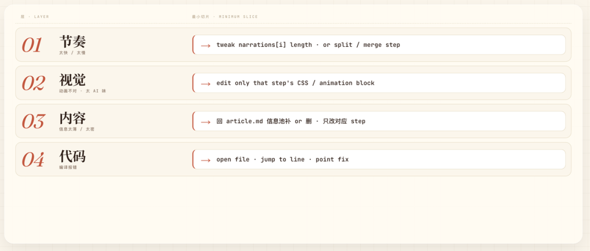

先定位问题在哪一层（节奏？视觉？内容？代码？），再改最小切片，不要重做整章。

| **问题层** | **最小切片** |
| --- | --- |
| 节奏（太快/太慢） | 调整对应 step 的 narration 文本长度，或拆/合 step |
| 视觉（动画不对） | 只改对应 step 的 CSS / 动画逻辑 |
| 内容（信息太薄/太密） | 回 article.md 信息池补充或删减，只改对应 step |
| 代码（编译报错） | 定位具体文件和行号，点修 |

---

### 2.6 评估与观测

评估与观测要回答的问题是：**系统怎么知道自己做得对不对**。

这一层是我在设计这个 Skill 时花心思最多的地方，因为它直接对应 Anthropic 提出的核心问题 — **自评失真**。

让写代码的 Agent 自己评价"这章写得怎么样"，结果几乎一定是"还不错"。

它不会告诉你"这一步的动画其实是无脑淡入，没有内容驱动""这个列表一次性全展示了，违反了逐步揭示原则" — 因为它自己写的，它当然觉得合理。

所以我设计了一套**硬性自检规则**。

每个关键产出完成后，必须走自检 → 修复 → 再汇报的流程：

| **产出** | **自检清单** |
| --- | --- |
| script.md（口播稿） | 口语化、B站风、无AI味、信息保留≥60%、念出来不别扭 ... |
| outline.md（开发计划） | 节奏规划（step数/时长/信息池）、无动画细节、与script时间误差<10% ... |
| CHAPTER-CRAFT.md（单章实现） | 有动图、不套模板、字大留白、逐个揭示、素材真实、代码隔离 ... |

更关键的是**执行方式**：

1. **最优：**使用 Agent Teams（目前仅 Claude Code 支持）开一个独立的 Reviewer Agent — 给它产出文件路径 + 对应清单 + 上下文，让它从零开始逐项核查。
2. **次优：**没有 Agent Teams 能力就用 SubAgent，走同样流程。
3. **兜底：**当前 Agent 自己逐项核查。但即使是自检，也必须 "严格逐项"，不允许目测一遍就放行。

---

### 2.7 回过头看

把这个 Skill 的设计摊开来，你会发现它和 OpenAI、Anthropic 做的事本质上没有区别 — 都是在搭 Harness。

只不过他们搭的是工业级的运行系统，我们搭的是一个 Skill 级别的协作协议。

这里也要跟大家明确一个误区，做 Harness 并不是要从零搭建一个 Agent，能用一个 Skill 把一个垂直的开发工作做好，也是在做 Harness。

下面，我们进入实战章节，从零跑通环节大家，并且使用这个 Skill 完成一个文章到视频的制作流程。

---

## 三、环境搭建

这条链路里主要会用到四个工具。

### 3.1 Claude Code

首先我们选择 Claude Code 作为我们的核心执行 Agent。

注：如果你本地使用 Cursor、Codex 以及其他支持 Skill 的 Agent 都是可以的。

---

安装命令：

```
curl -fsSL https://claude.ai/install.sh | bash
```

装好之后，在终端里输入：

```
claude -v
```

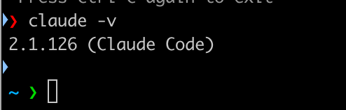

可以测试是否正常安装成功。

---

### 3.2 MiniMax

相信大家都知道，在国内正常使用 Claude Code 是非常困难的，我自己也被封了好几个账号了。

目前推荐的做法是搭配一个国产模型来使用，经过大量的试用，我自己目前的选择是 MiniMax。

MiniMax 的 Token Plan 和 Claude Code 的适配非常好，我订阅了 Plus 的极速版，速度非快、量大管够、性价比非常高，对于我日常的需求开发完全够用了。

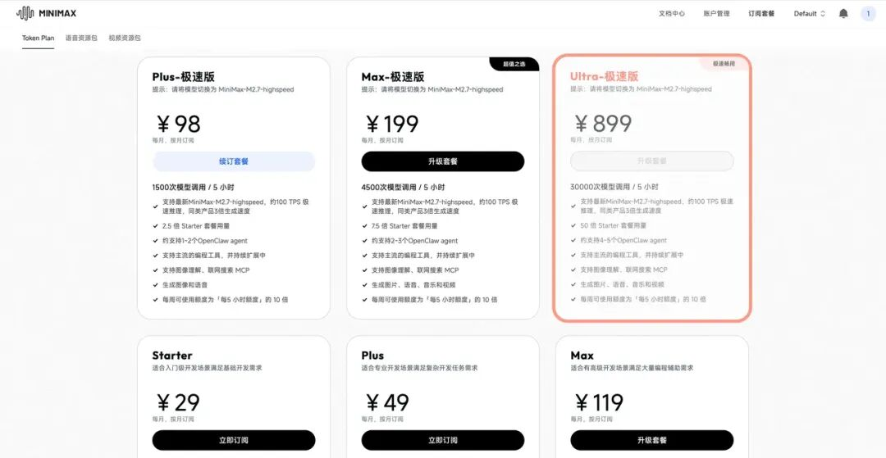

---

订阅完成后，会生成一个 API Key ，这个提前存好后面会用到：

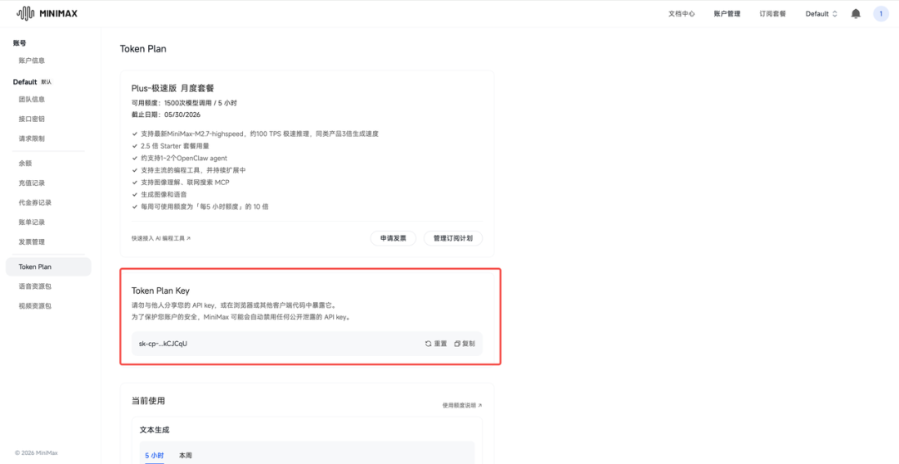

---

### 3.3 CC Switch

CC Switch 是一个桌面配置工具，可以让我们的 Agent（Claude Code、Codex、Gemini CLI）切换为任意的自定义模型。

在这套流程里，我主要用它来配置 MiniMax 的 Token Plan。

直接到它的 Github Release 页面 https://github.com/farion1231/cc-switch/releases/tag/v3.14.1 就可以下载指定系统（如 MacOS）的安装包：

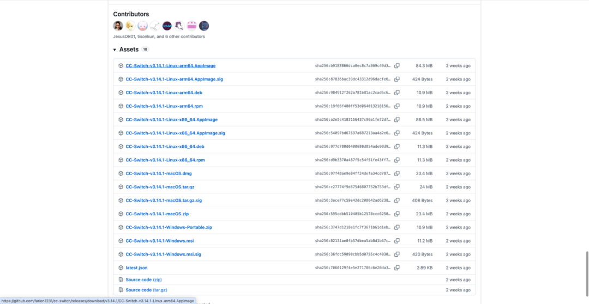

点击右上角 ”+” ，选择预设的 MiniMax 供应商，然后填写上一步保存的 API Key：

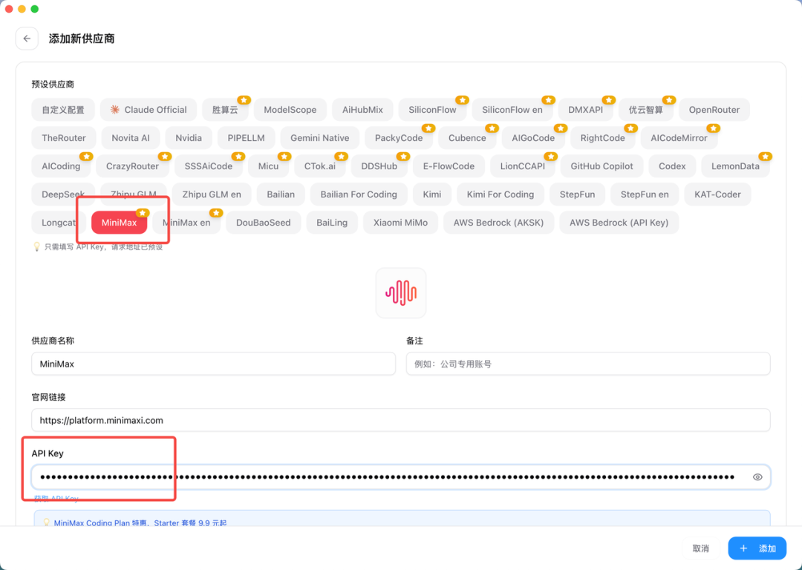

然后把模型名称全部改为 

```
MiniMax-M2.7
```

，然后直接点击保存就可以使用了：

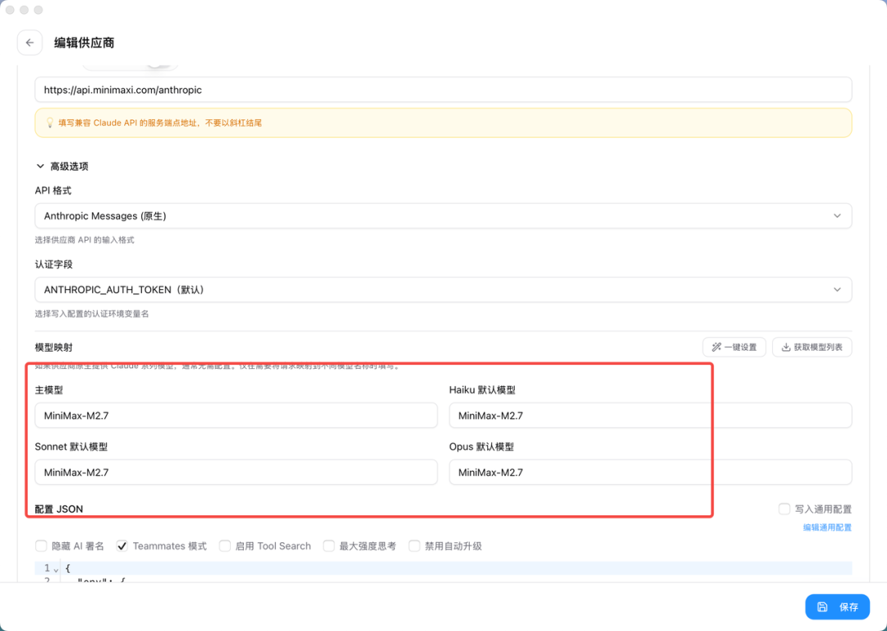

回到首页，点击 “启用”

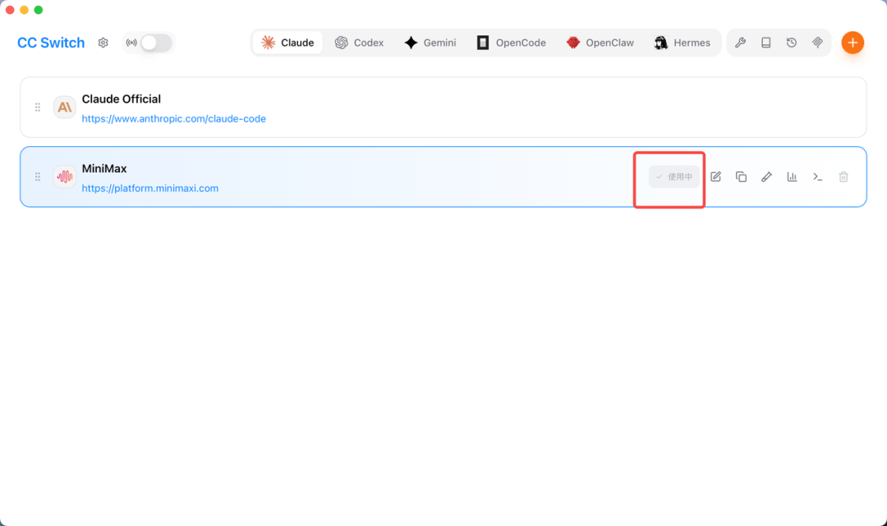

下面，我们打开终端输入 claude ，就可以直接使用了：

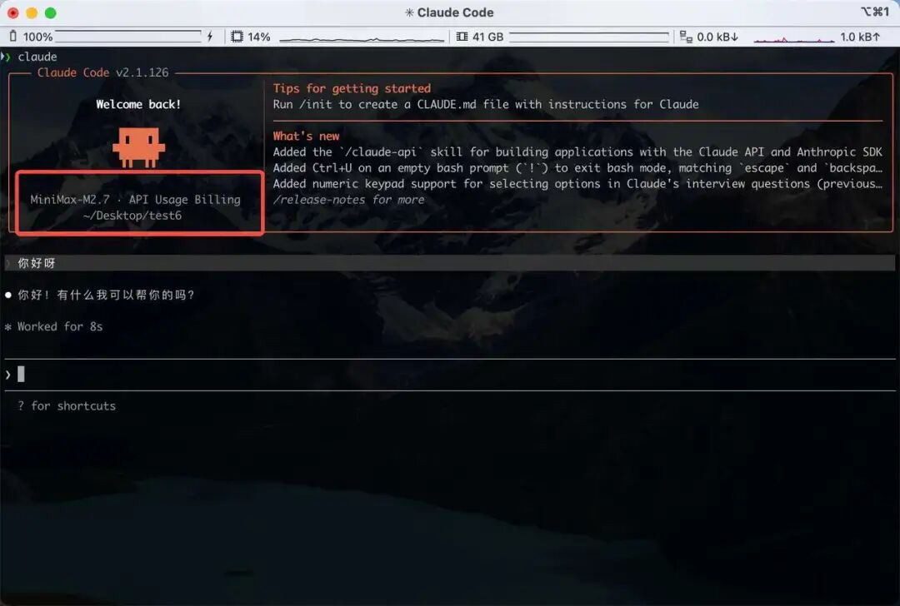

---

### 3.4 MMX CLI

相比其他家，MiniMax 的 Token Plan 还有一个明显的优势，就是还附带了多模态的套餐（图片、语音、视频）：

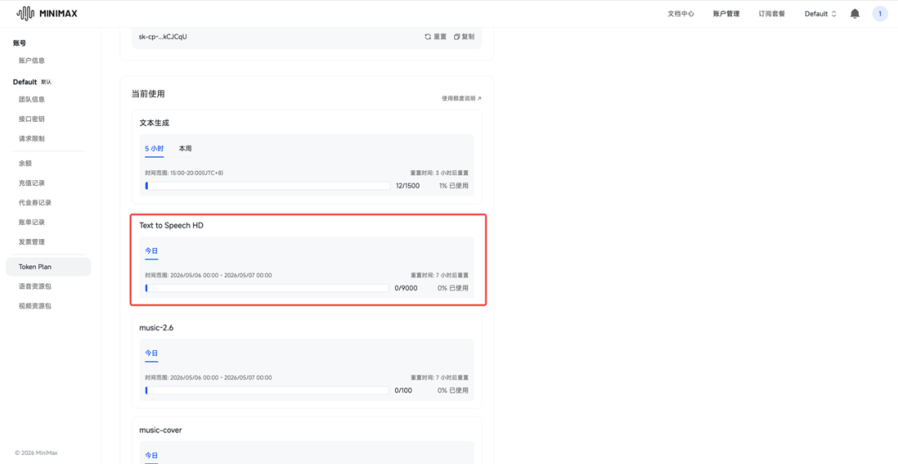

在今天的教程中，有一个关键环节就是要将文章的口播稿合成音频，MiniMax 的 Token Plan 自带了每天 9000 字的语音合成额度， 做两篇文章完全够用了。

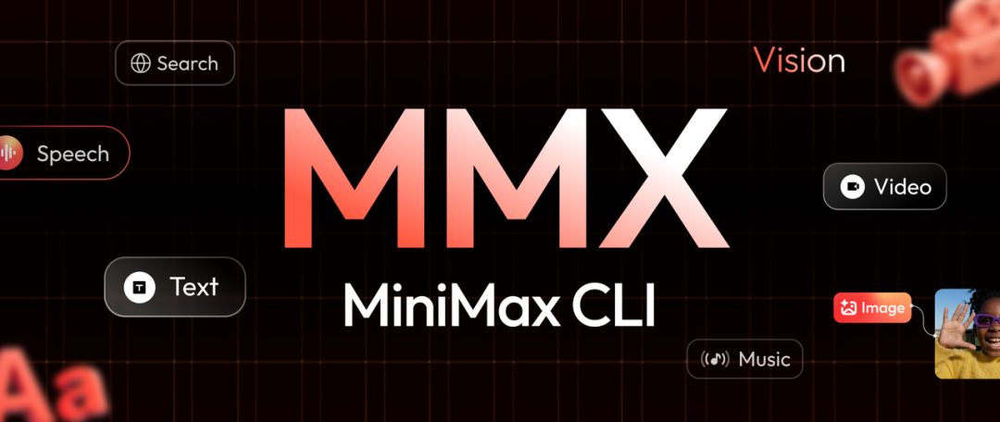

为了方便大家使用这些多模态的能力，MiniMax 官方还提供了一个 CLI，我们不用写一行代码，Agent 就可以直接调用 mmx cli 完成语音合成等工作。

安装也非常简单，直接把下面这段话发给你的 Claude Code，注意密钥替换为你 Token Plan 的密钥：

```
帮我安装 MiniMax CLI：https://github.com/MiniMax-AI/cli我的密钥是 sk-cp-xxxxx
```

安装完成后直接在本地执行：mmx，如果能列出下面的信息就代表安装成功：

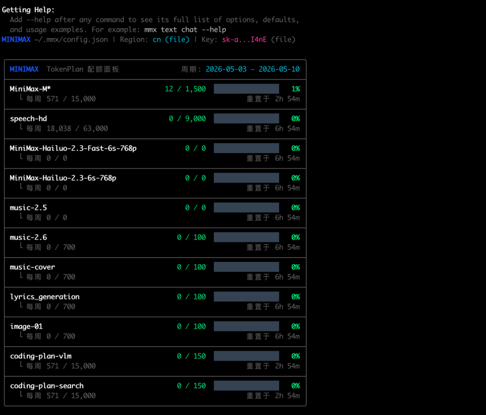

---

### 3.5 安装 Skill

下一步安装我们的 Skill ，首先我们访问这个 Github 地址：https://github.com/ConardLi/garden-skills/

然后找到 

```
[web-video-presentation](https://github.com/ConardLi/garden-skills/blob/main/skills/web-video-presentation)
```

 Skill 的下载地址，直接点击下载这个安装包：

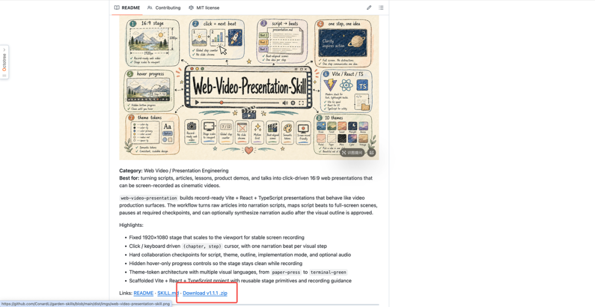

下载完成后解压得到 Skill 具体目录：

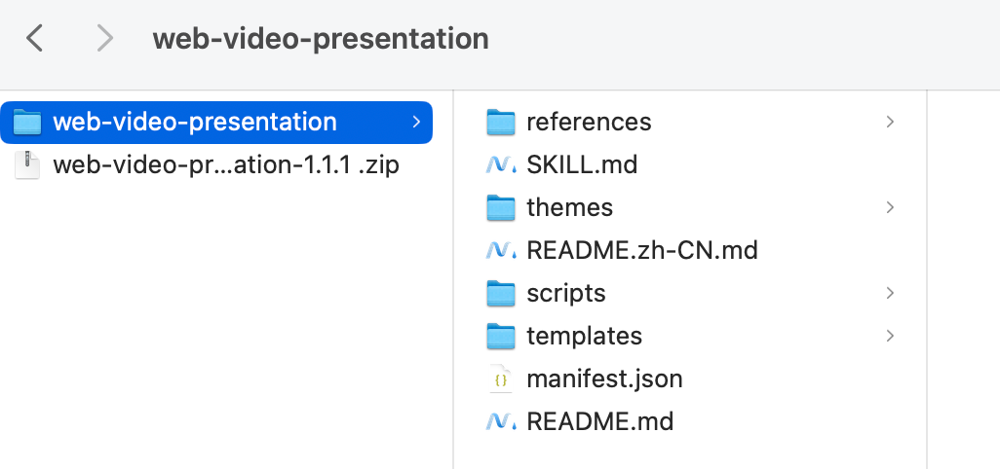

然后在你的工作目录新建 .claude/skills 目录，把这个文件夹粘贴进去：

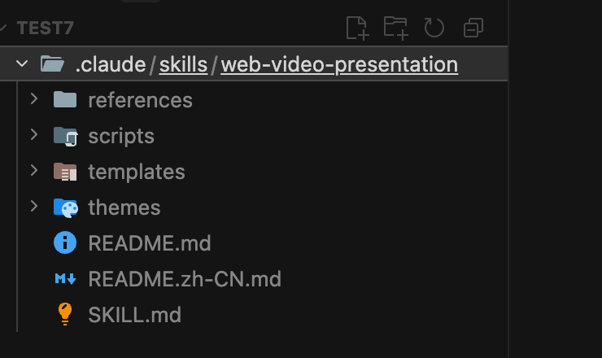

然后在这个目录启动 Claude Code，如果输入 /web-video 能够智能提示出这个 Skill ，说明配置成功：

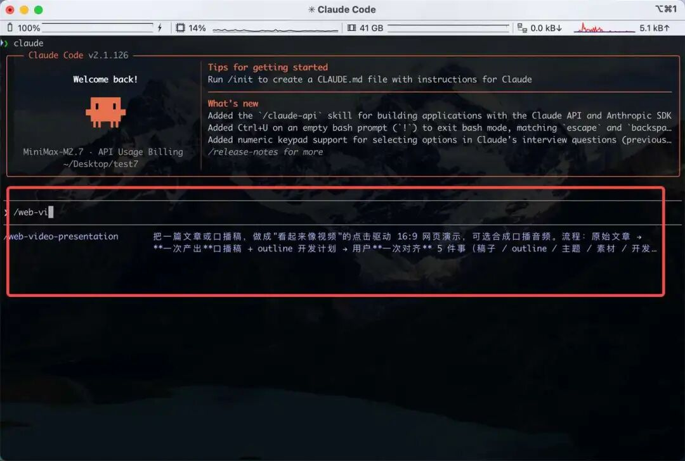

---

### 3.6 Agent Teams 和 tmux（可选）

这一步配置是可选的。如果只是做一个小 Demo，一个 Claude Code 会话就够了。

但如果你要做的是一个 10 章、100 多步的视频项目，让一个 Agent 从头写到尾会很慢。

由于 Skill 在设计上对视频的多个章节做了严格的物理隔离，天然支持了多 Agent 并行编写的模式。

这里我们先顺便讲一下 Claude Code 中支持的两种多 Agent 工作的能力：SubAgent 和 Agent Teams。

---

**SubAgent 更像一个子进程。**

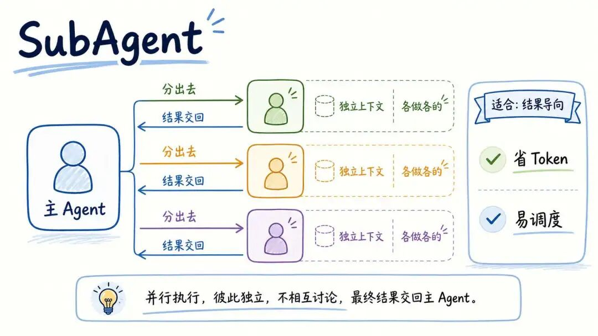

主 Agent 把一个任务分出去，子 Agent 在自己的一个完全独立的上下文里完成，然后把结果交回来。

子 AI 之间互相看不到，也不会讨论。

比如你让三个 **SubAgent** 分别写三个章节，它们就是各写各的。最后主 AI 再把结果收回来。

这种方式适合结果导向的任务。

比如并行开发多个章节，或者一次性检查某段代码。它比较省 Token，也比较容易调度。

---

**Agent Teams 则更像一个小项目组。**

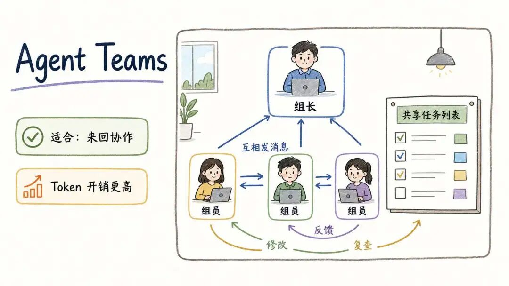

一个组长，加几个组员。每个组员都是独立会话，但它们之间可以互相发消息，也可以共享任务列表。

这种方式适合需要来回反馈的任务。

比如质检。Reviewer 看完代码后发现字号太小，就让 Developer 改大。

Developer 改完，Reviewer 再复查。这个过程用 SubAgent 做会比较别扭，但 Agent Teams 很适合。

代价也很明显：Token 开销更高。因为每个组员都是一个完整会话。

---

可以这么理解：

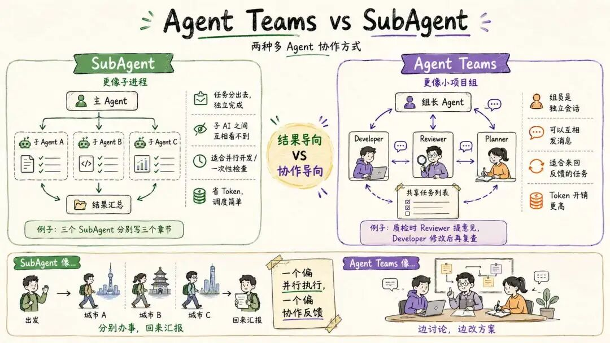

subAgent 像是你让三个人分别去三个城市办事，办完回来汇报。

Agent Teams 像是你把三个人拉进一间会议室，让他们边讨论边改方案。

---

Agent Teams 目前还是个实验性的功能，要开启 Agent Teams，需要在配置里加上：

```
{  "env": {    "CLAUDE_CODE_EXPERIMENTAL_AGENT_TEAMS": "1"  },}
```

为了更好的可视化整个展示过程，我们可以安装下 tmux。

tmux 是一款开源终端复用器，可在一个窗口中管理多个终端会话，支持分屏、大幅提升命令行效率。

配合 tmux 之后，Agent Teams 的每个组员会出现在不同的终端面板里。你能同时看到 Reviewer 在审哪里，Developer 在改哪里。tmux 安装：

```
brew install tmux
```

让 Claude Code 的 Agent Teams 适配 tmux，在配置里加上：

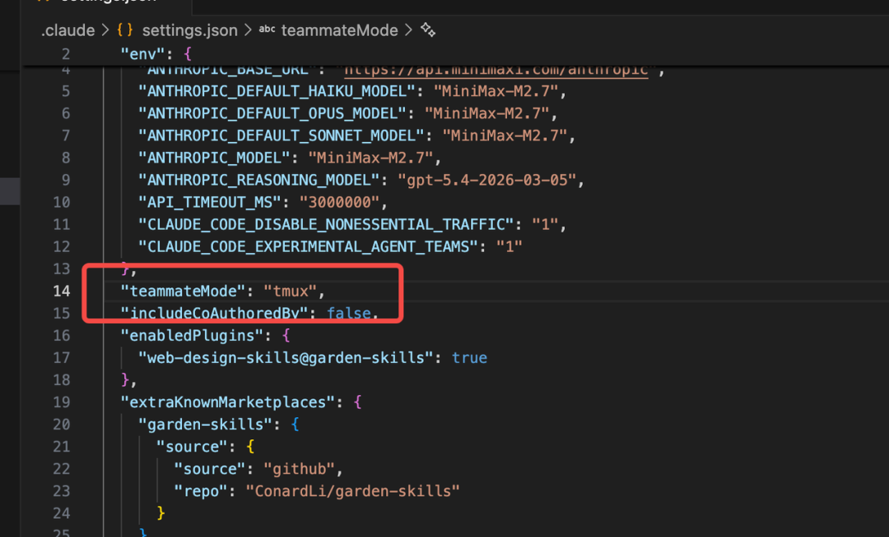

---

## 四、实战：完整流程演示

这里，我们以 一封邮件发出后的 600 毫秒 这篇文章为例，演示如何将其变成一个知识讲解视频：

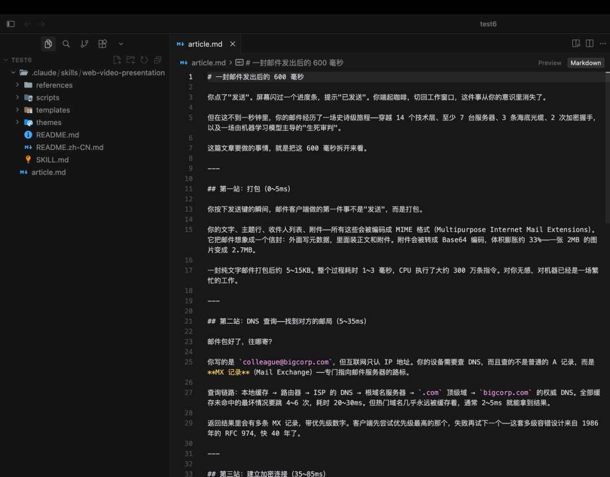

---

### 4.1 启动 Claude Code

进入项目目录后，在终端先输入 tumx ，进入 tumx 会话：

```
tmux
```

然后启动 Claude Code：

```
claude --dangerously-skip-permissions
```

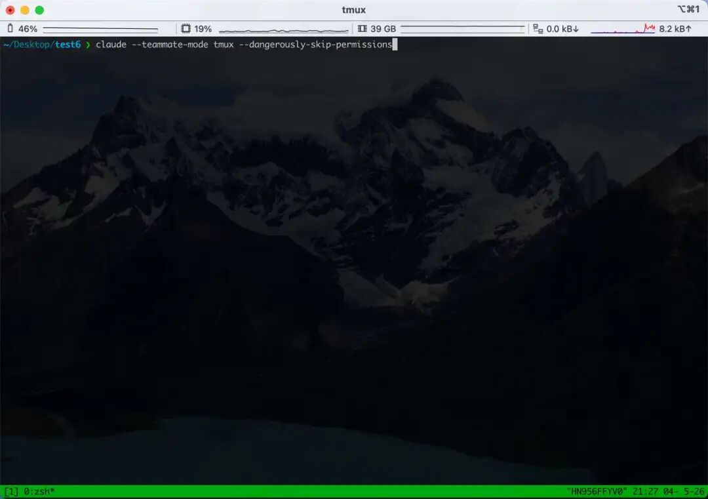

这里有一个参数要单独说一下：

```
--dangerously-skip-permissions
```

它会跳过每次工具调用时的权限确认。

并行开发时，如果每写一个文件都要手动点确认，整个流程会被打得很碎。

所以我一般会在可信目录里打开这个参数。

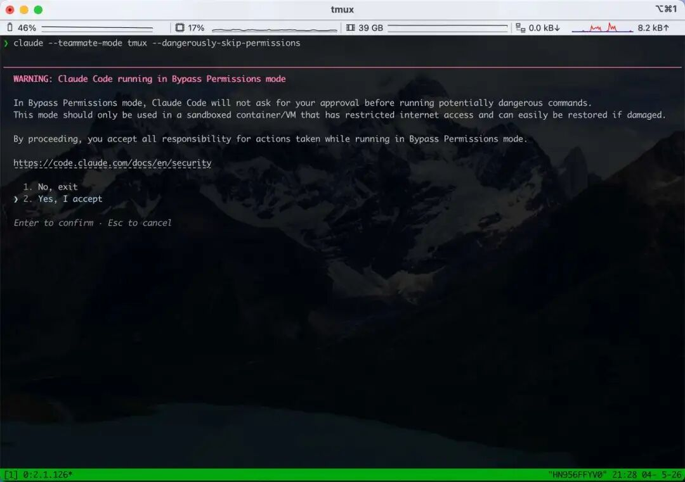

但它名字里带 

```
dangerously
```

 不是开玩笑。

只在你确定当前目录安全、项目内容可信的时候用。不要在陌生仓库里随便开。

---

### 4.2 先生成脚本和大纲

启动之后，把原始文章丢给 Claude，告诉它使用 

```
web-video-presentation
```

 Skill。

读取 @article.md ，按照 /web-video-presentation 要求，完成第一步。注意编写完成后使用 Agent Teams 创建两个独立 Agent 进行质检。

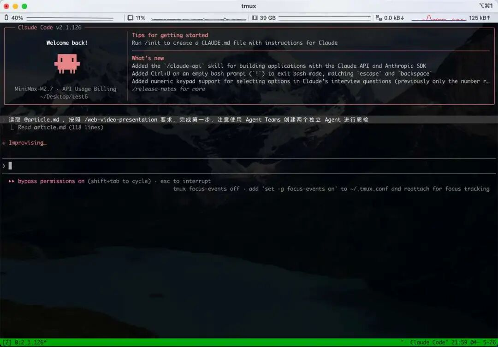

我们看到它创建了一个独立的 Content Writer Agent 来编写口播稿和开发大纲两个文件：

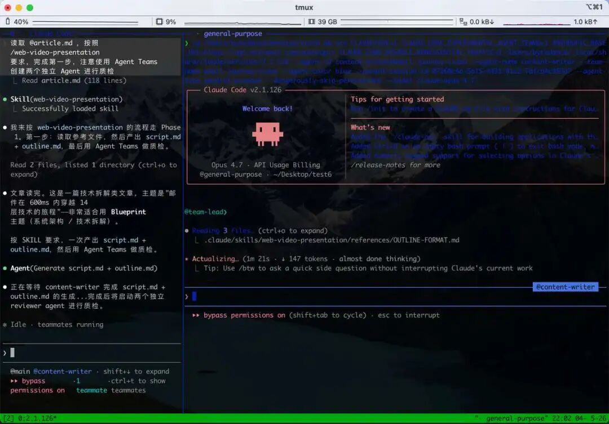

文件编写完成后，创建了两个 Reviewer Agent 来分别对两篇内容进行质检：

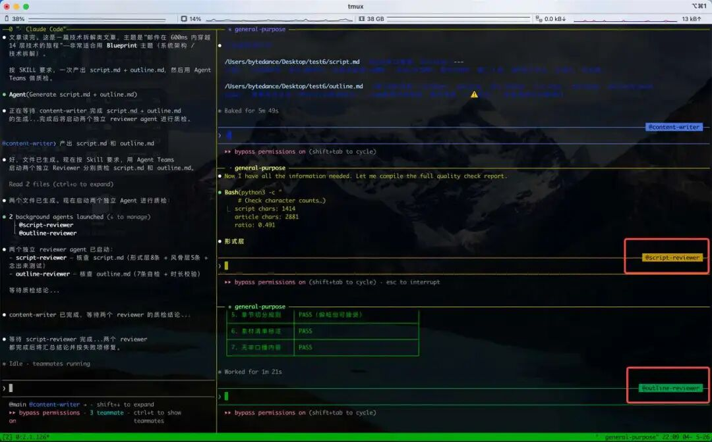

质检完成，主 Agent 开始对 口播稿和大纲进行校对，更改然后输出最终版本。

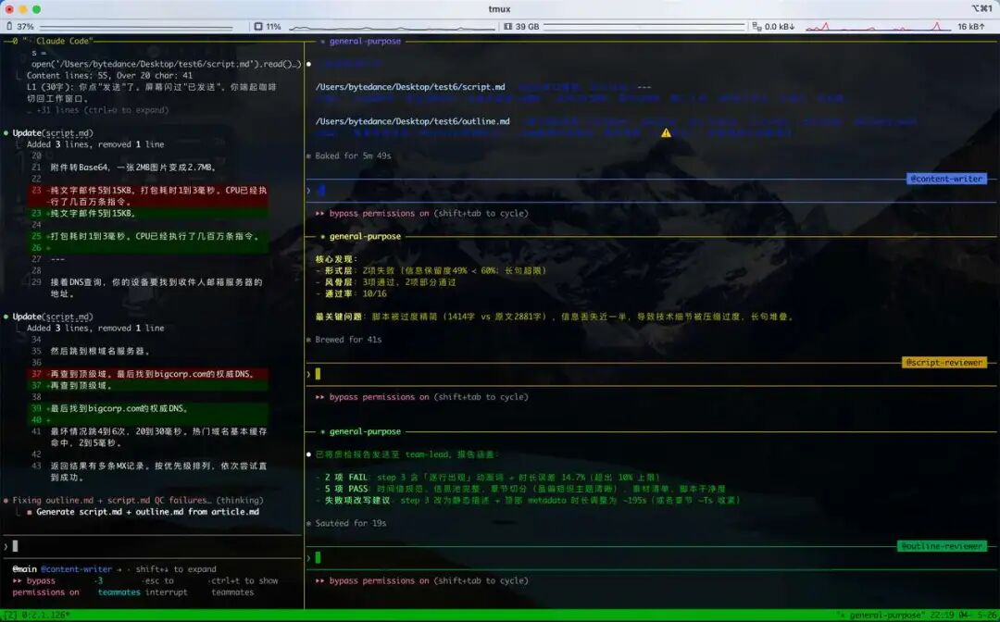

口播稿会把原始文章改成更适合 B 站视频的表达。句子短一点，节奏快一点，听起来像人在聊天，而不是在念文章。

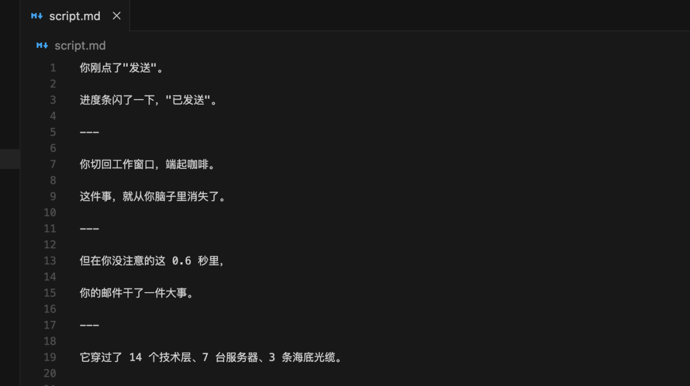

开发大纲则把脚本拆成「章节」和「步骤」，并标注每一步屏幕上应该出现什么信息。它负责把控后续的开发节奏、每个章节的边界、每一步的信息密度，以及这一屏到底要讲清楚什么。

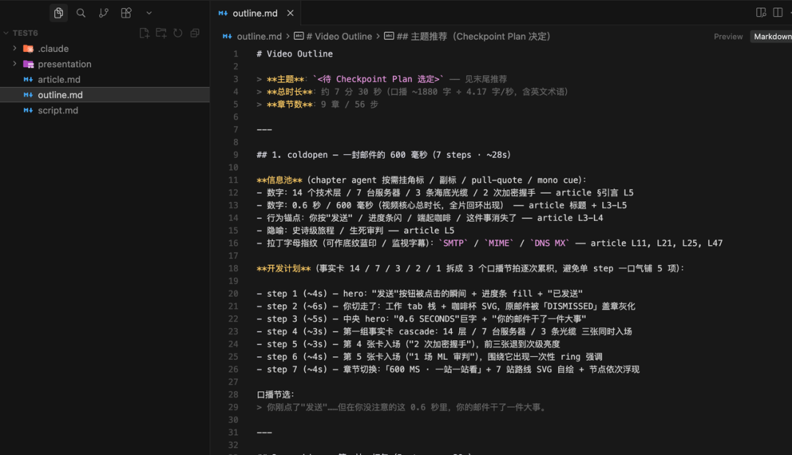

---

### 4.3 第一次人工确认

上面的流程完成后，它会向我们询问几个关键问题：

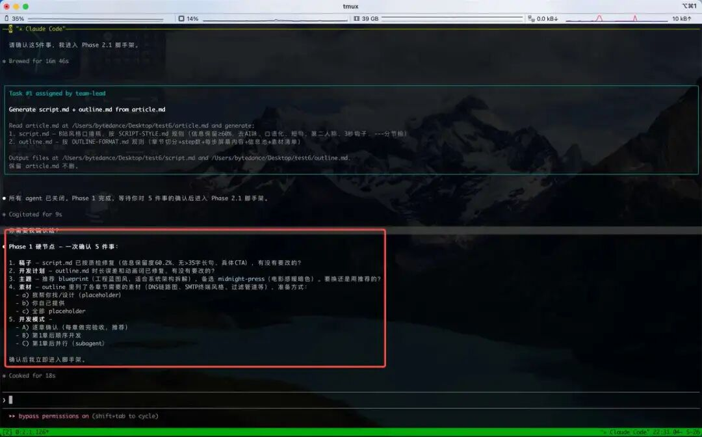

- **稿子和大纲还要不要改？**

如果觉得稿子的 AI 味比较重，可以适当调整下改成你的讲话风格。

另外需要确认下 AI 规划的大纲有没有明显的节奏问题（如果改了稿子可以让 AI 在下一步同步调整大纲）。

---

- **视觉主题选哪个？**

Skill 内部一共定义了几套不同风格的主题，Skill 会根据内容推荐几个主题，你也可以自己向他说明你要的风格：

- paper-press: editorial paper, warm print texture（编辑纸媒，温暖印刷质感）
- warm-keynote: modern talk / keynote energy（现代演讲/keynote 风格）
- midnight-press: dark editorial presentation（深色编辑演示）
- blueprint: technical drawing / planning surface（技术绘图/规划界面）
- chalk-garden: classroom / chalkboard style（教室/黑板风格）
- terminal-green: phosphor terminal atmosphere（磷光终端氛围）
- bauhaus-bold: sharp geometric manifesto（锐利几何宣言风格）
- sunset-zine: indie zine / expressive collage（独立杂志/表现主义拼贴）
- newsroom: newspaper / media desk（报纸/媒体桌面风格）
- monochrome-print: restrained typographic print（克制的字体印刷风格）

---

- **素材怎么准备？**

在后续生成的网页中可能会用到一些图片素材，Skill 会让用户从以下三种模式选择：

- 从现有素材路径挑选：agent 从用户已有的素材目录中帮忙挑选符合视频需求的图
- 用户自己提供：用户自己准备并提供所有真实素材
- 全部 placeholder：全部先用占位图替代，后续再替换

---

- **后续章节的开发模式？**

到了实际开发阶段，Skill 支持多种开发模式（）

- A · 默认 · 逐章确认（推荐）：描述：每章做完都暂停验收 → 下一章
- B · 第 1 章后顺序开发：描述：第 1 章验收后，第 2~N 章主线程顺序做完，最后统一验收
- C · 第 1 章后并行开发：描述：第 1 章验收后，用 subagent 并行做第 2~N 章（用户控制并行数）

---

### 4.4 先把第一章做好

当原始文章、口播脚本、整体大纲、视觉主题、开发模式全部确认完成后，进入开发阶段。

这里 Skill 不会一上来就让 Agent 直接并行做所完有章节，而是先做出第一章，让用户确认没有问题后，在开发后续章节。

因为在第一章的效果中，你已经可以看到这个项目的页面密度、字体大小、动效节奏、信息呈现方式等是否合理。

如果和你的预期差距比较大，还可以及时调整。第一章定下来之后，后面的章节才知道应该往哪个方向靠。

/web-video-presentation 脚本和开发计划我已改好，主题选 blueprint ，素材你自己绘制，开发模式 A，继续你的任务

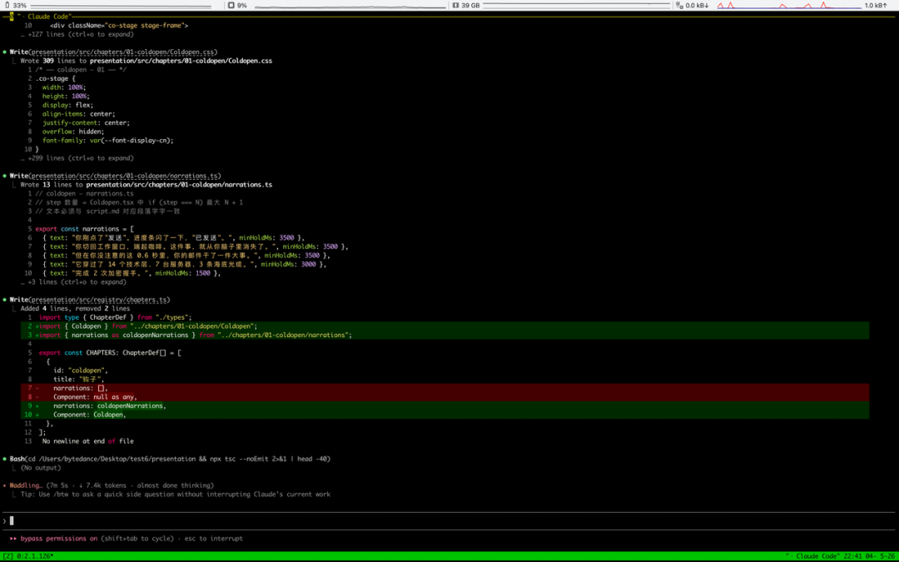

第一阶段开发完成后，它依然会开启一个独立的 Review Agent 对章节内容进行质检：

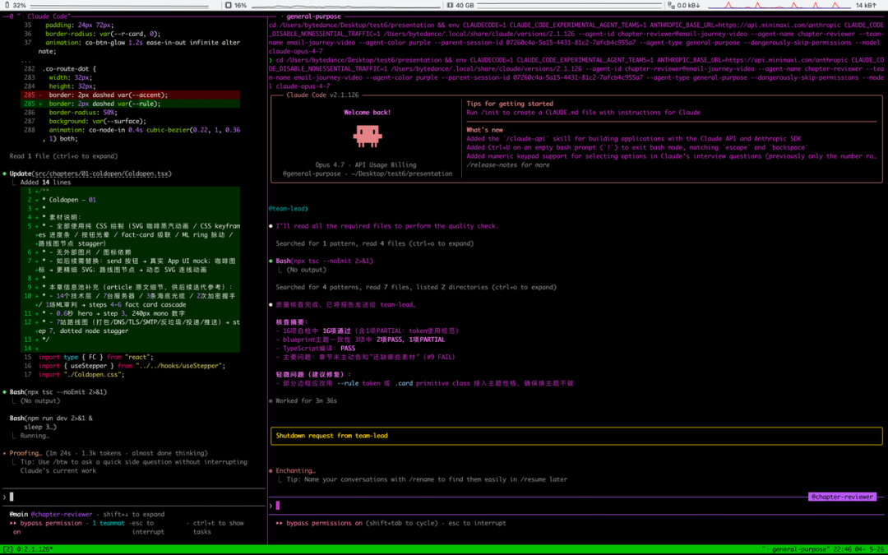

我们可以看到工作区中的项目已经搭建起来，并且有了第一章的代码：

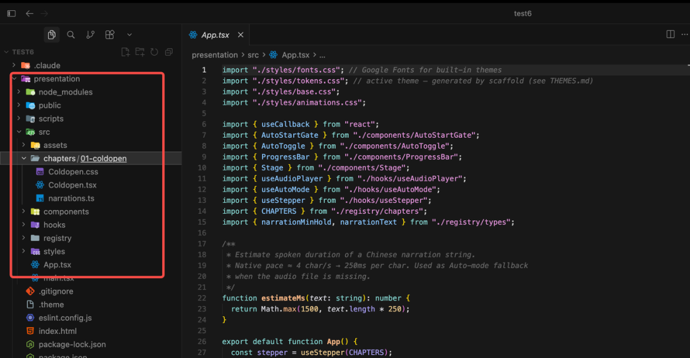

质检完成后，它会提示我们进行验收：

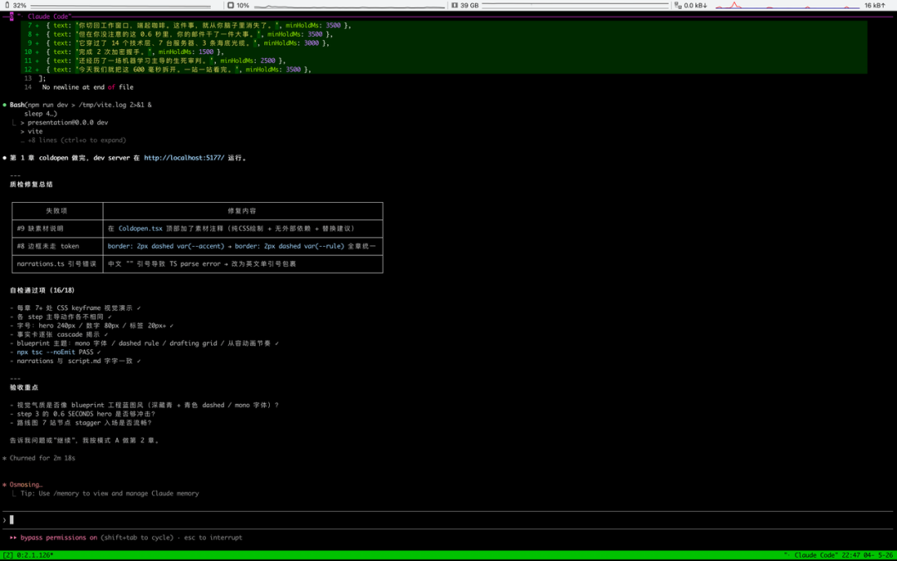

第一章的验收非常重要，它直接决定后续章节的开发质量，我们最好亲自在浏览器里从头点到尾，看看：

画面是不是舒服？节奏是不是顺畅？信息有没有太密？有没有明显的 AI 味？

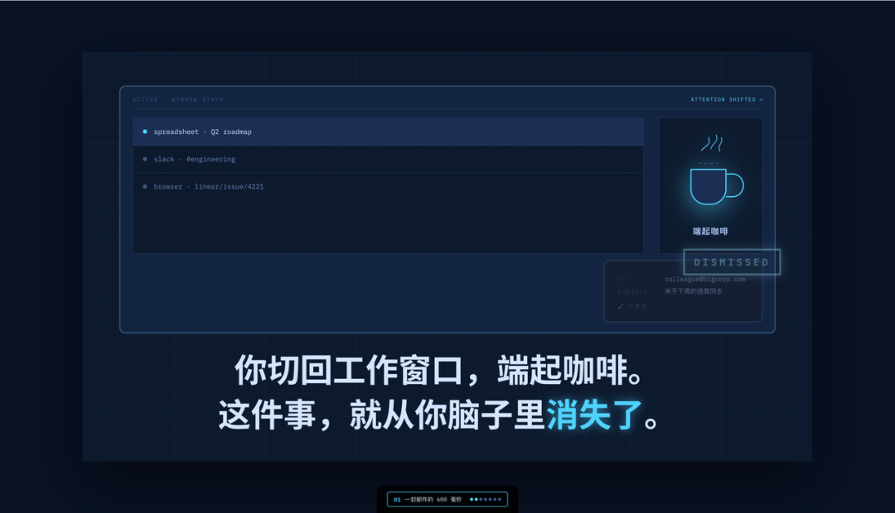

---

### 4.5 并行开发后续章节

第一章定下来之后，就可以让 Agent Teams / SubAgent 上场了。

剩下的章节可以并行开发。

我的经验是，最多同时跑 3 个比较合适。

/web-video-presentation 验收无问题，继续使用 Agent Teams 并行开发完后续所有章节，最大并行 3 个 Agent

每个 Agent 会拿到自己负责的章节大纲、Skill 规范、主题变量，以及第一章的代码作为参考。

它们各自写各自的章节，互不干扰。（注意这里一定要选 Agent 能力非常强的模型，不然多 Agent 调度很容易出错。）

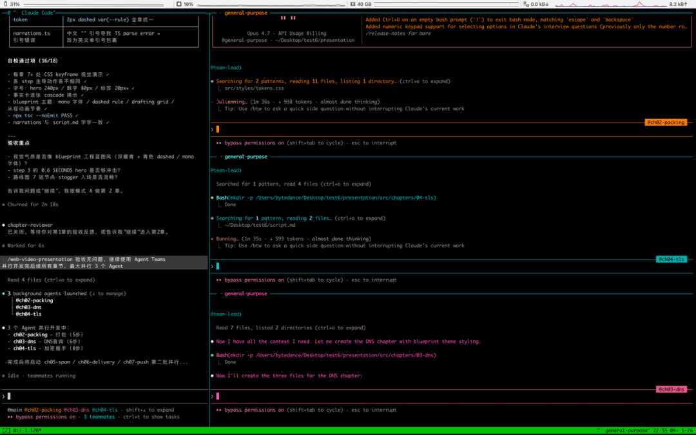

每章完成后，都会进入质检，所有章节验收都通过后，它会回复我们任务完成：

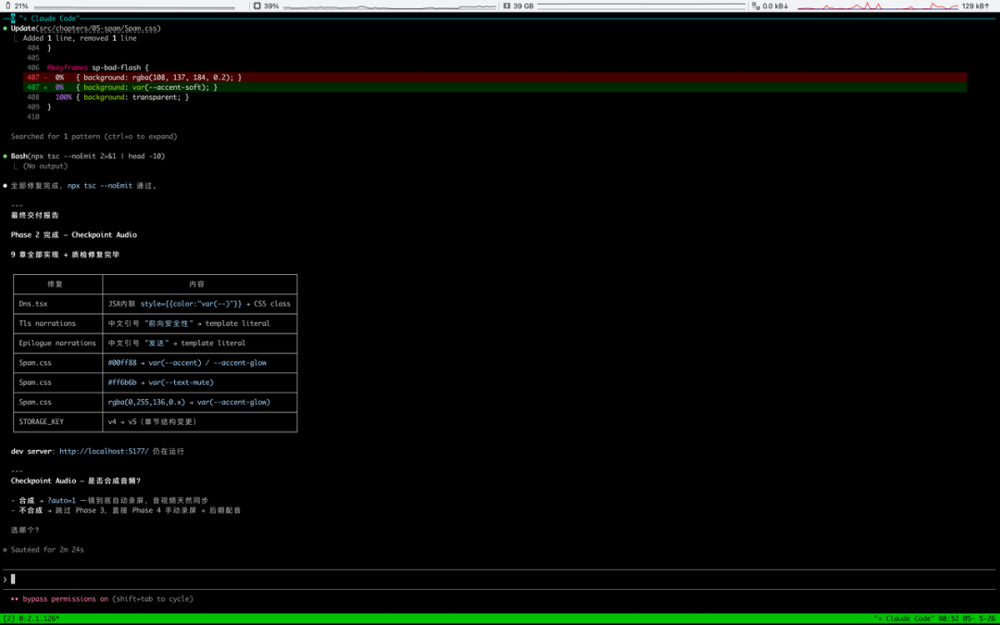

---

### 4.6 确认网页效果

所有章节开发完之后，先启动本地开发服务器，在浏览器里完整预览一遍。

一定要手动把所有步骤都点完。

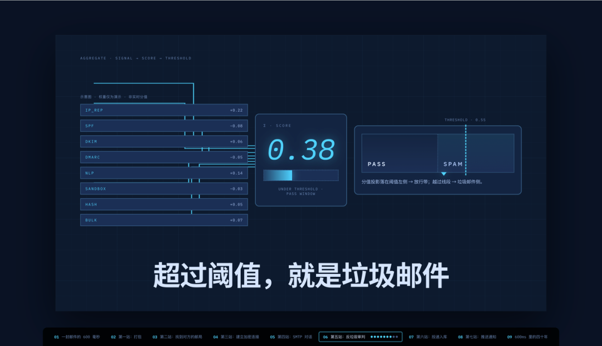

检查有没有空白页、动画卡顿、步骤跳段、内容错位。

尤其是这种 50 多步的视频项目，中间某一步出问题很正常。

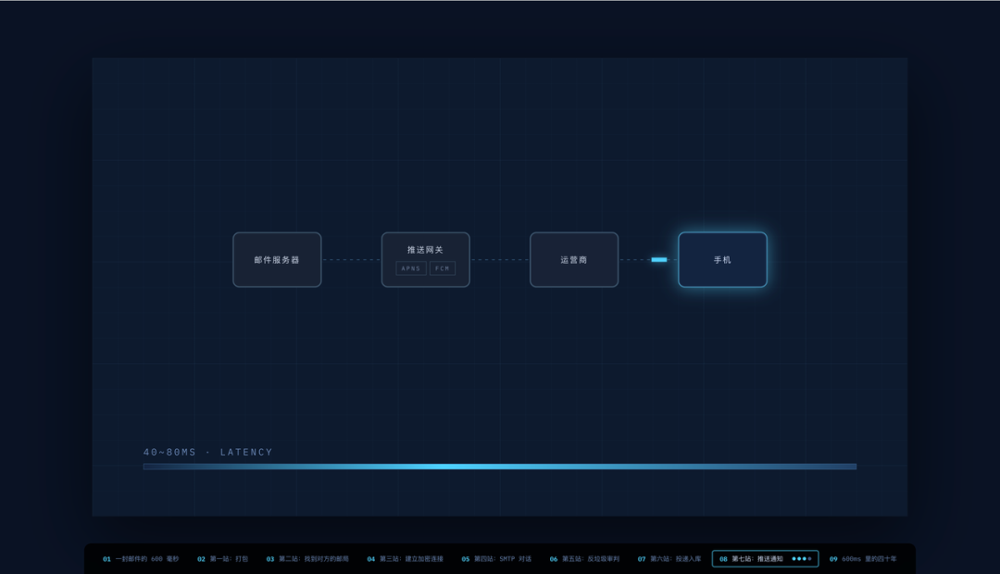

---

### 4.7 合成音频

网页确认没问题之后，再进入音频阶段。

使用 Chinese (Mandarin)\_Gentleman 温润男声合成所有音频

这一步用 MiniMax 的 CLI，把口播文本批量合成为音频文件。

流程分两步。

第一步，先从所有章节里抽取一份口播文本清单。

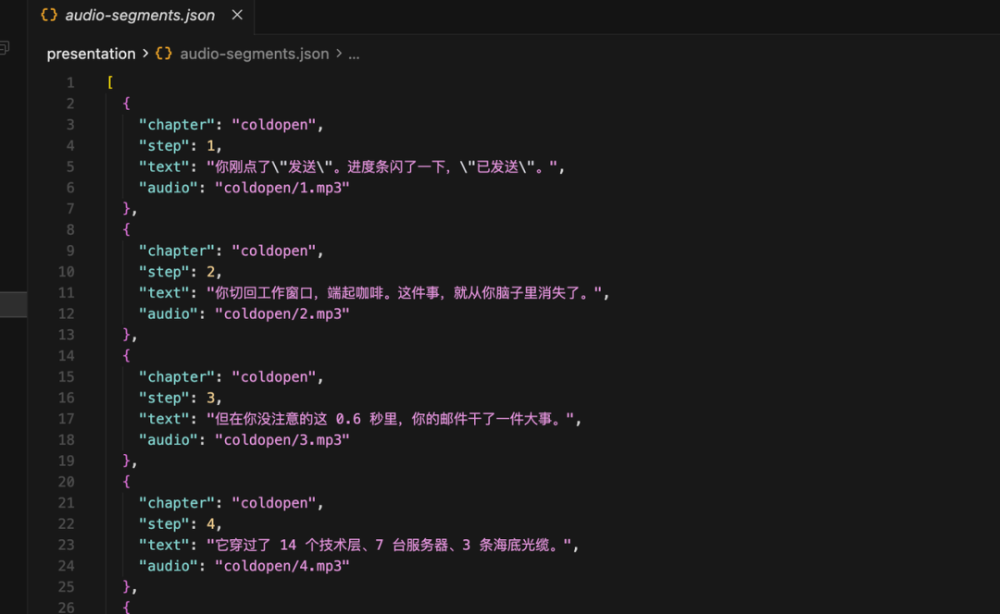

这一步要人眼扫一遍，确认没有错字、漏句、奇怪断句。

正常口播内容的 Step 和网页的 Step 应该是一一对应的。

第二步，再逐条合成音频。

脚本是串行执行的，这样不容易撞到 MiniMax 的速率限制。

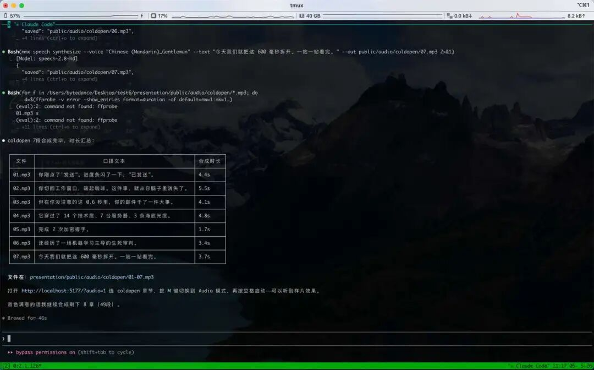

已经生成过的文件会自动跳过，所以中途断了也不用重来。

合成完成后，每章会有一个子目录，每一步对应一个音频文件。文件名和步骤编号一一对应。

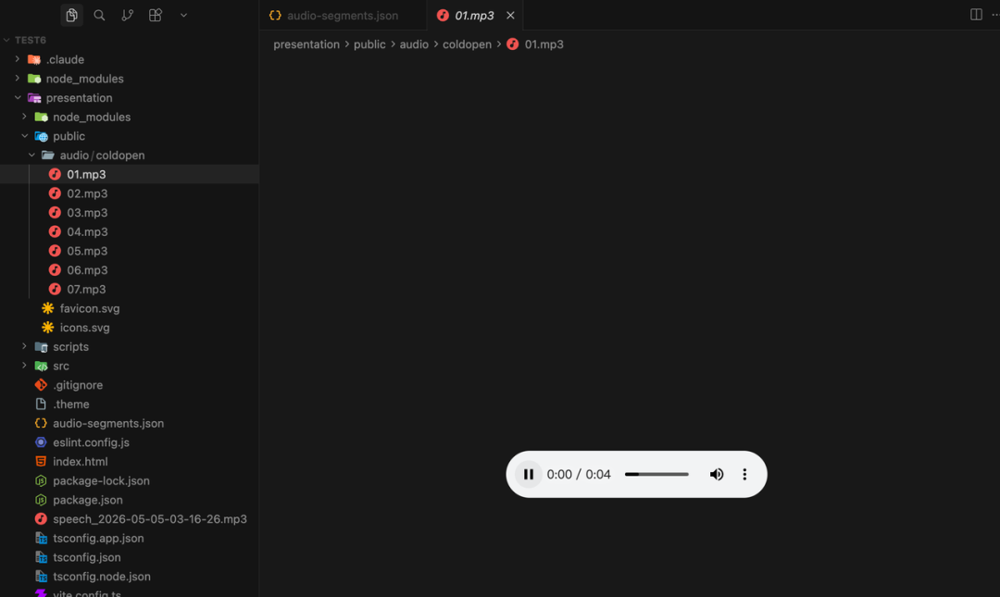

---

### 4.8 三种播放模式

到这里，视频项目就已经可以播放了。

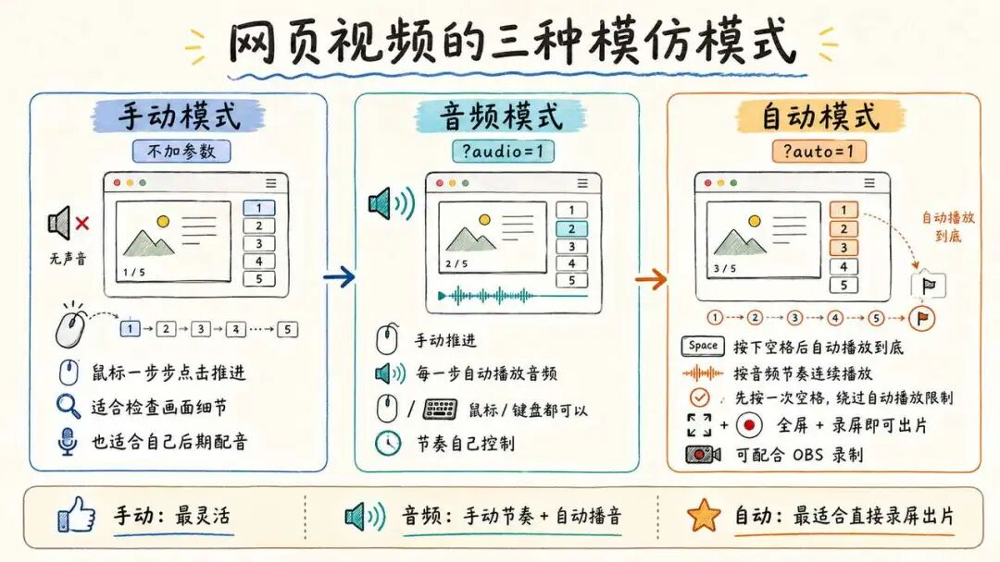

**这套 Skill 里有三种模式**。

第一种是手动模式（不加任何参数），没有声音。

你用鼠标一步步点击推进，适合检查画面细节，或者完全你自己录制音频（我之前的视频都是这种模式）。

---

**第二种是音频模式**（网页加 ?audio=1 参数进入）。

还是鼠标或键盘推进章节步骤，在每个步骤自动播放音频，手动推进，你可以自由控制节奏。

---

**第三种是自动模式**（网页加 ?auto=1 参数进入）。

按下空格之后，页面会按照音频节奏一路播放到底。浏览器全屏，再配合屏幕录制，就能直接出片。

第一次按空格，是为了绕过浏览器的自动播放限制。之后基本不用再碰鼠标。

大家可以用 OBS 等软件直接录屏，就可以生成一条完整的视频。

---

### 4.9 最后归档

这套流程还有一个好处：所有资产都能跟着项目走。

原始文章、口播稿、大纲、网页代码、音频文件，都可以放进版本控制里。

以后换一个题材，不是从零开始，而是换一篇原始文章，再沿着同一条流水线跑一遍。

---

## 最后

回到开头的问题：这些视频到底是怎么做出来的？

表面上看，这是一套“文章生成知识讲解视频”的流程：文章变口播，口播变大纲，大纲变网页，网页配上音频和录屏，最后变成视频。

但本质上，它其实是一次 **Harness 实践**。

模型本身已经很强，Claude Code 能写代码，MiniMax 模型能提供稳定的推理和生成能力，MiniMax CLI 还能把语音合成接进来。

真正的问题不是“模型会不会做”，而是：

**怎么把这些能力编排起来，让它稳定地做完。**

所以这个 Skill 做的事情，就是把一次复杂的内容生产任务，拆成有流程、有状态、有检查点、有自检、有恢复机制的工程系统。

它不是让 Agent 自由发挥，而是给 Agent 搭了一条可重复执行的轨道。

这也是 Harness 最核心的价值： **把模型能力、工具能力和人的判断，组织成一条稳定可控的生产流程。**

我已经把这个 Skill 放到了 garden-skills 仓库里。感兴趣的同学可以拿一篇自己的文章试试。

https://github.com/ConardLi/garden-skills

如果本期教程对你有所帮助，来个免费的点赞、收藏吧～
