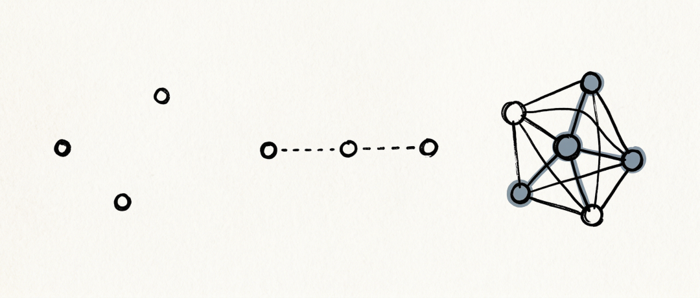

> 📎 来源: [律鹿](https://mp.weixin.qq.com/s?__biz=MzUyNTE2MDc1OA==&mid=2247485243&idx=1&sn=0ceba07c79448af5e75fc189aae5cf64&chksm=fb03846afcd3fa475dd10d1ff215bcc08484fcf34d2a33e96b8f487243f751138bf74140adaf&mpshare=1&scene=1&srcid=0428dM5HkRzZPNbRT0UxqG2q&sharer_shareinfo=503f488249fb87d758c486a9862d1f97&sharer_shareinfo_first=503f488249fb87d758c486a9862d1f97) | 时间: 2026-04-28 06:45

---

> 单个 Skill 解决的是一个点的问题，多个 Skill 的编排集合，才是完整的解决方案。

很多人已经意识到了 Skill 的价值，也花了时间打磨单个 Skill——写了个会议纪要整理的 Skill，用着还不错；做了一个邮件回复的 Skill，省了不少时间；甚至把周报生成也做成了 Skill，每周自动跑。

即便如此，到了真实业务场景里，还是会卡住。

不是 Skill 不够好，是好几个 Skill 之间连不上。

单个 Skill 解决了“点”的问题，但业务是一条线——**点串不成线，工作就推不动。**

## 一、问题的本质

Skill 是针对单个场景的定制和沉淀。

它解决的是一个点的问题——合同审查、案例检索、风险标注。

一个 Skill 做一件事，做到极致，封装起来，可复用。

这是对的。

一个工具 ≠ 一个系统你有的🔧一个 Skill能做一个点的事合同审查 ✓流程衔接 ✗覆盖全链路 ✗≠你需要的📄定制⚖️审查📋台账📨送达🔁审批✅交付多个 Skill 编排成完整链路数据自动流转工具解决点的问题，系统解决线的问题

**但问题是：真实工作不是一个个点，是一条线。**

一个完整的法律服务流程，从客户沟通、资料收集、法律研究、文件起草、风险审查、审批修改到最终交付，中间有无数环节。

每个环节的输出是下一个环节的输入，数据要流转，时序要衔接，多角色要协同。

**单个 Skill 再强，也只解决了一个点的问题。它不解决线的问题，不解决网的问题。**

这就是为什么很多人觉得 AI “看起来有用，用起来不够”——因为他们试图用一个工具解决一个系统的问题。

用三张图把这件事拆开看——单个 Skill、Skill 编排、完整解决方案，分别长什么样。

点 vs 线 vs 网单个 Skill📄📋📨各自独立，互不相连Skill 编排📄⚖️📋串联成线，流程可运行完整解决方案📄📨⚖️📋🔁多路径 + 容错 + 协同= 可交付的解决方案→→

##

## 二、一个真实场景：劳动人事合规

拆开讲，比讲道理更有说服力。

假设你负责一个中型企业的劳动人事合规工作。

新员工入职，你要基于模板生成劳动合同；对于管理层、核心技术人员等重要岗位，你要对定制条款做风险审查；日常管理中，你要维护员工的合同台账、跟进到期提醒。

员工离职，你要生成合规的解除文件；每一步操作，还要走内部的审批流。

用 SaaS 做，行不行？

SaaS 要服务尽可能多的用户，就必须做“最大公约数”——提取所有场景的交集，做通用流程。**通用流程 = 够用的流程 ≠ 最好用的流程。**

功能都有，但每一步都是断开的。你要先在系统 A 生成合同，再把合同内容复制到系统 B 做风险审查，审查完再手动同步到系统 C 更新台账，到期提醒还要在另一个日程工具里设置……

每个模块各管各的，数据在系统之间搬来搬去。

**功能是齐全的，流程是断裂的。** 

为什么不打通？因为这个场景不够“通用”，SaaS 不会为你改变——你只能改变自己，去适应它的流程。

这不是工具不够，是工具之间的墙太多了。【参考阅读[从 SaaS 黑盒到 Skill 积木：工具去中心化的未来](https://mp.weixin.qq.com/s?__biz=MzUyNTE2MDc1OA==&mid=2247485235&idx=1&sn=fc3fef15cb463844da22b7099b6c2794&scene=21#wechat_redirect)】

SaaS 的断裂流程📝系统 A合同生成模板填写完成手动复制🔍系统 B风险审查审查标注完成手动同步📊系统 C台账 + 日程手动录入到期日功能齐全，流程断裂每个系统各管各的，人在中间做搬运工

如果换一种方式，把这个流程拆成五个独立的 Skill 呢？

### 第一步：合同定制 Skill

输入岗位、薪资、期限、工作地点等关键字段，基于企业标准模板，输出适配该岗位的劳动合同文本。

这一层只关心一件事：把参数填入模板，自动处理个性化条款。不关心风险怎么审，不关心台账怎么更新。

### 第二步：条款审查 Skill

输入定制后的合同文本，识别偏离标准模板的风险点——违约金过高、无固定期限条款不合规、竞业限制补偿金约定缺失——输出标注了风险等级和修改建议的审查报告。

这一层主要服务于重要岗位的合同定制。

常规岗位直接用标准模板即可，但管理层、核心技术人员往往需要单独调整条款，这时候审查就不可或缺。它不关心合同是怎么生成的，只关心条款哪里有风险、怎么改。

### 第三步：台账管理 Skill

输入合同关键字段（员工姓名、合同类型、起始日期、到期日期、薪资），自动更新台账，并在合同到期前 N 天生成提醒。

这一层同样独立。它不关心合同内容怎么写、风险怎么审，只关心数据怎么存、提醒怎么发。

### 第四步：文件送达 Skill

输入文书类型（劳动合同、解除协议、通知书），输出符合法律格式的文件模板，并附带送达方式建议。

这一层还是独立。它不关心台账怎么管，只关心文件格式对不对、怎么送才合规。

### 第五步：流程审批 Skill

输入操作类型（新建合同、合同变更、解除），输出内部审批流的步骤、法律依据、以及需要提交的支撑材料清单。

这一层同样独立。它不关心文件怎么生成，只关心流程怎么走、依据是什么。

劳动人事合规：五步 Skill 串联👤HR 输入📄合同定制岗位+薪资→ 模板适配⚖️条款审查合同文本→ 风险标注📋台账管理关键字段→ 更新+提醒📨文件送达文书类型→ 模板+方式🔁流程审批→ 审批流每一步由不同角色优化，各自迭代，互不影响合同定制靠 HR 操作规范，条款审查靠法务经验台账管理靠 HRIS 数据逻辑，流程审批靠合规要求✅ 完整劳动人事合规解决方案 → 可交付

##

## 三、为什么不能做一个大 Skill

有人会问：为什么要拆这么散？一个 Skill 搞定所有不行吗？

不行。

这背后其实是软件工程里一个经典思路——**解耦**。

把一个复杂系统拆成独立模块，每个模块只做一件事、只依赖明确的接口。好处是：改一个不影响其他的，换一个不需要重写全部，加一个不需要动已有的。

Skill 也是一样。具体来说，有三个原因。

**第一，每个 Skill 沉淀的是不同角色的经验。**

合同定制靠 HR 操作规范，风险审查靠法务诉讼经验，台账管理靠 HRIS 系统的数据逻辑，文件送达靠送达合规要求，流程审批靠企业内部制度。

而且，这些工作本身就是不同频次的：模板可能半年更新一次，条款审查只在重要岗位入职时触发，台账管理则是日常高频。

这不是同一个人的经验，也不是同一个领域的知识。

想想劳动合规的工作流：HR 负责模板，法务处理风险审查，合规管审批。

每个角色在不同的节奏上更新知识，绑在一起意味着每次 HR 更新模板，法务审查逻辑都得重新验证。

不同角色，不同经验👨‍💼HR操作规范合同定制台账管理日常高频操作⚖️法务诉讼经验条款审查风险标注按需深度审查📋合规制度要求流程审批送达合规制度驱动调整三种角色 · 三种知识 · 三种迭代频率 → 拆开才对

用一个“大 Skill”去覆盖所有，要么太胖（什么都装，什么都不精），要么太偏（偏向某一端，其他环节效果差）。

**第二，每个 Skill 的迭代节奏不同。**

劳动合同法规可能每年修订一次，条款审查的 Prompt 可能只在遇到新的典型判例时才需要调整，台账字段可能随着 HRIS 系统升级而改变，而日常到期提醒的规则几乎不变。

把它们绑在一起，牵一发动全身，迭代成本极高。

不同的迭代节奏1月3月6月9月12月📄 合同模板法规修订时才更新 · 频率：约每年一次⚖️ 条款审查 Prompt遇到新判例才调整 · 频率：不固定，按需触发📋 台账管理日常高频更新 · 频率：每天绑在一起 = 牵一发动全身 · 拆开 = 各自安静迭代

**第三，每个 Skill 的边界决定了它能被复用。**

拆开的 Skill，合同定制模块不只用于新入职——合同续签、合同变更都可以用。

条款审查模块也不只审劳动合同——保密协议、竞业限制、解除协议，条款不同但逻辑相同。

**一个“大 Skill”是一个专用的盒子；一组“小 Skill”是一个通用的积木系统。**

积木式复用📄合同定制 Skill👤新员工入职🔄合同续签✏️合同变更同一个 Skill，不同的调用场景拆开才有复用，绑死只能专用

拆开的好处不仅在于复用。

一旦每个 Skill 独立，换一个、加一个、改一个都不影响其他环节。

大 Skill vs 拆开的小 Skill❌ 一个大 Skill合同 + 审查+ 台账 + 送达+ 审批 + ?📦改一处 → 全部重写换一个 → 从头来过加一个 → 动已有的✅ 一组小 Skill📄 合同定制半年迭代一次⚖️ 条款审查按需触发📋 台账管理日常高频📨 文件送达规则稳定🔁 流程审批按制度调整改一个不影响其他换一个不需要重写全部→

##

## 四、Skill 编排的两层能力

Skill 编排实际上包含两个层次，缺一不可。

**层次一：单技能设计。**

这是基础。核心是回答一个问题：这个 Skill 到底管什么？

管什么意味着边界要清楚——只解决一个场景，不做越界的事。

输入输出的格式要标准化，这样别的 Skill 才能接得上。实现细节要封装起来，只暴露能力，不暴露内部逻辑。

同时要抽象到通用模式——不是只解决“张三的合同”，而是解决“这一类合同”。

**层次二：技能编排。**

这才是真正的价值所在。

单个 Skill 设计得再好，不会串就只是一堆零件。

编排要解决的是：谁先谁后？数据在 Skill 之间怎么流转？如果某个环节输出为空、字段缺失，流程怎么容错？

不同的案件类型，是否该走不同的 Skill 组合？某个环节失败了，是回退还是跳过？这些不是单个 Skill 能回答的问题，是编排层要处理的事。

两层能力的结合，才构成完整的 Skill 编排体系。

也只有两层都做到位，Skill 才能从“好用的工具”变成“能交付的解决方案”。

Skill 编排的两层能力层次一：单技能设计📄边界清晰只解决一个场景🔌接口标准输入输出可对接🔧封装实现暴露能力不暴露逻辑▼层次二：技能编排📄 合同定制⚖️ 条款审查📋 台账管理📨 送达+ 审批底层设计好单个 Skill → 上层编排串成解决方案

**说到这里，一个绕不开的问题是：这和 Dify、Coze 这些平台做的 Agentic Workflow 有什么区别？**

表面上看起来很像——都是把任务拆开、串联、自动化。

但本质不同。

Agentic Workflow 的编排依赖可视化画布和节点连线。

你需要理解什么是“节点”、什么是“边”、什么是“数据映射”、字段怎么从上一个节点传递到下一个节点。

它在工程上是完整的，但门槛不在“想清楚流程”，而在“学会操作工具”。

很多人画不出一个可用的 Workflow，不是因为业务逻辑没想明白，而是因为工具本身需要学习。

**Skill 编排走的是另一条路。**

它的载体是 Markdown，编排语言是自然语言。

你不需要拖拽节点，不需要理解数据映射，你只需要用文字把逻辑写清楚：“先做 A，把结果传给 B，如果 C 为空就跳过，最后走 D。”

Agent 来负责理解和执行。

这并不意味着写好一个 Skill 很容易——事实上，写出一个高质量的 Skill 依然很有难度。

但它提供了一种可能性：**Skill 把瓶颈从操作工具，转移到了理解业务。** 

只要你能把自己的经验和规则用自然语言表达出来，就有机会把它变成可运行的 Skill。

Agentic Workflow 解决的是“工程师怎么把流程自动化”的问题。

Skill Architecture 解决的是“业务专家怎么把自己的经验变成可运行的系统”的问题。

前者的瓶颈在技术能力，后者的瓶颈在业务洞察。

而后者，才是大多数人真正需要的。

Agentic Workflow vs Skill 编排Agentic Workflow🔧 可视化画布 + 节点连线📡 理解数据映射和字段传递🎓 学会操作工具才能画瓶颈：操作工具需要工程师思维Skill 编排📝 Markdown + 自然语言💬 文字写清楚逻辑即可🧠 理解业务就能参与瓶颈：理解业务业务专家即可参与共同目标：拆开 + 串联 + 自动化——但门槛和受众不同

##

## 五、Skill Architect（技能架构师）

把一个业务场景拆成 Skill，把 Skill 串成解决方案——这个工作，由 Skill Architect 来做。

Skill Architect 不需要是每个领域的专家。但需要承担五项职责：

**理解业务全貌。**

先把流程从头走到尾，搞清楚有几步、终点在哪、哪些环节是关键节点。不急于拆分，先看全局。

**识别 Skill 边界。** 

知道哪些该拆、哪些该合。拆太碎则难以维护，拆太粗则难以复用。每个 Skill 的边界要清楚——只解决一个场景，不做越界的事。输入输出的格式要标准化，这样别的 Skill 才能接得上。

**设计编排逻辑。** 

谁先谁后？数据格式怎么统一？不同案件类型是否需要不同路径？编排逻辑决定了 Skill 能不能真正跑起来。

**处理异常跳转。** 

某个环节输出为空、字段缺失，流程怎么容错？某个 Skill 执行失败，是回退还是跳过？异常处理不是锦上添花，是上线后第一个用到的能力。

**持续迭代优化。** 

实际跑起来，哪里卡了？哪里可以换更优的 Skill？工作流能否进一步拆分或合并？上线只是起点，迭代才是常态。

说到底，Skill Architect 的核心能力不是技术，是从业务流程中提取结构，把经验变成可运行的系统。

Skill Architect 的五项职责SkillArchitect1. 理解业务全貌流程分几步？终点在哪？2. 识别 Skill 边界拆太碎？拆太粗？3. 设计编排逻辑谁先谁后？数据怎么流转？4. 处理异常跳转出问题怎么办？5. 持续迭代优化哪里卡了？能否更优？

##

## 六、为什么这是机会

把 Skill 编排看清楚之后，机会就清晰了。

大多数企业在 AI 转型时走的是同一条路：买 SaaS，雇人手动改、手动传。

工具是有了，但人没省下来。

更关键的问题是——**所有人用的是同一套思路。** 

SaaS 给你什么框架，你就用什么框架；SaaS 让你怎么做，你就怎么做。

产出没有差异化，效率也没有真正提升。

根本原因是：**外部 SaaS 只能做最大公约数，无法适配企业内部特有的流程和规范。** 它的工作流是封闭的、不可修改的。

一个劳动人事合规的流程，每家公司的做法都不一样——审批权限不同、台账字段不同、风险偏好不同。

用通用 SaaS，要么削足适履，要么绕道而行。

**Skill 编排解决的就是这个问题。**

用 Skill 串联起属于企业自己的流程，每个 Skill 的模板是自己的、逻辑是自己的、数据格式也是自己的。SaaS 的通用能力保留，定制化部分用 Skill 自己补。

而当所有人都在用同一个 SaaS 做同样的事情时，你用自己的 Skill 编排做出了一套「只有你会用」的工作流——你在这个领域里就拥有了别人无法复制的效率优势。

从「帮你做」到「让你自己能做」帮你做👨‍⚖️律师做，客户等交付：一份合同 / 一次咨询下次需要？再来找我单次服务→让你自己能做🏗️律师搭，客户跑交付：一套合规解决方案企业拿到方案后自主运转能力交付服务者 → 赋能者：从卖时间到卖能力

这意味着什么？

意味着律师提供服务的方式，正在从「单点输出」转向「能力交付」。

以前你交付的是一份合同、一次咨询。

**未来你交付的是一套「法律合规解决方案」——企业拿到这套方案后，可以自主运转，持续迭代。**

你不是在卖单次服务，你是在卖一套能力。

**从“帮你做”到“让你自己能做”，这是服务者和赋能者的区别。**

AI SaaS vs Skill 编排集合AI SaaS🔒 定制化低 · 只能改输入🔒 透明度低 · 黑盒🐢 迭代慢 · 依赖产品更新📦 交付形态 · 订阅持续付费👥 用的人产出一样 · 无差异归属：平台Skill 编排集合🔓 定制化高 · 每个环节都能调🔓 透明度高 · 每步可见可控🚀 迭代快 · 自己随时改📦 交付形态 · 一次性方案可传承💎 自己工作流独一份 · 有差异归属：自己同一套工具 → 同样的产出 vs 自己的工作流 → 独一份的解决方案

##

## 最后

现在很多人都在说 Skill，但大多停留在「单个 Skill 有多厉害」。

这不是重点。

重点在于**你能不能把多个 Skill 编排成一个完整的解决方案？**

Skill 的机会，不在单点，在编排。

不在工具，在解决方案。

不在「谁的 Skill 更强」，在「谁能把 Skill 串成更好的工作流」。

如果你的团队已经在写 Skill，但还停留在“单个 Skill 能跑”的阶段，这篇文章或许能帮你看清下一步：从写好一个 Skill，到编好一组 Skill。

可以转给正在做 AI 落地的同行——尤其是那些“Skill 写了不少，但业务流程还是推不动”的人。

**单个 Skill 解决的始终是一个点的问题。**

**Skill 的编排集合，才是能交付的解决方案。**

从点到方案📄单个 Skill解决一个点→📄📋Skill 编排串成一条线→📄📨⚖️📋🔁完整解决方案可交付的方案点 → 线 → 方案 = Skill Architecture 的完整路径

###

### 推荐阅读

[从 SaaS 黑盒到 Skill 积木：工具去中心化的未来](https://mp.weixin.qq.com/s?__biz=MzUyNTE2MDc1OA==&mid=2247485235&idx=1&sn=fc3fef15cb463844da22b7099b6c2794&scene=21#wechat_redirect)

[云端 Skill 看起来很热闹，但它不一定有用](https://mp.weixin.qq.com/s?__biz=MzUyNTE2MDc1OA==&mid=2247485072&idx=1&sn=9984accc604dd1be132a230a220beca9&scene=21#wechat_redirect)

[迈向资产化的提示词/Skill：从个人技巧到组织能力](https://mp.weixin.qq.com/s?__biz=MzUyNTE2MDc1OA==&mid=2247485026&idx=1&sn=87e0e5df7894f24779c2fa028849a6ab&scene=21#wechat_redirect)

[Skills Instead Of Agents：不做智能体，先把你的专业能力写成 Skills](https://mp.weixin.qq.com/s?__biz=MzUyNTE2MDc1OA==&mid=2247484868&idx=1&sn=283df729cc05e471d36ffe4ec11a91cf&scene=21#wechat_redirect)

### 新增微信交流群

如果人满或者过期了，可以添加我微信我手动拉群

### 作者

**杨卫薪律师/专利代理师/律所 AI 部门负责人/ SuitAgent 框架开发者**
专注知识产权、数据与 AI
探索法律 AI 工程化、Vibe Working System、Context Engineering

