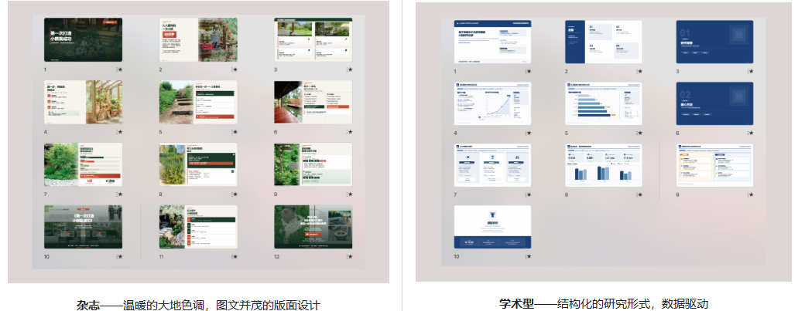
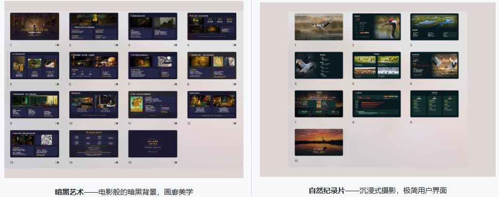
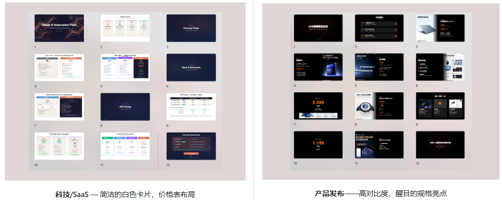

> 📎 来源: [知能小馆](https://mp.weixin.qq.com/s?__biz=MzE5ODE2ODMzNA==&mid=2247486428&idx=1&sn=8277a684f88e001295de7fb9fec5fc7f&chksm=97d294190df5948b052afa346be4294a0724b99e52e61fa5532653ee2b2bb16f2d5c0f11d5b9&mpshare=1&scene=1&srcid=0425JRXYjqVDNETh2RbPxse8&sharer_shareinfo=67de161cf9dc4403f275f24086356056&sharer_shareinfo_first=67de161cf9dc4403f275f24086356056) | 时间: 2026-04-25 18:07

---

哈喽大家好，欢迎来到新一期的「Skills 研习社」。

今天这期有点不一样，不是介绍插件市场的Skill，而是推荐一个开源项目，**ppt-master**，GitHub 7.3k Star，用多 Agent 协作的方式，让 AI 帮你做出专业级 PPT。

为什么专门拿一期来讲它？因为它解决了一个很多人头疼的问题，而且思路很值得借鉴。

往下看。

---

## 核心定位｜它到底解决什么问题

让AI 做PPT，这件事本身不新鲜了。

但你大概率经历过这种失望，你丢给AI 一份报告，它确实给你生成了PPT，但打开一看，能用但拿不出手。

**问题出在哪？**

做一份好PPT，不只是把文字搬上去，它需要内容提炼、排版设计、配色搭配、信息层级、配图选择，这是一整套专业能力，你让一个AI 同时干所有这些事，它很难都做好。

ppt-master的思路很直接，**不靠一个AI逞强，而是组一个团队，分工干**

在展开讲之前，先说两个它跟大多数AI PPT工具不一样的地方，**完全开源免费，无订阅付费**，除了AI模型调用成本，无任何额外费用，且**文件全程在本地运行**，无需上传到第三方服务器，数据隐私更有保障。

---

## 核心机制｜怎么用多Agent协作做出专业PPT

### 角色分工，像真实PPT团队一样运作

你见过咨询公司怎么做PPT 吗？不是一个人从头干到尾，而是策划出大纲、设计师出视觉、合伙人审稿，各司其职。

ppt-master把这个流程搬到了AI世界里，项目内置6个专业AI角色，核心4个负责全流程，执行师再分3个等级适配不同场景

| 角色 | 干什么 | 大白话理解 |
| --- | --- | --- |
| **策略师（Strategist）** | 分析你的内容，确认页数、风格、配色、信息架构 | 策划，定方向 |
| **执行师（Executor）** | 按照策略师的方案，逐页生成 SVG 视觉页面 | 设计师，出图 |
| **优化师（Optimizer）** | 用CRAP设计原则（对比、重复、对齐、亲密性）优化关键页面 | 审稿人，把关质量 |
| **图片生成师** | 需要配图时调用 AI 生图 | 插画师 |

> *CRAP设计原则，对比(C)让重点突出、重复(R)让风格统一、对齐(A)让页面整齐、邻近(P)让逻辑清晰。*

**注意，执行师还细分了三个等级**，通用型（灵活布局）、咨询型（数据可视化）、顶级咨询型（MBB级，SCQA叙事框架+金字塔原理），你做什么类型的PPT，就派什么级别的执行师上。

> *MBB 麦肯锡、波士顿咨询、贝恩三家全球顶级咨询公司，SCQA 是麦肯锡经典的叙事框架，背景(S)→冲突(C)→问题(Q)→回答(A)，让听众的逻辑跟着你走*

整个流程跑下来是这样的

```
你的文档（PDF/网页/Markdown）  ↓策略师分析内容，跟你确认八项设计要素  ↓执行师按规范逐页生成SVG  ↓优化师（可选）对不满意的页面做精修  ↓Python工具统一转换为PPTX
```

**关键点，每个角色都有自己专门的prompt，只干自己擅长的事，不会互相干扰**

### SVG中间格式，为什么不让AI直接生成PPTX

你可能好奇，为什么不直接让AI输出PPT文件，中间要绕一道SVG

因为 **PPTX是二进制格式，AI 没法精确控制**，你让AI "把这个标题往左移 20px、字号改 14px、颜色用 #1a73e8"，它做不到，它只能"大概"给你一个 PPTX，然后你打开一看，这里歪了、那里大了。

**SVG 是纯文本格式**，每一个元素的位置、大小、颜色、字号，都是代码写死的，AI能精确控制到像素级别。

打个比方，SVG像建筑图纸，每个尺寸、每个位置都标注得清清楚楚，AI能精确画出来，转成PPTX之后，每一页的文字、形状、图片都还是独立可编辑的元素，不是一张死图片。

所以ppt-master的策略是，**先用SVG 精确生成每一页，质量把控住了，再统一转成PPTX**。

### 本质，一套Prompt Engineering框架

说到这里你应该看明白了，ppt-master不是什么新的AI模型，它的本质是**一套精心设计的Prompt Engineering框架**

- **角色 prompt**：每个角色的system prompt 都经过反复打磨，定义了它该干什么、不该干什么、输出格式是什么
- **工作流规范**：规定了角色之间的协作顺序、输入输出标准
- **Python 工具链**：负责 PDF 转 Markdown、SVG 后处理、PPTX 导出等 AI 做不好的事

**而且它不绑定特定AI**，Claude Code、Cursor、VS Code Copilot、Antigravity、Codebuddy都能用，兼容 Claude、GPT、Gemini、Kimi等主流大模型。我在尝试用龙虾完成安装部署，后续会更新详细实操教程。

---

## 上手指南｜怎么跑起来

前置条件就两个：**Python 3.10+** 和 **一个AI编辑器**。

**第一步**，克隆仓库并安装依赖

```
git clone https://github.com/hugohe3/ppt-master.gitcd ppt-masterpip install -r requirements.txt
```

**第二步**，用AI 编辑器打开这个仓库

**第三步**，在聊天面板里描述你的需求

**整个过程你不需要写任何代码，也不需要懂 SVG，AI会按照仓库里的角色定义和工作流规范自动执行**

---

## 效果展示｜实际生成的 PPT 长什么样

光说没用，直接看效果。

ppt-master仓库里放了**15 个示例项目、229 页 SVG**，覆盖了多种风格

- **顶级咨询风**，麦肯锡/波士顿那种感觉，信息密度高、数据可视化专业，最大一个项目32 页
- **学术风**，论文答辩、学术报告，规范严谨
- **创意风**，像素复古游戏风、易经水墨风、禅意留白风，风格跨度很大
- **通用商务风**，季度报告、区域分析，日常办公够用

项目提供了 GitHub Pages 在线预览，你可以直接在浏览器里翻看所有示例页面的效果，看完再决定要不要上手。

附几张GitHub示例效果图







---

## 避坑提醒｜几个真实问题

**需要一定技术基础。** 你得会用命令行、装Python依赖、用AI编辑器，纯小白上手有门槛。

**生成质量依赖底层模型。** 同一套prompt，用Opus 4.6和用普通模型，效果差距很大，模型能力是天花板。

**导出的PTX 默认是原生可编辑的。** 导出的PPTX默认分为两个文件，一个是原生形状版本，文字、形状、图片都是独立元素，打开就能直接编辑，另一个是SVG快照版本，需要Office 2016+，手动右键转换为形状后才可以编辑。

**不是一键傻瓜式体验。** 策略师会跟你确认一堆设计要素，这个过程需要你有基本的审美判断，你想做什么风格、什么配色、页数多少，你得心里有数。

---

如果你经常需要做 PPT，而且受够了AI生成的那种"能用但丑"的效果，ppt-master值得试试，它的多Agent协作思路确实能把质量拉高一个档次。

> 项目地址：https://github.com/hugohe3/ppt-master

如果你喜欢这期「Skills 研习社」，觉得内容对你有帮助，麻烦点个赞、在看、转发给身边同样用AI提效的朋友。

关注我，解锁更多能落地的 AI Skill 和开源工具，我们下期再见。
