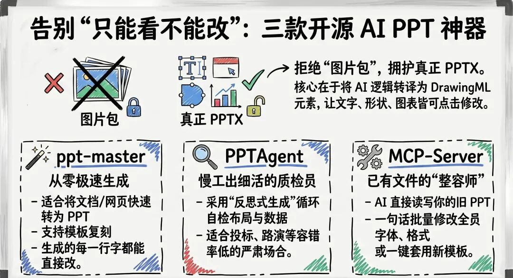
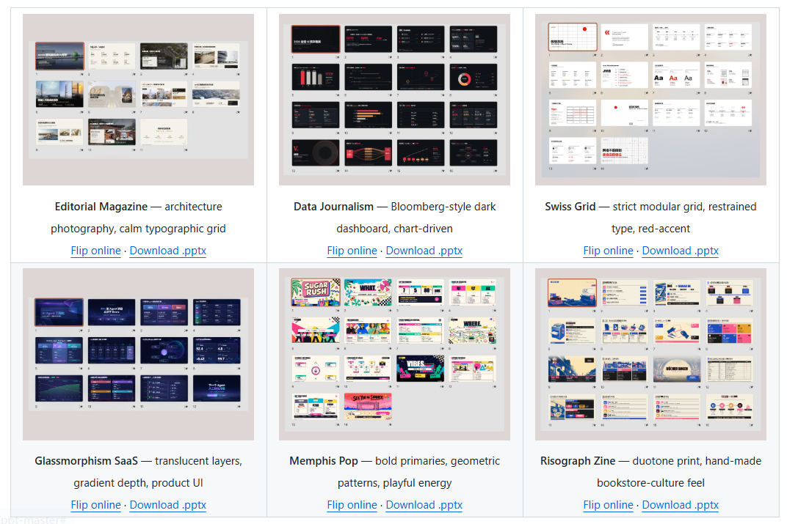
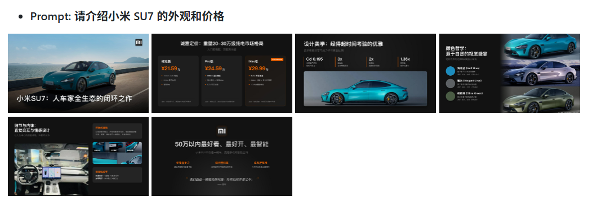
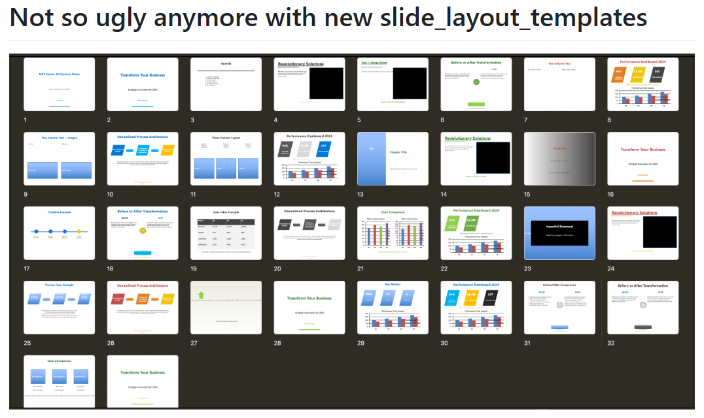

> 📎 来源: [知能小馆](https://mp.weixin.qq.com/s?__biz=MzE5ODE2ODMzNA==&mid=2247487285&idx=1&sn=027117f42bda0331617b81cb4e44be12&chksm=97bd62905876abd4fe859836d91a49d4d2570519d2f5066ce518839c8cbd6472e76a2b179912&mpshare=1&scene=1&srcid=0526mtqZZBJgQsaTtrQy69NY&sharer_shareinfo=ad1a60f7955aa6d2b98be33e873335fa&sharer_shareinfo_first=ad1a60f7955aa6d2b98be33e873335fa) | 时间: 2026-05-26 12:42

---

哈喽大家好，欢迎来到新一期的「Skills 研习社」。

先问大家一个问题

你用AI做的PPT，真正打开修改过几次？

我自己的体验是这样的，工具生成了十几页PPT，看着还不错，但是等你真的需要改个标题、换张图片、改个数字的时候，点上去才发现——全都改不了，因为每一页都是一张图，你想修改任何一个字，都只能重新生成。

好看的PPT和能改的PPT，完全是两回事。

今天这三个工具，就是在解决「能改」这个问题。

往下看

---

## 核心问题｜为什么大多数AI PPT改不了

过去一年，AI PPT工具在GitHub上爆发式增长，Claude Code的Skill市场里PPT类目成了热门赛道。

但你仔细看一圈就会发现，大部分工具走的是同一条路，让AI生成网页或者图片，然后打包成PPTX。

这条路的问题不在「生成」这一步，在「打包」。

你拿到手的PPTX，里面的文字、图表、形状全是像素，不是PowerPoint里能点开编辑的元素，它只是在PPTX的壳子里塞了几张大图。

为什么会这样呢？因为直接生成真正的PPTX远比生成HTML或图片要更难，PPTX底层是一套复杂的OOXML规范，每个文本框都有坐标、每个形状都有锚点、每个图表都有独立的数据源。

AI需要理解排版的逻辑，还要把理解翻译成精确的XML属性，大部分工具会选择绕过这个复杂的步骤。

绕过去的后果是，你做出来的PPT，就只能看，不能改了。

---

## ppt-master｜能改的PPTX，从零开始生成

github.com/hugohe3/ppt-master，20.7k Star，作者 Hugo He，金融背景。详细讲解可以看[Skills 推荐 · 特别篇｜PPT-Master：让AI组队帮你生成真正可编辑的PPT](https://mp.weixin.qq.com/s?__biz=MzE5ODE2ODMzNA==&mid=2247486428&idx=1&sn=8277a684f88e001295de7fb9fec5fc7f&scene=21#wechat_redirect)

这个ppt-master跟市面上大多数AI PPT工具的不同点，一句话就能说清楚，它输出的不是图片，是真正的PowerPoint元素。

传统工具走的是「AI出图→打包PPTX」，它用的是「AI出SVG设计稿→转译成DrawingML→嵌入PPTX」，中间多了「转译」，但是就是这一步，让输出的内容从图片变成了真实的文本框、形状和图表。

你在PowerPoint里打开它生成的文件，可以点击任意的元素，修改文字、换颜色、调位置，跟手动做的PPT一样可以修改。

不只能从零生成。随便丢一份PDF、Word文档、网址或者Markdown进去，它会自己提取内容、分页、设计版式，给你一份带封面和目录的完整演示稿，30页的报告PDF扔进去，几分钟就可以生成一份PPT。

还有一个我比较喜欢的功能，模板复刻。

可以把你公司已有的PPTX扔给它，它会自动提取配色、字体、母版结构，以后所有生成的PPT都可以按照这个风格输出，它内嵌了6种风格范例，从杂志设计到数据新闻到毛玻璃风格，覆盖大部分常见的场景。

还支持过渡动画、逐元素入场、TTS配音甚至克隆声音、可以一键导出MP4。

适用场景很明确，你要从零做一份新的PPT，或者有长文档要快速转换为演示稿，而且做完之后还需要继续修改。

---

## PPTAgent｜生成完不算完，先自己查一遍

中科院软件研究所团队的项目，4.4k Star，github.com/icip-cas/PPTAgent。

它的思路是我觉得这三个里最特别的——不直接给你生成结果，而是在生成过程里塞了一套反思质检。

具体来说就是，让它做一页PPT，生成完不是直接给你看，而是先自己检查一遍，布局合不合理、文字有没有出框、图表数据对不对、这页风格跟前面统不统一，如果发现问题了会自己修改，改完再检查，确认没问题了才会给你看。

论文里把这个循环叫「反思式生成」。

传统AI PPT的问题是，AI看一遍需求，一次性出结果，中间没有任何质量把控，结果好不好，完全看运气，PPTAgent的解法是给AI内部塞了一个质检员，在每步生成后都会先追问自己几个问题。

代价也很明显，慢，同样一份PPT比其他工具要多花1.5到2倍时间，但论文实验数据表明，经过反思修正的PPT，在布局合理性、风格一致性、数据准确性上都有显著提升。

跟ppt-master放在一起看，一个追求快出完整稿，一个追求慢出精修稿。前者适合日常汇报，后者适合关键场合精细打磨。

适合投标演示、投资人路演、学术会议汇报——适合那种「PPT里错一个字都尴尬」的场合。

---

## Office-PowerPoint-MCP-Server｜用AI直接读写PPTX文件

github.com/GongRzhe/Office-PowerPoint-MCP-Server，1.7k Star。

前两个工具都是从零生成，这个不一样，它是让AI直接读写、编辑你已经有的PPTX文件。

它的底层用的是python-pptx这个Python库，直接对PPTX文件做程序化读写。通过MCP协议把34个工具接口暴露给Claude Code之后，AI就可以像操作一个文件系统一样操作PPTX——添加文字、图片、形状、图表，批量改格式，套用模板。不需要你打开PowerPoint软件，Mac、Linux、WSL都能跑，也可以Docker部署。

三个场景最能体现它的价值。

第一个，批量改格式，50页的PPT，领导说「所有标题换成18号微软雅黑，副标题14号灰色，正文11号黑色」，如果手动改起码要一小时，但是用这个一句话就可以搞定了。

第二个，内容审查加自动修正，让AI检查整份PPT，哪些页面文字超了文本框、哪里配色不统一、哪些图表缺数据标注，发现之后还可以一键修复。它的智能排版检查会检测孤行、软回车断行、PowerPoint静默压缩的文字，三个问题一次性修改完。

第三个，模板套用，公司换了新模板，让AI把旧PPT的内容按新模板重新排版，可以文字保留、图片保留，只换版式和配色。

附带一个实用细节，内建的2500多个Material Symbols图标，支持语义搜索，你说「加一个下载图标」，它自己会自动匹配最合适的，还能用主题色着色。

它的能力受限于python-pptx这个库的边界。复杂动画、嵌入对象、部分特效python-pptx处理不了，所以不适合那种需要精细动画设计的场景。但对于批量改格式、统一风格、内容审查这些日常刚需，完全够用。

还有一个同类项目ppt-mcp，ykuwai开发，功能类似但是接口更全，目前只有19 Star，特别新，可以关注但暂时不建议当主力。

适用场景，你已经有一份PPT，需要批量修改、统一格式、内容审查，或者让AI在已有文件上接着编辑的场景。

---

## 三个工具怎么选

它们看着都在做「让AI做PPT」，但解决的其实是三件不同的事。

| 维度 | ppt-master | PPTAgent | Office-PowerPoint-MCP-Server |
| --- | --- | --- | --- |
| 定位 | 从零生成新PPT | 反思式质检生成 | 操控已有PPT文件 |
| 输入 | 主题/文档/PDF/网址 | 主题/内容描述 | 已有的PPTX文件 |
| 输出 | 可编辑PPTX | 可编辑PPTX | 在原文件上修改 |
| 优势 | 速度快，元素可编辑 | 质量高，数据准 | 批量操作，自动化强 |
| 代价 | 风格控制依赖模板 | 生成慢1.5-2倍 | 受python-pptx能力边界限制 |
| Star | 20.7k | 4.4k | 1.7k |

看完这张表就会很清楚了

- 从零做一份新PPT → ppt-master
- 质量优先，慢也行 → PPTAgent
- 改一份现有PPT → Office-PowerPoint-MCP-Server

而且这三个能结合起来使用，你可以先用ppt-master从文档生成初稿，再让PPTAgent做一轮质量审查，最后再用Office-PowerPoint-MCP Server做细节微调。

---

AI做PPT这件事，核心问题不是能不能生成，而是生成完成后能不能修改，一份PPT，你打开能修改字、能够调排版、能更新数据，才算真正的有用。

这三个工具都没走「截图打包」的捷径，ppt-master把AI输出转译成了真正的PPTX元素，在PowerPoint里就跟手动做的一样。PPTAgent多了一步反思质检，使用时间换质量。Office-PowerPoint-MCP Server 是让AI直接学会了操作已有的PPT文件，批量修改格式、统一修改风格、查找错误，省的是手工操作的时间。

如果你喜欢这期「Skills研习社」，觉得内容对你有帮助，点个赞、在看、转发给身边同样被PPT折磨的朋友。关注我，解锁更多能落地的AI Skill和开源工具，下期见。

**参考资料：**

- ppt-master：https://github.com/hugohe3/ppt-master
- PPTAgent：https://github.com/icip-cas/PPTAgent
- Office-PowerPoint-MCP-Server：https://github.com/GongRzhe/Office-PowerPoint-MCP-Server
- ppt-mcp：https://github.com/ykuwai/ppt-mcp
