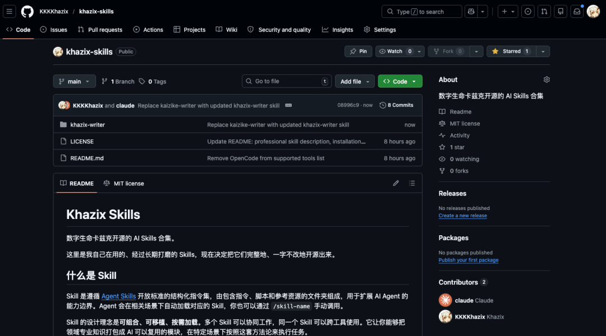
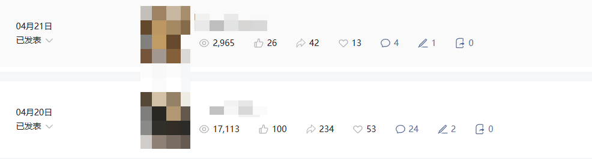
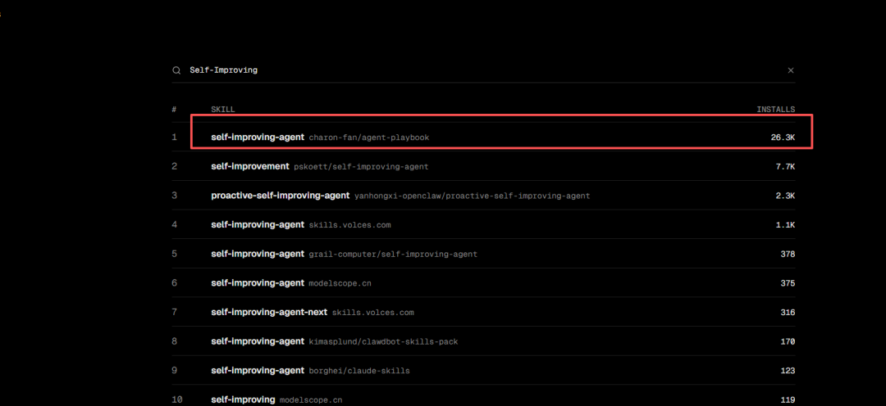
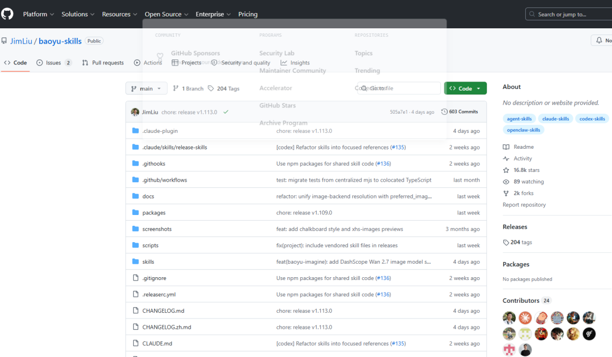

> 📎 来源: [匿星AI](https://mp.weixin.qq.com/s?__biz=MzYzOTA1MDAzMQ==&mid=2247486458&idx=1&sn=9209a2ae61dcb4ffca28b8258d4da67d&chksm=f140b58ec5f5e9ad2dd99bd6a8ee82b904474747d43ea1041ddc75638a3845606545481f65ee&mpshare=1&scene=1&srcid=0503ZuSiBVJ53SnF0O00XGBA&sharer_shareinfo=9c5932b791f06b17d8ff9e1d8530355d&sharer_shareinfo_first=9c5932b791f06b17d8ff9e1d8530355d) | 时间: 2026-05-03 01:25

---

# 你有没有这种感觉。别人和AI聊几句就能搞定一件事，你折腾半天出来的结果却总是差点意思。不是AI不行，是你没给它配上“武器库”。

今天分享一下我常用的Skill，覆盖写作、绘图、编程、学习、公众号运营——基本上涵盖了你用AI做的所有事。每一个都经过验证，每一个都能实打实提升效率。

我是匿星，主业程序员，专注于AI编程，副业工具提效，和5000+朋友一起共同创富！

## 01 写作绘图：一个技能全搞定

如果你是用AI写公众号、写内容的朋友，这两个技能你必须知道。

**卡兹克写作Skill**，一键加载之后，AI直接进入写作模式。

**卡兹克大佬** 把自己做了三年公众号的所有方法论、所有踩过的坑、所有我觉得就得这么写才是我的感觉，全部蒸馏成了一个Skill。

我之前也写过一篇文章，使用这个skill 写了几篇小爆款。[小龙虾跑出小爆款：融合AI大佬卡兹克神级Skill,我的AI辅助创作流程全公开](https://mp.weixin.qq.com/s?__biz=MzYzOTA1MDAzMQ==&mid=2247486323&idx=1&sn=ffdfdbfc03c2219f46f5a35254cea278&scene=21#wechat_redirect)

**开源地址：**https://github.com/KKKKhazix/khazix-skills

配合 **Nano Banana Pro** 使用，效果更好。

这是目前 Gemini 3 Pro Image 的图像生成方案，画出来的图质量足以直接用在文章封面、海报、配图上。

简单来说，别人还在用AI生成一些惨不忍睹的图，你已经可以做出专业级别的视觉内容了。

**开源地址：**https://youmind.com/nano-banana-pro-prompts

## 02 程序员专属：让AI从工具变成教练

如果你经常让AI帮你写代码，这部分必须认真看。

**superpowers** 

它直接把AI从“写代码的工具”升级成“编程教练”。

以前你是说“帮我写一个函数”，现在是“帮我交付整个工程”。它会帮你考虑架构、考虑代码组织、考虑后续维护。你不只是得到一段代码，你得到的是一个完整的工程思维。

**开源地址：** https://github.com/obra/superpowers

**ui-ux-pro-max** 

它让AI像专业设计师一样思考，生成的UI代码不仅仅是能看，而是真正具备设计感和用户体验。之前有人用这个Skill，几分钟生成了一套完整的登录页面，代码质量比很多初级前端工程师写得都规范。

**开源地址：**https://github.com/nextlevelbuilder/ui-ux-pro-max-skill

**remotion-best-practices** 

Remotion是用代码做视频的神器，但官方文档太散太乱。这个Skill把最佳实践整理好了，你不需要自己慢慢摸索，直接按照它给的路径走，就能做出高质量的代码视频。

**开源地址：**https://github.com/remotion-dev/skills

## 03 自我进化：让AI记住你的一切

这是我觉得最可怕的一个方向，也是很多人忽略的。

**Self-Improving-Agent** 这个Skill，装上之后，你的AI开始拥有“跨会话的长期记忆”。

你纠正过它的表达方式、你告诉过它你喜欢的写作风格、你强调过某个细节它总是搞错——这些它都会记住。

下次再聊的时候，它不再是一个陌生的工具，而是一个了解你脾性的搭档。

它不仅能记住，还能“自己变强”。每一次和你的交互都是一次学习机会，它会分析自己的输出，调整自己的策略。

你可以理解为，它在偷偷进化。某种程度上，这已经不像是在使用一个工具了，更像是在培养一个助手。

**开源地址：**npx skills add https://github.com/charon-fan/agent-playbook --skill self-improving-agent

## 04 公众号运营者的超级武器库

如果你在运营公众号，这部分和你直接相关。

**baoyu-imagine** 是目前最强大的AI绘图方案，支持OpenAI、Google、MiniMax、阿里云多个模型，画出来的图直接能用在文章里。

**baoyu-cover-image** 是封面图生成器，5种维度自动匹配，你只需要告诉它文章主题，它就能给你生成几十张候选封面。

**baoyu-post-to-wechat** 直接把文章帮你发布到公众号上。你写完文章，它帮你排版、生成封面、然后一键发布。整个流程，重复性的内容只用做一次。

还有：

**baoyu-image-cards**：做信息图卡片
**baoyu-infographic**：做专业信息图
**baoyu-slide-deck**：做PPT
**baoyu-comic**：画知识漫画

公众号运营的每一个环节，它都给你配齐了，另外还有：

**baoyu-markdown-to-html**：格式转换
**baoyu-translate**：翻译
**baoyu-youtube-transcript**：下载字幕做内容
**baoyu-x-to-markdown**：把推特内容转成文章素材

说白了，这就是一个完整的内容生产闭环。

## 05 官方正统：自己造武器

最后一个，**skill-creator**，是官方出的Skill创建指南。

前面那些Skill再好，那是别人做的。skill-creator教你自己怎么做属于自己的Skill。

学会之后，你可以把任何一套固定的工作流程封装成Skill，下次需要的时候一键加载，AI直接进入状态。

**开源地址：**npx skills add https://github.com/anthropics/skills --skill skill-creator

**查找skll：**https://skills.sh/

具体怎么使用？ 把这些复制开源地址，发给小龙虾，让它给你安装就行。

**AI时代的差距，不是AI本身，而是你会不会给它“装备”这些技能。**

但工具再多也只是开始，真正能让你变强的，是持续用、持续调、持续优化。

别人的Skill再好，拿到手之后也要根据自己的使用场景慢慢磨合。适合自己的，才是最好的。

如果你看完之后，想马上试试但不知道从哪个开始，或者用的时候遇到问题不知道如何解决——

**扫描下方二维码**，拉你进「AI自媒体交流群」，一起调教出最懂你的 AI 助手

同时送你一个福利，扫码即可参与 1 5.9w人AI星球三天体验卡。  2 三天内部直播公开课 。3《超级个体从零到百万变现》电子书 。4A I数字人口播带货，Al视频、AI代写、等热门AI赛道的玩法和实战拆解。

