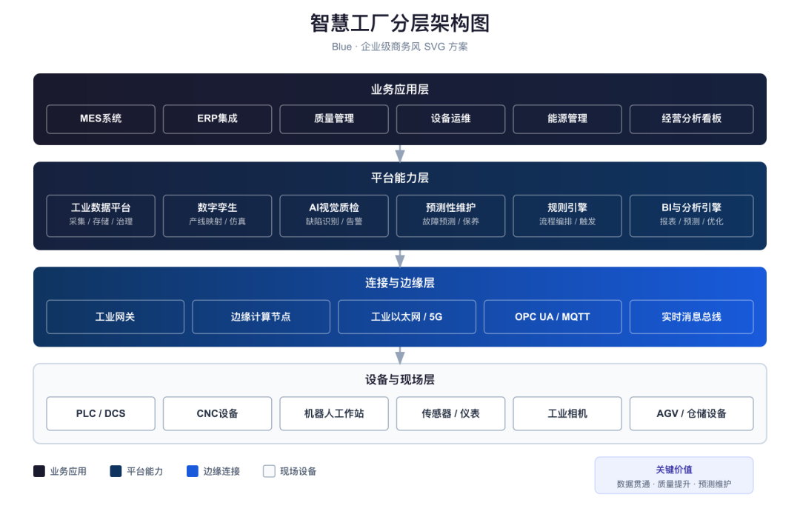
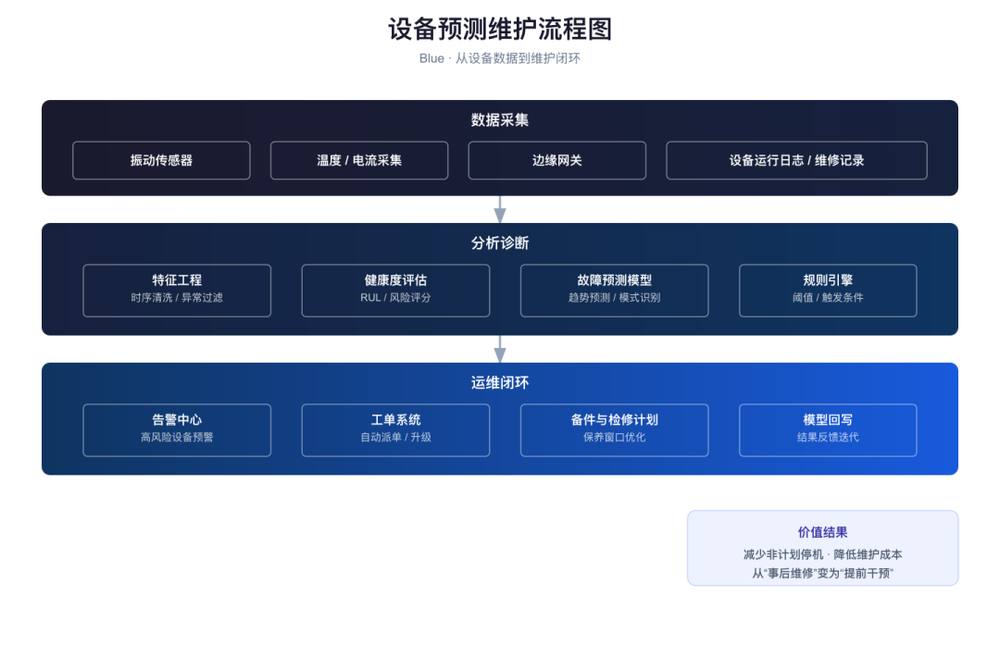
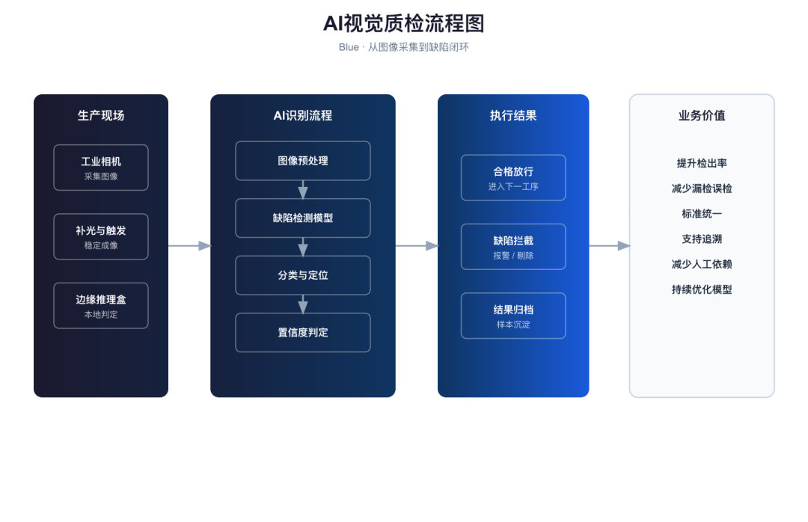
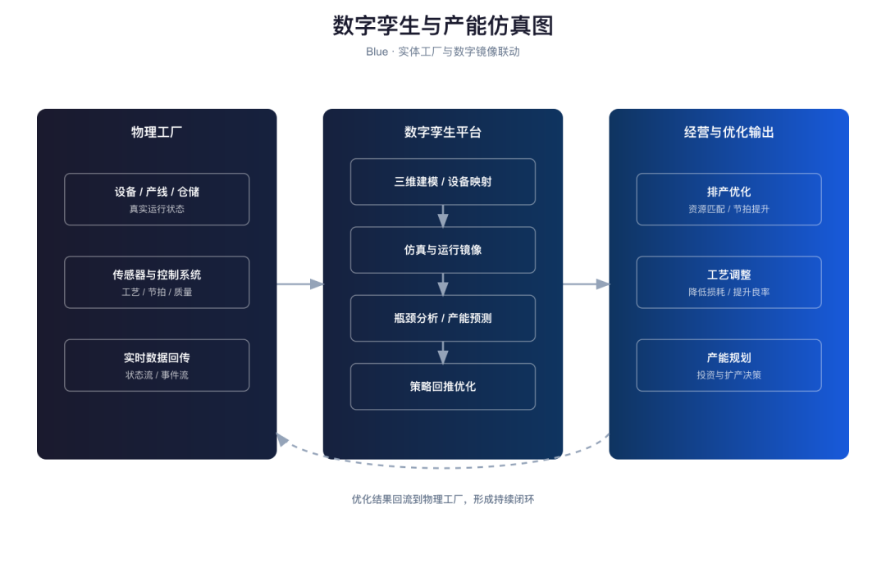
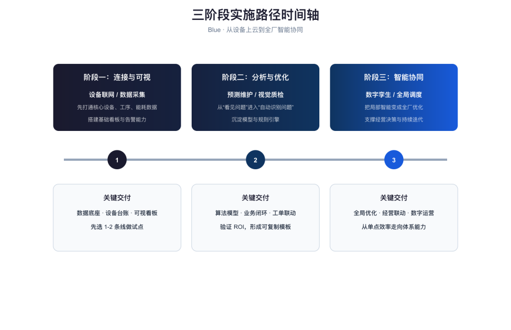
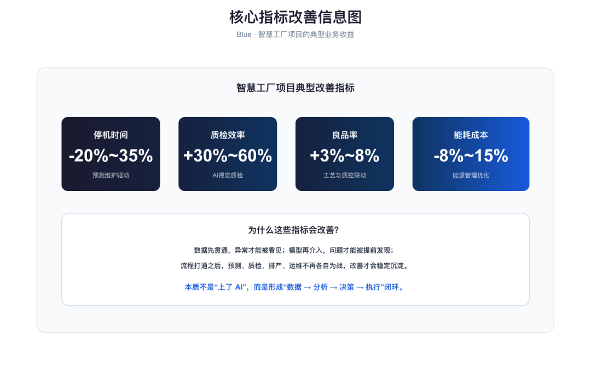
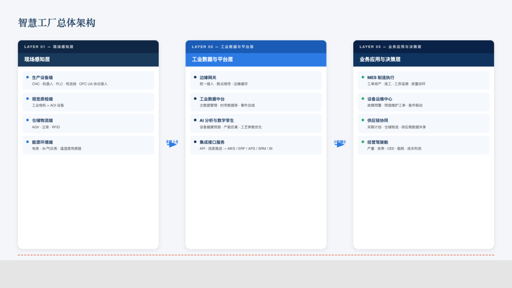

> 📎 来源: [小虾的 AI 笔记](https://mp.weixin.qq.com/s?__biz=MzcwOTIxOTY4Mw==&mid=2247483967&idx=1&sn=a797e54c79a388e4254e8fecad722d15&chksm=f4e02b40b319de36c5268f6d1cf9b7ed9f735c073f1d87c89fb7c8028740152d039476d01efc&mpshare=1&scene=1&srcid=0425zCttsGSRh8WnNHFtgfO9&sharer_shareinfo=845c0162e72e0ff53f380a80e2f2f7b8&sharer_shareinfo_first=845c0162e72e0ff53f380a80e2f2f7b8) | 时间: 2026-04-25 19:36

---

做方案这事儿，想必大家已经离不开 AI 了吧。现在 AI 已经很能打了——写文案、润色话术、整理竞品分析，都能交给它。

但配图这块，很多人还是有点尴尬——要么文字方案配纯文字，读者全靠脑补；要么从网上找参考图贴上去，风格不统一，还可能有版权问题。今天分享一套我最近验证过的 skill 搭配，走的是纯 SVG 手工路线，成本低、输出稳、可编辑性强，拿来应对方案汇报、商务演示绰绰有余。

### 一、两个 skill 是什么

这次真正起作用的是两个 skill：一个负责分析文字方案里的插图需求，一个负责把这些需求画成能直接交付的图。

01.
   **illustration-analysis**：把文字方案拆解成结构化插图需求，输出每张图的位置、类型和内容逻辑。（这个是自己写的，大家按自己的需要写就可以，很简单的，需求给ai，让它做）。

02.
   **arch-diagrammer**：接收插图需求，生成 SVG 架构图、流程图、时间轴等图形产物。

地址：https://clawhub.ai/skills/arch-diagrammer

03.
   前者负责“在哪里、画什么”，后者负责“怎么画”，两者拼起来就是一条完整的方案配图流。

>    简单说：文字方案进去，先被拆成一组清晰的插图任务；再由制图 skill 接手，把这些任务变成可交付的图。

### 二、这两个 skill 怎么协同

这套流程的关键，不是一个 skill 什么都做，而是每个 skill 只做自己最擅长的那一步。

>    文字方案 → illustration-analysis 分析 → 输出插图位置 + 内容逻辑 → arch-diagrammer 作图 → SVG / PNG 交付

illustration-analysis 不管视觉风格，它只负责把文档里“哪里该有图、图里该表达什么”说清楚；arch-diagrammer 再按这些结构化需求去出图。这样做的好处是，逻辑清晰、复用性高，而且后续要换风格、换图形方式，也不用重新理解原方案。

真正的一键感，不是一个工具包办一切，而是前后两步衔接得非常顺。

### 三、实操：智慧工厂方案 → 6 张配图

这次我拿一个智慧工厂解决方案做验证。操作也很直接：我直接发一份文字版方案进去，让流程自己拆图、自己出图。

illustration-analysis 输出了 6 个配图任务，分别覆盖总体架构、预测维护、视觉质检、数字孪生、实施路径和核心指标，基本把一份标准解决方案里最需要可视化的部分都覆盖到了。

01.
   总体架构图：三层结构（现场感知层→数据平台层→业务决策层），数据从现场来、决策回传现场。

02.
   设备预测维护流程图：数据采集→边缘处理→预测模型→维护工单，异常向上触发告警。

03.
   AI 视觉质检流程图：相机采图→AOI 检测→结果上传→质量闭环，合格/不合格双分支。

04.
   数字孪生流程图：建模→仿真→优化建议，与实际执行形成闭环。

05.
   三阶段实施路径时间轴：3 个月基础构建→6 个月能力提升→12 个月生态成熟。

06.
   核心指标改善信息图：OEE↑25%、故障停机↓60%、质检效率↑40%。

>    下面这 6 张图，就是这条流程按顺序产出的结果：从总体架构，到关键流程，再到实施路径和指标呈现。

### 四、这个过程中踩的坑

真正把这条流跑顺，中间还是踩了几个坑。这些坑也挺有代表性，如果你后面自己搭类似流程，基本也绕不开。

✓**元素重叠问题**：一开始走了弯路，用更灵活的设计稿路线，结果元素位置全靠手工算，重叠问题很棘手。

✓**中文编码问题**：SVG 里的中文编码一旦写错，XML 解析直接报错，图片导出失败。

这条流的核心经验不是“工具越多越好”，而是分析和作图要清晰分层。

### 五、这套搭配适合谁

如果你本来就在做解决方案、售前材料、产品汇报、项目建议书，这套流会很实用。

✓
   做解决方案的技术 / 售前：需要快速出配套架构图、流程图。

✓
   写方案报告的产品 / 运营：文字内容搞定了，但配图不想再靠拼凑。

✓
   时间紧、质量要求不低的商务场景：希望成本可控，输出稳定，还能二次编辑。

>    illustration-analysis + arch-diagrammer = 方案配图的低成本稳定输出路线。

---

如果你也有“方案写到一半，配图还要靠脑补”这种痛

可以试试把“分析需求”和“执行出图”拆开做，这条路比想象中稳得多。

skill配方 / 方案配图 / SVG / 架构图 / 工作流
