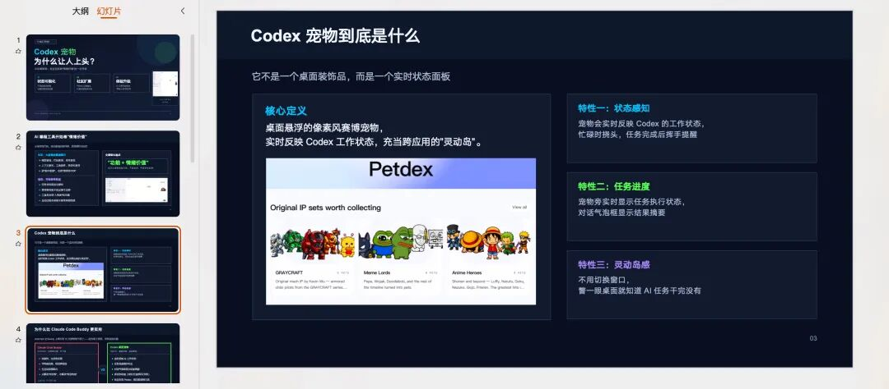
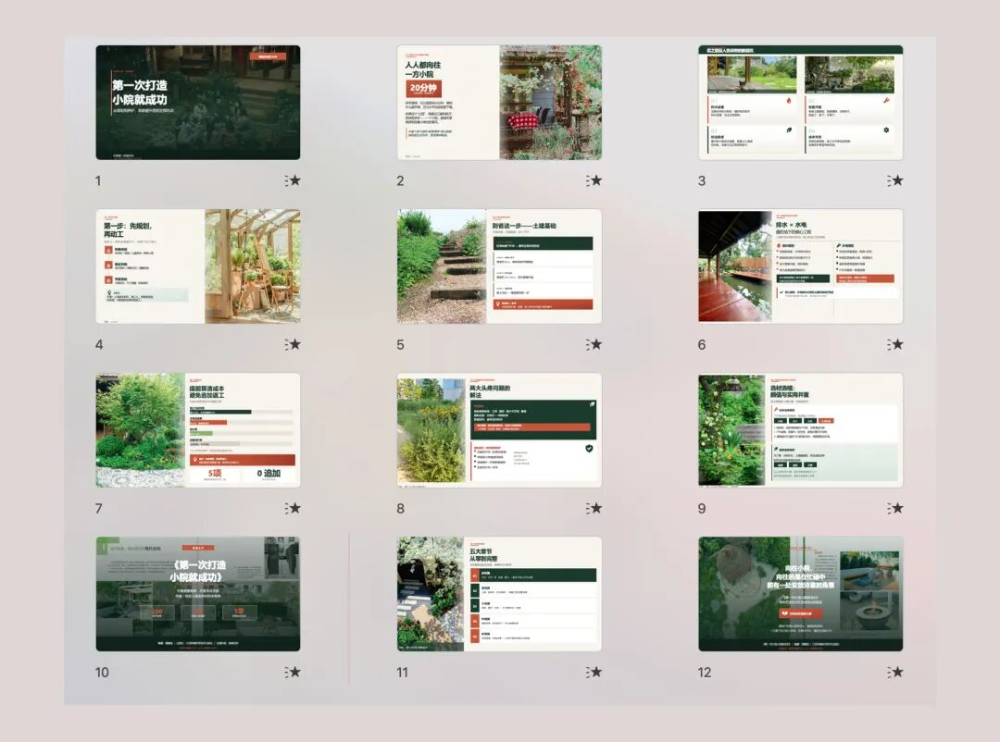
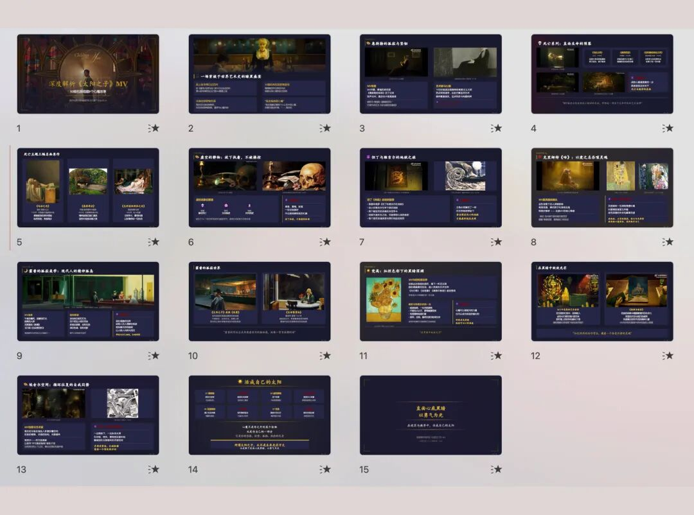
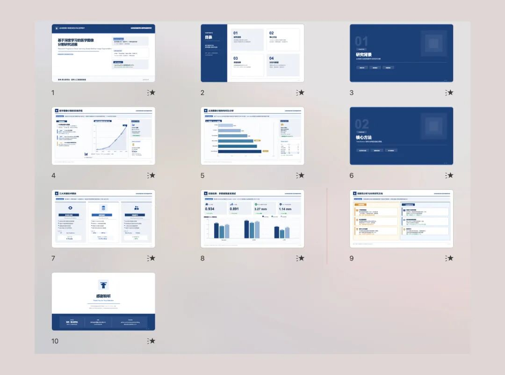

> 📎 来源: [小虾的 AI 笔记](https://mp.weixin.qq.com/s?__biz=MzcwOTIxOTY4Mw==&mid=2247484021&idx=1&sn=218c9864bcf4903827238d499f7dac2b&chksm=f45e87c4feae46007288c5713b427883379bfa7d80d8cb0868cb9d0401bcf8231009e87f0977&mpshare=1&scene=1&srcid=0507tJuJw6yNkDuCs1UbRgof&sharer_shareinfo=fcbf0e2734097a0e97adb5ed00c6a258&sharer_shareinfo_first=fcbf0e2734097a0e97adb5ed00c6a258) | 时间: 2026-05-07 04:44

---

PPT制作作为办公场景里的一个大场景，我认为是必须让个人AI具备的能力。尝试了多个skill工具，要么排版不够灵活有逻辑，要不就是输出HTML格式，可编辑性差。

  

我的三个核心论点：

1、PPT的质量高度取决于模板，AI生成PPT本质上就是XML文件生成。如果没有好的模板作为参考，AI很难自主设计出专业、有设计感的排版和布局。    

没有好模板，AI很难自主设计出专业排版和视觉效果

2、市面上很多"AI生成PPT"工具最终导出的是HTML或PDF。虽然视觉效果不错，但可编辑性极差，难以实现工作协同——客户反馈修改、团队协作时非常麻烦。   

一个真正好用的Skill，必须能稳定输出原生可编辑的.pptx文件

3、仅仅把文字塞进幻灯片是不够的。好的Skill需要理解方案逻辑，合理安排标题层次、内容主次、图表类型和页面流程，而不是简单的一页一堆文字。

模板+原生格式+内容规划能力，是AI生成PPT的关键三角

PPT Master是一个专注于"已有文档→原生可编辑PPTX"的工作流Skill（作者hugohe3）。核心优势包括：原生PPTX输出（SVG中间格式+多角色协作）、模板适配能力强（支持上传公司PPTX模板作为参考）、内容规划能力（多Agent协作：规划→内容→视觉）、适合严肃场景（方案、提案、汇报等需要专业排版和团队协同的办公场景）。

✓ 原生PPTX输出：使用SVG中间格式+多角色协作，最终打包成真正的PowerPoint形状和原生动画

✓ 模板适配能力强：支持上传公司PPTX模板作为参考，自动识别母版、占位符和主题，精准填充内容

✓ 内容规划能力：内置多Agent协作（规划Agent负责整体结构，内容Agent负责文字逻辑，视觉Agent负责布局和图表）

✓ 适合严肃场景：特别适合方案、提案、汇报等需要专业排版和团队协同的办公场景

> https://github.com/hugohe3/ppt-master

实测效果：

这次实测我直接给了小虾一个公众号文章链接，他对内容进行分析并将原文配图扒取，制作效果如下（当然也可以让他启用ai生图能力，这就取决于个人的api配置了）：

官方示例：

---

关注不迷路，分享真实可落地的AI工具与工作流

帮你把重复劳动自动化

AI效率 / 生产力 / 工作流自动化 / PPT制作
