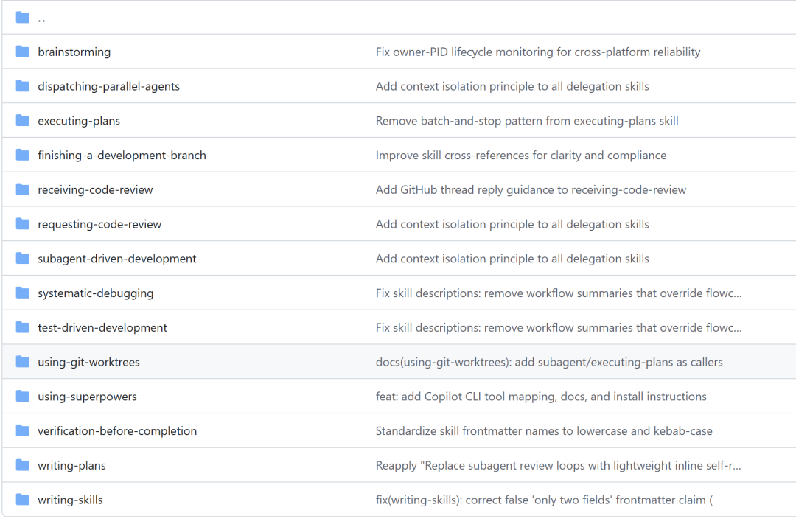

> 📎 来源: [角角的 AI 思考](https://mp.weixin.qq.com/s?__biz=MzYzMzcwNDM4OA==&mid=2247484989&idx=1&sn=ca6e9bc972fe4a014634fa15380bd242&chksm=f17cd3894e05c4c901ae6e570588dd3ef5fea8da9a46a7aa30b53dd526b2fa016826e0cf0a4b&mpshare=1&scene=1&srcid=0421nPADJYC3EYg8QeshcDTD&sharer_shareinfo=3a8860cac49bb37d16ff7fe00bd14f29&sharer_shareinfo_first=3a8860cac49bb37d16ff7fe00bd14f29) | 时间: 2026-04-21 11:56

---

用AI写代码，最怕什么？

不是AI不会写，是AI不听劝。用户说"帮我加个功能"，AI立刻开写，不问需求、不做设计、不管边界。写完就跑，不写测试、不做检查、不考虑回归。

这些问题，源于AI的训练目标：**生成看起来合理的代码**。而软件工程的核心是**流程和纪律**，这两者之间存在根本矛盾。

Jesse Vincent（Carton创始人，Perl6语言设计者）提出的Superpowers框架，给出了他的答案：**把软件工程的最佳实践封装成可自动触发的技能**。

本文从GitHub源码提取核心设计文档，逐段解析Superpowers的技术架构。下面是里面的skill截图，大家有兴趣可以去github上下载使用。



## 一、SKILL.md格式：技能的定义规范

Superpowers的技能以固定格式存储在 

```
skills//SKILL.md
```

 文件中。每个技能包含两个核心字段：

```
---name: brainstormingdescription: 你必须在任何创造性工作之前使用此技能——创建功能、构建组件、添加功能或修改行为。---
```

### YAML Frontmatter 规范

```
---name: 技能名称（小写，连字符）description: 触发条件描述---
```

**name 字段**是技能的唯一标识，引用格式为 

```
superpowers:
```

。

**description 字段**采用"触发条件"写法，明确说明在什么场景下必须使用这个技能。例如：

> "You MUST use this before any creative work"

这种写法让AI能自动判断何时需要加载技能，而不需要用户手动提示。

### Markdown Body 结构

Frontmatter之后是Markdown格式的正文，通常包含：

- **触发条件**：何时使用此技能
- **执行步骤**：具体的工作流程
- **硬性门控（HARD-GATE）**：禁止逾越的边界
- **产出物（Deliverables）**：每个步骤必须生成的文档
- **技能引用**：调用其他技能的格式

## 二、技能加载机制：自动检查，即时触发

Superpowers定义了一套严格的技能检查流程：

```
用户消息   → 检查是否有适用的技能（哪怕只有1%可能）  → 加载技能  → 执行
```

关键设计：**技能优先级高于默认行为**。

AI不能自行决定"这个任务太简单，不需要用技能"。一旦有技能适用，就必须使用。

这是对AI"选择性忽视"问题的根本解决——不是告诉AI"你可以用技能"，而是规定"必须检查技能"。

## 三、硬性门控（HARD-GATE）：不可逾越的边界

Superpowers引入了 HARD-GATE 标签来标记绝对边界：

```
## HARD-GATE: 在获得设计审批之前Do NOT invoke any implementation skill, write any code, scaffold any project, or take any implementation action until you have presented a design and the user has approved it.
```

翻译成人话就是：**想动手？先拿出设计方案，等用户点头。**

这个HARD-GATE不是建议，是铁律。违反即失败。

### 为什么需要硬性门控？

因为AI有"生成冲动"。当你让AI写代码时，它会立刻开始写，哪怕你还没说清楚要什么。硬性门控强制AI先停下来，把设计想清楚。

这模拟的是有经验工程师的工作方式：**动手之前，先想清楚**。

## 四、brainstorming技能：需求分析的艺术

brainstorming是Superpowers的第一个技能，定义在 

```
skills/brainstorming/SKILL.md
```

 中。

### 完整技能定义（原文）

```
---name: brainstormingdescription: 你必须在任何创造性工作之前使用此技能——创建功能、构建组件、添加功能或修改行为。---# Brainstorming在开始任何创造性工作之前，必须先完成需求分析和方案设计。## 执行流程### 第一步：探索上下文回答以下问题：- 用户想要解决什么问题？- 现有系统如何处理这个问题？- 用户期望的解决方案是什么样的？- 成功标准是什么？### 第二步：提问澄清如果信息不足，提出具体问题：- 谁能用这个功能？- 在什么场景下使用？- 需要和哪些现有系统集成？- 有什么限制条件？### 第三步：提出方案提供2-3个方案选项，每个方案包含：- 核心设计思路- 主要优势- 主要权衡（trade-offs）- 推荐程度### 第四步：展示设计用文字描述最终推荐的方案，包括：- 系统架构变化- 关键数据结构- API设计（如果有）- 用户交互流程### 第五步：编写设计文档在 `docs/superpowers/specs/` 目录下创建设计文档：- 文件名格式：`YYYY-MM-DD-feature-name.md`- 包含：背景、目标、详细设计、开放问题### 第六步：自检在提交设计之前，检查：- [ ] 是否覆盖了所有关键场景？- [ ] 是否有遗漏的边界情况？- [ ] 设计是否和现有架构一致？- [ ] 是否考虑了性能和安全？### 第七步：用户审阅等待用户对设计的反馈和批准。## HARD-GATE**禁止在设计获得批准之前进行任何实现工作。**## 产出物- 设计文档：`docs/superpowers/specs/YYYY-MM-DD-feature-name.md`- 推荐方案的理由- 2-3个备选方案的权衡分析## 技能引用完成后，调用 `superpowers:using-git-worktrees` 准备开发环境。
```

### 核心设计解析

**1. 分步验证**

每一步都有明确的产出物（deliverable）。用户问"加个功能"，AI必须：

- 第一步：理解问题
- 第二步：确认理解
- 第三步：给出方案
- 第四步：解释方案
- 第五步：写成文档
- 第六步：自己检查
- 第七步：等用户批准

不能跳步，不能合并，不能省略。

**2. 强制提问**

如果信息不足，AI必须提问，不能猜测或假设。这意味着AI在不确定时不能擅自决定。

**3. 方案对比**

要求提供多个方案并分析权衡（trade-offs），而不是只给一个答案。这培养了工程思维。

**4. 文档化**

最终设计必须写成文档，而不是留在脑子里。文档是后续开发的依据，也是知识传承的载体。

## 五、writing-plans技能：把设计转化为可执行计划

设计通过后，下一步是把设计转化成可执行的计划。

### 核心规范（原文）

```
---name: writing-plansdescription: 在设计批准后使用此技能，将设计文档转化为可执行的任务计划。---# Writing Plans把设计转化为具体的执行计划。## 文件结构规划在定义任务之前，必须先规划文件结构。设计单元（design unit）应该有：- 清晰的边界- 定义良好的接口- 明确的职责每个文件应该只有一个明确的职责。## 任务粒度规范每个任务应该是 **2-5分钟** 的动作。好的任务：
```

Step 1: 写一个失败的测试
Step 2: 运行测试确认失败
Step 3: 写最小代码让测试通过
Step 4: 运行测试确认通过
Step 5: 提交代码

```
坏的任务：
```

- 实现用户模块（太粗）
- 写代码（模糊）
- 修复bug（未验证）

```
## 禁止占位符以下内容不允许出现在计划中：- "TBD"- "TODO"- "implement later"- "Add appropriate error handling"（无具体代码）- "Similar to Task N"（不重复代码）计划必须包含工程师执行所需的一切信息。## TDD强制执行每个功能任务必须遵循 TDD 循环：- RED：写失败的测试- GREEN：写最小代码- REFACTOR：重构清理## 产出物在 `docs/superpowers/plans/` 目录下创建计划文件：- 文件名：`YYYY-MM-DD-feature-name-plan.md`- 包含：文件结构、所有任务、预期结果
```

### 关键设计理念

**1. 任务粒度**

"2-5分钟的任务"这个标准非常具体。Superpowers认为，只有足够小的任务才能：

- 容易验证（每个任务都能确认完成）
- 容易回滚（如果出错，只回退一小步）
- 容易并行（多个AI可以同时做不同的任务）

**2. 禁止占位符**

"TODO"、"以后再实现"这类占位符是软件质量的敌人。Superpowers明确禁止：计划里写的每件事都必须是可以立刻执行的。

**3. TDD循环**

每个任务都遵循"红-绿-重构"循环，确保测试先行。

## 六、TDD技能：铁律与执行机制

test-driven-development 是Superpowers最核心的技能之一。

### 核心铁律

```
# Test-Driven Development**铁律：没有失败的测试，就不能写产品代码。**## 流程### RED 阶段写一个**失败的测试**，验证：- 测试失败原因正确- 测试的是正确的行为### GREEN 阶段写**最小代码**让测试通过，验证：- 所有测试通过- 没有为了通过测试而写的多余代码### REFACTOR 阶段在测试保护下重构清理，然后回到 RED 继续下一个行为。## 技术细节### 测试先行原则如果用户说"先写代码再加测试"：1. 告诉他们这是不允许的2. 如果代码已存在，删除它3. 从测试重新开始**你不能"保留参考"代码，不能"边写测试边调整"。**必须亲眼看到测试失败，才能确认测试的是正确的东西。### 验证失败必须正确RED 阶段不仅要"测试失败"，还要确认：- 失败原因是你期望的- 不是因为测试写错了如果测试错误地通过了，这不是好的 RED。
```

### 执行机制

Superpowers的TDD不是建议，是强制执行：

1. 1. **如果用户要求先写代码**：拒绝
2. 2. **如果代码已存在**：删除，从测试开始
3. 3. **RED失败但原因不对**：不是好的RED，重写测试
4. 4. **GREEN阶段写过多了**：回退，只写最小代码

这模拟了资深工程师对TDD纪律的坚持。

## 七、requesting-code-review技能：子智能体调度

代码完成后，需要进行审查。Superpowers定义了subagent调度机制。

```
---name: requesting-code-reviewdescription: 在完成代码编写后、提交PR之前使用此技能。---# Code Review## 流程### 第一步：获取变更范围通过 git SHA 确定审查范围：
```

git log --oneline -n 20
git diff SHA\_A..SHA\_B

```
### 第二步：调度审查者使用 `superpowers:code-reviewer` 子智能体进行审查。传递给审查者的上下文：- 变更的代码- 相关的设计文档- 任务描述**注意**：审查者应该拿到精心构建的上下文，而不是完整的对话历史。### 第三步：处理反馈根据审查意见修改代码，直到通过。
```

### 子智能体设计

Superpowers引入了子智能体概念：

```
superpowers:main      # 主智能体，协调者superpowers:brainstorming    # 需求分析superpowers:writing-plans   # 计划编写superpowers:code-reviewer   # 代码审查superpowers:finishing       # 收尾工作
```

每个子智能体有独立的上下文，只接收与其任务相关的信息。这解决了AI"上下文窗口污染"问题。

## 八、executing-plans技能：计划执行与回退

计划制定后，executing-plans技能负责执行。

### 核心机制

```
---name: executing-plansdescription: 在计划批准后使用此技能，执行任务计划中的每个步骤。---# Executing Plans## 执行原则### 按顺序执行严格按照计划顺序执行任务，不能跳步。### 停止条件遇到以下情况必须停止：- **阻塞（Blocked）**：缺少依赖、信息不清- **测试失败**：实现有bug- **指令不明**：计划中的步骤不清晰**遇到阻塞必须停止，不能猜测或强行推进。**### 回退机制如果发现计划本身有重大问题：1. 停止执行2. 标记需要重新设计的部分3. 返回 brainstorming 或 writing-plans不能闷头继续错误的计划。## 禁止行为- 不要添加计划外的功能- 不要重构无关的代码- 不要忽略警告- 不要猜测用户意图
```

### 关键设计

**停止条件**是最重要的规则。AI有"总想给出答案"的本能，遇到问题会猜测。但Superpowers要求：遇到阻塞就停，等用户确认。

这和TDD的"快速反馈"原则一致：小步前进，快速验证，发现问题立刻停止。

## 九、工作流编排：技能串联

Superpowers的技能不是孤立的，而是形成工作流：

```
brainstorming    ↓using-git-worktrees (创建开发分支)    ↓writing-plans    ↓executing-plans (或 subagent-driven-development)    ↓requesting-code-review    ↓finishing-a-development-branch
```

### 技能间调用

技能内部通过 

```
superpowers:
```

 格式引用其他技能：

```
## 技能引用完成后，调用 `superpowers:using-git-worktrees`。
```

这种组合机制让技能可以嵌套和复用。

### 产出物传递

每个技能的产出是下一个技能的输入：

| 技能 | 产出物 |
| --- | --- |
| brainstorming | ``` docs/superpowers/specs/YYYY-MM-DD-feature-name.md ``` |
| writing-plans | ``` docs/superpowers/plans/YYYY-MM-DD-feature-name-plan.md ``` |
| executing-plans | 完成的代码、测试、提交 |
| requesting-code-review | 审查通过的代码 |

## 十、与传统Prompt Engineering的对比

| 维度 | Prompt模板 | Superpowers |
| --- | --- | --- |
| 触发机制 | 手动引用 | 自动检查 |
| 执行约束 | 软性建议 | 硬性门控 |
| 上下文管理 | 依赖对话历史 | 显式产出物 |
| 错误处理 | AI自行决定 | 强制停止 |
| 工作流程 | 单次交互 | 串行技能链 |

**核心区别**：Prompt模板告诉AI"怎么做"，Superpowers告诉AI"**在什么时机做什么，以及必须怎么做**"。

## 总结

Superpowers的技术价值在于：它不是告诉AI更多知识，而是给AI建立**约束和流程**。

AI不缺知识，缺的是纪律。通过把软件工程的最佳实践封装成强制执行的技能，Superpowers让AI的能力在正确的方向上发挥作用。

对于构建AI原生开发工具的团队，Superpowers的技能系统设计值得深入研究。

---

**参考资料**：

- Superpowers GitHub：https://github.com/JesseStover/superpowers
- Jesse Vincent's Agent Skills：https://github.com/JesseStover?tab=repositories
