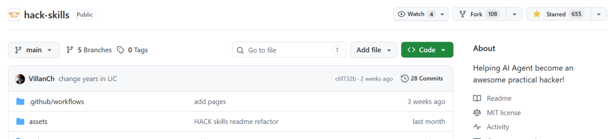

> 📎 来源: [进击的HACK](https://mp.weixin.qq.com/s?__biz=MzkxNjMwNDUxNg==&mid=2247490060&idx=1&sn=c658f1851ee0468a255ee1159b133d20&chksm=c029027723470a78c37e40cbf125b7a63a984ee01c84b42dfe055f3058ce662c5c1534b508f0&mpshare=1&scene=1&srcid=05227eesOTkYXJoSCxAo2kwA&sharer_shareinfo=5336a9a01cb8995754dc8536adc538e1&sharer_shareinfo_first=5336a9a01cb8995754dc8536adc538e1) | 时间: 2026-05-22 22:35

---

> 字数 934，阅读大约需 5 分钟

## 前言

一套智能体专属技能知识库，囊括网页安全、应用程序接口安全、身份鉴权与访问授权、多操作系统权限提升（Linux/Windows/ 苹果系统）、活动目录域攻防、移动端安全、二进制漏洞利用（Pwn）、逆向分析、密码体系攻击、区块链及智能合约安全、人工智能 / 机器学习与大语言模型安全、网络协议渗透与内网横向跳转、电子数据取证；专为漏洞赏金挖掘、合规渗透测试、CTF 夺旗竞赛及合法授权安全研究量身打造。

项目地址：https://github.com/yaklang/hack-skills



## 快速安装

通过命令行一键安装核心技能库：

```
npx skills add yaklang/hack-skills
```

也可直接拉取单个技能文件（如核心主入口）：

```
https://raw.githubusercontent.com/yaklang/hack-skills/main/skills/hack/SKILL.md
```

## 核心定位

针对 Agent 场景的**安全知识提炼层**——将零散的安全技术、Payload、攻击方法，浓缩为结构化、场景化的技能条目，覆盖 14 个核心安全领域：

- Web 安全、API 安全、身份认证与授权
- 操作系统提权（Linux/Windows/macOS）、Active Directory 攻击
- 移动安全、二进制漏洞利用（Pwn）、逆向工程
- 密码学攻击、区块链&智能合约安全、AI/ML & LLM 安全
- 网络协议&内网穿透、数字取证

## 知识组织方式

采用**三级分层结构**，兼顾「全局路由」和「深度细节」：

| 层级 | 作用 | 典型技能示例 | 使用场景 |
| --- | --- | --- | --- |
| 主入口 | 全局路由、测试阶段评估、跨类别切换 | ``` hack ```   （核心主入口） | 新目标、未知攻击面 |
| 分类入口 | 按攻击面路由到稳定的技术家族 | 侦察（recon-for-sec）、API 安全（api-sec）、认证安全（auth-sec）等 6 个分类 | 明确攻击面后（如发现 API 接口、登录功能） |
| 深度主题 | 完整的攻击手册、执行细节 | XSS、SQLi、AD 权限滥用等 101 个深度技能 | 需深入某一具体漏洞/攻击手法 |

所有技能均遵循统一目录规范：

```
skills/{语义化标识}/SKILL.md
```

，避免碎片化，聚焦 Loader 真正需要的核心内容。

## 访问与使用方式

项目提供三种同步更新的访问形式，适配不同工作流：

1. 1. **Web 界面**（https://skills.hackbenchmark.com）：纯前端静态站点，支持模糊搜索、分类/优先级筛选、复制安装命令、加密 ZIP 下载，无追踪、无后端；
2. 2. **GitHub 源码**：直接查看每个技能的 

   ```
   SKILL.md
   ```

    原始 Markdown 内容，支持 PR 贡献、离线深度阅读、差异审查；
3. 3. **加密 ZIP 包**：AES-256 加密（公开密码：hack-skills），包含所有技能 Markdown 文件，适配无网络/防病毒软件拦截的离线场景。

### 提炼原则

- 不直接复制大字典/完整 Payload 列表，聚焦「可路由、可组合、可审计」的技能；
- 用小而稳定的样本、分类体系、交叉引用提升 Agent 在实战中的稳定性；
- 无客户/厂商敏感信息，纯教育性方法论。

## 核心价值

1. 1. **标准化**：统一的技能目录结构，降低知识检索和集成成本；
2. 2. **场景化**：按实战攻击面（侦察、API、认证、注入、文件操作等）分类，贴合真实渗透流程；
3. 3. **轻量化**：聚焦核心有用内容，避免信息过载，适配 Agent 快速加载和执行；
4. 4. **多形态**：Web/源码/ZIP 多端同步，适配在线查询、离线使用、协作贡献等不同场景。

简言之，Hack.SKILLS 是将分散的安全知识「结构化、场景化、工具化」的一站式技能库，旨在提升安全从业者在漏洞挖掘、渗透测试、CTF 等场景下的效率和成功率。
