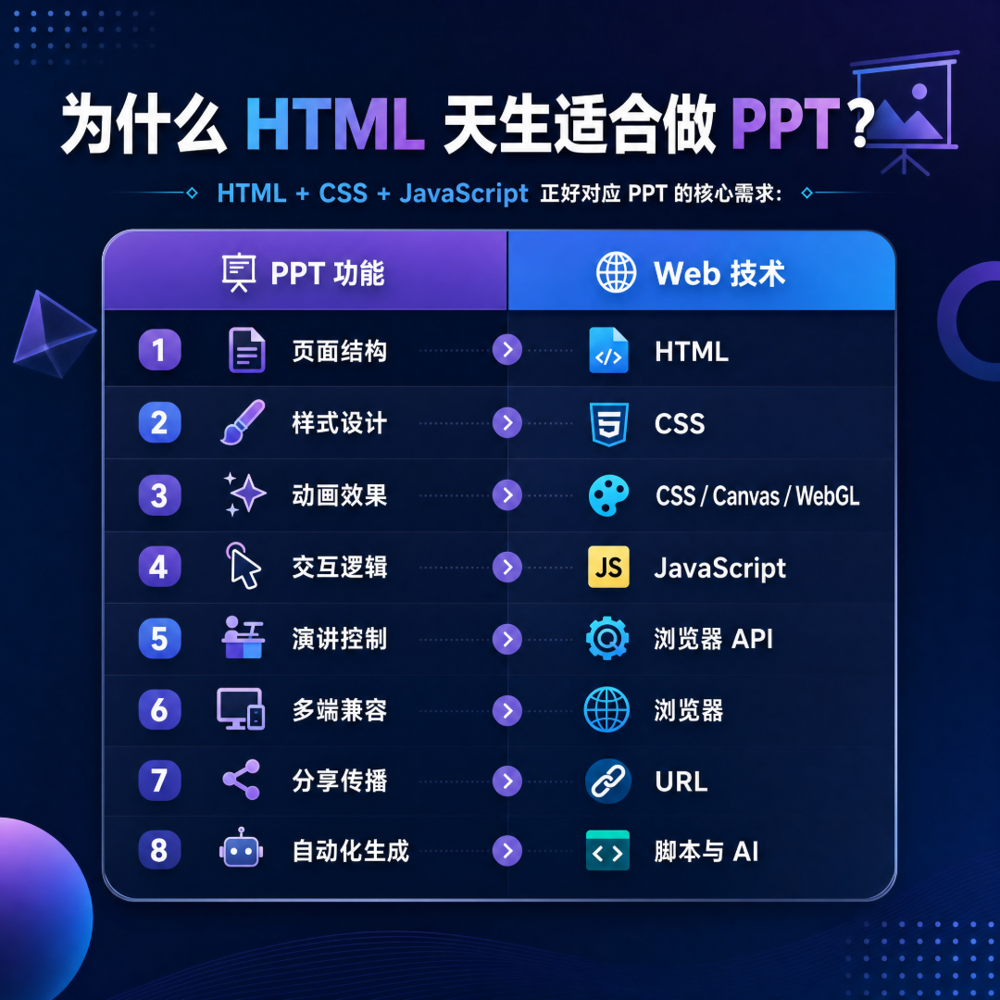
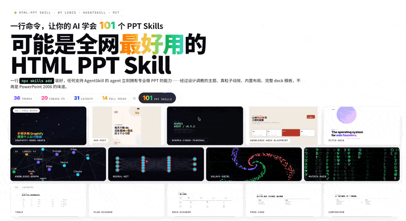
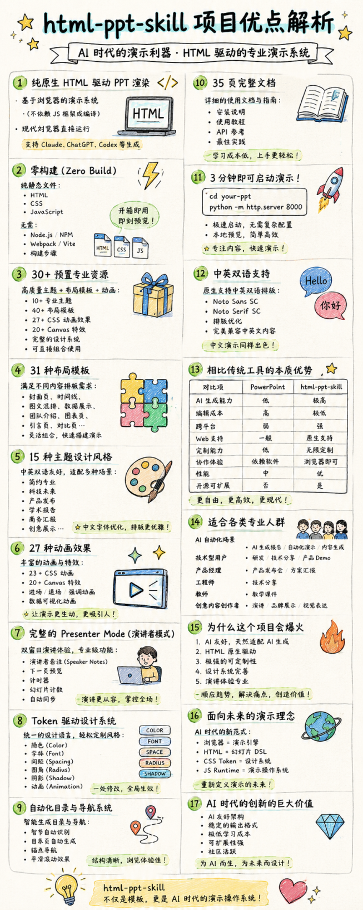

> 📎 来源: [智械日志](https://mp.weixin.qq.com/s?__biz=MzI0NzgwNDQwMg==&mid=2247485045&idx=2&sn=95ac5519339656cc9c7576cdd927723d&chksm=e8120be30b5dcd84422966eea805e6af6a24f999d8dcf02bce7c6032b0d41d3c72fad3b83c60&mpshare=1&scene=1&srcid=05134RaT662zkbNkJ5SflWRE&sharer_shareinfo=616a12a8315e5284f359ad3dedde5268&sharer_shareinfo_first=616a12a8315e5284f359ad3dedde5268) | 时间: 2026-05-13 01:58

---


## ai时代，ppt的未来肯定是html！

很多人认为 PPT 是一种文件格式，但从本质上看，PPT 其实是信息组织、视觉排版、动画与交互、演讲辅助、输出与传播。这些能力，本质上都可以由 Web 技术天然实现。

##



这么看来，演示文稿本质上就是一个多页面的前端应用而已。而html还有更多的优势：

## 1. AI 原生、AI 最擅长生成代码和结构化文本。

## 2. 可编程、可以像软件一样复用、组合和自动化。

## 3. 可部署直接发布到网站。

## 5. 可扩展，可接入图表、3D、实时数据等能力。

## 6. 响应式，适配不同设备和比例。

我在这里推荐给大家一个html-ppt-skill，这个是真正意义上的ai原生PPT系统。一句话就能搞定专业的演示文稿。而且审美极佳。

https://github.com/lewislulu/html-ppt-skill

一键安装命令：

```
npx skills add https://github.com/lewislulu/html-ppt-skill
```





#html
