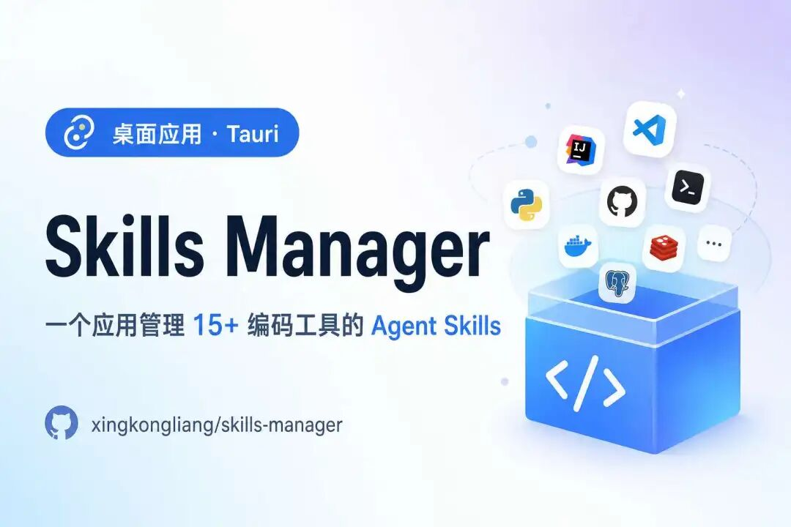
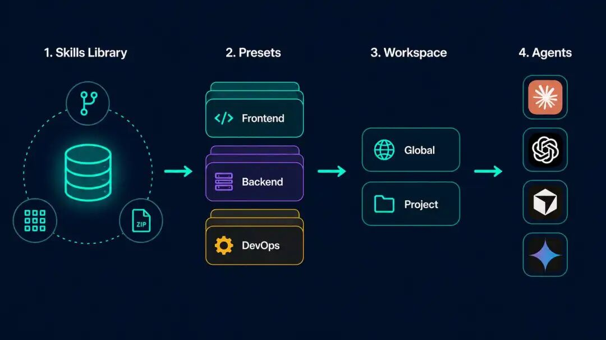
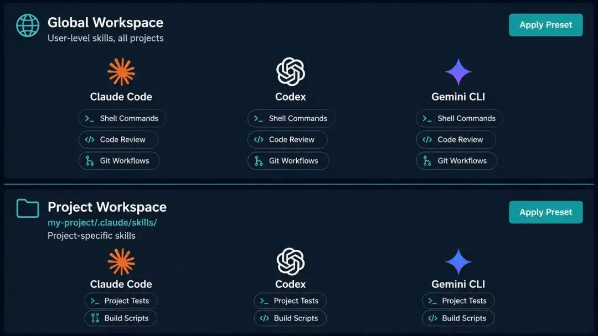
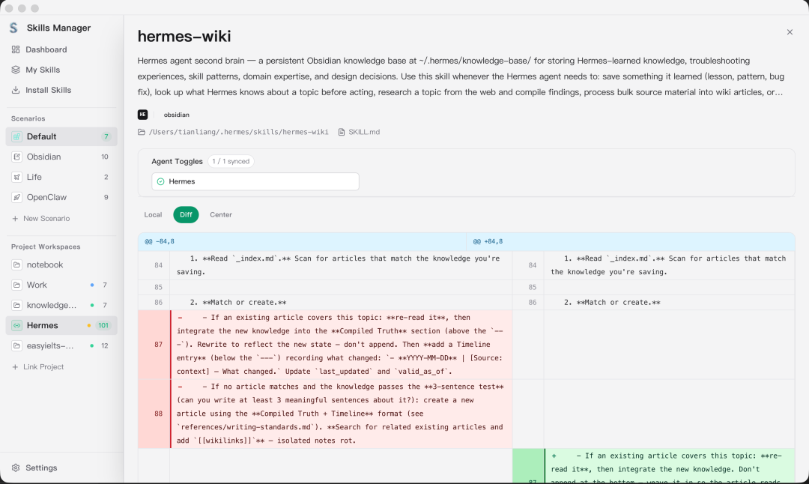

> 📎 来源: [效能跃迁实验室](https://mp.weixin.qq.com/s?__biz=MzYzOTE4NzgxNQ==&mid=2247484443&idx=1&sn=46d9c019250702a0466ab89410fa1fc4&chksm=f139b1aff310d15b8a47d1cb61c0fbb9cd6b5fcdb32a6f2d04956892fd5924ba21fd1ff0b8bc&mpshare=1&scene=1&srcid=0524TMvakuvOGiqXnFldklzu&sharer_shareinfo=4cdfcedb3708a071f7fec8ffb1bd89d8&sharer_shareinfo_first=4cdfcedb3708a071f7fec8ffb1bd89d8) | 时间: 2026-05-24 12:31

---

先放链接：

```
https://github.com/xingkongliang/skills-manager
```

**skills-manager** 是一款 **跨平台桌面应用**（Tauri 2 + React + Rust），口号是「**一个应用，统一管理所有 AI 编码工具的 Skills**」。



---

## Skills Manager 是什么

一句话：**把分散在各 Agent 目录里的 Skills，收进一个中央技能库，再用图形界面安装、分组、同步到 Cursor / Claude Code / Copilot 等 15+ 工具。**

默认中央库在 \*\*

```
~/.skills-manager
```

\*\*（可在设置里改路径）。你从 Git、本地文件夹、

```
.zip
```

 / 

```
.skill
```

 压缩包，或应用内 **Marketplace** 把 skill 装进这个库；再通过 **软链接或复制** 一键同步到各工具的全局目录或项目目录。

应用内还可预览 

```
SKILL.md
```

、打标签、检查 Git 来源更新，并用 **Git 备份**

```
skills/
```

 目录实现多机同步。

它不编写 skill 正文，而是做 **库管理 + 多工具分发**，适合长期维护一套个人或团队的技能资产。

---

## 主要解决谁的痛点

- **工具多、路径乱**：Cursor、Claude Code、Codex、Windsurf 等各自一套 

  ```
  skills
  ```

   目录，手工拷贝容易漏、版本不一致。
- **想有「我的技能库」**：希望先集中收纳，再按需装到某个 Agent 或某个项目，而不是每次从零找仓库。
- **需要 Preset（预设）**：例如「前端套件」「安全审计套件」一键给当前 Agent 挂上/卸下整组 skill。
- **项目级与全局要分开管**：项目工作区只看当前 repo 下的 

  ```
  .cursor/skills
  ```

   等，并能和中央库 **双向同步**。
- **需要图形化操作**：Marketplace 浏览、卡片上点 Agent 角标安装、批量启用/禁用。

---

## 能力一览

| 能力 | 说明 |
| --- | --- |
| 统一技能库 | 默认 `~/.skills-manager`，集中存放已安装 skill |
| 安装来源 | Git、本地目录、压缩包、应用内 Marketplace、可选 SkillsMP AI 搜索（需 API Key） |
| Preset | 命名技能组；在工作区点 Preset 标签批量激活/停用（**一次性复制，非实时订阅**） |
| 全局工作区 | 按 Agent 查看其全局目录里**实际存在的**全部 skill（含非本应用安装的） |
| 项目工作区 | 管理某项目下各 Agent 的本地 skill，与中央库双向同步 |
| 多工具同步 | 软链接或复制；skill 卡片上 per-Agent 角标显示/切换安装状态 |
| 标签与筛选 | 按来源、标签筛选；批量启用/禁用、导出、删除 |
| Git 备份 | 对 `skills/` 子目录做版本历史；支持远程 push/pull 与快照恢复 |
| CLI | `skills-manager-cli` 与桌面共用 Rust 核心，适合脚本与 Agent 自动化 |

支持工具（内置）：Cursor、Claude Code、Codex、OpenCode、Amp、Kilo Code、Roo Code、Goose、Gemini CLI、GitHub Copilot、Windsurf、TRAE IDE、Antigravity、Clawdbot、Droid 等；可在设置里 **添加自定义工具路径**。

---

## 核心概念（工作区怎么理解）

仓库 README 用概念图说明「中央库 ↔ Agent ↔ 项目」关系



简要对应：

- **Preset**：可复用的 skill 分组；激活 = 把这一组复制到当前选定的 Agent 范围，**不是**云端实时联动。
- **全局工作区**：管 

  ```
  ~/.claude/skills/
  ```

  、

  ```
  ~/.cursor/skills/
  ```

   这类 **用户级** 目录。
- **项目工作区**：管当前项目里的 **项目级** skill 目录。
- **关联工作区**：把任意目录指成 skill 根，适合非默认路径的合集。

整体数据流可参考：



---

## 界面长什么样



侧边栏常见入口：**安装 Skills（Marketplace）**、**全局工作区**、**Agent 工作区**、**项目工作区**、**设置** 等（中英文界面可在设置切换）。

---

## 怎么安装、怎么用（极简版）

**普通用户（推荐）**：到 Releases 下载对应系统的安装包（如 macOS 

```
.dmg
```

 / Windows 安装程序）。macOS 首次打开若被 Gatekeeper 拦截，README 说明可 **右键 → 打开**，或按版本执行 

```
xattr -cr
```

（见仓库「常见问题」）。

**开发者本地跑**：

```
git clone https://github.com/xingkongliang/skills-manager.gitcd skills-managernpm installnpm run tauri:dev
```

**上手路径（与 README 一致）**：

1. 从本地 / Git / 压缩包 / Marketplace 安装若干 skills 到中央库。
2. 打开 **全局工作区**，选一个 Agent（如 Cursor）。
3. 点 **Preset** 标签，一键挂上预设里的 skills。
4. 若要管某仓库的项目级 skill，进 **项目工作区**。
5. 需要多机同步：在 **设置** 配 Git 远程，在 **我的 Skills** 里 **开始备份 / 同步到 Git**。

**CLI（可选）**：

```
npm run cli:install
```

 将 

```
skills-manager-cli
```

 装到 

```
~/.cargo/bin
```

；与桌面应用 **共用 SQLite**，CLI 改库后需重启或刷新桌面端。

---

## 开源与社区

- **许可证**：MIT
- **仓库**：https://github.com/xingkongliang/skills-manager
- **中文 README**：README.zh-CN.md
- Star / Issue 数以仓库页为准。

---

## 使用边界

- **Skill 内容安全**：应用不审计第三方 skill 脚本；从 Marketplace 或 Git 安装前请自行阅读 

  ```
  SKILL.md
  ```

   与仓库文件。
- **Preset 非实时同步**：改 Preset 或中央库后，已复制到 Agent 目录的内容不会自动全部回滚，需按应用内流程再操作。
- **CLI 与桌面并发**：共用数据库，CLI 写入后桌面端需刷新或重启。
- **macOS 签名**：未 Apple 公证，首启可能需按 README 处理 Gatekeeper。

---

## 延伸阅读

- Skills Manager 仓库：https://github.com/xingkongliang/skills-manager
- 最新 Release：https://github.com/xingkongliang/skills-manager/releases
- 中文说明：https://github.com/xingkongliang/skills-manager/blob/main/README.zh-CN.md
- AgentSkills 约定：https://agentskills.io

往期硬核推荐：

|  |
| --- |
| [【AI提效】去 AI 味：HumanTone、Humanizer等 5 款在线人性化改写工具横评（附截图）](https://mp.weixin.qq.com/s?__biz=MzYzOTE4NzgxNQ==&mid=2247484365&idx=1&sn=46dfc35db858eb89e9074b9019316111&scene=21#wechat_redirect)  [【AI提效】产品经理10 分钟装上 Superpowers：做这三件事，用七步工作流让 AI 编码更靠谱](https://mp.weixin.qq.com/s?__biz=MzYzOTE4NzgxNQ==&mid=2247484135&idx=1&sn=b4c9ed23dc5ef7e4901ab1aa211e4bf3&scene=21#wechat_redirect)  [彻底告别PPT，用AI一段话一分钟直接生成的HTML网页效果更好](https://mp.weixin.qq.com/s?__biz=MzYzOTE4NzgxNQ==&mid=2247484073&idx=1&sn=51fc7de6cc8ea210ae7ce2f017396764&scene=21#wechat_redirect)  [AI可替代岗位自测表！ Anthropic：排名第一的是程序员，75%的工作已AI化](https://mp.weixin.qq.com/s?__biz=MzYzOTE4NzgxNQ==&mid=2247483915&idx=1&sn=a9ca76d1356783159c8b6edc7a82ad9d&scene=21#wechat_redirect)  [EasyClaw：免费且一键界面化部署的OpenClaw，自动生成每日AI简报发至企业微信，附提示词](https://mp.weixin.qq.com/s?__biz=MzYzOTE4NzgxNQ==&mid=2247483907&idx=1&sn=5f536650fcb03172a3f9931f13fe0643&scene=21#wechat_redirect)  [Github上最全的CVE漏洞利用PoC合集，持续更新至2026年](https://mp.weixin.qq.com/s?__biz=MzYzOTE4NzgxNQ==&mid=2247483874&idx=1&sn=63c652c8e4159ac87638496698c7aee3&scene=21#wechat_redirect)  [SudoAI - 一句话完成渗透测试的AI安全智能体](https://mp.weixin.qq.com/s?__biz=MzYzOTE4NzgxNQ==&mid=2247483865&idx=1&sn=da82a7efa5208a94163b2ff108e034d0&scene=21#wechat_redirect)  [【AI提效】如何找到想要的skills 前端｜后端｜设计｜测试](https://mp.weixin.qq.com/s?__biz=MzYzOTE4NzgxNQ==&mid=2247483857&idx=1&sn=7592345feab351b3571e5e2599ec7254&scene=21#wechat_redirect)  [【AI提效】阿里开源：基于57 个专业提示词框架的提示词优化插件](https://mp.weixin.qq.com/s?__biz=MzYzOTE4NzgxNQ==&mid=2247483839&idx=1&sn=8214bc748a6ffe6706f317a7bc8cf8ae&scene=21#wechat_redirect)  [【AI提效】告别手搓技术架构图，开源excalidraw已接入Skills](https://mp.weixin.qq.com/s?__biz=MzYzOTE4NzgxNQ==&mid=2247483825&idx=1&sn=90cb18e24ee54cbb39bdf523e7539d03&scene=21#wechat_redirect)  [【AI提效】AI工具大全，不用到处找AI工具啦](https://mp.weixin.qq.com/s?__biz=MzYzOTE4NzgxNQ==&mid=2247483784&idx=1&sn=6d101f46c587ea63803f987019a091f4&scene=21#wechat_redirect)  [【AI提效】GetDraft：你的AI写作团队](https://mp.weixin.qq.com/s?__biz=MzYzOTE4NzgxNQ==&mid=2247483751&idx=1&sn=b4f33598a1f228741a60f3f608f1b141&scene=21#wechat_redirect)  [【AI提效】KIMI更新 一句话生成PPT 效果惊艳](https://mp.weixin.qq.com/s?__biz=MzYzOTE4NzgxNQ==&mid=2247483740&idx=1&sn=3d673c16405667c82ae7cc344e6d9d19&scene=21#wechat_redirect)  [【AI提效】一键生成可编辑图表和PPT：Napkin AI](https://mp.weixin.qq.com/s?__biz=MzYzOTE4NzgxNQ==&mid=2247483709&idx=1&sn=70b4361438b5a0a58a713abaadf958f3&scene=21#wechat_redirect) |
