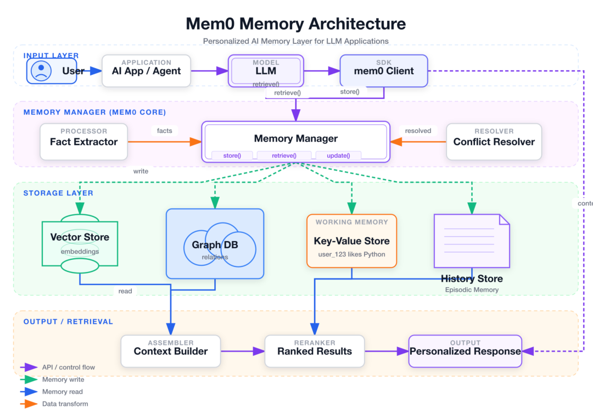
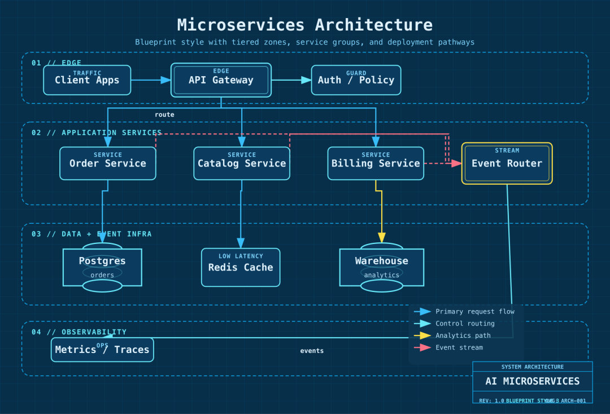
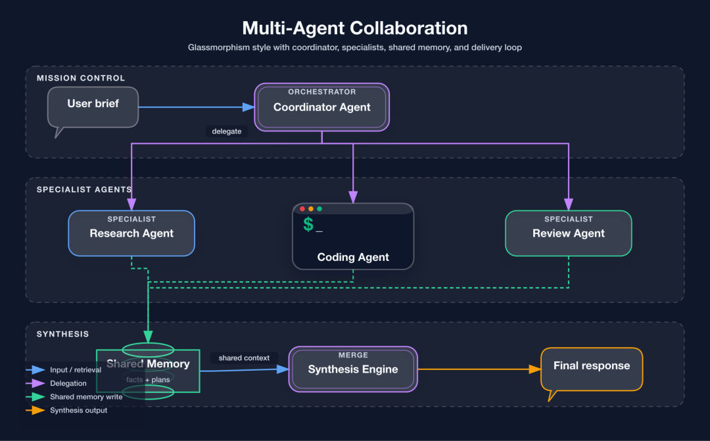

> 📎 来源: [物联网星球](https://mp.weixin.qq.com/s?__biz=MzkzMDQ0MjE3Mg==&mid=2247501872&idx=1&sn=32f80658d3ed68ea2f80d7b25f54554f&chksm=c3b17533bdbdb91c10771a0e00a0c128519685b421fd47c0f55d6d19276d1811672820fd1d72&mpshare=1&scene=1&srcid=0501wtyv8bYmK6cFKR6FEzce&sharer_shareinfo=1661173ff12dd6bb466d643213931afa&sharer_shareinfo_first=1661173ff12dd6bb466d643213931afa) | 时间: 2026-05-01 12:13

---

还在为熬夜画架构图感到崩溃？Draw.io 里拖框框拖到凌晨两点，Mermaid 语法写了一行又删一行……这些场景，做技术的你一定不陌生。

今天给大家安利一个开源神器：**fireworks-tech-graph**，一个 Claude Code 的 Skill，能让你**用一句话直接生成高清架构图**，SVG+PNG 双格式输出，画图从此不再焦虑。

核能亮点一：7 种视觉风格，从极简白到赛博暗

不同于多数画图工具只有一种默认风格，fireworks-tech-graph 内置了 7 种专业视觉风格，每种都精心打磨：

•

**风格 1 · Flat Icon**：纯净白底 + Helvetica 字体，适合博客、PPT、产品文档

•

**风格 2 · Dark Terminal**：深色终端风 + 霓虹色点缀 + 等宽字体，GitHub README 绝配

•

**风格 3 · Blueprint**：蓝图工程风 + 青色线条 + 网格背景，架构文档首选

•

**风格 4 · Notion Clean**：极简白 + 单色强调，Notion、Confluence 即插即用

•

**风格 5 · Glassmorphism**：毛玻璃卡片 + 暗色渐变背景 + 柔光效果，产品官网、Keynote 逼格拉满

•

**风格 6 · Claude Official**：暖米色底 + Anthropic 品牌色，优雅克制

•

**风格 7 · OpenAI Official**：纯白 + 绿色强调线，干净现代



每种风格不是简单的「换个配色」，而是从字体、间距、容器样式到箭头语义的完整设计体系。比如你说「画一张 Agent 架构图，玻璃态风格」，它马上输出带毛玻璃卡片、柔光渐变、多层代理结构的专业大图——这质感，手动画两小时都不一定调得出来。

核能亮点二：14 种图类型 + AI/Agent 领域深度覆盖

你以为它只能画架构图？错了。它支持的图类型覆盖了几乎你能用到的全部场景：

**UML 全家桶（14 种全覆盖）：**
类图、组件图、部署图、包图、组合结构图、对象图、用例图、活动图、状态机图、时序图、通信图、时序图、交互概览图、ER 图

**AI/Agent 领域专属模式：**

•

RAG 流水线架构

•

Agentic Search 检索流程

•

Mem0 记忆架构

•

多智能体协作架构

•

Tool Call 调用链路

•

五种记忆类型对比图

•

LLM 技术栈全景图

更绝的是，它内置了**语义形状词汇表**：LLM 自动渲染为双线框矩形、Agent 用六边形标识、向量数据库用环形圆柱体、数据流箭头自动按读/写/异步/循环分色。这些细节，手画时往往被忽略，但在这里全自动帮你搞定。

怎么用？对话即画图

使用方式极度简单，在 Claude Code 中直接对话即可：

•

「画一张 RAG 流水线架构图，暗黑终端风格」

•

「画一张微服务架构图，蓝图风格」

•

「画一张多 Agent 协作图，毛玻璃风格」

•

「画一张 OAuth2 授权码流程时序图」

•

「画一张 Kubernetes 部署架构图，输出到桌面」

完全不用写 DSL，不用记语法，脑子里的架构直接用话说出来，图就有了。SVG 可以继续编辑，PNG 直接拿来放到文档、PPT、文章里——1920px 宽度，哪里用都够。



和其他工具的对比感受一下：

| 能力 | Mermaid | Draw.io | fireworks-tech-graph |
| --- | --- | --- | --- |
| 自然语言输入 | ❌ | ❌ | ✅ |
| AI/Agent 领域模式 | ❌ | ❌ | ✅ |
| 多视觉风格 | ❌ | 手动 | ✅ 7 种内置 |
| 高清 PNG 导出 | ❌ | 手动 | ✅ 自动 1920px |
| 语义箭头配色 | ❌ | 手动 | ✅ 自动 |
| 离线可用 | ✅ | ❌ | ✅ |

Mermaid 适合 Markdown 里的快速内联图，Draw.io 适合需要精调的复杂图表，而 fireworks-tech-graph 最适合你只想**描述系统然后立刻拿到一张好看能用的图**。

安装一把梭

```
# 安装 Skill（推荐）npx skills add yizhiyanhua-ai/fireworks-tech-graph# macOS 需额外安装 rsvg-convert（用于 SVG 转 PNG）brew install librsvg# Ubuntu/Debiansudo apt install librsvg2-bin# 验证rsvg-convert --version
```

装完之后，直接在 Claude Code 里说「画张图」就能触发了。

赛博吴同学

以前画架构图这个事，真的是程序员的「体力活」——想法五分钟，画图两小时。fireworks-tech-graph 把这个过程压缩到了一句话：你描述系统，它生成图，干净利落。

它背后不只是简单的模板拼贴，而是内置了 AI/Agent 领域的专业知识编码——知道 RAG 有哪些关键组件、多 Agent 架构的标准分层、矿山物联网场景的典型物联网平台分层……这些领域知识，让它生成的图不只是「能看」，而是「专业」。

https://github.com/yizhiyanhua-ai/fireworks-tech-graph

从此画图再也不焦虑，一句话的事。

# 

## End

---

**往期推荐**

[产品推荐｜ThingsKit 物联网平台，2.0版本，项目交付首选IoT平台，支持源代码与镜像包交付](https://mp.weixin.qq.com/s?__biz=MzkzMDQ0MjE3Mg==&mid=2247501039&idx=1&sn=cf0d3543e6045a3c6525bcdc52acebbc&scene=21#wechat_redirect)

[Node-RED：开源的物联网与工业4.0的视觉化编排规则引擎，大厂都在用！](https://mp.weixin.qq.com/s?__biz=MzkzMDQ0MjE3Mg==&mid=2247501023&idx=1&sn=8ef2e509a04149b81cd534495d1e731b&scene=21#wechat_redirect)

[15k Star丨一个超漂亮的数据可视化大屏开源项目（MIT协议），IoT数据大屏应用首选](https://mp.weixin.qq.com/s?__biz=MzkzMDQ0MjE3Mg==&mid=2247500697&idx=1&sn=8d4a66a4996b4c10afd80ad0005dfa1d&scene=21&poc_token=HNATb2mjitylB4u0UbT6t9O5HXkFcKVhZiJ7YSww&token=1738189348&lang=zh_CN#wechat_redirect)

---

****

**关注「物联网星球、赛博吴同学」**

每日分享物联网、AI干货 | 开源项目 | 实战教程 | 实用工具
