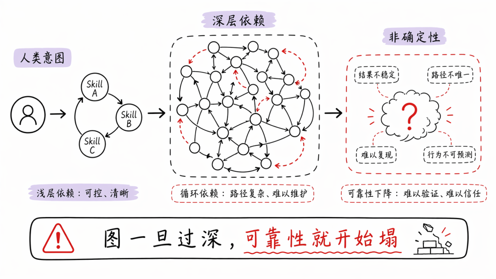
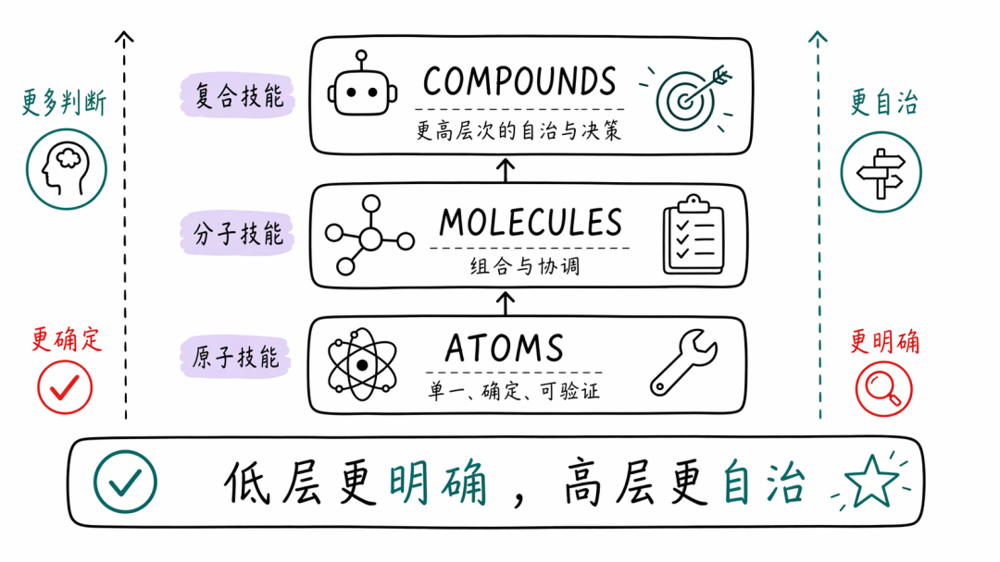
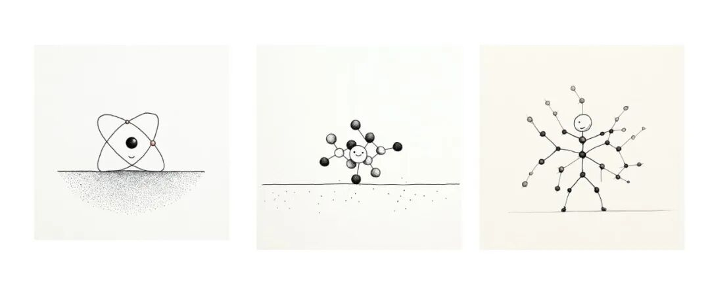
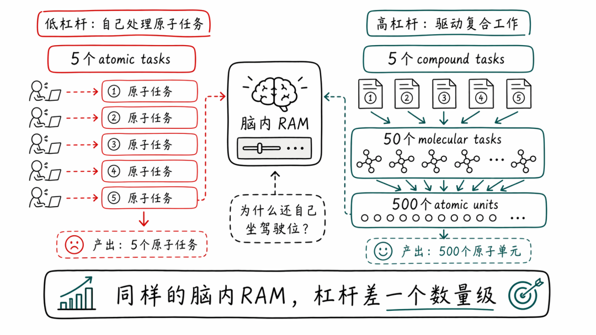
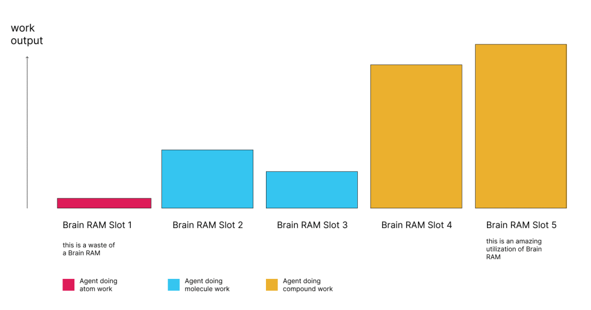
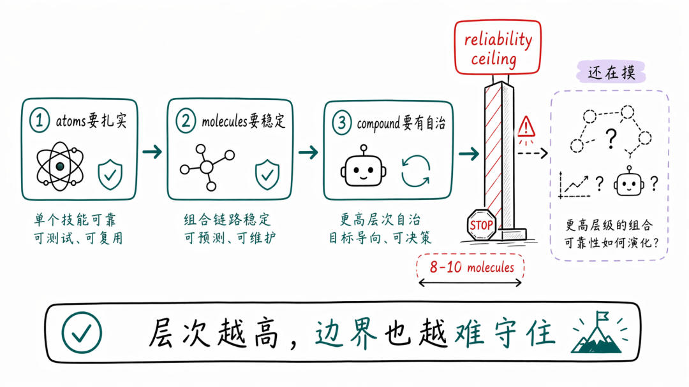
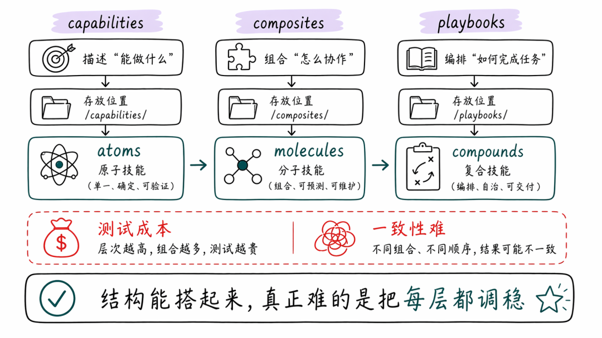

> 📎 来源: [AI的岔路口](https://mp.weixin.qq.com/s?__biz=MzI5NTg2OTk2Ng==&mid=2247485339&idx=1&sn=de044b3e4689235fd2d292fdba540c8f&chksm=ed1e75a8aa63362c69f57e65d2c023bec2b2559736a8ccf81c0f6165c94d21774c7a92d3aadb&mpshare=1&scene=1&srcid=0424ByUmxRGU003zSaGyqmMj&sharer_shareinfo=ebe65000a2486f3800f21b9da886c126&sharer_shareinfo_first=ebe65000a2486f3800f21b9da886c126) | 时间: 2026-04-24 21:54

---

最近我学到的一件特别有价值的事，就是如何思考“组合 skills”这件事，才能在工作里拿到更大的杠杆。

前阵子 skill graph 这个想法[1] 引起了不少兴趣。它的核心思路是：通过在 markdown 文件里把依赖技能互相链接起来，构建出一张 skill graph，就像你在 Obsidian 里把笔记互相连起来那样。

一个 skill，本质上就是把知识 + 过程编码进一个 markdown 文件里，必要时再附上一些 agent 可以反复调用的脚本。

所以直觉上，skill graph 当然很合理。只要你想把更大的流程，或者完整的岗位职能，编码成 skills，你大概率就会碰到 skills 依赖其他 skills 的情况。

举个例子，一个“起草营销邮件”的 skill，可能就会依赖一个平面设计 skill。

## Skill Graphs 到底会在哪儿失效

但问题在于：当你的 skill graph 大到一定程度之后，Agents 往往就没法稳定调用到某个深度之后的技能。依赖越多，可靠性通常就越差。（很多在 reddit 和 X 上实际尝试过这套东西的人，也都提到过这一点。）

如果 Skill A 明确写着“去调用 Skill B”，那通常还比较可靠。

但一旦图变得非常稠密，像维基百科那种感觉，依赖链深度可能会大得惊人。到了那一步，你基本没法确定最终到底会发生什么。

问题就在这里：一个本来带着明确意图的人类操作者，现在却要面对大量非确定性，同时还把一大截判断权交给 agent 处理，而且很可能交得过头了。

循环依赖也会是个麻烦。

那是不是说明这条路本身就是个伪命题？



当然不是。

> 组合 skills 这个底层想法仍然非常重要。只要你真的能把 skills 组合好，在任何类型的工作里，你都可能多解锁一个数量级的杠杆。

## 用另一种方式来组合 skills

我认为，解法不是放弃组合，而是换一种组合方式。

我是这样理解的：

> Skills 其实运行在不同层级上：atoms、molecules、compounds。
> 越高层的 skill，给 agent 的判断空间越大；越低层的 skill，给模型的执行流程越清晰。





## ATOMS

这是最底层的 atomic skills，也就是单一用途、边界狭窄的基础构件。

比如：

- 抓取 LinkedIn 资料
- 找竞品博客文章
- 在 Apollo 里找某个人
- 用 Hunter 验证邮箱
- 检查邮箱可投递性
- 研究一个主题
- review 这个 PR

这些东西应该非常可靠。最好接近确定性，至少要尽可能逼近 LLM 能做到的确定性上限。

atoms 通常根本不调用其他 skills。

## MOLECULES

molecules 负责解决更大的问题。

一个 molecule 可能会调用 2 到 10 个 atomic skills，来完成一个边界清晰的任务。

它应该非常明确地说明：什么时候调用哪些 atomic skills、按什么顺序调用。

它给 agent 的判断空间会比 atoms 更大，但仍然尽量把“什么时候用哪个 skill”写清楚，这一点会非常有帮助。

也就是说，你要尽可能把组合逻辑压进 skill 自己内部，把 agent 在运行时临时拍脑袋做决策的空间降到最低。

molecules 也应该非常可靠。比如说：

1. 1. 一个结构化工作流，把若干 atoms 串起来。

> 先用 atom-1 和 atom-2 找 leads -> 再用 atom-3 做资格筛选，用 atom-4 做信息补全 -> 最后用 atom-5 把它们写进我的表格。

1. 2. 一个知道 5 个 atoms 的 orchestrator，它会用自己的判断力，把这些 atoms 组合起来解决用户的 prompt。

当然，也可能还有其他结构。

到了这一层，agent 的判断力和自治程度天然会比 atoms 更高，但我们仍然是在尽量把流程写明确。

## COMPOUNDS

compounds 是更高一层的 orchestrators，它们会同时调度多个 molecules。

比如：

- “跑一遍 outbound sales playbook”
- “规划并构建这个功能，然后做 review 和 QA”

到了这一层，你才算是真的把比较有分量的自治权交给了 agent。

这类东西天然会更不确定，因为 agent 需要做判断的层次已经太多了。

而且它们也是最难真正做对的那一层，大概率仍然需要一个人类来驾驶。

对，至少在今天，compound 层大概率还是需要人类来驾驶。

## 杠杆与脑内 RAM

每往上一层，杠杆大概都会再抬一个数量级。也就是说，如果你驾驶的是 compounds，而不是 atoms，你的产出可能会直接多 100 倍。

原因很简单。

你脑子的 RAM，也就是你同时把多个任务维持在记忆里、并有效切换上下文的能力，已经成了真正的瓶颈。

假设这样一个场景：

你的脑内 RAM 最多允许你同时在 5 个 agents 之间来回切换。

再假设：

- 1 个 compound 能可靠地编排 10 个 molecules
- 1 个 molecule 又能可靠地编排 10 个 atoms

> 如果你还亲自开着 agents 去做 atomic work，本质上就是用 1 个脑内 RAM 槽位去盯一个低杠杆任务，因为这类工作本来就接近确定性。
> 你的车都已经有 full self-driving 了，你为什么还非要自己坐在驾驶位上？

但如果你在并行驾驶 5 个 agents，让它们去完成 molecule 或 compound 层的工作，那就是：

- 5 个 compound tasks
- 50 个 molecular tasks
- 500 个 atomic units of work

> 对你的脑内 RAM 和时间来说，并行执行 5 个 atomic tasks，和并行执行 5 个 compound tasks，消耗其实差不了太多。





> 在相同的时间和脑内 RAM 消耗下，如果你驾驶的是 atomic work 还是 compound work，最终产出会差得非常夸张。

这里其实很像一家公司里的 CTO。一个管着 1000 名员工的 CTO，不可能自己下场修每一个 bug。他能相信 ICs 稳定地把那类工作做完。

## 这套东西还会在哪儿失效（我还在摸）

当然，这套方法真正成立的前提是：

- 每个 atom 都得足够扎实
- molecules 得能稳定地把它们串起来
- agent 在 compound 层得有足够自治权，才能真的做决策

你的判断力，其实应该落在 compound 层，或者更高。

至于这套方法还会在哪儿继续坏掉，我也还在摸。

我的猜测是：一旦某个 compound 横跨超过 8 到 10 个 molecules，它本身也会撞上新的可靠性上限。



再往后，compounds 迟早也会变得“足够好”，以至于我们又得发明比它更高一层的抽象。

我现在还没走到那一步。

我目前仍然在亲自驾驶 molecules 和 compounds，而即便只是这样，也完全谈不上轻松。

> 但目标很明确：在每一条工作流上，都不断往更高层移动。

我们把自己的 skills library[2] 也按 atoms / molecules / compounds 这个结构搭起来了，目前感觉还不错。

我们给它们起的名字是：

- capabilities（atoms）
- composites（molecules）
- playbooks（compounds）



到目前为止，这套东西运行得挺不错。

## 最大的挑战

真正难的地方在于：每一层 skills 的可靠性 / 一致性，其实都不容易做好，而测试这些 skills 本身又非常花时间。

我猜某种 autoresearch 类型的方案，也许能帮忙解决这个问题，但我自己还没把它用于这一题。希望很快能试上。

## Thread

### 1

https://x.com/shivsakhuja/status/2047219549863555285

这里补几件我在正文里没展开写的事：

1. 1. Context bloat 也许是个问题，但 skill frontmatter 大概只有 100 tokens，而 Opus 的上下文窗口是 1M tokens，所以在 30 到 100 个 skills 这种现实规模下，这到底是不是个真问题，我其实也还没完全确定。
2. 2. 不过话说回来，我并不会把所有 atomic skills 都放在

   ```
   .claude
   ```

    里（避免它们被误触发）。如果我真的需要用某个 atom，它们会放在另一个我可以很容易搜索、或在 prompt / molecule skill 里显式引用的目录。
3. 3. 通常我会显式调用 molecule 或 compound orchestrators 来驱动工作。比如：用

   ```
   /product-planning
   ```

    来启动一个新功能的规划流程。
4. 4. 再比如：在规划一个新 feature 时调用

   ```
   /product-planning
   ```

   。但它内部依然会利用其他 skills，比如查数据库、查 Mixpanel、看用户反馈渠道，等等。

我不想在一堆地方反复重写“怎么查 Mixpanel”这套逻辑（DRY）。

### 2

https://x.com/shivsakhuja/status/2047225060344418741

如果有人想看看这种结构真实长什么样，这里有个 repo： https://t.co/oHlASETBkv

#### 引用链接

```
[1]
```

 skill graph 这个想法: *https://x.com/arscontexta/status/2023957499183829467?s=20*

```
[2]
```

 skills library: *https://skills.gooseworks.ai/*
