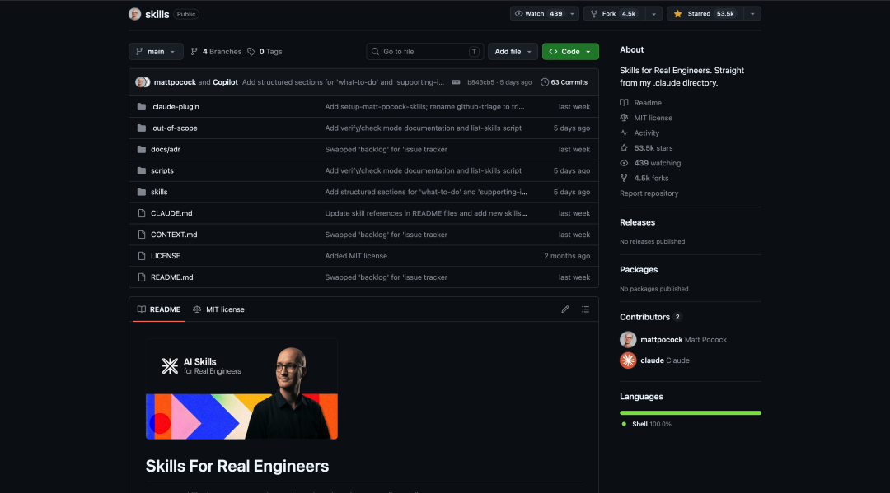

> 📎 来源: [小九 AI 观察笔记](https://mp.weixin.qq.com/s?__biz=MzI5MzA0MzUyNg==&mid=2247484145&idx=1&sn=967ab83bc7006b4d8167d5b27f0c1116&chksm=ede895f26878a92084db233de57963ef5f203bfb691fc3c5f26e253df67483162fb5629fb1c9&mpshare=1&scene=1&srcid=0509BRUC6XgAe3CesN8B4bpN&sharer_shareinfo=f3124e7f8122c9a7cb46a8393f4fba76&sharer_shareinfo_first=f3124e7f8122c9a7cb46a8393f4fba76) | 时间: 2026-05-09 23:16

---

如果你最近一直在看 AI 编程工具，很容易产生一种错觉：只要模型够强，提示词够长，开发效率自然会一路上升。

但真正下场做项目的人，很快会遇到另一面现实。模型确实能更快地产生代码，却也能更快地产生误解、冗长、错误和混乱。速度上去了，熵也一起上去了。很多团队的问题，不是“AI 不会写”，而是“AI 写得太快，以至于把坏流程也一起放大了”。

这也是为什么我觉得 mattpocock/skills 这个项目值得单独拿出来讲。



它表面上看，是一组给 AI coding agent 使用的 skills；但如果你顺着 README、

```
CONTEXT.md
```

、几份核心 

```
SKILL.md
```

 读下去，会发现 Matt Pocock 其实在做另一件更重要的事：他在把那些原本只存在于资深工程师脑子里的工作方法，重新封装成一套可复用、可组合、可传递给 agent 的工程技能层。

这不是“怎么把 AI 用得更花”，而是“怎么让 AI 回到工程实践中”。

## 这个项目到底是什么？

先说最直观的一层。

```
mattpocock/skills
```

 的 GitHub 首页把它定义得很直接：这是 “Skills for Real Engineers”，并且强调这些 skill 是 Matt 自己每天在真实工程里使用的，不是拿来做 “vibe coding” 的花活。README 里还特别说明，这套东西来自他的个人 

```
.claude
```

 目录，后来整理成公开仓库，方便别人安装、选择和改造。

截至 **2026 年 5 月 5 日**，这个仓库在 GitHub 上显示约 **59.6k stars**、**5.1k forks**。

从形式上看，它符合 GitHub 现在对 Agent Skills 的官方定义。GitHub 文档把 agent skill 描述为一组可以按任务场景被自动加载的 instructions、scripts 和 resources，本质上是让 agent 在特定问题上“知道该怎么做、去哪找上下文、遵守什么工作方式”。也就是说，skill 不是人格设定，不是长期系统提示，而是按需触发的、任务级的能力包。

Matt 的项目，正是把这个机制用在了软件工程的核心痛点上。

所以，如果你把它理解成“提示词仓库”，理解就浅了。更准确一点说，它是一套围绕 AI 协作的软件工程流程框架。

## 它最有价值的地方，不是技能数量，而是问题定义非常准

这个项目最强的一点，在 README 的 “Why These Skills Exist” 里说得很透。

Matt 不是从“我能给 agent 增加什么能力”开始讲，而是从“AI 编程最常见会在哪些地方失败”开始讲。这种切法很重要，因为它决定了整个仓库不是功能导向，而是故障模式导向。

他大致拆了四类失败：

第一类，**agent 没有做你真正想做的事**。

这其实不是 AI 独有问题，而是软件开发的老问题：需求对齐失败。人和人协作会出这个问题，人和 agent 协作一样会出。于是他给出的解决方案不是“把需求写得更长”，而是让 agent 先反过来盘问你，也就是 

```
grill-me
```

 和 

```
grill-with-docs
```

 这类 grilling session。

第二类，**agent 太啰嗦，而且说不到点上**。

这个问题在团队里也很常见。业务方、产品、开发者、AI agent 讲的不是同一种语言，于是一个本来可以一句话说清的东西，最后要绕二十句。Matt 的判断是，要解决这个问题，不靠“压缩输出”，而要靠“共享语言”。于是项目里专门有 

```
CONTEXT.md
```

 这种文档，用来定义术语、边界和项目内部的语言约定。

第三类，**代码能生成，但跑不起来，或者质量不稳定**。

这个问题背后不是模型能力不足，而是反馈回路太弱。README 里明确提到：如果 agent 缺少静态类型、浏览器访问、自动化测试这些反馈，它就是在盲飞。于是 

```
tdd
```

 skill 被放在一个很核心的位置，用 red-green-refactor 让 agent 在更短反馈回路里工作。

第四类，**AI 把代码库越写越乱，最后变成 ball of mud**。

这是我认为最值得中国开发团队警惕的一类问题。因为 AI 最容易给人制造一种错觉：提交变快了，项目就在进步。可真实情况恰恰可能相反，功能推进变快时，架构熵增也会更快。Matt 在 README 里写得很明确：agents can radically speed up coding, but they also accelerate software entropy。这个判断非常硬，也非常准。

你会发现，这四类问题几乎就是今天所有 AI 编程团队都会遇到的四连击。也因此，这个项目真正卖的不是某个 skill，而是对问题的切分能力。

## 为什么  ``` grill-with-docs ```  这类 skill 很关键？

如果只挑一个最能代表这个仓库思想的 skill，我大概率会选 

```
grill-with-docs
```

。

它的描述很有代表性：不是单纯提问，而是“挑战你的方案是否符合现有 domain model，打磨术语，并在决策逐渐清晰时，顺手更新 

```
CONTEXT.md
```

 和 ADR”。这背后有两个非常成熟的工程观念。

第一，**把需求澄清当成正式工作，而不是聊天前奏**。

很多团队把“先聊聊”看成进入开发前的暖场，实际上真正决定质量的，往往就是这一步。

```
grill-with-docs
```

 的做法很像一个有经验的技术负责人：它不会急着做，而是顺着设计树一层一层往下问，直到依赖关系和边界条件都讲清楚。

第二，**把语言系统和决策记录一起纳入 agent 工作流**。

这点尤其妙。README 里提到，这个 skill 不只是 grilling，它还能帮助你构建共享语言，并把难解释的决策沉淀进 ADR。

```
CONTEXT.md
```

 里也能看到这种思路：它会明确什么叫 issue tracker，什么叫 issue，什么叫 triage role，甚至连“避免使用哪些近义词”都规定了。

这件事的商业价值，其实比表面看上去大得多。

因为当一个团队开始稳定地用共享术语命名变量、函数、文件，agent 的理解成本会下降，代码库导航效率会上升，后续每一次会话的 token 浪费也会减少。说白了，这不是在优化一次回答，而是在优化整个团队与 agent 的长期协作成本。

很多公司今天都在谈“AI 落地”，但大多数所谓落地，还是停留在工具接入层。

```
grill-with-docs
```

 这种设计告诉我们，更深的一层其实是语言基础设施。

## ``` tdd ```  skill 说明它并不迷信模型，而是迷信反馈

再看 

```
tdd
```

 这个 skill，就更能看出 Matt 的底层立场。

这个文件里写得很清楚：测试应该验证的是通过公共接口暴露出来的行为，而不是内部实现细节；好的测试更接近集成风格，读起来像规格说明，而不是像对函数内部动作的监视器。这其实是非常经典、也非常稳的工程取向。

重点在于，这套思路在 AI 时代并没有过时，反而更重要了。

原因很简单。人类开发者会偷懒，但多少知道自己在偷懒；agent 则可能在你没意识到时，持续稳定地放大低质量模式。如果没有 red-green-refactor 这种强约束，它就很容易把“看起来像完成了”误判成“已经完成了”。

所以 

```
tdd
```

 skill 的价值，不是教 agent 学会写测试，而是强迫 agent 在可验证的反馈回路里推进工作。它让“生成”重新服从“验证”。

这个思路其实也解释了为什么 Matt 在 README 里反复强调，这些 skills 是小而可组合的。因为真正有效的工程流程，往往不是一个包治百病的大总管，而是一组在关键节点插入约束的机制。

## ``` setup-matt-pocock-skills ```  和  ``` write-a-skill ```  暴露了项目更大的野心

如果说前面的 skill 解决的是“怎么用”，那 

```
setup-matt-pocock-skills
```

 和 

```
write-a-skill
```

 解决的就是“怎么把这套方法复制出去”。

```
setup-matt-pocock-skills
```

 很重要的一点在于，它不是让你直接跑技能，而是先要求你把仓库级上下文补齐，比如 issue tracker 用 GitHub、Linear 还是本地 markdown，triage label 怎么定义，

```
CONTEXT.md
```

 和 ADR 放在哪里。这说明 Matt 很清楚：再好的 skill，如果没有落在具体仓库的流程和约束里，也只会变成空转 prompt。

换句话说，他不是在做“万能工程 prompt”，而是在做“带配置能力的工程工作流模板”。

而 

```
write-a-skill
```

 则进一步把生产方式公开了。它要求先收集需求，再起草 

```
SKILL.md
```

，必要时拆出参考文件和脚本，最后再跟用户 review。你会发现，连“怎么做 skill”本身，也被 skill 化了。

这其实是一个非常值得关注的信号。

一个项目一旦开始把“创建方法论的方法”也产品化，它就不再只是内容仓库，而开始接近平台。今天它还是 Matt 自己的 skills；明天它完全可能演化成更多团队、更多个人，将经验模块化、分发化、复用化的一种标准工作方式。

## 这个项目最值得中国团队借鉴的是思维转换

如果你只是把这个项目当成一个安装命令，比如 README 里给出的 

```
npx skills@latest add mattpocock/skills
```

，那你学到的只是表层。

它真正值得借鉴的，是三层思维转换。

第一层，从“让 AI 多干活”，转向“让 AI 按工程规律干活”。

这意味着你关注的重点不再是一次生成了多少代码，而是需求是否对齐、上下文是否稳定、反馈是否充分、结构是否持续可维护。

第二层，从“prompt 优化”，转向“组织知识结构优化”。

```
CONTEXT.md
```

、ADR、issue tracker、triage labels 这些东西，看起来不像 AI 工具，实际上才是 agent 稳定工作的土壤。没有这些，模型再强，也只能在模糊上下文里猜。

第三层，从“单次对话技巧”，转向“长期协作系统设计”。

Matt 的 skills 之所以有说服力，不是因为某一句提示词写得多漂亮，而是因为它们被设计成可以反复使用、可组合、可沉淀，并且能随着项目推进不断修正文档和语言系统。

这对很多正在推进 AI 编程的团队，是一个非常现实的提醒：

真正的竞争力，不会长期停留在“谁先用了更强的模型”，而会落到“谁先把自己的工程经验包装成 agent 能稳定调用的能力层”。

## 写在最后

如果只用一句话评价 

```
mattpocock/skills
```

，我的判断是：

**它不是一个教你怎么“更会提示 AI”的仓库，而是一个把软件工程常识重新翻译给 AI agent 的仓库。**

这件事的价值，恰恰在于它看起来并不性感。它没有强调自主智能，也不贩卖全自动研发幻觉。它做的是更朴素、也更难的一件事：把需求对齐、共享语言、测试反馈、架构演进这些老问题，重新组织成 AI 时代还可执行的工作流。

如果你是个人开发者，这个仓库会让你更快意识到，真正该沉淀的不是更多 prompt，而是你自己的工程习惯。

如果你是团队负责人，它给你的启发则更直接：AI 编程的上限，不取决于模型会不会写，而取决于你的团队有没有把工作方式结构化到足以被 agent 接住。

从这个角度看，Matt Pocock 做的不是 skill collection。

他更像是在提前搭建一种面向 AI 协作的软件工程操作系统雏形。

项目地址：https://github.com/mattpocock/skills
