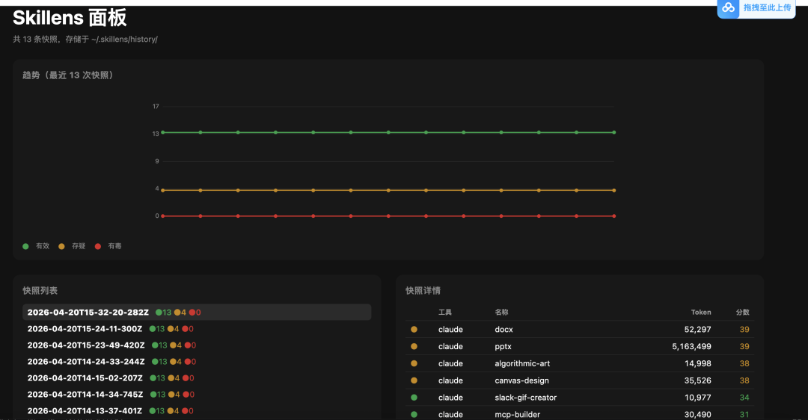
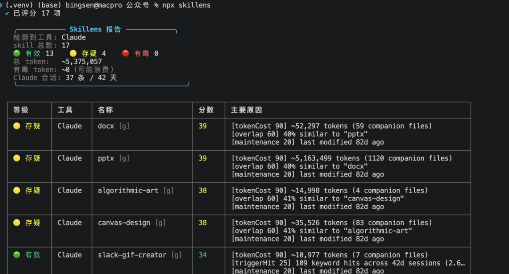
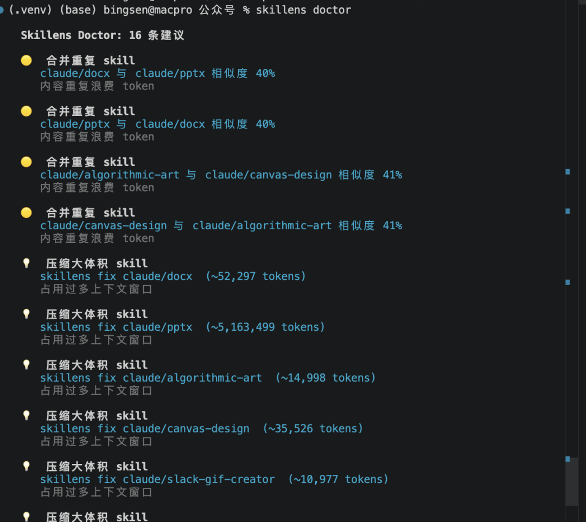
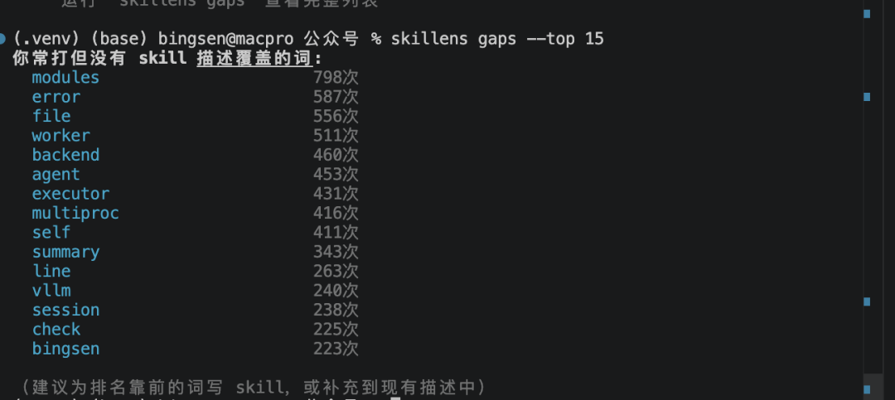
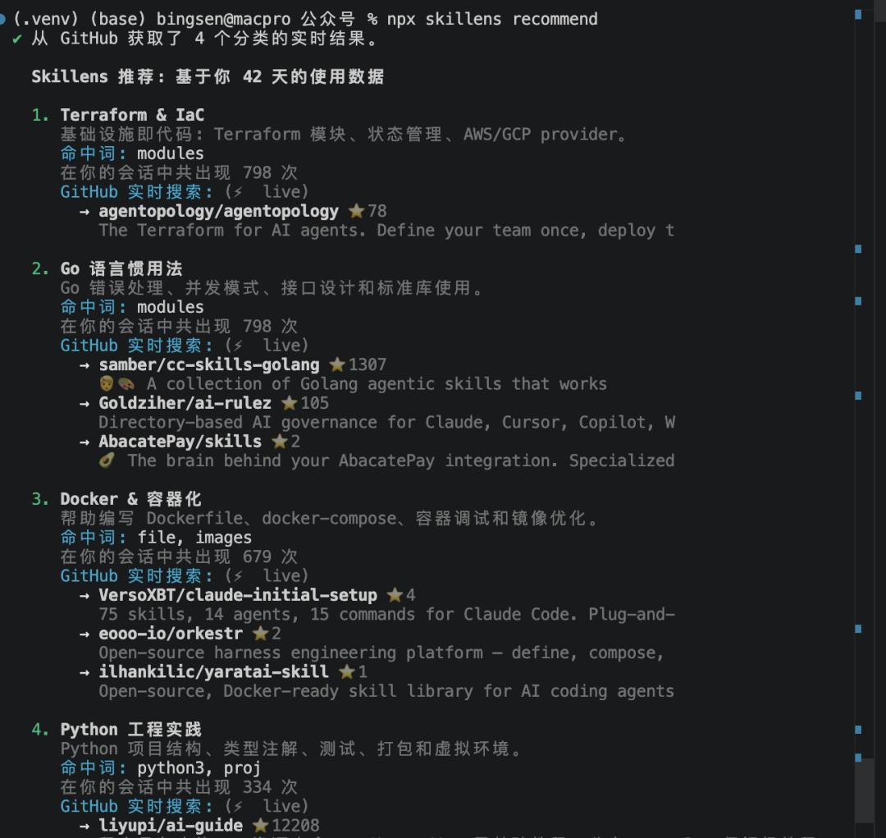

> 📎 来源: [cft0808](https://mp.weixin.qq.com/s?__biz=Mzg2NjcwOTM4MQ==&mid=2247484063&idx=1&sn=439c46fdd383b5ebf2d5a29532c352e3&chksm=cfb00b4cb8485af819dee36cddf2b40cf6e89ee78afb11e72d8ae90c0abddb4e769fce8a6a41&mpshare=1&scene=1&srcid=0421DQATNSzE6C63QCeTyAyv&sharer_shareinfo=ccff98824c4fa81d5405e9b362dffec0&sharer_shareinfo_first=ccff98824c4fa81d5405e9b362dffec0) | 时间: 2026-04-21 12:03

---

一周没更新了!


这期先抽个我喜欢的~下期想抽个黄金转运珠~~~~

·HIRONO公路日志系列-毛绒公仔挂件盲盒~~~

# 01｜事情的起因

如果你用 Claude Code、Cursor、GitHub Copilot 这些工具，你应该知道 skill（有些叫 rule、instruction）——就是那种你可以自定义的 .md 文件，告诉 AI "你是一个 XXX 专家，遇到 YYY 情况请 ZZZ"。

我自己装了 17 个。前端的、后端的、文档的、测试的、设计的……看着都挺有用，装的时候特爽。

但说实话，装完之后我从来没回头看过。

直到上周，跟一个朋友聊天，他说："我 Cursor 里装了 30 多个 rule，感觉 AI 反应越来越慢了，是不是 rule 太多了？"

我：？然后我去查了一下——每个 skill 文件都会被注入到上下文窗口里。那个最大的 pptx skill，光它一个就吃了超过 500万token。500万？？人麻了。

# 02｜问题在哪

skill 这东西吧，装的时候的逻辑是"看着有用就装"：

- 看到一个"前端设计"的 skill？装！
- "Excel 数据处理"？装！
- "PPT 自动生成"？装！
- "算法艺术"？虽然我从来没画过，但万一呢？装！

但问题是，Claude 每次对话会把你所有的 skill 文件全部塞进上下文——不管这次任务用不用得上：

Token成本 -- 一个大 skill 动辄几千 token，全部装进去，留给你描述问题的空间就少了

重复成本-- Claude 和 Cursor 里装了几乎一样的东西，两边都在付这个代价

噪音成本-- AI 读了一堆跟当前任务无关的 skill，干扰判断


# 03｜那就做个工具来审

思路很简单：

你的 AI 编程工具每天都在产生对话记录。这些记录里藏着你真正在做什么、在问什么、在写什么代码。

拿这些数据跟你装的 skill 做个交叉——

- ·你说了一个月的 "docker"、"kubernetes"、"nginx"，但没有一个 skill 覆盖？→ 缺口

- ·一个 skill 声称自己管 "算法艺术"，但你 42 天的对话里从没提过？→ 白装

- ·两个 skill 的描述词重叠 40%？→ 重复

于是开发了个工具：skillens。

```
npx skillens scan
```

 一行命令，用你本地的真实聊天记录，审判你的每一个 skill。





这是我自己电脑上的数据：

| 指标 | 数据 |
| --- | --- |
| 检测工具 | Claude Code |
| skill 总数 | 17 |
| 🟢 有效 | 13 |
| 🟡 存疑 | 4 |
| 🔴 有毒 | 0 |
| 总 token | 5,375,057 |
| 分析会话 | 35 条，跨 42 天 |

13 个没问题，4 个存疑——主要是 docx 和 pptx 重叠 40%（它俩描述太像了），还有 algorithmic-art 和 canvas-design 重叠 41%。

所谓"存疑"不是说它没用，而是"可能有优化空间"。


# 04｜它怎么打分

每个 skill 从六个维度打分，0 分最健康，100 分最毒：

| 维度 | 看什么 | 举例 |
| --- | --- | --- |
| Token 成本 | 吃了多少上下文 | pptx 一个 skill 吃 500 万 token |
| 触发命中 | 关键词在你对话中出没出现过 | frontend-design 命中 892 次/42天 |
| 重叠度 | 跟其他 skill 是不是干同一件事 | docx 和 pptx 重叠 40% |
| 维护状态 | 多久没更新了 | 半年没动 = 可能过时 |
| 权限风险 | 有没有rm -rf这种危险指令 | allowed-tools: ["\*"] 很危险 |
| 锁定度 | 有没有绑死某个付费 API | 绑了就有供应商风险 |

综合加权：🟢 有效（< 35 分）、🟡 存疑（35-65 分）、🔴 有毒（≥ 65 分）。

关键是——所有的"触发命中"数据都来自你本机的真实会话记录，不是猜的。


# 05｜不光告诉你问题，还告诉你怎么办

光说"你这个 skill 有问题"没用，你还得自己想怎么办。

所以我又加了几个命令：

skillens doctor — 一键诊断

npx skillens doctor




它会直接告诉你：

- 哪两个 skill 该合并
- 哪个 skill 太大了该压缩
- 哪些高频词没被任何 skill 覆盖

**不用你动脑子，直接照着命令跑就行。**

### `skillens gaps` — 找出需求缺口

```
npx skillens gaps --top 15
```



这个图挺直观的：**你天天打的词，但没有任何 skill 的描述覆盖到。**

`modules` 出现了 793 次、`docker` 391 次、`python3` 334 次——但我一个对应的 skill 都没有。

### `skillens recommend` — 数据驱动推荐

这是我觉得**最有意思**的一个功能。

市面上有不少 skill 市场/推荐工具——GitHub 上搜一搜，`claude-code-plugins-plus-skills`（1983⭐）收录了 2849 个 skill，`agent-skills-cli`（127⭐）有 4 万多个 skill。

**但它们的逻辑都是"浏览-安装"——像应用商店一样。**

你不知道自己缺什么，就只能盲装。

skillens 的 recommend 不一样：**它先读你 42 天的会话记录，看你到底在做什么，然后才推荐。**

```
npx skillens recommend
```



注意看：**不光告诉你"该装 Docker skill"，还直接告诉你去哪个仓库、装哪个具体的 skill。**

目前内置了 20 个分类，关联了 GitHub 上真实存在的社区 skill 仓库——主要来自 `jeremylongshore/claude-code-plugins-plus-skills`（500 个 skill，20 个分类）和 `kakarot-oncloud/claude-dev-skills`（15 个实用 skill）。

---

## 06｜完整工作流

```
发现问题 → 诊断原因 → 剪掉没用的 → 补上缺的 → 跟踪变化    │       │         │           │          │   scan  doctor     archive      init       diff
```

1. `npx skillens scan`

   — 扫一遍，看全貌
2. `npx skillens doctor`

   — 拿到具体建议
3. `npx skillens archive`

   — 归档有毒 skill（不是删除，随时可恢复）
4. `npx skillens recommend`

   — 看看该装什么
5. `npx skillens diff`

   — 下次扫描跟上次对比，确认效果

---

## 07｜几个技术细节

说几个可能有人关心的点：

**① 支持 6 个工具**

Claude Code、Cursor、GitHub Copilot、OpenAI Codex、Windsurf、Cline。每个工具的 skill 文件路径和格式都不一样，逐个写了适配器。

**② 纯本地，不联网**

默认不发任何数据到任何地方。你的聊天记录永远不会离开你的机器。这一点我觉得很重要——毕竟聊天记录里可能有项目代码。

可以选择加 `--ai` 调用 Claude/OpenAI API 做更深度的诊断，但只发 skill 文件内容，不发聊天记录。

**③ 零安装**

`npx skillens` 直接运行，不需要全局安装，不需要配置文件。

---

## 08｜说说局限性

实话实说：

1. **会话日志解析依赖工具的日志格式** — 如果 Claude Code 哪天改了日志结构，这边得跟着改。目前基于 `~/.claude/projects/*/` 下的 JSONL 文件。
2. **关键词匹配不等于语义理解** — skillens 做的是词频匹配，不是真正理解你"为什么"要用某个 skill。加 `--ai` 能弥补一些，但不可能完美。
3. **分数不是绝对的** — 一个 skill 分数高（接近 100）不代表它"坏"，可能只是 token 大、暂时没用到。分数是信号，不是判决。
4. **GitHub 实时搜索有频率限制 — 无 token 时 10 次/分钟，有 GITHUB\_TOKEN 能到 30 次/分钟。超了就自动 fallback 到内置目录，不影响使用。**

**我不想吹这个工具多牛逼，它就是解决一个具体问题：你装了一堆 skill，到底哪些有用？**

---

## 09｜开始使用

```
# 一行体验npx skillens# 看诊断建议npx skillens doctor# 看需求缺口npx skillens gaps# 看该装什么npx skillens recommend# 对比上次变化npx skillens diff
```

GitHub开源地址: **https://github.com/cft0808/skillen**

你的 AI 编程工具不是装得越多越好。用你自己的数据说话，只留真正有用的。欢迎各位朋友提交issue!
