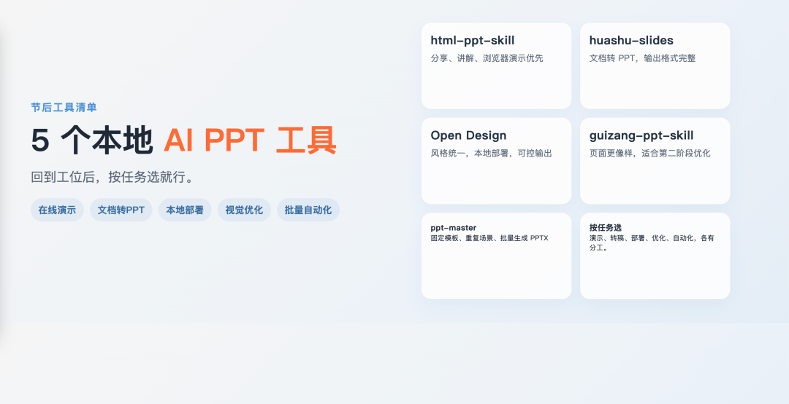
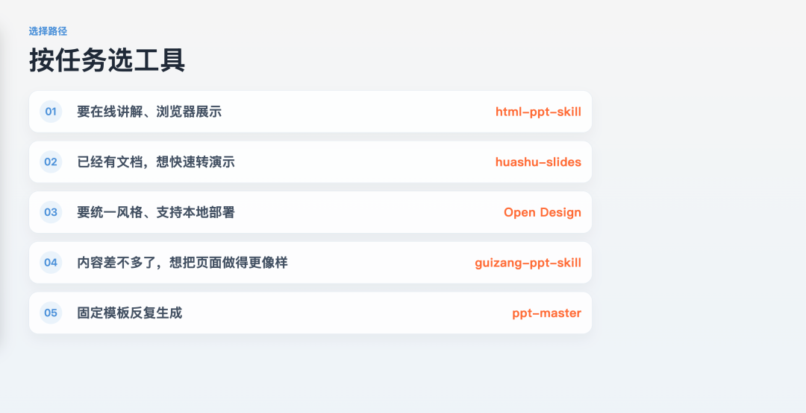

> 📎 来源: [创神日记](https://mp.weixin.qq.com/s?__biz=MzAxMjE5MjIyNA==&mid=2247483735&idx=1&sn=2263949bdaadd3b253436006c50cc1be&chksm=9a247a06e522c82ca76421c7611d8e5d26874cf904f6d63c4f31f78bfd9eeb9a946da2310cc1&mpshare=1&scene=1&srcid=0507RrRBCetB2BUWqKNnWCLc&sharer_shareinfo=fde4430af86630c45164c547ed7a0b6f&sharer_shareinfo_first=fde4430af86630c45164c547ed7a0b6f) | 时间: 2026-05-07 04:41

---

假期结束，回到工位后的第一件事，补 PPT。

   5 个更适合公司场景的 

```
skill
```

 和本地开源工具推荐。

  到底该用哪一个。



## 01 如果你做的是分享、讲解、演示，而不是交一个  ``` .pptx ``` ：先看  ``` html-ppt-skill ```

GitHub：

```
https://github.com/lewislulu/html-ppt-skill
```

因为很多公司里的 PPT，表面上叫 PPT，实际上更接近“讲给别人看的演示内容”。

比如：

1.内部分享2.培训材料3.技术演示4.在线打开直接展示的讲稿

这种任务里，传统 PowerPoint 其实并不一定是最顺手的载体。

```
html-ppt-skill
```

 本质上是 HTML5 幻灯片方案，重点输出是：

1.单文件 

```
HTML
```

2.离线可用3.打印支持4.深色模式5.演讲者视图

这意味着它特别适合这种场景：

1.你希望演示文稿天然跑在浏览器里2.你更看重展示效果，而不是 Office 兼容性3.你希望内容能放进版本控制，持续迭代

我自己会把它理解成：

**它不是在替代所有 PPT，而是在替代“那些本来就更适合用网页来讲的 PPT”。**

它的优势很明确：

1.浏览器即演示环境2.对代码、交互、深色模式更友好3.很适合程序员或内容团队持续维护

它的限制也很明确：

1.如果你的协作对象最后只认 

```
.pptx
```

，它就不是第一选择2.如果你必须把文件交给别人继续在 PowerPoint 里改，它会不顺手

一句话总结：

**```
html-ppt-skill
```

 适合“演示导向”的任务。**

## 02 如果你已经有现成文档，想直接转成正式演示：用  ``` huashu-slides ```

GitHub：

```
https://github.com/alchaincyf/huashu-skills
```

公司里最常见的一种 PPT 任务，不是从一句 prompt 开始，而是你手上已经有材料了。

比如：

1.一份 Word 方案2.一篇 Markdown 文档3.一份会议纪要4.一份培训稿、白皮书草稿

这种时候，最烦的不是“从零想内容”，而是把已经写好的东西重新排成 PPT。

这类场景里，我会先看 

```
huashu-slides
```

。

它本身就是一个 PPT 生成 skill，支持多种设计风格，而且输出不只一种：

1.

```
PPTX
```

2.

```
HTML
```

3.

```
PDF
```

这意味着它更适合“已经有内容，想系统化转成演示”的任务。

它适合的场景很明确：

1.长文档拆成汇报稿2.一套内容要同时出 PPT 和 PDF3.你希望后面还能继续修改 PowerPoint 文件4.你不只是想生成一份，而是想把这件事变成稳定流程

它的优势在于：

1.输出格式完整2.可编辑的 

```
PPTX
```

 比较实用3.更像一个“内容到演示”的工作流，而不是只给你一张成品图

它的边界也要说清楚：

1.这类工具更适合本来就有内容沉淀的人2.如果只是临时做两页简报，未必需要上完整 workflow3.最终效果仍然受原始内容质量影响很大

一句话总结：

**```
huashu-slides
```

 适合“手里已有文档，把它稳定变成 PPT”。**

## 03 如果你更在意品牌统一、可控输出和本地部署：用  ``` Open Design ```

GitHub：

```
https://github.com/nexu-io/open-design
```

有一类 PPT 任务，麻烦不在于没内容，而在于它最后必须“长得像公司里的正式文件”。

这种场景下，我会更关注 

```
Open Design
```

。

它的特点不是单纯生成几页 slides，而是更偏一整套设计系统化能力：

1.有 Web UI、API、CLI2.支持本地运行和容器化部署3.支持多模型接入4.输出 

```
PPTX / HTML / PDF
```

这类工具更像“把演示稿生成这件事工程化”。

它适合的场景是：

1.一套演示内容要反复复用2.你希望不同人做出来的东西风格尽量一致3.你很在意品牌统一、设计系统、企业内可控性4.你后面还要导出给 Office、浏览器、PDF 多端使用

它比纯聊天生成工具更值的地方在于：

1.输出链路更完整2.更适合长期重复使用3.本地部署这件事，对很多公司场景很重要

但它也不是“打开就会”的轻量工具：

1.更适合有一定流程意识、工具意识的团队2.学习成本会高于消费级产品3.它解决的是“体系化输出”，不是“随手来一页灵感稿”

一句话总结：

**```
Open Design
```

 适合“想把 PPT 生产这件事做得更稳、更统一、更可控”。**

## 04 如果你更看重视觉表现和页面布局：加上  ``` guizang-ppt-skill ```

GitHub：

```
https://github.com/op7418/guizang-ppt-skill
```

前面几个工具，解决的更多是格式、流程和交付问题。

但 PPT 还有一类很现实的需求：

**内容不一定最难，难的是做出来不能太土。**

这时候，

```
guizang-ppt-skill
```

 值得加进来。

它更偏“设计表达”和页面布局这一层。也就是说，它不是最强调自动化流水线的那个工具，而是更适合在下面这些场景里补位：

1.你已经有内容框架，但页面观感还不够好2.你希望汇报稿、提案稿更像一份认真设计过的文档3.你不只是要生成，还要让它看起来更有完成度

它适合怎么用？

我会把它理解成一个很好的“第二阶段工具”：

1.先用别的工具把结构和内容跑出来2.再用 

```
guizang-ppt-skill
```

 去拉视觉质量和页面完成度

这样更符合真实工作流。

因为很多时候，PPT 真正耗时间的不是起稿，而是最后那一轮：

1.页面层级顺不顺2.字和图挤不挤3.一页看上去是不是像成稿

它的边界也很清楚：

1.它更偏设计优化，不是最适合拿来做批量自动化生成的那个2.如果你手里连结构都没有，先上它不一定是最优顺序

一句话总结：

**```
guizang-ppt-skill
```

 适合“内容差不多有了，但页面还需要更像样”的阶段。**

## 05 如果你想批量生成结构化 PPTX，重点是自动化：用  ``` ppt-master ```

GitHub：

```
https://github.com/hugohe3/ppt-master
```

有些 PPT 任务，真正痛苦的地方不在视觉，而在重复。

比如：

1.每周都要更新同一类汇报2.一套模板要不断灌新数据3.结构固定，但内容每次都要换

这种任务，如果还全靠手动改页，其实很浪费时间。

```
ppt-master
```

 这一类方案是基于 

```
python-pptx
```

 的自动化生成思路，重点是程序化生成 

```
PPTX
```

。

它适合的场景是：

1.固定结构的周报、月报、项目更新2.一批内容要批量生成成同一种格式3.你更看重自动化，而不是一页页手工设计

它的优势在于：

1.输出目标很明确，就是 

```
PPTX
```

2.和数据、脚本、模板流程更容易结合3.适合重复性高的内部场景

它的边界也很明显：

1.更偏工程化，不是给零门槛用户准备的2.强在自动化，不一定强在创意视觉3.更适合“稳定生产”，不适合“临时灵感型美化”

一句话总结：

**```
ppt-master
```

 适合“结构固定、反复生成、需要程序化产出 PPTX”的任务。**

## 06 最后一句话



如果你做的是分享、讲解、在线演示：

**先看 

```
html-ppt-skill
```

。**

如果你已经有完整文档，想稳定转成 PPT：

**先看 

```
huashu-slides
```

。**

如果你更在意品牌一致、可控输出、本地部署：

**看 

```
Open Design
```

。**

如果你已经有结构，重点是把页面做得更像样：

**加上 

```
guizang-ppt-skill
```

。**

如果你做的是固定模板、重复性高、需要批量产出：

**看 

```
ppt-master
```

。**
