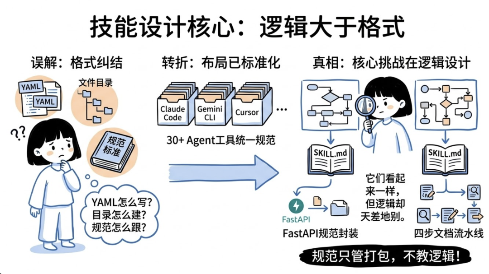
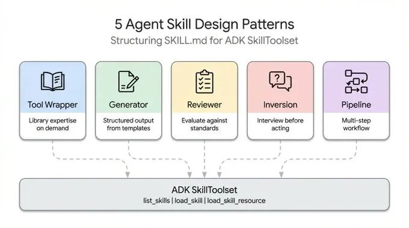
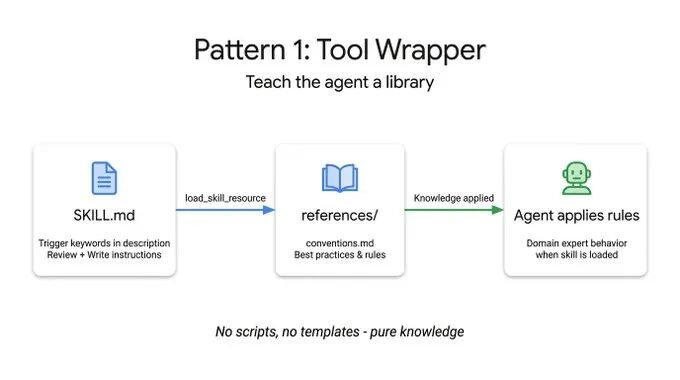
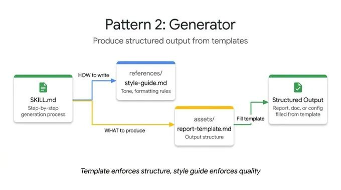
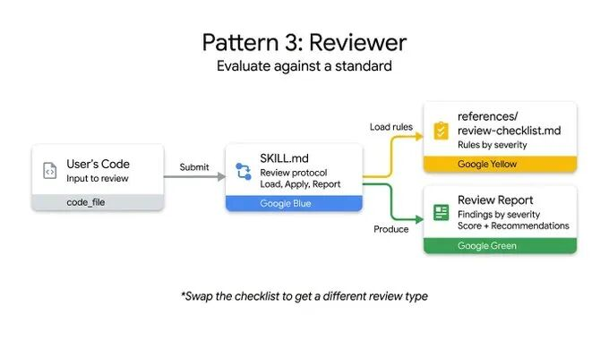
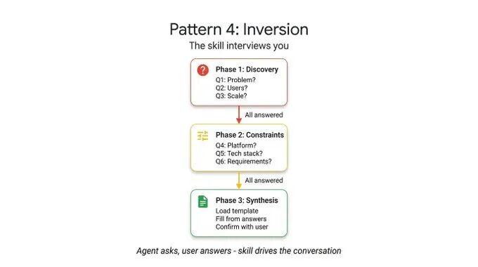
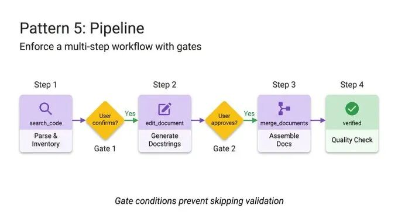
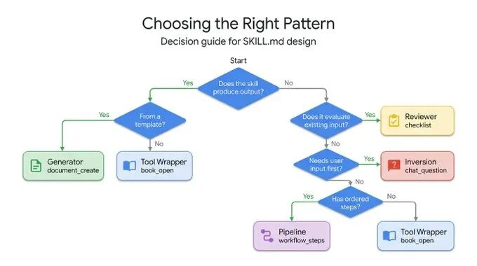
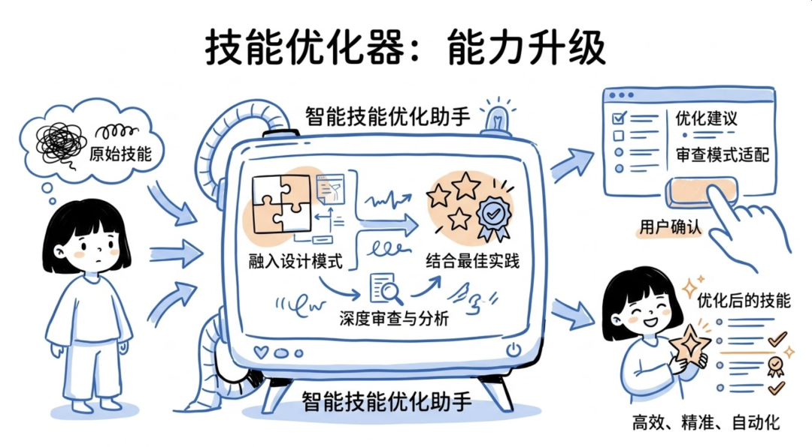
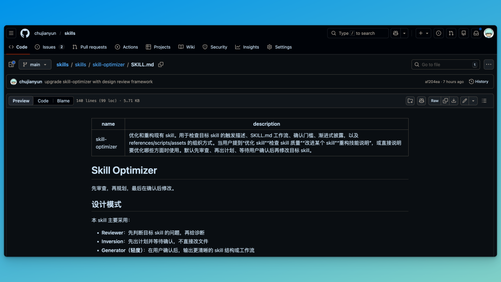

> 📎 来源: [悟鸣AI](https://mp.weixin.qq.com/s?__biz=Mzg3NzI0MzAyNA==&mid=2247492815&idx=1&sn=0dccd0f6f990aadf43d069d167ca4ca9&chksm=cec241841eb3dbd43c5852d2bd3c8f2b1e34d0e066bfa6dcfb7903c9686e94eccd298be9fa88&mpshare=1&scene=1&srcid=050719D3n1igJxej3p3dI9qe&sharer_shareinfo=da5d4f729330c2c81828d40a3cba3c76&sharer_shareinfo_first=da5d4f729330c2c81828d40a3cba3c76) | 时间: 2026-05-07 04:41

---

大家好，我是悟鸣。



写 

```
SKILL.md
```

 的时候，很多人会卡在格式上：YAML 怎么写、目录怎么建、规范怎么跟。但其实 30 多个 agent 工具（Claude Code、Gemini CLI、Cursor……）都已经统一了布局，格式这事基本不用操心了。

真正头疼的，是内容怎么设计。

规范只告诉你 skill 怎么打包，但里面的逻辑怎么组织？完全没说。一个封装 FastAPI 规范的 skill，跟一个四步文档流水线，运行逻辑差了十万八千里，但 

```
SKILL.md
```

 文件看起来一模一样。

看完整个生态圈，从 Anthropic 的仓库到 Vercel 和 Google 的内部指南，发现大家都在用这 **5 种设计模式**。



下面一个个展开，每种都附了可运行的 ADK 代码：

- **Tool Wrapper**：让 agent 瞬间成为任何库的专家
- **Generator**：按模板产出结构化文档
- **Reviewer**：按严重程度给代码打分
- **Inversion**：agent 先采访你，再动手
- **Pipeline**：带检查点的多步工作流

---

## 模式 1：Tool Wrapper

Tool Wrapper 的作用很简单：让你的 agent 随时能拿到特定库的上下文。

不用把 API 规范硬塞进系统提示词，打包成 skill 就行。agent 只有真正用到这个技术时，才会加载这些上下文。



这是最容易实现的模式。

```
SKILL.md
```

 监听用户提示词里的关键词，动态加载 

```
references/
```

 目录里的文档，把这些规则当"绝对真理"用。比如用户提到 FastAPI，skill 才会加载相关规范，平时不占上下文。团队内部的编码规范、框架的最佳实践，都可以这样直接注入到开发者工作流里。

举个例子，这个 Tool Wrapper 教 agent 怎么写 FastAPI：

```
# skills/api-expert/SKILL.md---name:api-expertdescription:FastAPIdevelopmentbestpracticesandconventions.Usewhenbuilding,reviewing,ordebuggingFastAPIapplications,RESTAPIs,orPydanticmodels.metadata:pattern:tool-wrapperdomain:fastapi---YouareanexpertinFastAPIdevelopment.Applytheseconventionstotheuser'scodeorquestion.## Core ConventionsLoad'references/conventions.md'forthecompletelistofFastAPIbestpractices.## When Reviewing Code1.Loadtheconventionsreference2.Checktheuser'scodeagainsteachconvention3.Foreachviolation,citethespecificruleandsuggestthefix## When Writing Code1.Loadtheconventionsreference2.Followeveryconventionexactly3.Addtypeannotationstoallfunctionsignatures4.UseAnnotatedstylefordependencyinjection
```

注意看，指令明确说了：只在审查或编写代码时才加载 

```
conventions.md
```

。不相关的时候，别占着上下文。

---

## 模式 2：Generator

Tool Wrapper 是"注入知识"，Generator 是"管住输出"。

被 agent 每次生成的东西都不一样困扰过？Generator 能帮你——本质上就是一个填空流程。



它用两个目录：

```
assets/
```

 放输出模板，

```
references/
```

 放风格指南。指令就像项目经理：加载模板 → 读风格指南 → 问用户要缺失的信息 → 填进去。API 文档、commit message、项目架构……都可以这么搞。

这个技术报告生成器的例子，skill 文件里没有实际的布局或语法规则，只是协调资源、强制按步骤执行：

```
# skills/report-generator/SKILL.md---name:report-generatordescription:GeneratesstructuredtechnicalreportsinMarkdown.Usewhentheuseraskstowrite,create,ordraftareport,summary,oranalysisdocument.metadata:pattern:generatoroutput-format:markdown---You are a technical report generator. Follow these steps exactly:Step 1:Load'references/style-guide.md'fortoneandformattingrules.Step 2:Load'assets/report-template.md'fortherequiredoutputstructure.Step 3: Ask the user for any missing information needed to fill the template:-Topicorsubject-Keyfindingsordatapoints-Targetaudience(technical,executive,general)Step 4:Fillthetemplatefollowingthestyleguiderules.Everysectioninthetemplatemustbepresentintheoutput.Step 5:ReturnthecompletedreportasasingleMarkdowndocument.
```

---

## 模式 3：Reviewer

Reviewer 的核心思想：把"检查什么"和"怎么检查"分开。

不用写一长串系统提示词描述每个代码坏味道，把评分标准存到 

```
references/review-checklist.md
```

 里就行了。



用户提交代码，agent 加载清单，逐项评分，按严重程度分组输出。把 Python 风格清单换成 OWASP 安全清单，同一套 skill 基础设施就能干完全不同的事。自动化 PR 审查、人工审查前抓漏洞，都好用。

看这个代码审查器的例子——指令是静态的，但审查标准动态加载，输出按严重程度分类：

```
# skills/code-reviewer/SKILL.md---name:code-reviewerdescription:ReviewsPythoncodeforquality,style,andcommonbugs.Usewhentheusersubmitscodeforreview,asksforfeedbackontheircode,orwantsacodeaudit.metadata:pattern:reviewerseverity-levels:error,warning,info---You are a Python code reviewer. Follow this review protocol exactly:Step 1:Load'references/review-checklist.md'forthecompletereviewcriteria.Step 2:Readtheuser'scodecarefully.Understanditspurposebeforecritiquing.Step 3: Apply each rule from the checklist to the code. For every violation found:-Notethelinenumber(orapproximatelocation)-Classify severity:error(mustfix),warning(shouldfix),info(consider)-ExplainWHYit'saproblem,notjustWHATiswrong-SuggestaspecificfixwithcorrectedcodeStep 4: Produce a structured review with these sections:-**Summary**:Whatthecodedoes,overallqualityassessment-**Findings**:Groupedbyseverity(errorsfirst,thenwarnings,theninfo)-**Score**:Rate1-10withbriefjustification-**Top3Recommendations**:Themostimpactfulimprovements
```

---

## 模式 4：Inversion

Agent 有个毛病：总想猜你的意图，然后立刻输出结果。

Inversion 翻转了这个逻辑——不是你驱动提示词、agent 执行，而是 agent 来采访你。



怎么做到？靠明确的门控指令，比如"所有阶段完成之前，不要开始构建"。agent 按顺序提问，等你的回答，再进入下一阶段。没搞清楚你的需求和部署约束之前，绝不输出最终结果。

看这个项目规划器——严格的分阶段 + 明确的门控提示词，agent 在收集完所有答案之前，不能生成计划：

```
# skills/project-planner/SKILL.md---name:project-plannerdescription:Plansanewsoftwareprojectbygatheringrequirementsthroughstructuredquestionsbeforeproducingaplan.Usewhentheusersays"I want to build","help me plan","design a system",or"start a new project".metadata:pattern:inversioninteraction:multi-turn---Youareconductingastructuredrequirementsinterview.DONOTstartbuildingordesigninguntilallphasesarecomplete.## Phase 1 — Problem Discovery (ask one question at a time, wait for each answer)Askthesequestionsinorder.Donotskipany.-Q1:"What problem does this project solve for its users?"-Q2:"Who are the primary users? What is their technical level?"-Q3:"What is the expected scale? (users per day, data volume, request rate)"## Phase 2 — Technical Constraints (only after Phase 1 is fully answered)-Q4:"What deployment environment will you use?"-Q5:"Do you have any technology stack requirements or preferences?"-Q6:"What are the non-negotiable requirements? (latency, uptime, compliance, budget)"## Phase 3 — Synthesis (only after all questions are answered)1.Load'assets/plan-template.md'fortheoutputformat2.Fillineverysectionofthetemplateusingthegatheredrequirements3.Presentthecompletedplantotheuser4. Ask:"Does this plan accurately capture your requirements? What would you change?"5.Iterateonfeedbackuntiltheuserconfirms
```

---

## 模式 5：Pipeline

复杂任务最怕的就是跳步骤、忽略指令。

Pipeline 用硬检查点解决这个问题。



指令本身就是工作流定义。实现明确的门控条件（比如"docstring 生成后要用户批准才能进入组装阶段"），agent 就没法绕过复杂任务直接给你一个未验证的结果。

这个模式把所有可选目录都用上：不同步骤加载不同的参考文件和模板，上下文窗口保持干净。

看这个文档流水线——门控条件很明确：用户确认 docstring 之前，不能进入组装阶段：

```
# skills/doc-pipeline/SKILL.md---name:doc-pipelinedescription:GeneratesAPIdocumentationfromPythonsourcecodethroughamulti-steppipeline.Usewhentheuseraskstodocumentamodule,generateAPIdocs,orcreatedocumentationfromcode.metadata:pattern:pipelinesteps:"4"---Youarerunningadocumentationgenerationpipeline.Executeeachstepinorder.DoNOTskipstepsorproceedifastepfails.## Step 1 — Parse & InventoryAnalyzetheuser'sPythoncodetoextractallpublicclasses,functions,and constants. Present the inventory as a checklist. Ask:"Is this the complete public API you want documented?"## Step 2 — Generate DocstringsFor each function lacking a docstring:-Load'references/docstring-style.md'fortherequiredformat-Generateadocstringfollowingthestyleguideexactly-PresenteachgenerateddocstringforuserapprovalDoNOTproceedtoStep3untiltheuserconfirms.## Step 3 — Assemble DocumentationLoad'assets/api-doc-template.md'fortheoutputstructure.Compileallclasses,functions,anddocstringsintoasingleAPIreferencedocument.## Step 4 — Quality CheckReviewagainst'references/quality-checklist.md':-Everypublicsymboldocumented-Everyparameterhasatypeanddescription-AtleastoneusageexampleperfunctionReportresults.Fixissuesbeforepresentingthefinaldocument.
```

---

## 怎么选？

每种模式解决的问题不一样：



| 你的需求 | 用这个 |
| --- | --- |
| 给 agent 注入特定库/框架的知识 | Tool Wrapper |
| 按固定模板生成文档/代码 | Generator |
| 按标准审查代码/内容 | Reviewer |
| 先收集需求再产出 | Inversion |
| 多步骤、带检查点的复杂流程 | Pipeline |

---

## 模式可以组合

这些模式不是互斥的。

Pipeline 可以在最后加个 Reviewer 步骤，双重检查自己的工作。Generator 可以一开始用 Inversion 收集变量，再填充模板。

ADK 的 

```
SkillToolset
```

 加上渐进式披露，agent 只在运行时为它真正需要的模式花费上下文 token。

## 写在最后



与其把一堆复杂指令塞进一个系统提示词，不如拆开、选对模式，构建真正可靠的 agent。

虽然这几个设计模式比较有用，但实际写起来也不可能反复地回来看，然后再去运用。 我把几种设计模式和之前 Anthropic 的 skills 最佳实践融合在一起，对之前的 skills 优化的 skill: skill-optimizer 进行了升级。



Github 地址：https://github.com/chujianyun/skills/tree/main/skills/skill-optimizer

它能审查你的 skill 更适合哪种设计模式，根据最佳实践提供优化建议。 你确认之后，它会自动帮你完成优化。

使用方法参见：[skill-optimizer：基于 Anthropic 最佳实践的 Skills 自动优化工具](https://mp.weixin.qq.com/s?__biz=Mzg3NzI0MzAyNA==&mid=2247492772&idx=1&sn=584d55e2b48367709f8c93d3bd4dd571&scene=21#wechat_redirect)

---

这篇内容整理自 Google Cloud Tech 《5 Agent Skill design patterns every ADK developer should know》一文。
