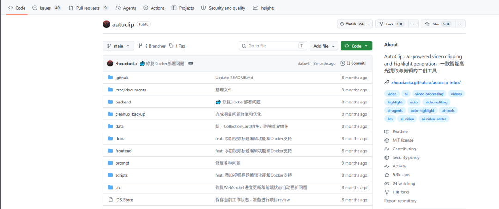
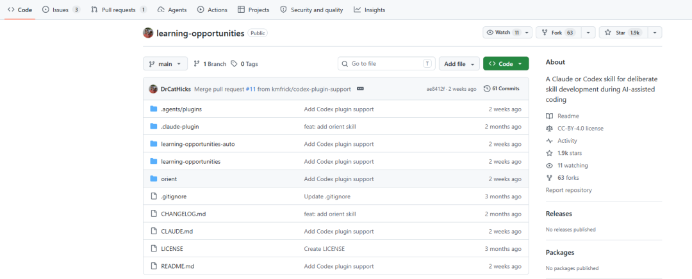
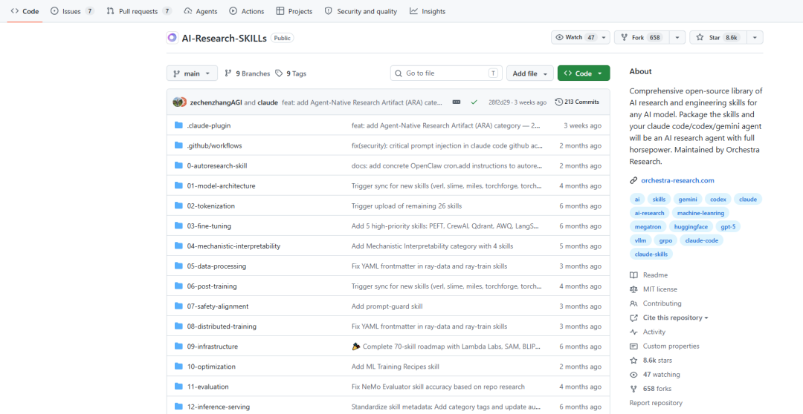

> 📎 来源: [Ai扫街笔记](https://mp.weixin.qq.com/s?__biz=MzYzOTA3NjAyOQ==&mid=2247483966&idx=1&sn=aeb353ca998f7e300fed5d992c6bf687&chksm=f1b44860fa35927da27fda29027a556ee8c6b674e76546b7720270b31d77bb1cf88ff518750e&mpshare=1&scene=1&srcid=0520bCtYdwXzZN4sWKW3Oc3a&sharer_shareinfo=67e48a5f3508ffe6fcb3338f0a0ce67c&sharer_shareinfo_first=67e48a5f3508ffe6fcb3338f0a0ce67c) | 时间: 2026-05-20 04:25

---

分享3个Github上的宝藏Skills，大家按需下载。

# 1.zhouxiaoka/autoclip(5.3K Star)

AI驱动的智能视频高光切片与二创工具。支持YouTube/B站视频下载、AI内容分析（通义千问等）、自动提取精彩片段、智能合集生成、字幕处理等。提供Web界面、Docker一键部署，功能完整（下载+分析+切片+合集）

适用于短视频矩阵运营者、自媒体从业者、代运营公司、电商带货主播、知识付费博主，特别适合做中文视频用户，支持实时进度和异步处理，批量处理长视频转短视频/合集

# 2.Learning Opportunities Skill(1.9K Star)

使用“动态教材”方法，在agentic coding过程中嵌入科学-based技能构建练习，帮助开发者/代理边做边系统提升专业知识，而非仅完成任务

适用于教育、个人成长或团队 onboarding。在AI辅助编码session中自动注入练习，提升长期能力（如架构决策、调试模式）。特别适合学生、初级开发者或希望“教代理学习”的高级用户，与Superpowers等框架结合使用

# 3.AI Research SKILLs(8.6K Star)

最全面的AI研究与工程Skills库，包含98个Skills，分23个类别（如Autoresearch orchestration、Model Architecture、Fine-Tuning、Post-Training、Inference、Paper Writing、Mech Interp等）。提供生产级指导、代码示例、故障排除和完整研究流程（从idea到paper）

适合AI研究者/工程师让代理自主进行文献调研、实验设计、训练优化、论文撰写。能迅速提升AI代理从“聊天”到“自主研究员”的能力
