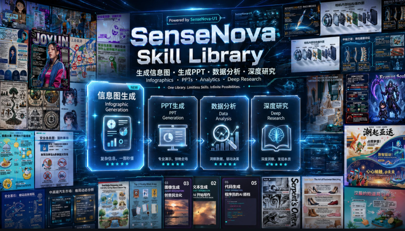
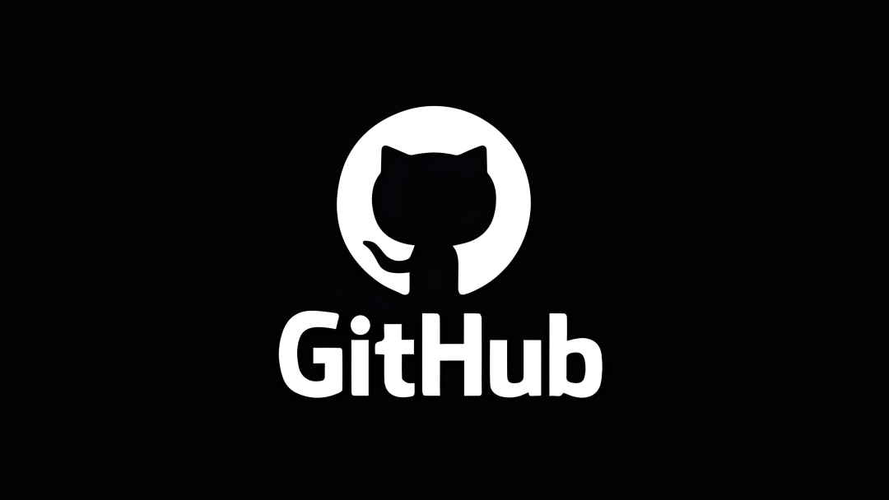

> 📎 来源: [开启新人生](https://mp.weixin.qq.com/s?__biz=MzYzOTA3NjAyOQ==&mid=2247483911&idx=1&sn=747d06324254f63f570813ad9d23cb5d&chksm=f10c977f5904151931402de212351f21d6be545589f463d0bc55d1b7f3fb36c24e4b2cc4586b&mpshare=1&scene=1&srcid=0511gSJoLZ54jMADZglDU5hs&sharer_shareinfo=3d940672cc36886525f941d1dd35f376&sharer_shareinfo_first=3d940672cc36886525f941d1dd35f376) | 时间: 2026-05-10 17:50

---

分享3个刚发现的宝藏Skills，大家按需下载。

# 1.SenseNova-Skills

商汤SenseNova模型配套的办公/多模态Skills集合，包括图像生成（infographic、imitate）、PPT生成（creative/standard模式，支持PDF/DOCX输入转PPTX/PNG）、Excel数据分析（大文件处理、清洗、可视化）和深度研究工具

适用于办公自动化、报告生成、数据可视化场景，端到端办公能力的Agent用户（如结合OpenClaw/hermes-agent），例如从文档生成PPT/信息图、分析Excel数据，或进行行业研究

# 2.Warp oz-skills

Warp团队官方开源的15+高质量生产级Agent Skills集合，包括SEO & 无障碍审计、文档自动写作、Terraform/DevOps配置、GitHub Issue处理、代码审查、分析工件、dbt模型索引等。Skills以可重用Markdown形式提供，教AI代理处理真实工作流，能直接给出具体优化建议

适用于开发者/团队日常DevOps、内容审计、Issue triage、文档生成等生产环境。特别适合Warp/Oz代理用户，或想快速注入专业能力的个人/小团队

# 3.lenny-skills

从知名商业播客Lenny's Podcast提炼的86个产品管理专属Skills，覆盖写需求文档、竞品分析、设定OKR、用户研究、团队管理、战略规划、shipping等。注入“资深PM思维”，让AI生成更接地气、有商业落地视角的内容，而非空谈

适用于产品经理、创始人使用Claude Code/Cursor处理产品工作，如需求梳理、规划、用户访谈总结等。特别适合需要“实战PM视角”的场景，能显著提升AI辅助的产品输出质量
