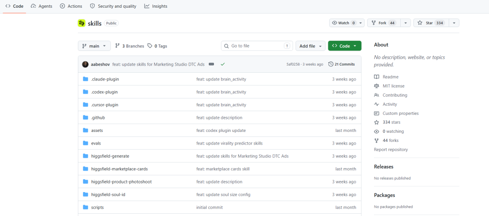
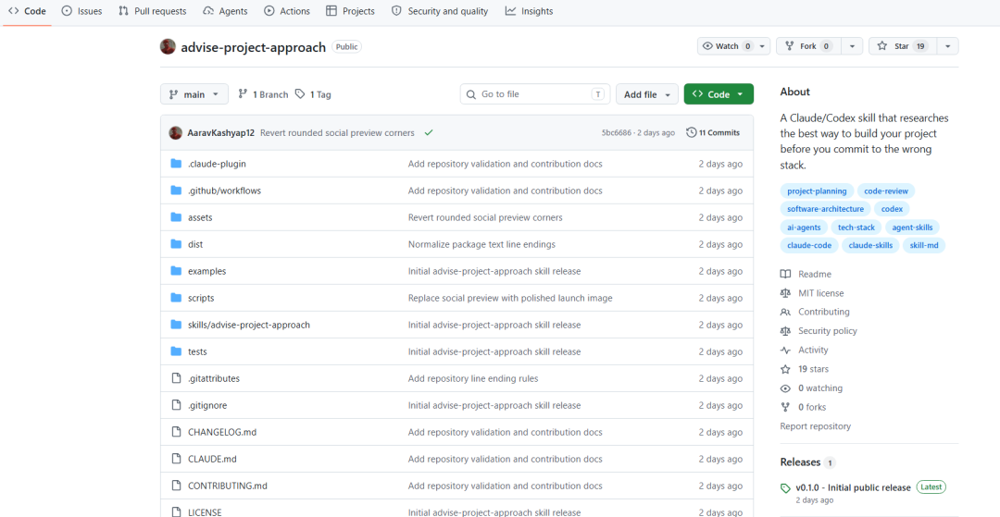
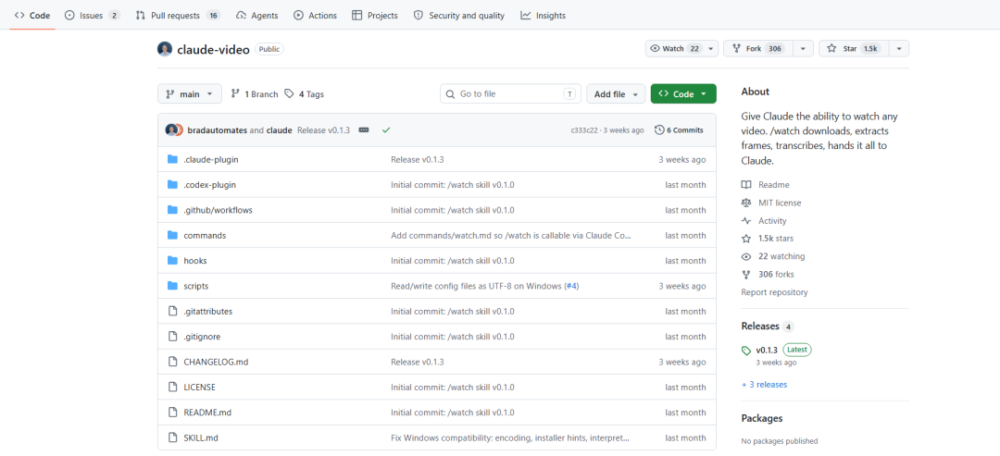

> 📎 来源: [Ai扫街笔记](https://mp.weixin.qq.com/s?__biz=MzYzOTA3NjAyOQ==&mid=2247484039&idx=1&sn=1dfb19e971feec77797394a2acd4f836&chksm=f19721768542e14dcd00b77623a3a5e493a3550c65171d516d1b297d89ed4ea7fd9c6e262327&mpshare=1&scene=1&srcid=0531sCpUsjb10BOfhGBdtqcU&sharer_shareinfo=ce0812bfbb282b4401567e2fa8c3f271&sharer_shareinfo_first=ce0812bfbb282b4401567e2fa8c3f271) | 时间: 2026-05-31 02:34

---

分享3个Github上的宝藏Skills，大家按需下载。

# ◆ 01 | higgsfield-ai/skills：AI视频生成一键搞定

Higgsfield AI用于做图像和视频生成，这套Skill把他们的能力打包成了几个实用工具：

Marketing Studio（营销素材）

Virality Predictor（爆款预测）

soul（角色一致性保持）

product-photoshoot（产品摄影）

装起来也简单，一行命令搞定：

npx skills add higgsfield-ai/skills

给段文字描述，直接出片。做营销视频或者产品展示图的时候能省不少时间。之前做一条30秒的产品介绍视频，从写脚本到成品要折腾半天，现在大概10分钟就能跑出个能看的版本。

如果你平时用Claude Code或Cursor，搭这个挺自然的，不用切换太多工具。

# ◆ 02 | advise-project-approach：新项目启动前前先问问它

这个Skill适合在项目启动前跑一遍。

它会拿你的项目去对比真实案例和文档，告诉你哪些坑其实可以避开。比如solo app硬上Kafka这种——不是说Kafka不好，是你一个人维护不过来，后期哭都来不及。

不只是选型阶段有用，项目做到一半或者准备上线前也能查一遍。独立开发者容易在架构上走弯路，这个Skill相当于有个资深工程师帮你把关。

适合谁用：

独立开发者选技术栈

项目中期架构审查

上线前的最后一轮检查

# ◆ 03 | claude-video系列：让Claude能"看"视频

这套组合让Claude能直接处理视频内容，流程是这样的：

yt-dlp下载视频 → ffmpeg抽帧 → Whisper转文字 → Claude分析

全部本地跑，不需要额外买API。

支持1500+平台，YouTube、TikTok、B站都能下。30分钟的视频2分钟就能分析完。

我试了下YouTube上的教程视频，Claude能直接告诉我：

哪几秒是重点

节奏怎么安排的

视觉钩子在哪里

做竞品分析或者内容拆解的时候很省事。以前看一条视频要记笔记、暂停、回退，现在直接丢给Claude，它帮你提炼结构。

