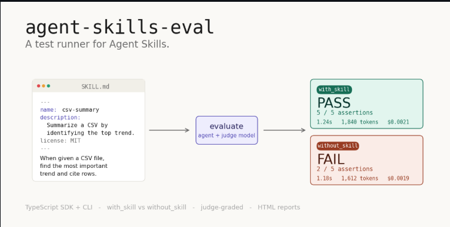
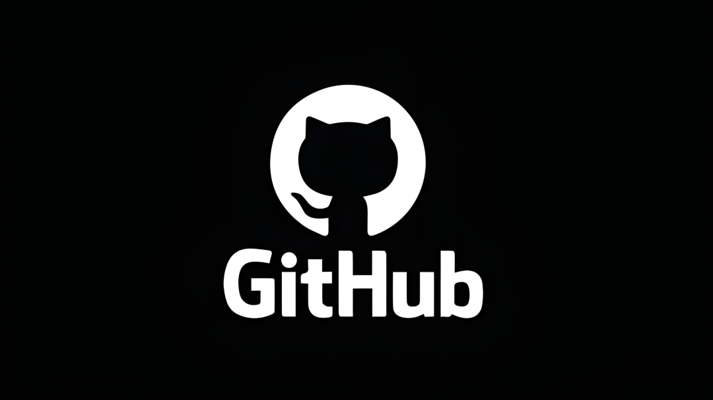
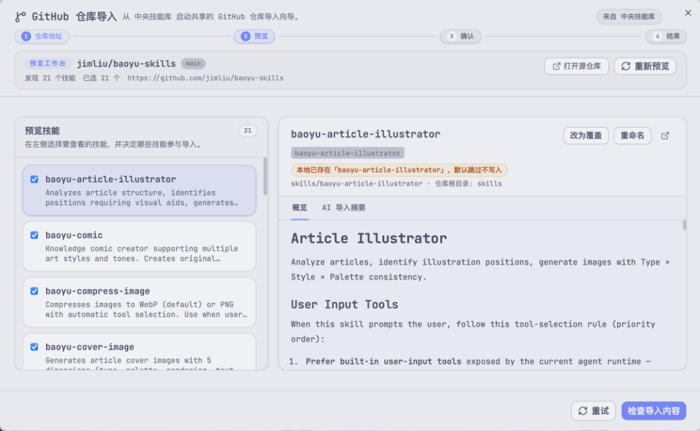

> 📎 来源: [开启新人生](https://mp.weixin.qq.com/s?__biz=MzYzOTA3NjAyOQ==&mid=2247483924&idx=1&sn=0d7ad3a74262f0588a33723c9fa9a9b9&chksm=f1fbe4672ceb8ae3809f5dc96d53b5f0c028400ff78022498ebc54c5d9c2e93eaa8915d40d6e&mpshare=1&scene=1&srcid=0515O5jJj1ci2tSwUqOESYyJ&sharer_shareinfo=9c07b64d3d75311264f4eda7f7e00ecb&sharer_shareinfo_first=9c07b64d3d75311264f4eda7f7e00ecb) | 时间: 2026-05-15 03:46

---

1.agent-skills-eval

Agent Skills的测试运行器/评估框架。针对SKILL.md文件编写评估用例，通过对比实验（带技能 vs 不带技能）用评审模型打分，输出JSON报告和HTML可视化结果，支持CLI一键运行和SDK集成CI流水线

适用于AI Agent开发者验证自定义技能效果、集成到开发管道中进行自动化评估、对比不同提示/技能的实际收益，尤其适合构建高质量、可量化的代理系统

2.anthropics/skills

官方示例Skills集合，包括文档处理（PDF、XLSX等）、代码审查、TDD、架构设计、GitHub Issues管理等。可动态加载到Claude等代理，提升特定任务性能

适用于软件工程工作流（代码生成、审查、项目管理）、文档自动化处理；开发者在IDE中构建可重复代理任务，或社区贡献自定义Skill。常与skill-creator工具结合使用

3.Owl-Listener/designer-skills

87个Skills + 27个命令 + 8个插件，覆盖设计全流程：用户研究、设计系统、UI设计、交互、项目交付、handoff到开发等。支持生成设计 rationale、case studies、dev handoff包（测量、行为、边缘案例、QA checklist）

适用于indie开发者、全栈或产品构建中AI辅助设计环节。解决“不会设计”的痛点，用于生成UI/UX、设计系统、研究总结、交付文档。特别适合非专业设计师快速产出专业级输出，与工程Skills结合实现端到端开发

4.skills-manage

桌面端/可视化工具，用于跨平台集中管理AI编码代理技能（支持Claude Code、Cursor、Gemini CLI、Codex等20+平台）。基于~/.agents/skills目录实现单源真理，通过软链接同步、版本控制、权限管理、使用统计、批量安装/更新等功能

适用于多AI工具重度用户或团队管理大量Skill.md文件，避免重复/冲突；GitHub集中存储+自动同步；定期审查与安全扫描，特别适合一人公司或开发团队构建可维护的“技能库”

在AI时代，学习技巧比死耗时间重要十倍，最需要的不是努力，而是正确的方法
