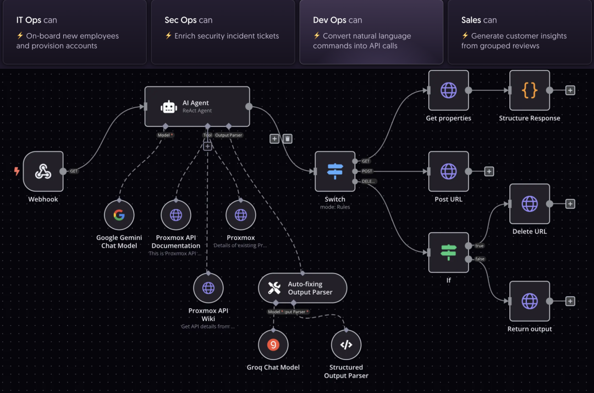
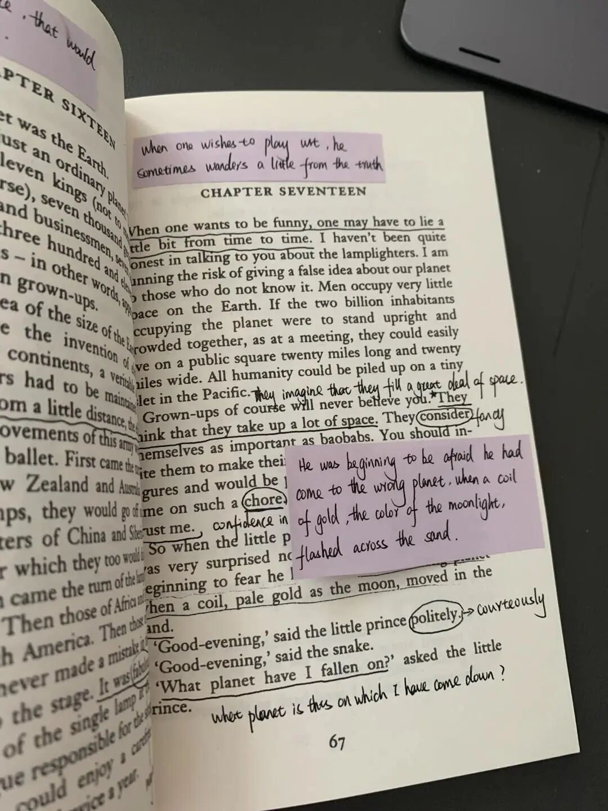
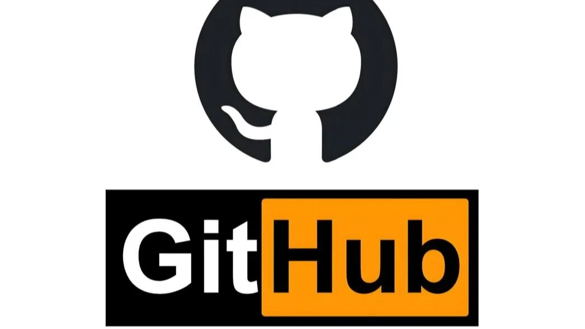

> 📎 来源: [开启新人生](https://mp.weixin.qq.com/s?__biz=MzYzOTA3NjAyOQ==&mid=2247483884&idx=1&sn=ea20b5220c84bca5f31393ee374197a0&chksm=f1e8365e611da2137d7d36b9581f4875f89116323299c3122a5dd1327540fa0a2ea8fc6faf54&mpshare=1&scene=1&srcid=0501tAsNNDjmOndd3CO3hOsf&sharer_shareinfo=8ef36e26cce47a6fcf2f404e574afb1d&sharer_shareinfo_first=8ef36e26cce47a6fcf2f404e574afb1d) | 时间: 2026-05-01 22:54

---

# 1. Awesome-Claude-Skills

curate的Claude Skills集合，这是个包含文档处理（Docx/Xlsx/PDF）、设计生成、前端实践、研究自动化、Obsidian集成等多个分类的模块化Skill

适用于构建个人AI工作流，例如自动化文档分析、UI生成、研究报告起草。非常适合需要复用“专家级”流程的场景（如副业工具链、团队SOP转AI），一次定义、多处复用，显著减少重复提示

# 2. Blueprint（Claude Code / Cursor / VS Code扩展Skill）

能够一键生成高质量Plan，比原生Claude Code Plan Mode更注重 grounded questions 和可执行计划，支持嵌套代理层次。充当“Manager + Specialist”桥接

适用于复杂编码/工程任务，如大型重构、多步软件开发。开发者先用Blueprint生成可靠计划，再交给执行代理，避免盲目编码。特别适合独立开发者或小团队处理“模糊大任务”，提升成功率3倍左右

# 3. Frontend Design / UI-UX-Pro-Max-Skill

从提示生成生产级HTML/CSS/React/Tailwind界面，避免“AI slop”，包含设计系统、响应式布局、可访问性检查，支持HTML/PDF/PPTX导出和sandbox预览

适用于快速原型设计、Landing Page生成、UI/UX迭代。产品经理、设计师或solo开发者可以用它将想法转为可交互原型，结合Claude Code实现“vibe coding”。特别适合需要跨平台（Web/iOS/Android）一致性设计的场景

# 4. baoyu-translate Skill

一个专业长文本/书籍翻译Skill。通过全文预分析术语/风格 → 生成共享提示词 → 并行分块翻译，大幅降低token消耗，同时确保术语一致性和风格统一。支持自定义术语表和多模式（快速/普通/精炼）

长文档/书籍汉化、大型文章翻译等需要高一致性的大文本处理。适合专业翻译、跨语言内容创作或本地化工作

# 5. op7418/guizang-ppt-skill

能够将提示转为单文件横向滑动杂志风格HTML演示稿。包含10种布局、5套主题（墨水经典等）、WebGL英雄背景、字体分级、配图指导（支持Codex生成）。提供模板、checklist和严格设计原则（克制、结构优先）

适用于线下分享、产品发布、demo day、个人/行业演讲。特别适合需要高视觉冲击力、非传统企业模板演示的场合；一句话提示即可生成浏览器可直接打开的精美deck，避免传统PPT的枯燥感

# 6. last30days-skill

AI代理驱动的实时搜索/总结技能，跨Reddit、X、YouTube、HN、Polymarket、GitHub、TikTok等来源抓取最近30天内容，按点赞/ upvotes/真实资金投注等“人群投票”打分，合成特别接地气的总结。v3引擎支持智能实体解析、集群合并和跨源比较，支持自带密钥/浏览器会话

适用于会议前快速了解人物/公司最新动态（超越LinkedIn）；热点事件或产品比较（如工具 vs 工具、时事）；旅行/学习快速掌握社区真实反馈；销售/研究前做grounded情报收集。命令示例：/last30days [topic]。适用于需要“实时人群信号”而非编辑精选的场景
