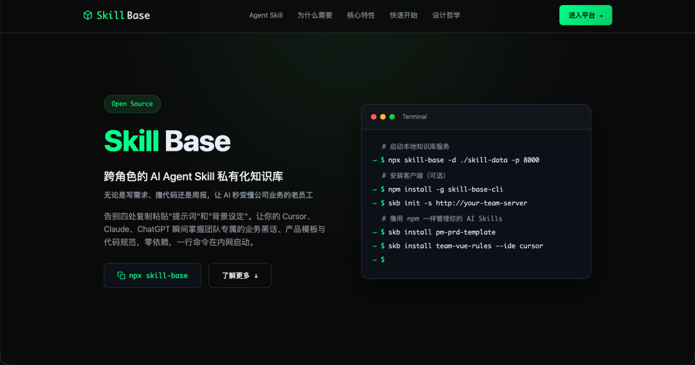
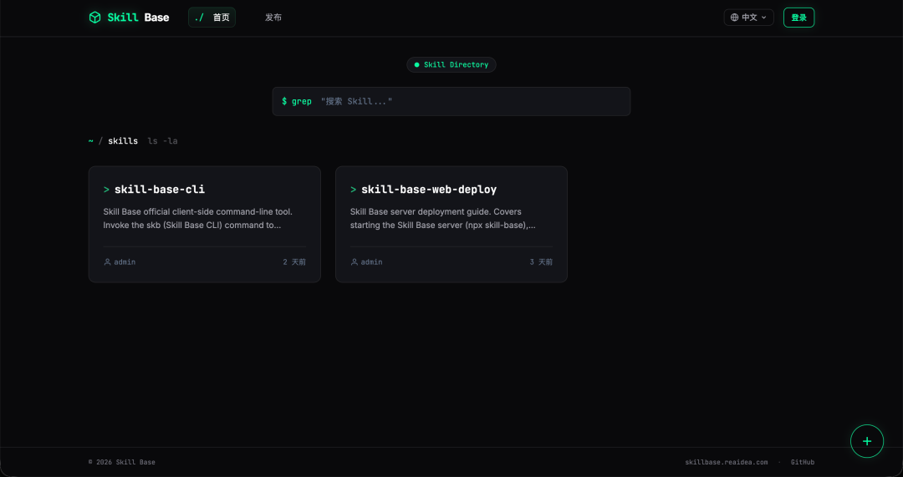
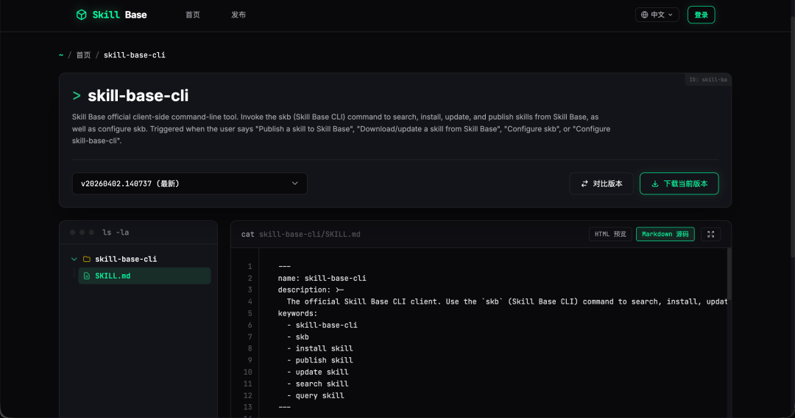
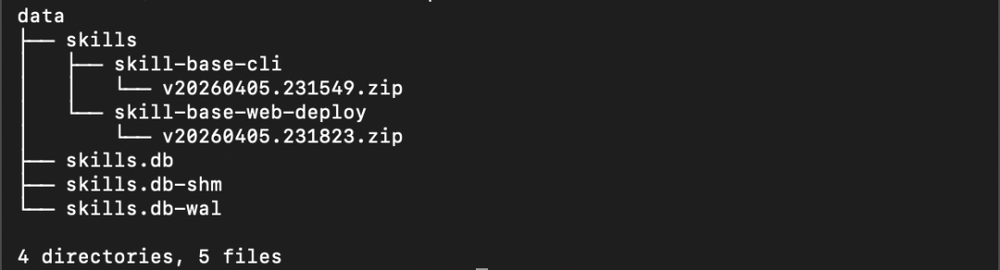

> 📎 来源: [杂货ZAHOO](https://mp.weixin.qq.com/s?__biz=MzIxMzE0ODU2OQ==&mid=2650284861&idx=1&sn=9b8e53a83d3e7a3403fe2e9bf30b5772&chksm=8e4f0698ea7bc2f98c4214e44da533ce671405d47001a5afa6abecae1046eff57f9e1c9154bc&mpshare=1&scene=1&srcid=0517aUDeGFSrdJJaqaNxrtiz&sharer_shareinfo=db811dbabf0d917f5545b51707e42a60&sharer_shareinfo_first=db811dbabf0d917f5545b51707e42a60) | 时间: 2026-05-17 23:37

---

在 2026 年的今天，用 AI 助手写代码/文档早就不是新鲜事。随着Agent skills的流行，一些团队也已经习惯了把团队的最佳实践写成 Skill，塞进项目的 `.cursor/skills` 或者 `.claude/skills` 目录里，跟着代码一起用 Git 同步。

**但随着团队里用 AI 的人越来越多，这种做法的弊端会逐渐暴露：**

1. 1

   **IDE 碎片化灾难：** 团队里有的人用 Cursor、Claude Code、Qoder，有的喜欢用 OpenCode、Windsurf。各个 IDE 对 Skill 目录的要求完全不同，规则怎么同步？
2. 2

   **“非研发人员”被拒之门外：** 产品经理 (PM) 和测试 (QA) 也需要用 Skill 写 PRD、写测试用例。但难道为了用个提示词，还要给他们开代码仓库的权限、教他们用 Git Pull 吗？
3. 3

   **跨项目复用极差：** 公司的“通用接口鉴权 Skill”，在 A 项目更新了，B 项目还得手动拷一份。

如果你也受够了这些痛点，那你一定要试试我刚开源的这个小工具：**Skill Base —— 专为中小团队打造的 Agent Skill 私有化分发平台。**







### 📦 亮点一：一处更新，本地处处同步

你以为 Skill Base 只是个存文件的网盘？不，它的杀手锏在配套的 CLI 客户端。

当你在本地通过 `skb install` 安装某个 Skill 时，**CLI 会记住这个 Skill 被安装到了哪些项目的哪些 IDE 目录里**（无论是 `.cursor/skills` 还是 `.claude/skills`）。

当团队规范发生变更，某人在内网发布了新版本，你只需要敲一行：

```
skb update some-skill
```

CLI 会自动帮你找到该Skill在本地关联的所有目录，**可以一键将所有目录下的旧 Skill 替换为最新版！** 彻底告别“复制粘贴一上午，漏改一处出大 Bug”的窘境。

更过瘾的是，现在可以实现 **“AI 自动闭环更新”**：

有时在开发或者使用过程中发现现有版本的Skill需要补充完善，只需让 AI 自己修改 Skill，然后调用 `skb publish` 传到内网，AI连 Changelog 都自动填好了。别的同事一敲 `update`，直接用上热乎的新规范。

### 🤝 亮点二：把 Skill 剥离代码仓库，全员可用

代码仓库是写代码的，不应该成为团队知识的瓶颈。

Skill Base 是一个独立部署在内网的服务（支持 Node / Docker 一键拉起），通过网页端或 CLI 提供服务。

**现在的工作流变成了这样：**

- **研发：** 终端敲 `skb install some-skill` 安装使用Skill。
- **测试 / PM：** 直接登录内网的 Skill Base 网页端，搜索 `prd-skill` 或 `test-skill`，一键下载最新的技能包到本地。

不用给 PM 开 Git 权限，也不用教他们敲命令，团队上下在同一个基准线上被 AI 伺候。

### 💾 亮点三：天生契合 GitOps 的极简数据结构

作为一个基建平台，数据备份往往是最让人头疼的。但 Skill Base 的底层设计极其克制，采用了纯文件 + SQLite 架构。

看看它服务端的数据目录结构，简直是强迫症福音：



**怎么做容灾备份？**

根本不需要写复杂的 mysqldump 脚本！只要在这个数据目录下跑一个定时任务：`git add . && git commit -m "backup" && git push`。

所有的 Skill 版本包（轻巧的 zip）和数据库索引，完美融入你们现有的 Git 基建中，随时可以回滚。

### 🦦 彩蛋：终端里的卡皮巴拉 (Cappy)

###

###

###


为了缓解大家修 Bug 和等发版时的焦虑，如果启动服务时加上 `--cappy` 参数，终端里会多出一只名叫 Cappy 的 ASCII 卡皮巴拉。

好玩的是，它通过底层的生命周期 Hook 和真实的系统请求联动：

- 当有同事发布了牛逼的新 Skill，它会冒出电火花 `⚡` 努力工作，感慨：“希望它的代码没有过度设计。”
- 当大家疯狂拉取规范时，它会发呆：“代码开始流通，Cappy 觉得很赞。”

没有过度设计，只有极简、稳定、和一点点反内卷的浪漫。

---

如果你的团队已经在深度使用 Agent Skills，强烈建议你们花5分钟把 Skill Base 跑起来。统一的规范，才是驾驭 AI 的终极魔法。

👉 **GitHub 开源地址：**github 搜索 ginuim/skill-base (如果喜欢，别忘了点个 ⭐ 喂一下 Cappy)

👉**Docker 一键运行：**`下载源码后docker run -d -p 8000:8000 -v ./data:/app/data skill-base:latest`

查看原文访问官方网站
