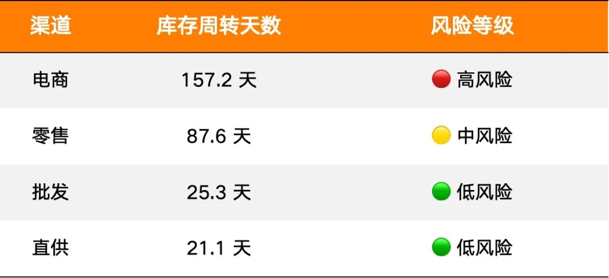
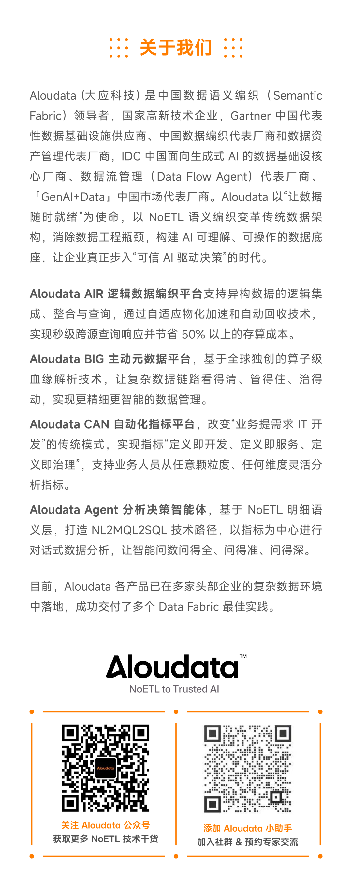

> 📎 来源: [Aloudata](https://mp.weixin.qq.com/s?__biz=Mzk0NjYzMjU4NA==&mid=2247493780&idx=1&sn=16675ee08486a5d6d0b5cece604381c6&chksm=c2db70ba89a1fafce28529df730e40ce62882028bd4299055b4829cbfff9a3e1d499efae885e&mpshare=1&scene=1&srcid=0420UsjMjaiRVIFHmWwGBVoi&sharer_shareinfo=d2a9b8c880dc600116f59e9632e5010d&sharer_shareinfo_first=d2a9b8c880dc600116f59e9632e5010d) | 时间: 2026-04-20 20:44

---

第一期我们让小龙虾接上语义层，它学会了查数和归因。第三期我们换了一个完全不同的业务场景——库存——还多装了四个分析 Skill。同样是你问它答，但每一步回答的深度变了。这篇是完整记录，没时间看视频的话读这篇就够了。

视频在这里 ↓

***01***

**这期装了什么？**

环境还是上次的，metric-query 查指标、metric-attribution 做归因，两个老朋友还在。这期加装了四个新 Skill：

- **anomaly-detection**，判断指标正不正常。给它一段时间序列，它算基线、定区间、做判断，告诉你是真异常还是正常波动。

- **forecast-simulation**，预测趋势和模拟假设场景。你能问「30 天后库存到什么水位」，也能问「如果销量涨 30% 会怎样」，两种情景它都能算。

- **analysis-report**，总编角色——它自己不做分析，它知道一份完整报告应该包含什么内容，然后调度其他 Skill 干活，最后串成一份有叙事线的文档。

- **scheduled-report**，把一轮对话里做过的分析流程录制下来，设成定时任务，以后自动重跑。

六个 Skill 加在一起形成了三层：底层是能力层（查数据、做分析），中间是编排层（组织报告），上面是调度层（定时执行）。架构清楚，各司其职。

***02***

**全局看没问题，渠道看冰与火**

这期换了一个完全不同的业务场景——库存，展示分析 Skill 在实际对话中怎么跑。

注意这句话和第一期的区别。第一期问的是「上月销售额多少」——指标、时间都是明确的。这次只说了「库存有没有异常」，看什么指标、看多长时间、怎么定义异常，全部没指定，交给 anomaly-detection 自己来。

它先去语义层搜了一圈，找到三个核心库存指标：库存量、库存市值、库存周转天数。这些指标名不是硬编码在 Skill 里的，是从语义层搜回来的——换一个客户的语义层，它找到的就是另一套，分析框架跟着变。然后拉了近 30 天逐日数据，用 3σ 原则做基线检测。结果三个指标全绿，无异常。库存量 3 月中旬到过 4448 件峰值，之后随销售消化回落到 3916 件，周转天数从月初 91 天持续优化到 47 天——趋势健康，波动平稳。

**到这一步，如果你只看全局，你会觉得库存管得不错。**

既然整体没问题，想知道按这个速度走，一个月后大概到哪。forecast-simulation 没有重新调 API 取数，直接复用了上一步已经拿回来的 30 天数据——多个 Skill 协作，不做重复劳动。

计算逻辑：近 30 天库存从 4111 件降到 3916 件，日均下降约 6.72 件，30 天后预测值约 3714 件。它还附上了前提假设：预测成立的前提是销售节奏和补货节奏与过去 30 天保持一致，无大型促销或供应链异常。把假设摊开来，是分析师该有的态度。

预测是基于「现状不变」的假设。如果公司要搞大促、销量涨了三成，库存撑不撑得住？

forecast-simulation 的 What-if 模拟：销量 +30%，保持现有补货节奏，30 天后库存约 2969 件，压力缓解但完全可控。它还主动算了极端情景——若销量 +30% 的同时完全停止补货，现有库存只够撑约 36 天，30 天后只剩 684 件，再撑 6 天就断货。它主动告诉你：搞促销的时候别忘了安排补货。 这种多算一步、主动提醒边界的习惯，是分析师和计算器的区别。

到这里，三轮分析全在说：整体没问题。

把渠道维度打开。Agent 先确认了库存指标支持渠道维度，然后按一级渠道查出最新数据，输出风险分级表：

全局均值 47 天，背后是电商积压五个月、零售逼近红线、批发直供周转飞快。同一个平均数，掩盖了两个截然不同的处境。

**全局均值是最容易骗人的数字。**

Agent 给出的不只是这张表——还跟了风险结论和行动建议：电商建议 618 预售清仓、直播清库，零售建议减少下季度补货量 20% 加会员折扣，批发直供保持现状。

**第一期的 Agent 会告诉你「电商库存 1221 件」，这期的 Agent 会告诉你「电商积压严重，建议 618 预售清仓」。** 两步之差，质变。

前面做了异常检测、趋势预测、压力测试、渠道风险分级，散落在对话里，不方便给供应链同事看。一句话让它出正式报告——analysis-report 接管，确认报告结构，调度已经完成的四项分析，串联成完整文档。

第一版是 Markdown。内容挺全的，但排版嘛——小龙虾的分析能力是上来了，审美还是个理工直男。让它重新生成 HTML 格式，浏览器打开，核心摘要、指标概览、渠道风险矩阵、行动建议，一套下来有结构有叙事，像点样了。

最后设成每周一 10:00 定时执行。scheduled-report 把这轮对话的分析步骤录下来，时间参数换成相对日期，以后每周自动重跑一遍完整的库存健康分析，生成 HTML 报告保存到本地。从一次性的临时分析，变成了常规运营工具。

***03***

**但我们最想说的是**

虽然本期重点展示了几个新的 Skill，但其实我们更想说的是语义层与 Skill 的乘数效应。

第一期装了 2 个 Skill，Agent 学会了查数和归因。这期再装 4 个，Agent 多了异常检测、趋势预测、报告编排、定时执行。6 个 Skill 加在一起，覆盖了一个完整的分析闭环：发现问题 → 预测走势 → 压测边界 → 归因溯源 → 整合报告 → 自动重放。

这不是功能叠加，是分析能力的闭环。有了这个闭环，下一个新场景——比如会员复购健康度、门店坪效监控、毛利结构分析——只需要写一个新的分析 Skill，嵌入闭环里的对应节点，Agent 就能覆盖。范围扩大，架构不变。

传统 BI 要覆盖新场景，要么等供应商更新版本，要么自己改仪表盘，数据也不可能无限灵活供给；Agentic Analysis 的「版本升级」是写一个 Skill——一份把分析方法论编码进去的文档。**语义层提供确定性的数据基础，Skill 承载可积累的分析方法论，两者加在一起，让 Agentic Analysis 具备了持续扩展的能力**。

但有一件事要说清楚：Skill 的壁垒不在于生成速度和数量。让模型批量输出 50 个 Skill 文件不是难事，但好不好用，取决于背后编码了多深的分析能力：

- anomaly-detection 需要知道什么场景下 3σ 是合适的、什么场景下它会失灵、检测阈值怎么设才不会误报；
- forecast-simulation 需要知道线性外推在什么条件下有效、前提假设怎么声明、边界情景怎么设计。

这是初级分析师和中级分析师之间真实的能力差距——装进 Skill 之后，Agent 就在这个层面上运作。

**Skill 能把分析天花板抬高，但抬多高，取决于写这个 Skill 的人有多深的分析功底。**

**btw，我们选了个很普通的模型来验证 Agentic Anaylis 的下限，如果你能用更好的模型（以及 Agent），结果会很惊艳……**

**下**

**期**

**预**

**告**

分析做到这里，还差一步。

Agent 发现了电商库存积压 157 天、零售逼近红线——但供应链团队拿到这份报告，接下来做什么？618 预售打几折？哪些 SKU 优先清？零售要减补货，减多少？这些，数据分析回答不了。

下一期，我们给小龙虾装一个库存策略 Skill。不是更深的统计方法，而是业务决策框架。Agent 的角色从分析师，升级成业务领域的策略师。

***资源获取***

- **第三期完整演示视频**

链接：https://weixin.qq.com/sph/AwM4ncOgz

- **四个 Skills**

|  |  |
| --- | --- |
| Skill | **链接** |
| anomaly-detection | https://clawhub.ai/jackyujun/aloudata-anomaly-detection |
| forecast-simulation | https://clawhub.ai/jackyujun/forecast-simulation |
| analysis-report | https://clawhub.ai/jackyujun/analysis-report |
| scheduled-report | https://clawhub.ai/jackyujun/scheduled-report |

*注：demo 环境的数据在视频录制后又有修改，你得出的结论会跟我们不同，但不影响这些 skill 的体验。*

- **第一期视频 + 文章**

[《给小龙虾装上业务大脑：两个 SKILL 让 OpenClaw 学会查数和归因》](https://mp.weixin.qq.com/s?__biz=Mzk0NjYzMjU4NA==&mid=2247493741&idx=1&sn=3676eaeae7628b0f6b50a6dcca072877&scene=21#wechat_redirect)

- **第二期视频 + 文章**

[《Text-to-SQL 没有答错，但答案不一定是你要的那个》](https://mp.weixin.qq.com/s?__biz=Mzk0NjYzMjU4NA==&mid=2247493759&idx=1&sn=4f07f31434799becb309c58a9de95f49&scene=21#wechat_redirect)

- **申请 Aloudata CAN Demo 环境 API Key：**

有问题欢迎在评论区留言。

点击**“阅读原文”**进入 Aloudata 官网，或**长按二维码，加入技术交流群**，了解更多产品及最佳实践信息，期待您的留言、反馈、分享和交流。

[从 OpenClaw 到企业 Agent：为什么真正的门槛在语义层](https://mp.weixin.qq.com/s?__biz=Mzk0NjYzMjU4NA==&mid=2247493707&idx=1&sn=278b10db396c0db7a90e0d1afbf5599e&scene=21#wechat_redirect)

[Snowflake SVA vs Aloudata CAN：两种语义层哲学的深度对比](https://mp.weixin.qq.com/s?__biz=Mzk0NjYzMjU4NA==&mid=2247493681&idx=1&sn=bed9aca2607445f1491fb5797efe474e&scene=21#wechat_redirect)

[Gartner：40% 的 AI Agent 项目注定被砍](https://mp.weixin.qq.com/s?__biz=Mzk0NjYzMjU4NA==&mid=2247493694&idx=1&sn=af952cb28132ace98aee5ea5351f7ba9&scene=21#wechat_redirect)

