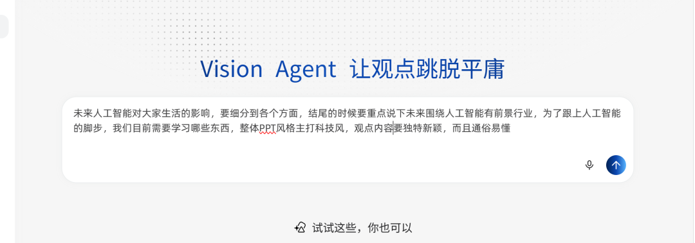
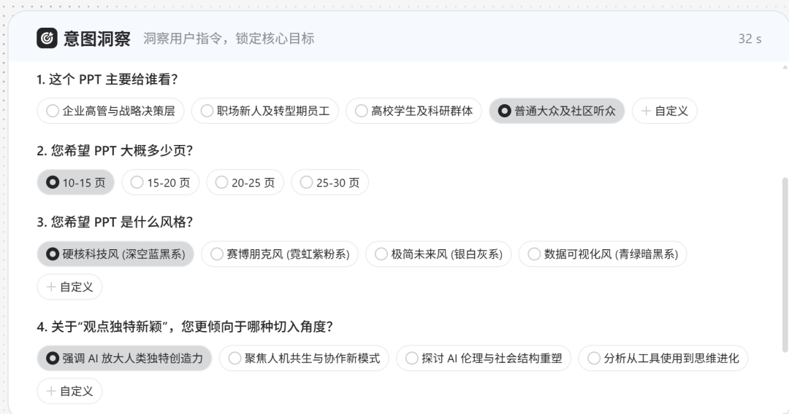
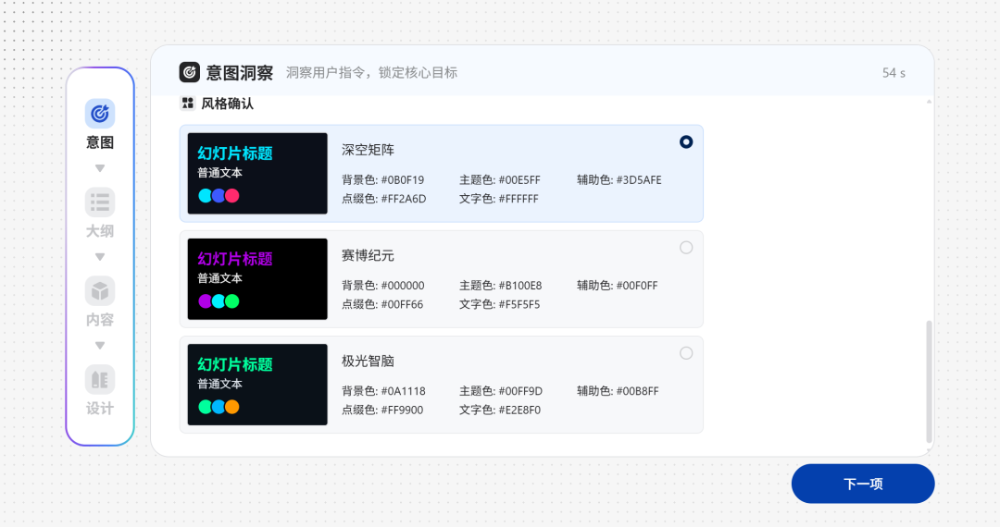
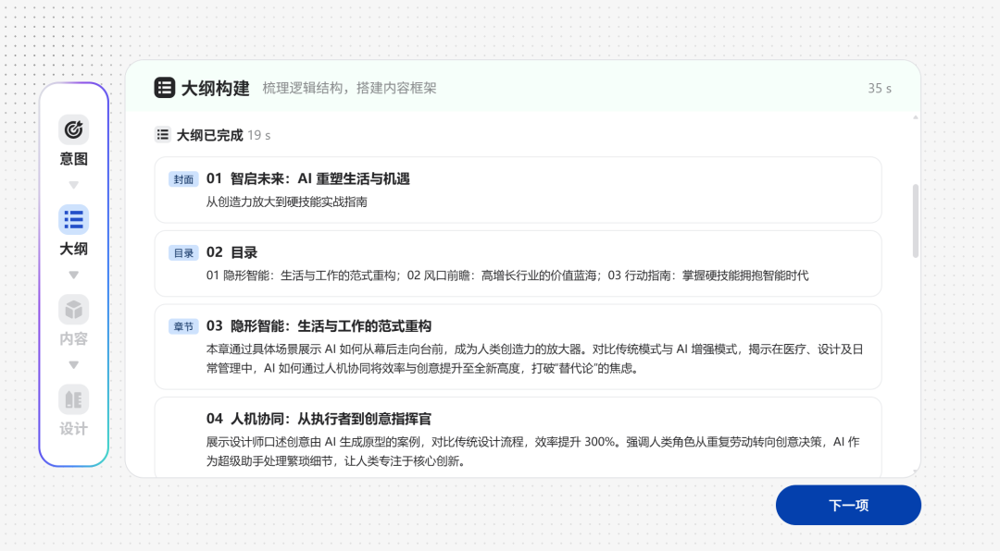
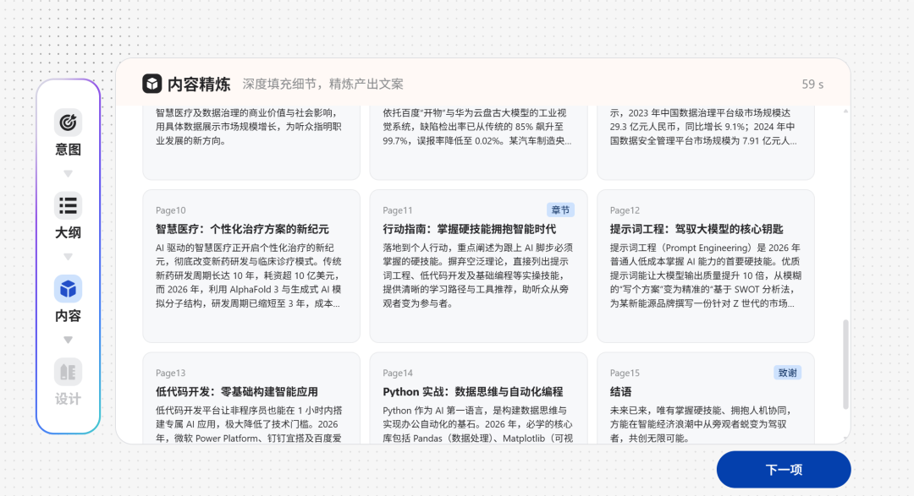
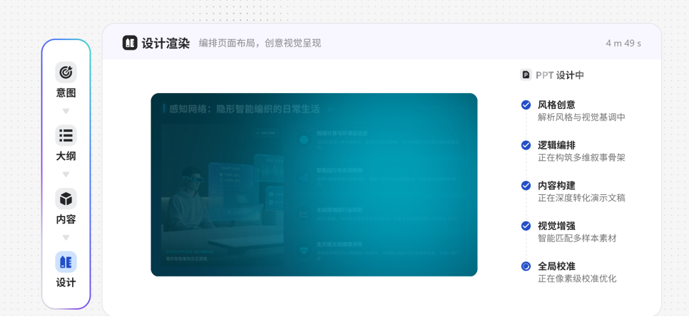

> 📎 来源: [往事乌托邦](https://mp.weixin.qq.com/s?__biz=MzI3MDI2MTM4Mg==&mid=2247483968&idx=1&sn=a374eb9b8a8027969d7a094ccc2b8d02&chksm=eba39bb87efeda31ed0c6e1c3d31396cde3c468e52c8a66c3f1daba95025bdf87ac54a298227&mpshare=1&scene=1&srcid=0509fPG13fNxJQgDmjragGPu&sharer_shareinfo=1cdc328cdeb816aa9f7fc0c62776af8a&sharer_shareinfo_first=1cdc328cdeb816aa9f7fc0c62776af8a) | 时间: 2026-05-09 23:16

---

科技改变生活，AI赋予未来，之前大家都使用过AI写PPT，But那是1.0版本，大部分内容需要自己修正，而且生成的PPT之前都是先挑模板，再往里填内容，这种方式最大的弊端是内容和排版很难同时做好，但是2.0时代不一样，一句话就能生成一份完美的PPT，内容主打科学性、逻辑性、没有1.0时代那种东拼西凑的“PPT味，最后还能自动校准。从无到有7分8秒我只用了一句话，不多说今天带大家沉浸式体验一下：

一、打开界面输入提示词：下面是我给的提示词，提示词最好观点明确，把自己的逻辑说明白点。

二、意图洞察，这个很人性化，就是让他知道你是站在什么角度，用什么的风格和角度来生成这份PPT，这样时候能出出来的东西更贴合需求，本环节耗时32秒。

三、大纲构建，根据你的提示词，进行全网搜索，提炼关键数据，里面的内容也可以手动修改，生成PPT的大纲，此环节耗时35秒。

四、对搜索的数据进行提炼，编辑和校准，确保数据的合理性，逻辑性和简洁性，最终生成文化，里面的内容也可以手动修改，此环节耗时59秒。

五、进入设计渲染和全局校准环节，对内容进行排版，构建生成PPT风格，视觉感进行优化，初步生成后对PPT全局进行自动校准，最终生成目标

PPT，此环节耗时4分49秒。

完工，这篇PPT最终耗时32+54+35+59+289=469秒，合计7.8分钟，这就是最后成品：

需要相关网站地址和最终PPT关注公众号找我要
