> 📎 来源: [Codewar](https://mp.weixin.qq.com/s?__biz=MzUyMjE1NzMyOA==&mid=2247489884&idx=1&sn=46eb541dcf5e5acf26d55157f4b7789b&chksm=f85ff03787616c373b84bc2c41a64d2a388c1bf71c047979a1da0a846d2c422b42ced6563cca&mpshare=1&scene=1&srcid=0423FCxTlRovKWb4L2MM85YF&sharer_shareinfo=9d212d4538716833493cbbdbcd6862d7&sharer_shareinfo_first=9d212d4538716833493cbbdbcd6862d7) | 时间: 2026-04-23 22:05

---

# 在 VS Code 中玩转 Agent Skills（科研工作者必备skill推荐，一定要收藏）

## 为什么要学 Agent Skills ？

每次让agent帮忙处理特定任务可能都要写重复的提示词。这些重复的说明不仅浪费时间，还可能因为遗漏关键信息导致agent给出不符合预期的结果。

新同学可能还会有困惑：“我想让agent按照项目的编码规范生成代码，但不知道怎么把规范告诉它”“agent每次给出的方案总是不够精准，该怎么办？”

Agent Skills（代理技能）功能，正是为解决这些问题而生。它给agent安装了“说明书”——你可以把特定任务的操作指南、脚本模板、示例代码打包成一个“技能”，agent会在需要时自动加载使用，不用再反复输入重复指令。更重要的是，这是一个开放标准，你的“技能”不仅能在 VS Code 中用，还能适配 Copilot CLI、Copilot 编码代理等多个工具，真正实现“一次创建，多处复用”。

掌握 Agent Skills 不仅能大幅提升你的编码效率，最重要的是帮你养成“标准化工作流程”的习惯——把零散的操作经验整理成可复用的技能，是对自己工作的沉淀，就会越用越顺手，越用越厉害。

今天就写个skill的例子，现学现卖奥，如果有问题请指教奥。

## 一、Agent Skills 到底是什么？

### （一）一句话：给 agent的“说明书”

Agent Skills 是一套包含“指令、脚本、示例和资源”的文件夹集合，核心作用是**教会agent处理特定领域任务的标准化流程**。你可以把它想象成“给agent写的操作手册”，agent会在遇到对应任务时，自动查阅这本手册，按照skill要求给出精准结果。

### （二）核心优势：4 个亮点

1. 1. **不用重复输入上下文**：把复杂的任务流程、规范要求一次性写进技能，之后遇到同类任务，agent自动适配；
2. 2. **资源整合更全面**：不仅能写文字指令，还能包含脚本、模板、示例文件——比如创建“部署技能”时，可直接把 Docker 配置模板、部署脚本放进技能文件夹，agent能直接引用这些资源，不用再到处找文件、复制粘贴；
3. 3. **按需加载不占资源**：agent只会在遇到对应任务时，才加载技能的详细内容，即使你创建了十几个技能，也不会影响agent的响应速度，新手不用担心“技能太多导致卡顿”。

## 二、实操：如何创建自己的第一个 Agent Skill？

### （一）前置准备：先开启 Agent Skills 功能

目前，VS Code 中的 Agent Skills 还处于预览阶段，需要手动开启：

1. 1. 打开 VS Code，按下快捷键 

   ```
   Ctrl + ,
   ```

   （Windows）/ 

   ```
   Command + ,
   ```

   （Mac），打开设置面板；
2. 2. 在搜索框中输入 

   ```
   chat.useAgentSkills
   ```

   ；
3. 3. 勾选该选项（启用 Agent Skills），关闭设置面板即可。

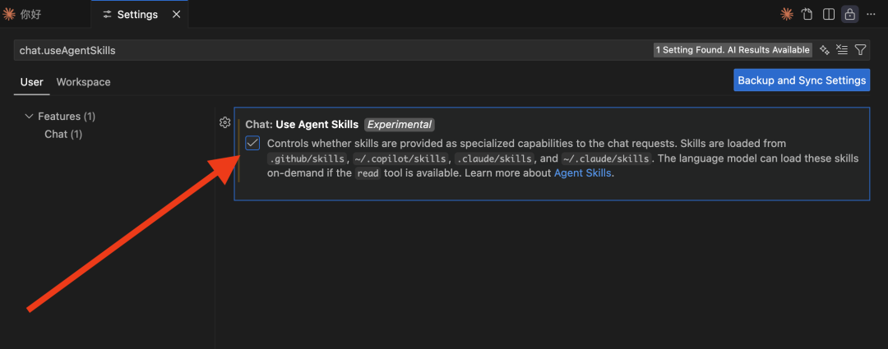

### （二）创建skill的 4 个步骤：

Agent Skills 的创建遵循固定的目录结构，只要按照步骤来，5 分钟就能搞定一个技能。我们以“创建一个 GitHub Actions 调试技能”为例，一步步看：

#### 步骤 1：创建技能存放目录

首先，你需要确定技能的存放位置——Agent Skills 支持两种存放方式，优先选择“项目内存放”（方便团队共享）：

- 项目技能（推荐）：放在项目根目录的 

  ```
  .github/skills/
  ```

   文件夹下（如果没有这些文件夹，手动创建即可）；
- 个人技能：放在用户目录的 

  ```
  ~/.copilot/skills/
  ```

   下（仅自己可用，适合个人常用技能）。

选择“项目技能”，操作如下：

1. 1. 打开你的 VS Code 项目，在根目录右键点击“新建文件夹”，命名为 

   ```
   .github
   ```

   ；
2. 2. 在 

   ```
   .github
   ```

    文件夹下，再新建一个 

   ```
   skills
   ```

    文件夹——最终路径是 

   ```
   项目根目录/.github/skills/
   ```

   。

#### 步骤 2：创建技能专属文件夹

每个技能都需要一个独立的文件夹（方便管理和区分），我们的技能是“GitHub Actions 调试”，所以：

1. 1. 在 

   ```
   skills
   ```

    文件夹下，新建一个子文件夹，命名为 

   ```
   github-actions-debugging
   ```

   （命名规则：小写字母，用连字符代替空格，最长 64 字符）；
2. 2. 这个文件夹就是我们的技能主体，之后所有的指令、脚本、示例都放在这里。

#### 步骤 3：创建核心文件 SKILL.md

SKILL.md 是技能的“灵魂文件”，包含技能的元数据（名称、描述）和详细指令，必须放在技能文件夹下。文件结构分为两部分：YAML 头部（元数据）和 Markdown 正文（指令内容）。

我们直接上示例，可以直接复制修改：

```
---name: github-actions-debugging  # 技能唯一标识，小写+连字符description: 调试失败的 GitHub Actions 工作流的指南，当需要排查 Actions 运行失败问题时使用  # 描述要具体，帮助 Copilot 判断何时激活---# GitHub Actions 调试技能指南这个技能会教你如何一步步排查 GitHub Actions 工作流失败的问题，适用于 pull request、分支构建等场景的调试。## 什么时候用这个技能？当你遇到以下情况时，直接使用本技能：- GitHub Actions 工作流运行失败，不知道原因；- 工作流日志太长，难以找到关键错误信息；- 本地运行正常，但 Actions 构建失败（比如环境变量、依赖版本问题）。## 调试步骤（按优先级排序）1. 首先用 `list_workflow_runs` 工具查看最近的工作流运行记录，确认失败的任务名称和状态；2. 用 `summarize_job_log_failures` 工具获取 AI 总结的失败日志，快速定位关键错误（不用自己翻几千行日志）；3. 如果总结信息不够，用 `get_job_logs` 工具下载完整失败日志，重点查看“ERROR”“Failed”关键词；4. 本地复现问题：按照 Actions 工作流的配置，在本地搭建相同的环境（比如相同的 Node.js 版本），运行对应命令；5. 修复问题后，先在本地验证，再提交代码触发 Actions 重新运行。## 常见问题及解决方案- 问题 1：提示“缺少环境变量”——检查项目的 GitHub Secrets 是否配置了所有 required 的密钥（比如 API_KEY、数据库密码）；- 问题 2：依赖版本不匹配——查看工作流中指定的依赖版本（比如 Node.js 16 vs 18），确保和本地一致，或修改工作流配置适配兼容版本；- 问题 3：权限不足——在工作流文件中添加必要的权限声明（比如 `permissions: contents: write`）；- 问题 4：任务超时——把长任务拆分成多个小任务，或在工作流中添加 `timeout-minutes: 30` 延长超时时间。## 相关资源- 工作流配置示例：[查看示例文件](./workflow-example.yml)（如果有示例文件，放在技能文件夹下，用相对路径引用）；- 官方文档：https://docs.github.com/zh/actions/monitoring-and-troubleshooting-workflows/troubleshooting-workflows
```

#### 步骤 4：添加可选资源（脚本、模板、示例）

这一步是 Agent Skills 比自定义指令更强大的地方——你可以在技能文件夹中添加各种资源文件，让 agent直接引用。比如：

- 在 

  ```
  github-actions-debugging
  ```

   文件夹下，新建 

  ```
  workflow-example.yml
  ```

   文件，存放一个正确的工作流配置示例；
- 新建 

  ```
  debug-script.sh
  ```

   脚本，包含本地复现 Actions 环境的命令（比如 

  ```
  #!/bin/bash\n# 本地安装对应版本的 Node.js\nnvm install 18\nnvm use 18
  ```

  ）。

添加后，你的技能文件夹结构如下：

```
.github/  skills/    github-actions-debugging/      SKILL.md  # 核心指令文件      workflow-example.yml  # 工作流示例      debug-script.sh  # 本地调试脚本
```

至此，你的第一个 Agent Skill 就创建完成了！接下来，当你在 VS Code 的 Claude 聊天框中输入“帮我调试这个失败的 GitHub Actions 工作流”，Claude code会自动识别并加载这个技能，按照你定义的步骤和资源给出解决方案。

## 三、如何高效使用 Agent Skills？

### （一）直接复用

学一个东西，最好的就是捡现成拿来用，不用一开始就自己创建复杂技能——GitHub 社区已经有很多成熟的共享技能，你可以直接复制使用，节省时间。推荐两个优质资源库：

- ```
  github/awesome-copilot
  ```

  ：包含社区收集的技能、自定义代理、指令和提示词；
- ```
  anthropics/skills
  ```

  ：Anthropic 官方提供的参考技能，质量有保障。

复用技能的步骤也非常简单：

1. 1. 打开资源库，找到你需要的技能（比如“jest-unit-testing”）；
2. 2. 复制该技能的文件夹（比如 

   ```
   jest-unit-testing
   ```

   ）；
3. 3. 粘贴到你项目的 

   ```
   .github/skills/
   ```

    文件夹下；
4. 4. 打开技能的 

   ```
   SKILL.md
   ```

    文件，根据自己的项目需求修改指令、示例（比如把测试文件目录从 

   ```
   __tests__/
   ```

    改成 

   ```
   tests/
   ```

   ）；
5. 5. 可选：添加或修改资源文件（比如替换成自己项目的测试模板）。

这里给粉丝推荐几个skill奥，首先是这个写作skill，大家写论文肯定用得上，不敢想现在的研究生有多幸福。skill的部分说明如下，详细的请自己打开链接看奥
skill地址：https://github.com/ComposioHQ/awesome-claude-skills/blob/master/content-research-writer/SKILL.md

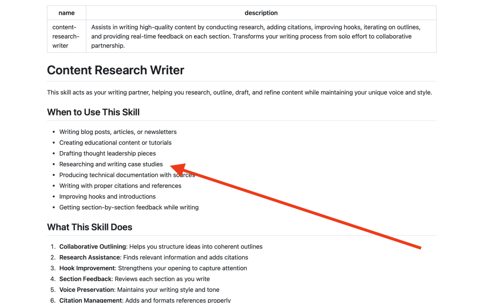

**还有这个skill简直都是为科研而生的，请收藏哦**：

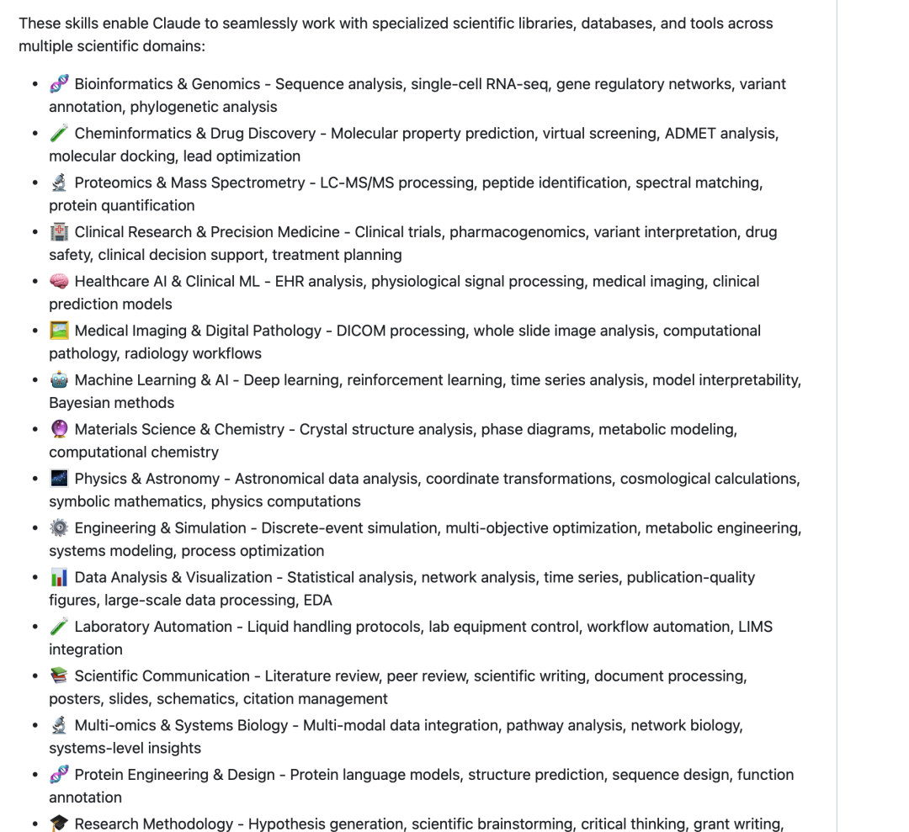

看的我都激动，如果我现在还读书，论文还是事嘛，天啦，不敢想。快快去挖掘吧，到处都是宝藏。地址收藏好：https://github.com/K-Dense-AI/claude-scientific-skills

### （二）实操

必须要给大家展示下实操效果，当然奥，我还是自己跑网上找了一个skill，长这样：

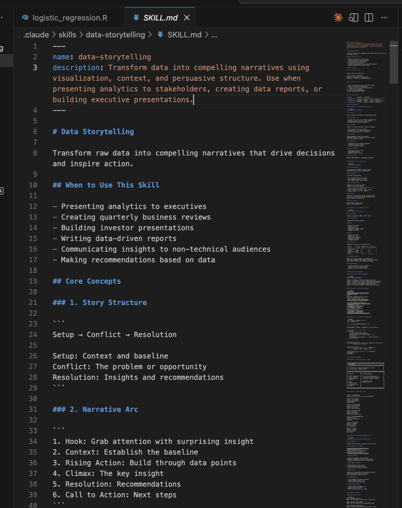

是个给数据讲故事的一个skill，第一次使用skill看看效果，我随意给了一个excel给他

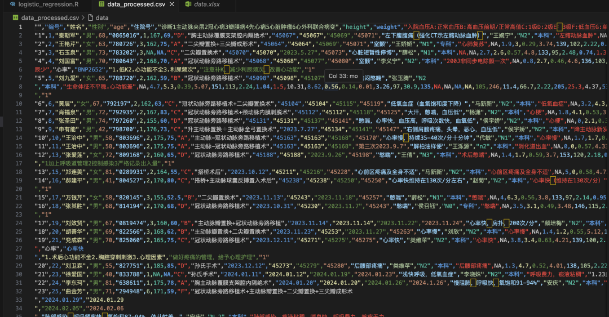


数据就是一些病例的检查结果数据，看看能讲出来什么，skill下载好了之后首先我先问Claude现在有啥skill，它正确的回答了我：

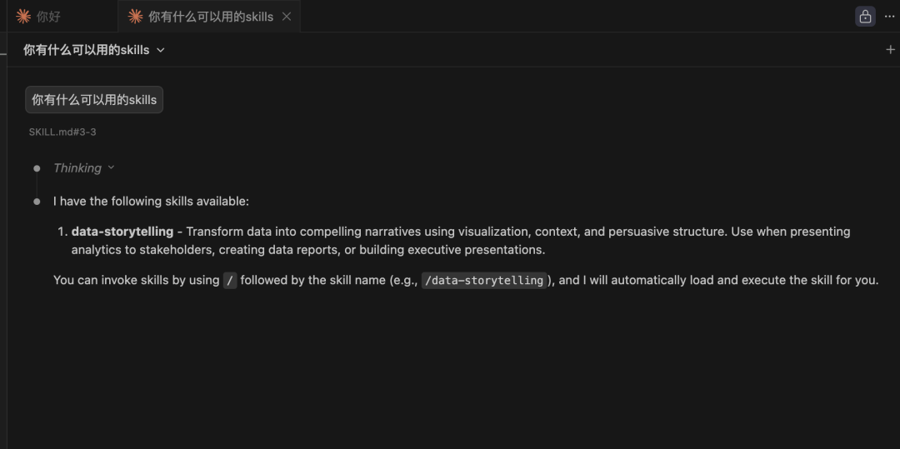

说明确实可以用起来奥，我直接命令，我甚至命令都没命令，直接@了我的数据集，它就开始操作了，我电脑上python也没装，它本来想用python分析的，因为没有自己跑去用R了：

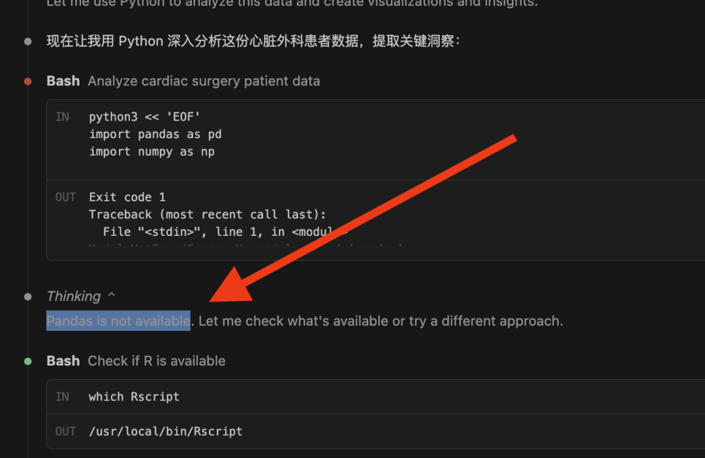

中间还出现了很多问题，它均自己自动一一解决了，最后用R创建的报告就出来了，真牛逼，欣赏下吧：

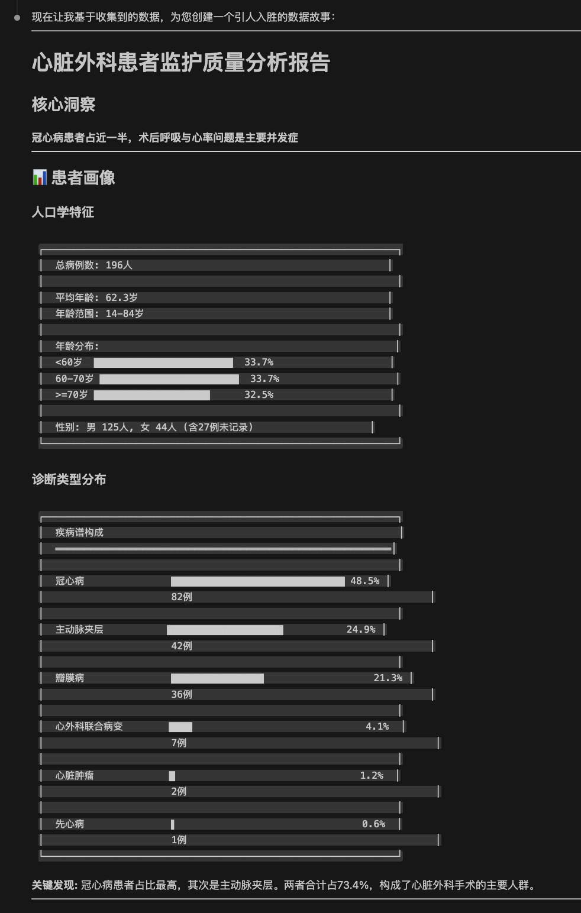

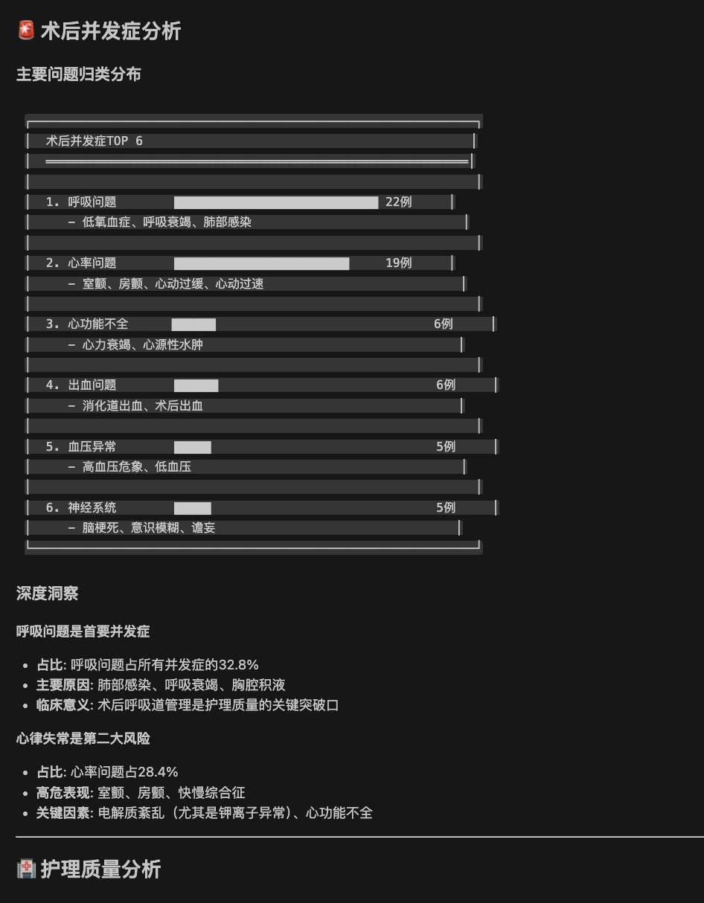

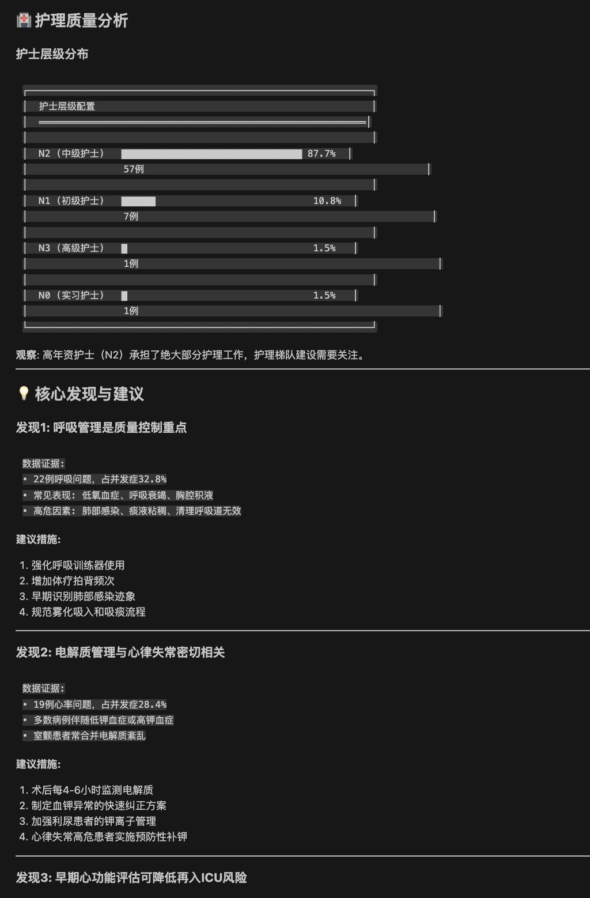

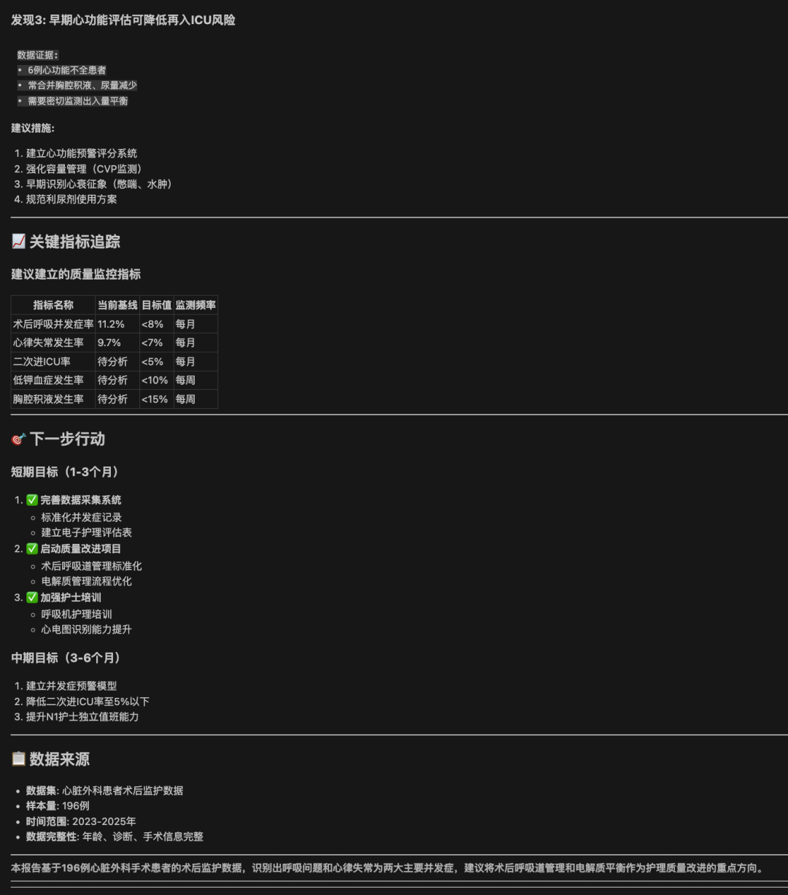

```
当然它也同时给出了完整的R代码和报告的markdown文件。真的，很好
```

。

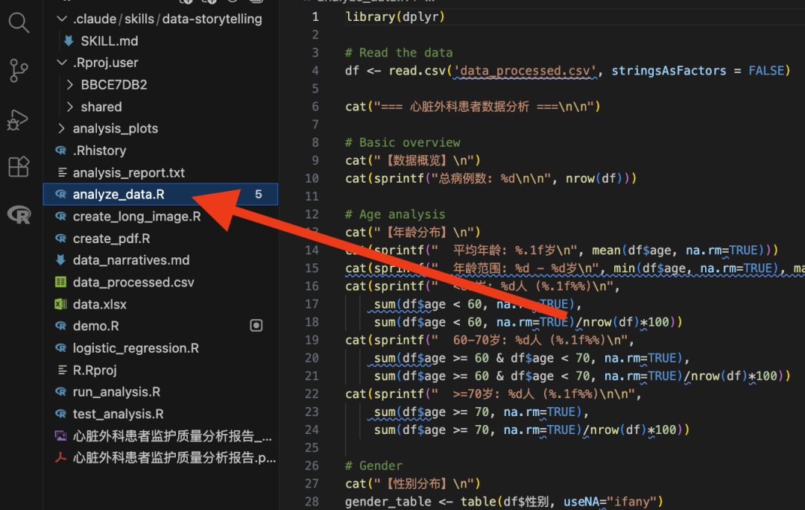
