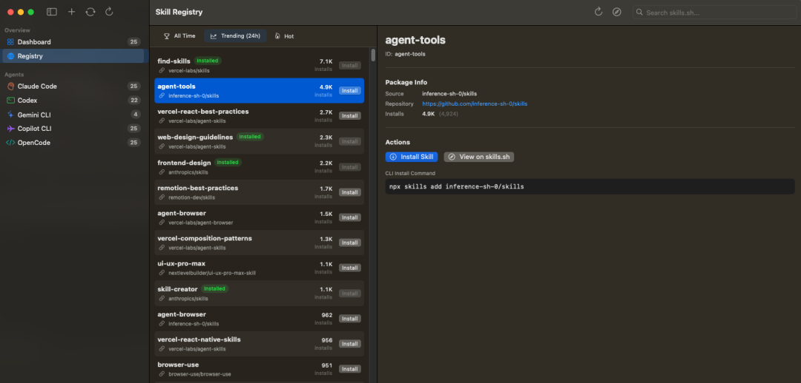
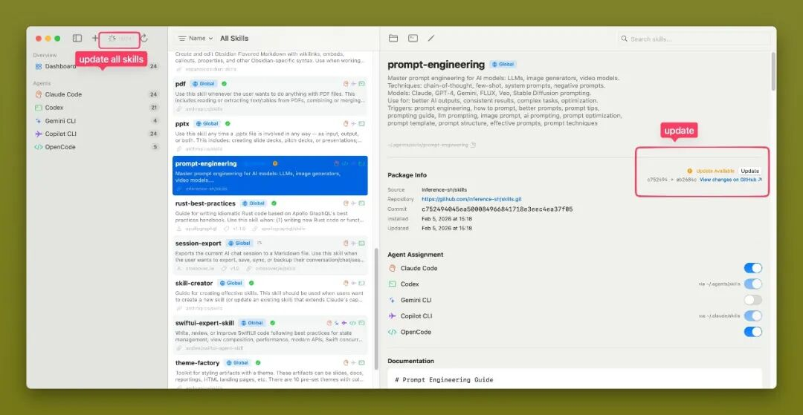
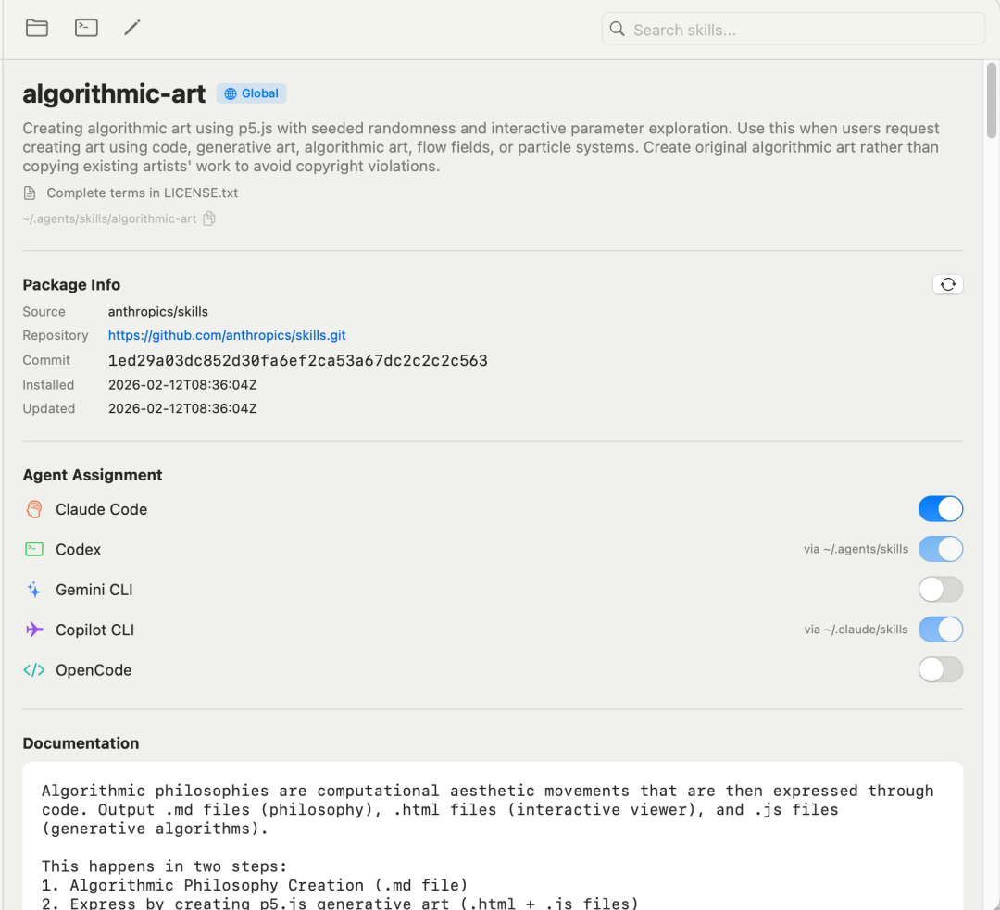

> 📎 来源: [Rico的设计漫想](https://mp.weixin.qq.com/s?__biz=MzA3MDc2OTQwMw==&mid=2456445936&idx=1&sn=9dd313884c4f8b4383247c1a5e17f4e2&chksm=89c9ffe76d8f7c6d973afc285406aeca020ddae04bf97fd9c7491abb25c4b24e32a5416cf97d&mpshare=1&scene=1&srcid=05017xsS6D0N7dKGM67SYtKj&sharer_shareinfo=7bc5cf2134342aee87c0084a698f0756&sharer_shareinfo_first=7bc5cf2134342aee87c0084a698f0756) | 时间: 2026-05-01 13:28

---

不知不觉积累了许多好用的 skills，但是管理起来也确实有些麻烦，尤其我同时用着多个 AI 工具，Skill 分散在不同目录，安装、更新、编辑、同步也浪费了不少时间。

有了痛点，所幸也找到了解决方案： SkillDeck - 一款管理所有的 Skills 的桌面客户端工具，支持 Claude Code、Codex、OpenCode、Antigravity 等主流 AI 工具。

开源地址：github.com/crossoverJie/SkillDeck



## SkillDeck - 解决管理 Skills 难题的开源客户端

它是一个非常简单的多代理 Skill 管理工具。各式各样的 Skills 已经多到让人眼花缭乱，但 Skills 管理的痛点却还少见有方案，SkillDeck 应该说是顺应而生的解决方案。



### 功能特性

- **多代理支持** — Claude Code、Codex、Gemini CLI、Copilot CLI、OpenCode、Antigravity、Cursor、Kiro、CodeBuddy、OpenClaw、Trae
- 
- **技能市场浏览** — 浏览 skills.sh 排行榜，并针对 OpenClaw 浏览 ClawHub 市场，支持搜索、排序和筛选
- **统一仪表盘** — 所有技能集中在一个 macOS 原生三栏视图中
- **灵活导入** — 支持从 GitHub 安装或从本地文件夹导入，并自动创建符号链接、更新锁文件
- **更新检测** — 检测远程更改，一键拉取更新
- **SKILL md 编辑器** — 分栏式表单 + Markdown 编辑器，支持实时预览
- **代理分配** — 通过符号链接管理，切换技能安装到指定代理
- **应用设置** — 支持全局字体设置和代理网络配置（HTTPS / SOCKS5、Keychain 凭证、绕过列表）
- **自动刷新** — 文件系统监控，即时响应 CLI 端的变更

## 安装

### 下载安装（推荐）

从 GitHub Releases 下载最新的通用二进制包：

1. 1. 下载 

   ```
   SkillDeck-vX.Y.Z-universal.zip
   ```
2. 2. 解压并将 

   ```
   SkillDeck.app
   ```

    移动到 

   ```
   /Applications/
   ```
3. 3. 首次启动时，macOS 会阻止未签名的应用。请执行以下命令：

```
xattr -cr /Applications/SkillDeck.app
```

或者：右键点击 → 打开 → 在弹出对话框中点击"打开"

### Homebrew

```
brew tap crossoverJie/skilldeck && brew install --cask skilldeck
```

### 从源码构建

需要 macOS 14.0+（Sonoma）、Xcode 15.0+、Swift 5.9+。

```
git clone https://github.com/crossoverJie/SkillDeck.gitcd SkillDeckswift run SkillDeck# 或在 Xcode 中打开open Package.swift    # 然后按 Cmd+R
```

运行测试：

```
swift test
```

## SkillDeck 优势

- 原生 SwiftUI + macOS 深度集成：启动飞快、UI 极致流畅、支持 macOS 14+（Sonoma 及以上），完全不像 Electron 那种“伪原生”应用。
- 文件系统即数据库：Skill 本质就是带 SKILL.md 的文件夹，SkillDeck 用 Swift Actor 保证线程安全，数据永不丢失。
- 零学习成本：下载 App 拖到 /Applications 就能用，Homebrew 一行命令安装也超简单。
- 跨代理标准化：11 个主流 AI 代码代理全部适配 Skill，未来新增代理也极易扩展。
- 免费开源 + 持续更新：作者活跃维护，最近几天还在加新功能，欢迎 PR。

## 最后

对比手动管理 Skill 一是耗时、并且数量多上来了容易遗忘，而用 SkillDeck 可以清晰的一站式可视化，又能做到监测文件变化自动更新、做到实时同步，这确实解决了实际问题。

不管你是重度 Claude Code 用户，还是多代理切换党，都强烈建议你立刻安装试用，试试导入一个 GitHub Skill 或浏览 skills.sh 市场，把自己的注意力专注到项目上。

我是 Rico，

关注分享更多 Vibe Coding 知识！
