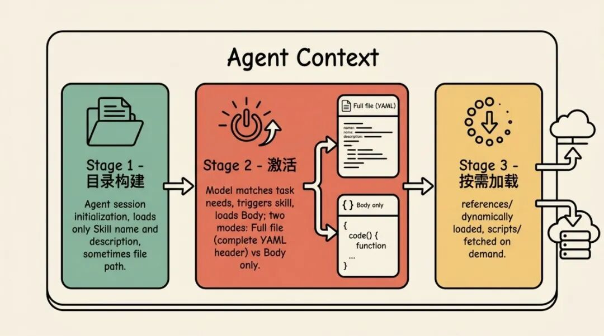
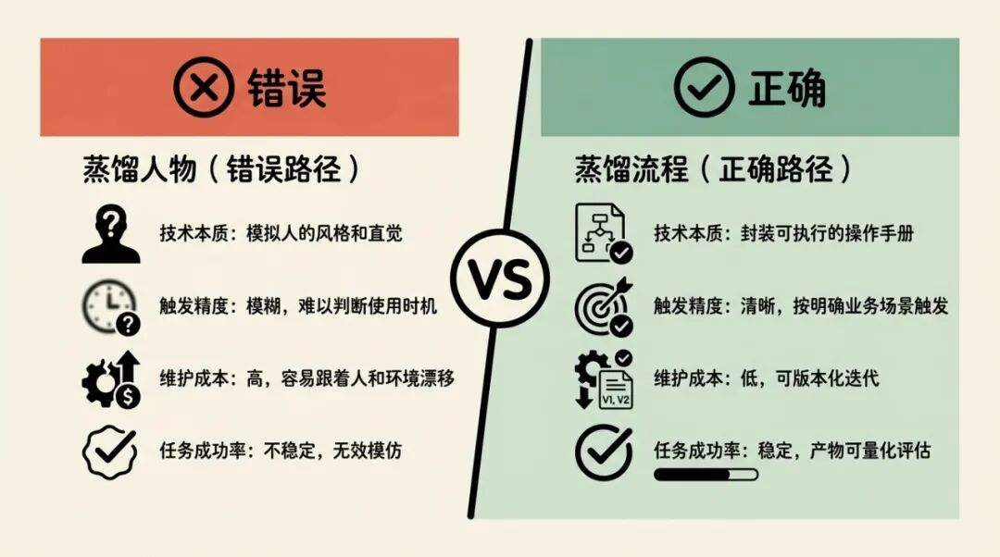
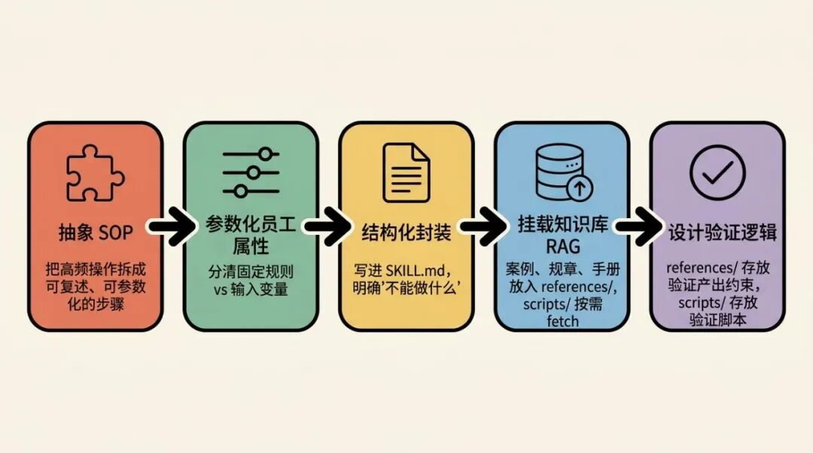
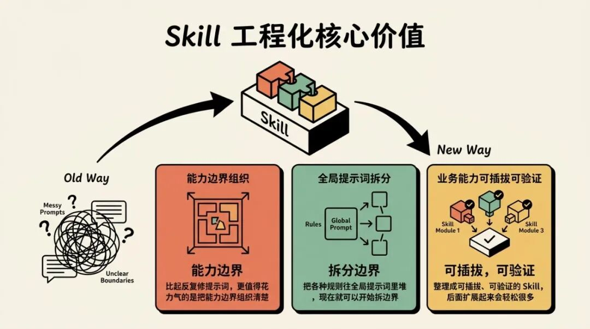

> 📎 来源: [芯火丹师](https://mp.weixin.qq.com/s?__biz=MzIwMzIzODcyNA==&mid=2247483678&idx=1&sn=941ee2c1eddc4666dd39ae1df27c3d6b&chksm=97ed28f8626e79cf47dc1acbc94b55a6e3105779141c0ff828887746369d606eda9bdf8d9c19&mpshare=1&scene=1&srcid=0420H5dtIaBmjZEcqoZ42cyk&sharer_shareinfo=fa87b033bc3102df5372972c95a3cc89&sharer_shareinfo_first=fa87b033bc3102df5372972c95a3cc89) | 时间: 2026-04-20 21:28

---

AI Agent 工程化，从过往的"提示词工程"、"上下文工程"逐渐走向"Harness 工程"，"Skill 模式"基本是绕不过去的一步。

变化主要在设计重点上，Agent 开始从对话（零散的LLM工具调用）转向组织能力（AgentLoop为主的模块化框架）。同样的基座模型，能不能拉开差距，就看各个模块的评估体系有没有完备、成熟。

这些模块中，其中一块不可或缺的一个，就是今天要聊的 Skill。

## 一、Skill 的技术本质与 Agent 载入原理

Skill 和 Prompt 不在一个层面，它更接近一个标准化的能力封装层。它把能力拆到文件结构里，让这些能力可以被索引、版本化，也可以按需插拔。Skill 主要包含以下内容：

- 标准化文件夹：通常用 

  ```
  kebab-case
  ```

   格式命名。
- 核心文件 

  ```
  SKILL.md
  ```

  ：放在上述的文件夹内，内容包括

  ```
  YAML
  ```

  头和 Body（具体的 SKILL 内容）
- 脚本 

  ```
  scripts/
  ```

  ：复杂计算、格式处理这类确定性工作尽量交给脚本。代码是确定的，大模型的理解和输出不是。
- 参考资料（

  ```
  references/
  ```

  ）：放技术文档、API 指南之类的材料，别把所有东西都塞进主指令里。
- 资源（

  ```
  assets/
  ```

  ）：模板、静态资产或其他复用材料。

YAML头中内容看起来像这样：

```
name: my-comprehensive-skill
```

大模型在长上下文里会出现"上下文腐蚀"（Context Rot）：上下文一长，注意力就会被摊薄，决策质量、指令遵循能力也会往下掉，通常在 300k-400k tokens 之后会更明显。Skill 用"渐进式披露"（Progressive Disclosure）把这个问题拆开处理：

1. Agent 会话的初始阶段（构建技能目录时）：大模型的上下文中通常只会加载 Skill 的 

   ```
   name
   ```

    和 

   ```
   description
   ```

   （有时会包含 Skill 文件路径）来构建可用的技能目录。在这个阶段，YAML 头部中的其他字段是**不会**被载入到上下文中的。
2. Skill 被意图识别命中激活阶段（Agent 决定调用该技能时）：当大模型匹配到任务需求并决定触发该技能时，会按需加载 Skill 的 Body 部分。而是否加载

   ```
   YAML
   ```

   头中的其他字段则完全取决于 Agent 读取技能文件的方式：

- 保留完整文件（Full file）模式：模型会读取包含完整

  ```
  YAML
  ```

  头内容的整个 

  ```
  SKILL.md
  ```

   文件。此时，YAML 头部的其他字段会被载入上下文，例如 

  ```
  compatibility
  ```

  （兼容性）字段可以在此时为模型提供环境要求说明，从而影响模型执行指令的方式。这在基于"文件读取（File-read）"来激活技能的实现中非常自然和常见。
- 仅正文（Body only）模式：也有许多 Agent 实现是使用专用激活工具（Dedicated tool）加载 Skill 正文，系统会在解析阶段主动剥离（Strip）YAML 前置内容，仅将 Markdown 格式的操作指令正文返回给模型。在这种模式下，除了已经被读取的 

  ```
  name
  ```

   和 

  ```
  description
  ```

   之外，其他的 YAML 字段都不会进入模型的上下文。

3. `SKILL.md正文中提及的 `scripts/`、`references/`、`assets/` 在指令明确要求时，按需加载到上下文中。`



由此可见：

1. Skill 的 

   ```
   description
   ```

    尽可能在保持简短的前提下说明这个 skill 在什么条件下触发，不能只是功能简介，"适用于" 比 "我能做什么"更有效。
2. 一个 Agent 会话中也不宜出现多个功能类似（拥有类似 

   ```
   description
   ```

    ）的 Skill。
3. 一个 Agent 会话中加载的 Skill 也不宜过多（过多的 name 和 description，也会塞爆上下文），我的实践结论是最多约 20 个为宜。
4. 单 Agent 架构可以设计成"单脑多手册"，在切换不同类型的任务时，需要及时清空上下文。这里涉及到 Harness 工程中的另一个设计，此篇暂时不聊。

## 二、行业主流几个 Skill 设计模式：

为了同时兼顾确定性和灵活性，Skill 设计通常会落在下面几种模式里。这几种模式都已经被反复验证过。

1. 工具包装器（Tool Wrapper）：

- 核心：把某个库或工具链的约定封进 Skill，比如 FastAPI、Git 或内部 CLI。
- 价值：不用把一长串 API 规范塞进全局系统提示词里。只有任务真涉及这项技术时再加载，成本更低。

2. 生成器（Generator）：

- 核心：用 

  ```
  assets/
  ```

   里的模板约束输出结构。
- 价值：对报告、代码骨架、配置文件这类产物很有用，能减少格式漂移，也能压住"看起来像对了"的幻觉。

3. 评审员（Reviewer）：

- 核心：把检查标准和执行动作拆开。
- 价值：可以用独立的评分标准从多个维度打分，再按严重程度归类，质量控制会清楚很多。

4. 反转拦截（Inversion）：

- 核心：先设死前置条件，比如 A/B/C 信息没收齐就不允许继续。
- 价值：它会让 Agent 在进行下一步之前先收集信息，少一些猜测。

5. 工作流流水线（Pipeline）：

- 核心：在流程中引入"条件决策"。
- 价值：类似"组装前必须先过 docstring 校验"这种规则，适合交给脚本或用户审批卡住，防止复杂任务执行失焦。

这几种模式经常会一起使用：

1. 比如在 Pipeline 末尾接一个 Reviewer 做终审
2. 先用 Inversion 收齐参数，再把结果交给 Generator
3. 等等你可以想到的组合

不管是以上的哪些模式或模式组合，从我的工程实践上来看，有两点对 Skill 的产出质量有提升的建议：

1. 在 

   ```
   YAML
   ```

   头中的 

   ```
   description
   ```

   中使用

   ```
   适用：xxx，不适用：xxx，产出：xxx
   ```
2. 在 Body 的最开始加上限制，比如：

```
- 适用：用户要新建 skill、升级现有 skill、给 skill 做 review/重构，或把零散 prompt、脚本、模板整理成 skill 包。
```

设计 Skill 的几点约束：

- Skill 名称：1-64 个字符；仅限小写字母、数字和连字符（

  ```
  -
  ```

  ）；不能以连字符开头或结尾；不能包含连续连字符。且必须和 Skill 目录名称一致。
- YAML 描述限制：

  ```
  description
  ```

   最多 1024 个字符，里面也不能出现 XML 标签（

  ```
  <
  ```

  ），不然加载会失败。
- 路径规范：引用文件时统一用正斜杠（

  ```
  /
  ```

  ），不要混用 Windows 风格的反斜杠（

  ```
  \
  ```

  ）。
- 物理隔离：Skill 目录里不要放 

  ```
  README.md
  ```

  ，相关说明要写进 

  ```
  SKILL.md
  ```

   或 

  ```
  references/
  ```

  。
- 500 行准则：

  ```
  SKILL.md
  ```

   超过 500 行以后，模型的负担会明显变重，这时候就该拆文件了。

## 三、为什么“同事.Skill”不是有效的 Skill

最近各种蒸馏人物的 Skill 层出不穷：

```
同事.skill
```

、

```
前任.skill
```

、

```
女娲.skill
```

 等等。

个人认为，把 Skill 理解成"同事分身"很容易走偏。它更适合被看成操作手册（SOP），重点在流程，不在人格。而这些爆火的 Skill 都是一些无效的 Skill，或者说，这些只能算是人物

```
知识库整理
```

的 Skill。

因为你没法把一个人的直觉、语气和临场判断完整蒸馏出来，但是，你可以把他反复验证过的 SOP 抽出来。如果两个专家面对同一任务时总给出截然不同的判断，问题往往不在模型，而在 Skill 写得还不够清楚。

- 错误逻辑：想复刻同事的语气、习惯和模糊判断，比如"小张.skill"。
- 正确路径：把它沉淀成明确的岗位能力或业务流程，比如"财务合规初审.skill"。



## 四、正确的"同事蒸馏法"：业务能力沉淀路径

把隐性经验沉淀成显性的 Skill，就是在把业务经验变成可复用资产。一个常见的做法是按下面五步走：

1. 抽象 SOP：把高频操作拆成可复述、可参数化的步骤。
2. 参数化员工属性：分清哪些是固定规则，哪些是输入变量。
3. 结构化封装：写进 

   ```
   SKILL.md
   ```

   。很多时候，比起"能做什么"，"不能做什么"更需要写清楚。
4. 挂载知识库（RAG）：把案例、规章、手册等材料放进 

   ```
   references/
   ```

   动态载入，或

   ```
   scripts/
   ```

   按需 fetch 获取载入。
5. 设计验证逻辑：在 

   ```
   references/
   ```

   中存放验证产出的约束，或 

   ```
   scripts/
   ```

    中存放验证产出的脚本，直接验证输出。



## 五、总结

Skill 这套做法，会把 Agent 设计重新拉回业务逻辑本身。比起反复修提示词，更值得花力气的是把能力边界组织清楚。对应地，开发者的角色也会从调提示词，慢慢转到搭能力边界。Skill 的价值还是来自对需求和流程的理解，不在 Markdown 写法本身。也不要靠感觉判断 Skill 好不好用，最好把评测基础设施搭建起来。

如果你还在把各种规则往全局提示词里堆，现在就可以开始拆边界了。把业务能力整理成可插拔、可验证的 Skill，后面扩展起来会轻松很多。甚至你都不需要自己搭建 Agent 系统，直接使用类似 OpenClaw 等等 Agent 应用运行你的业务 Skill ，就能跑通你的业务了。



现在，开始写自己的业务 Skill 吧。

不知如何开始？欢迎尝试我放出的第一个技能创建 Skill：better-skill-creator[1] ，可以用来创建一个 Skill 骨架，然后你可以接着优化生成的 Skill。

如果喜欢此文，欢迎关注本公众号。后面有空的话，我会接着聊聊 Harness 工程相关的实践经验。

---

### 引用链接：

1. better-skill-creator: https://github.com/RookieZoe/zoe-skills/blob/main/better-skill-creator/SKILL.md
