> 📎 来源: [产品方法论集散地](https://mp.weixin.qq.com/s?__biz=MzU0MTE2MjczOA==&mid=2247485401&idx=1&sn=c56cde728981b85155be5a7a1d1459df&chksm=fa64bc1c21067f0b363ba3e20d0b651a8040a168a9275c2e8a08af49874dec73bed71911367d&mpshare=1&scene=1&srcid=04294tGGLY6JpdgHFwXqJUlS&sharer_shareinfo=02af88675d963a9e0c130667baa1a23f&sharer_shareinfo_first=02af88675d963a9e0c130667baa1a23f) | 时间: 2026-04-29 03:28

---

不知道你有没有留意，最近一直在分享Skills。

从最早聊它如何完成 50 个客户案例，到后来聊它怎样嵌进产品经理的工作流，再到最近分享如何从 0 到 1 写一个“画原型”的 Skills，这条线其实一直很清晰：不是在炫技，而是在回答一个更实际的问题，AI 到底怎么真正进入工作，而不是只停留在演示里。

但这里面一直有一个绕不开的话题，之前没有单独展开说。

那就是：怎么把你的经验、方法论，真正装进 Skills 里，让它输出的内容不只是“看起来对”，而是“对你有用”。

很多人会有一个很自然的疑问：AI 已经这么强了，为什么还要强调“把自己的经验喂给它”？这听起来好像有点自以为是，仿佛默认自己比 AI 更懂。

其实不是。

更准确地说，你不是在教 AI 变聪明，而是在给它一个边界、一个约束、一个参考。你是在告诉它，什么才叫符合你的业务现实，什么才叫符合你的判断标准，什么才是你真正想要的输出结果。

否则，它当然也能给你答案，而且往往还会给得很完整、很漂亮、很像那么回事。但问题是，那些内容未必属于你，未必适合你的场景，甚至可能只是“高大上”，却和实际工作没什么关系。

这篇文章，就是想聊这件事。

# 为什么我会开始折腾这个问题

拿一个很真实的场景来说。

作为一名 SaaS 产品经理，每周少则要评估 1 到 2 家客户的定制需求工作量，多的时候可能有 5 到 10 家。每次评估，少则 1 小时，多则一整天。它既重复，又高频，还特别费时间。

你如果不认真评估，只是给客户一个笼统的人天，比如 10 人天，对方很可能会继续追问：“你们有评估依据吗？有没有需求理解和时数拆解？”

可你如果认真去做，又会很快陷入另一个现实：费了不少时间，最终真正愿意付费定制的客户，可能连 5% 都不到。

这就是一个特别典型、也特别适合用 Skills 去解决的问题。

但真正开始写的时候，很快就会发现，事情没那么简单。一个看起来“很明确”的需求，要做成一个稳定可用的 Skills，背后其实很讲究。不是把需求描述给 AI，就能自然得到一个符合预期的结果。

我前后调了好几个小时，写废过一个 Skills，又拿 5 个完全不同的真实需求反复验证，才慢慢调出一个能真正投入工作的版本。

回过头来看，真正决定结果的，不是提示词写得多长，而是你有没有把自己的经验和方法论讲清楚。

这也是这篇文章的由来。想把这个过程完整分享给你，或许能帮你少走一点弯路。

# 第一轮调试：一个 Skill 干太多事

最开始调试的时候，我其实犯了一个很常见的错：希望一个 Skill 一次性把所有问题都解决。

我当时的想法很直接。输入一个需求，让它同时输出解决方案、用户故事、流程图，再顺便给出工作量评估。听起来很合理，甚至还有点“一步到位”的味道。

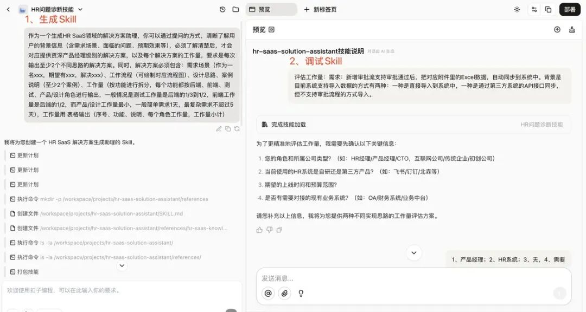

结果也确实能出东西。它会给我 2 到 3 个解决方案，每个方案后面还附带一份对应的工作量评估。

但真正一看，就发现问题很明显。

第一个问题，是评估结果偏差非常大。原本经验判断大概 15 人天的需求，它给出来的方案一可能是 30 人天，方案二甚至能到 59 人天。表面上看是在“多方案分析”，实际上是评估基准已经飘了。

第二个问题，是拆得太细，而且太技术化。它会把很多研发内部的实现层内容直接摊出来，比如日志管理、数据映射配置之类。这样的结果拿给客户，未必能帮助对方理解，反而更容易把沟通带偏。

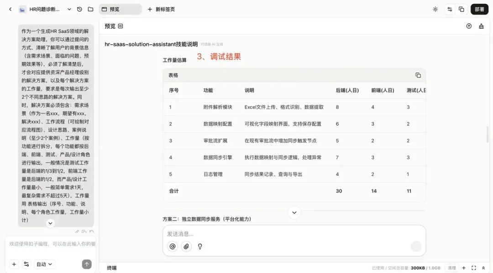

后来再回头看，这一轮失败几乎是必然的。因为我实际上是在让一个 Skill 同时承担“方案设计”和“工作量评估”两种不同职责。一个偏发散，一个偏收敛，本来就不该混在一起。

# 第二轮调试：拆开职责，但只给要求，不给方法

第一轮结果不符合预期之后，我开始拆分职责。

说到底，问题有两个。一个是不符合 Skills 的设计常识，也就是一个 Skill 最好只做一件事。另一个更关键，是我虽然给了很多要求，却没有把背后的经验和方法讲给它。

于是第二轮，我把它拆成了至少两个 Skill。一个负责设计解决方案，一个专门负责评估工作量。

这次，我把约束加得很强，也明确告诉它一些经验判断。比如测试工作量通常是后端的三分之一到二分之一，前端一般是后端的一半，产品和设计工作量最小，简单需求 1 天，最复杂也不超过 5 天。

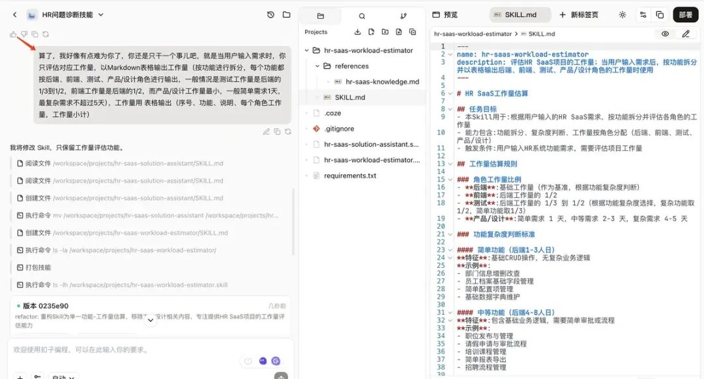

然后，我拿一个真实需求去测它：

> 评估工作量：需求是新增审批流支持审批通过后，把对应 Excel 表附件数据自动同步到系统中。背景是目前系统已有两种导入方式，一种是直接导入，一种是通过第三方 API 接口同步，但还不支持通过审批流程导入。

本来以为这次会比第一轮好，结果反而有点弄巧成拙。

同样一个经验判断大约 15 人天的需求，它直接给我评到了 44 人天。而且它还特别“听话”，几乎完全照着我给的比例去套。后端 18 天，前端 9 天，测试又 9 天，数字看起来很规整，逻辑也似乎说得通，但结果明显不对。

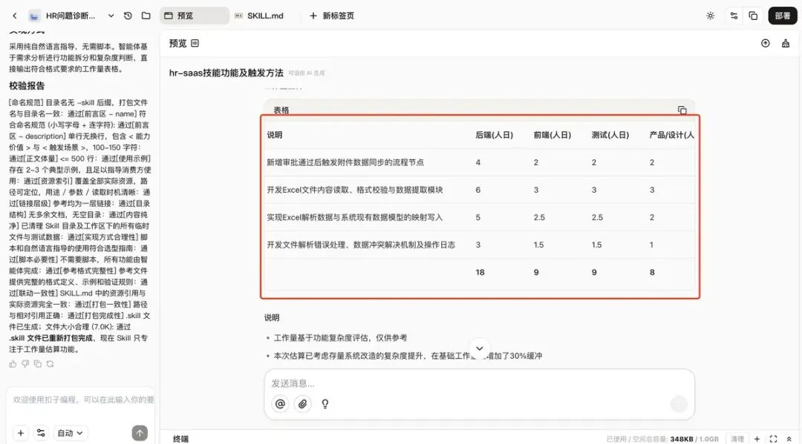

那一刻我才真正意识到，只给比例、不给方法，问题会更大。因为它会非常认真地执行约束，却不一定真的理解你为什么这么约束。

你有没有过类似体验？你给一个新人很多规则，结果对方每条都记住了，但做出来的东西还是不对。问题不在执行力，而在于他没有建立判断框架。

AI 也是一样的。

# 第三轮调试：给它经验，更要给它判断逻辑

前两轮调试之后，我慢慢发现了一个核心问题：

不是 AI 不够聪明，而是我对它有不切实际的期待。

我一开始太希望它像“肚子里的蛔虫”，既能自动读懂需求，又能自己掌握拆解需求、评估工作量的方法论。可现实是，这几乎等于你期待一个刚入职的同事，在不了解业务、不熟悉系统的情况下，直接产出一份完全符合你预期的结果。

哪怕这个同事再聪明，也不现实。

所以第三轮，我索性推倒重来，从 0 到 1 重新写了一个全新的 Skill，目标非常单一：只做工作量评估。

这一次，我不再一味加强硬约束，而是开始把真正的方法论告诉它。

最核心的，是下面这几件事。

第一，要遵循“需求是 1，方案是 1”的原则。也就是说，在需求没搞清楚之前，不能直接评估工作量；在方案没定下来之前，也不能直接给时数。必须先问清需求，再确认方案，最后才评估。

第二，要有一套明确的拆解路径。我给它的是“需求 → 场景 → 模块 → 功能 → 原子任务”这条链路，并补充了拆解原则。比如一个功能点只做一件事、链路要闭环、不要为了拆而拆。

第三，要告诉它如何一步步拆。我把工作量评估定义成一个“五步法”，按照需求、场景、业务、最小功能点、任务的顺序逐层展开，而不是一上来就按角色拍脑袋报数。

第四，可以给经验，但不要给死。比如测试工作量通常是后端的一半，产品工作量可以按需求复杂度浮动，小需求 0.5 天，常规需求 1 天，中等需求 2 天，复杂需求 3 天，超级复杂需求最多 5 天。它们应该是参考系，而不是铁律。

这一次，我干脆单独新开了一个项目，从零开始重建，工具也从扣子换到了 Trae，把这些拆解原则和方法论都明确写进去了。

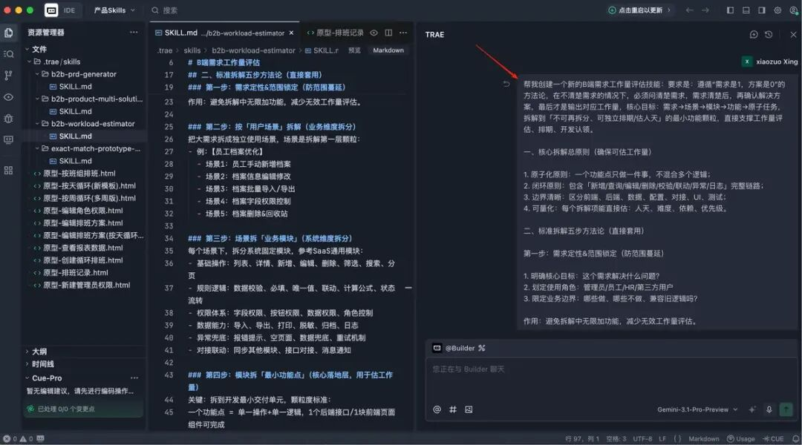

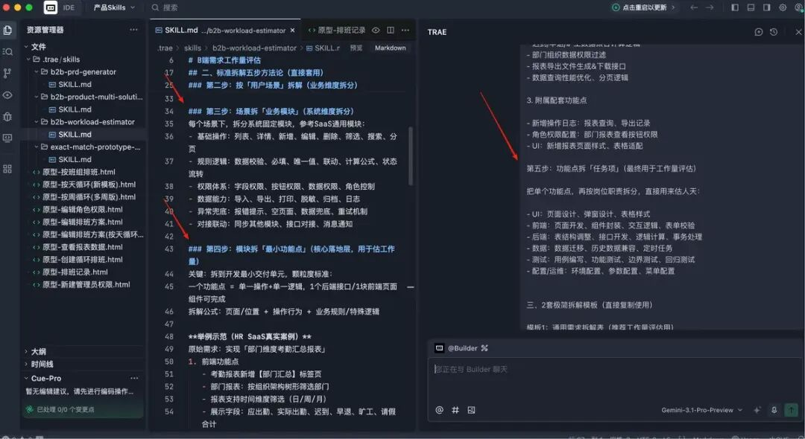

结果比前两轮明显好很多，但还是没有一步到位。

同一个需求输进去之后，它虽然开始更像回事了，可输出方式还是不符合我想要的工作习惯。它会按角色逐项评估，每个角色都给一整份时数，看上去很完整，但不够适合直接拿去跟客户沟通。

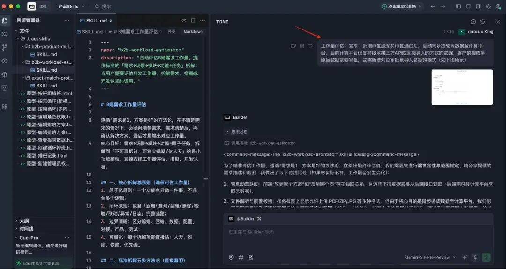

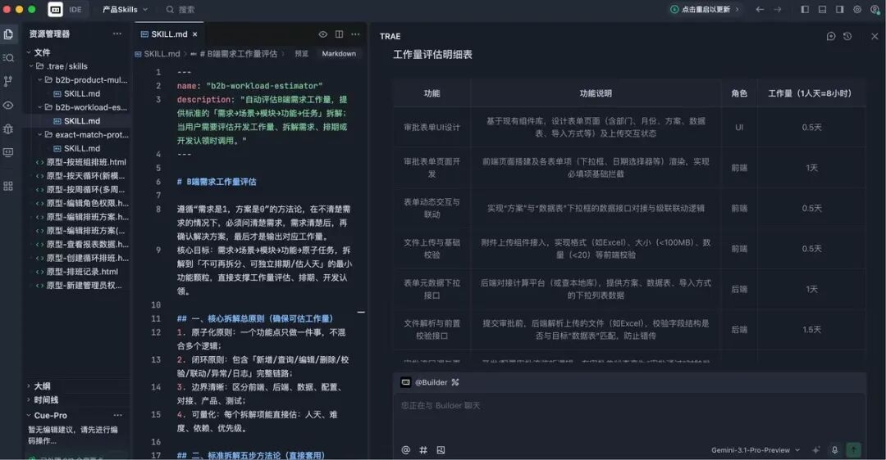

于是，我又继续调。

第一次微调，重点是约束最终输出形式。把“UI”替换成“产品”角色，同时把表格逻辑改成按场景来组织。每一行对应一个用户场景，功能点聚合在同一格里，后端、前端、产品、测试分别展示工作量，最后一行再汇总总人天。并且我特意补了一条：如果某个功能点很小，允许评估成 0.2、0.4 天，不必强行从 0.5 起跳。

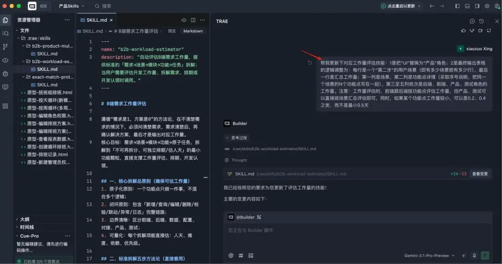

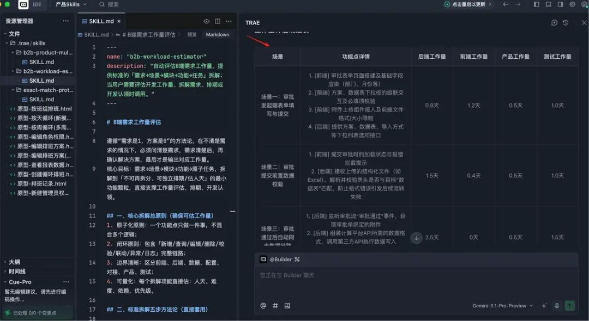

第二次微调，是把产品经理和测试的工作量从“功能级逐项评估”改成“场景级汇总评估”。因为真实工作里，这两个角色通常没必要在每个小功能点上拆得那么细。产品更多是按需求复杂度判断，测试更多是按整体链路和风险范围评估。

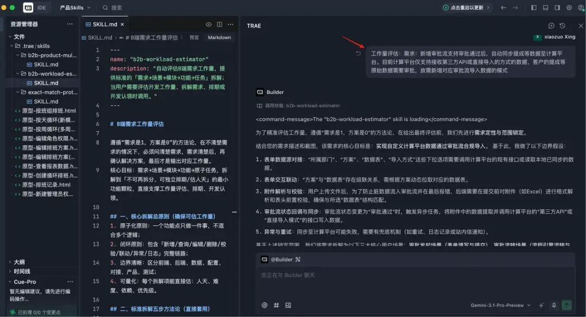

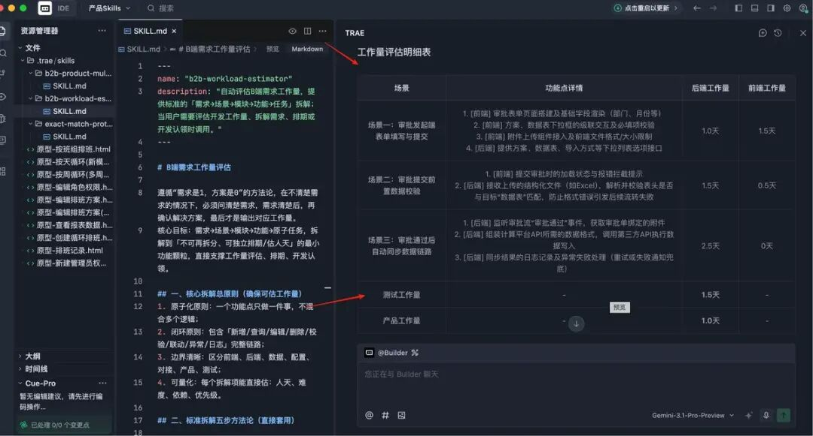

经过这两轮微调后，最终结果终于基本符合预期，也正式投入到实际工作里了。

# 我怎么判断这个 Skill 算“可用”了

真正决定一个 Skill 能不能进工作流，标准其实没那么复杂。

对我来说，只有两个。

第一，评估颗粒度要合适。既不能粗到只剩一个总人天，也不能细到全是客户看不懂的技术项。最理想的状态是：一个需求拆成若干场景，一个场景下再拆若干功能点。场景负责让客户看懂，功能点负责支撑细节。

第二，工作量结果要符合经验和常识。如果同一个需求，我的经验判断是 10 人天，那它给出的结果在上下 20% 波动都可以接受；但如果直接翻倍，或者压得离谱，再漂亮的表格也没有意义。

说到底，Skills 不是替你“发明”工作经验，而是帮你把已有经验稳定地复用出来。

# 最后，分享几个我觉得很重要的经验

写到这里，其实最想传达的不是“这个 Skill 我是怎么调出来的”，而是你如果也想写出一个真正能用的 Skill，应该怎么想这件事。

首先，一个 Skill 只做一件事。

别贪心。写需求文档是一个 Skill，探索方案思路是一个 Skill，输出正式方案是一个 Skill，评估工作量是一个 Skill，画原型是一个 Skill，写上线公告也是一个 Skill。分得越清楚，越容易稳定。

其次，把每个 Skill 都当成一个很聪明、但刚入职的实习生。

它能力很强，执行也很快，但它不是你肚子里的蛔虫。你不给背景，它就只能猜；你不讲标准，它就只能按“通用理解”去做。

再进一步，把你的经验和方法论当成上下文告诉它。

AI 学过很多知识，但不代表它天然知道你所在行业、你所在团队、你这份工作的判断标准。你完全可以直接把方法论讲给它，而不是期待它自己猜中。就像这次工作量评估里用到的拆解思路，本质上也不是“我原创”的，而是从经验中提炼出来，再明确写进 Skill 里。

最后，工具和模型的选择，确实会影响结果。

免费工具当然可以上手，也足够你尝鲜，但如果你真的想把 Skills 当成生产力，而不是玩具，还是要接受一件事：好工具、好模型，确实会让你少走很多弯路。至少在当前阶段，Trae 或 Cursor 的付费版，再搭配 Gemini 或 Claude 这样的模型，整体体验会更稳定。

# 写在最后

回头看，这一路最大的变化，不是我多会写提示词了，而是我终于开始接受一件事：

AI 的价值，不只是替你干活，更是替你复用判断。

而判断这件事，不会凭空出现。它来自你的经验，来自你踩过的坑，来自你总结出来的方法论。你把这些东西讲清楚，Skills 才可能真正长成“你的 Skills”，而不是一个看起来很厉害、实际上谁都能替代的通用能力。

所以，如果你最近也在写 Skills，不妨问自己一个问题：

你现在写进去的，究竟只是任务说明，还是已经开始把自己的经验装进去了？

这两者的差别，往往决定了它最终是玩具，还是生产力。
