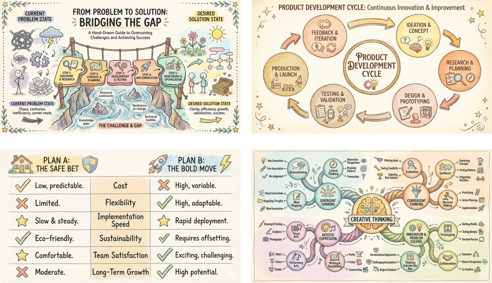
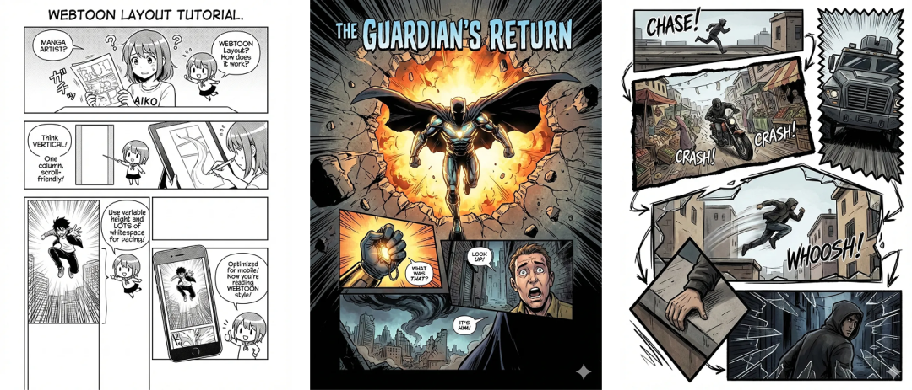
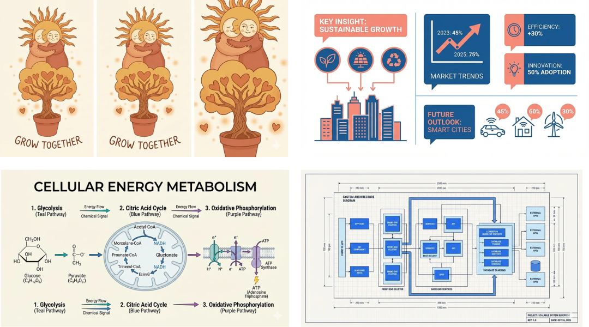
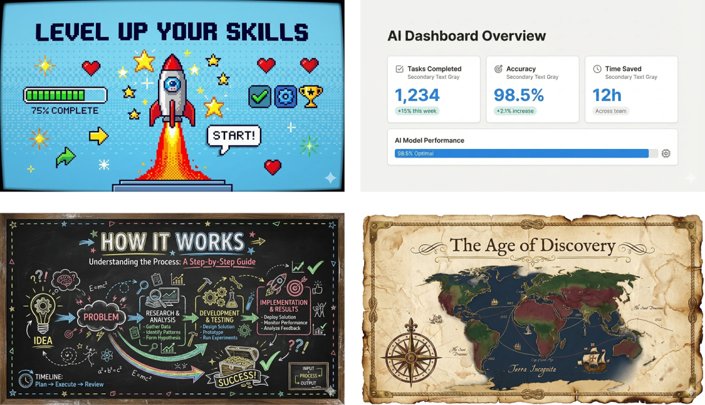

> 📎 来源: [乾元AI智能](https://mp.weixin.qq.com/s?__biz=MzA5MzI2ODI1MA==&mid=2457222302&idx=1&sn=f33c1553db685cb12960807307fe78bb&chksm=863da1361281ac19c268086e0e5e3f30a07c6a936f30db4b658ed963c5433926b92fc08faa95&mpshare=1&scene=1&srcid=0424X1jmvrXizKcfFkA73Kqp&sharer_shareinfo=0f5ef990e5eccc78c49b9a9dcb873681&sharer_shareinfo_first=0f5ef990e5eccc78c49b9a9dcb873681) | 时间: 2026-04-24 21:35

---

做技术文档要画架构图、写公众号需要封面图、发小红书得做图文卡片 —— 职场人常陷入 “写文 2 小时，配图大半天” 的困境。要么等设计排期，要么自己用工具瞎折腾，最终效果还不尽如人意。

baoyu-skills 这个开源技能库，刚好解决了这个痛点。它基于 Claude Code 、openclaw等agent生态，把文章配图的高频需求做成了 “即插即用” 的技能，不用懂设计、不用写复杂代码，普通人也能快速生成专业配图。

**一、什么是 baoyu-skills？**

本质是一个适配 Claude Code 、openclaw等agent生态的效率技能集合，由开发者 JimLiu 维护，核心定位是 “文章配图自动化”。

核心优势很明确：

- 无代码门槛：自然语言或简单指令就能操作

- 场景覆盖全：从小红书卡片到技术架构图，涵盖 7 大类职场配图需求

- 生态兼容性强：支持 MinMax、OpenAI 等 10 + 生图平台，有 API Key 就能用

- 迭代活跃：目前已更新到 v1.107.0，持续新增风格和功能

前置准备也简单：安装 Node.js 环境，有 Claude Pro 订阅即可，生图类功能按需配置 API Key 就行。

**二、7 大核心配图技能，覆盖 90% 职场场景**

每个技能都有明确的应用场景，按需选用不冗余：

**1. 小红书图文卡片（baoyu-xhs-images）**


- 适用：小红书笔记配图

- 关键参数：12 种风格（cute、notion、chalkboard 等）、6 种布局（对应不同内容密度）、3 种配色

- 实操：

```
/baoyu-xhs-images "职场时间管理技巧" --style notion --layout list，10 秒生成 9:16 比例卡片
```

- 优势：自动拆分内容，不用手动排版

**2. 专业信息图（baoyu-infographic）**



- 适用：公众号推文、报告、PPT

- 关键参数：20 种布局（漏斗图、思维导图、时间线等）、17 种风格（商务、手绘、赛博朋克等）

- 实操：

```
/baoyu-infographic "用户转化漏斗分析" --layout funnel --style corporate --aspect 16:9
```

- 优势：自动分析内容，推荐最优布局 + 风格组合

**3. 技术 / 流程示意图（baoyu-diagram）**

- 适用：技术文档、架构说明（程序员 / 产品经理必备）

- 关键参数：6 种图表类型（流程图、时序图、架构图等），输出 SVG+PNG 双格式

- 实操：

```
/baoyu-diagram "微服务架构" --type structural --lang zh
```

- 优势：支持明暗模式自动适配，SVG 可无限放大不失真

**4. 文章封面图（baoyu-cover-image）**

- 适用：公众号、知乎、小红书封面

- 关键参数：5 大维度组合（类型 × 配色 × 渲染 × 文字 × 基调），77 种搭配

- 优势：自动提取标题，适配多平台比例，支持无文字纯视觉风格

**5. 知识漫画插图（baoyu-comic）**



- 适用：科普文章、教育内容

- 关键参数：5 种美术风格（日漫、水墨、写实等）、7 种情绪基调、6 种布局

- 优势：把复杂知识点可视化，增强内容可读性

**6. 全文智能插图（baoyu-article-illustrator）**



- 适用：长文配图（避免手动找图插图）

- 关键参数：6 种插图类型、8 种风格，支持配色自定义

- 优势：自动识别文章需要配图的段落，批量生成风格统一的插图

**7. 幻灯片配图（baoyu-slide-deck）**



- 适用：演讲报告、培训课件

- 关键参数：16 种预设风格，支持 8-30 页自定义页数

- 优势：按文章逻辑生成大纲，自动合并为 PDF/PPTX 文件

- 实操：

```
/baoyu-slide-deck path/to/article.md --style corporate --slides 15
```

**三、2 步快速上手（新手友好）**

**步骤 1：安装技能库**

终端执行：

```
npx skills add jimliu/baoyu-skills
```

按照安装提示选择你使用的工具（支持claude code、openclaw等30+的工具）

**步骤 2：生成配图（3 种方式）**

1. 自然语言：“用 corporate 风格生成 16:9 比例的用户转化漏斗信息图”

2. 指令操作：

```
/baoyu-diagram "Kubernetes架构" --type structural --lang zh
```

2. 文件输入：

```
/baoyu-article-illustrator path/to/your-article.md --style notion
```

**四、实用技巧与注意事项**

**1. 关于 API Key**

- 基础配图（流程图、信息图）：无需 API Key，直接生成

- AI 生图类（漫画、场景封面）：需配置生图平台 Key（MinMax、OpenAI 等均支持）

- 建议：优先用自己有额度的平台 Key，避免频繁切换

**2. 效率提升点**

- 开启自动更新：在 Claude Code 的 Marketplaces 标签中，勾选 “Enable auto-update”

- 批量生成：支持同时处理多篇文章，并行任务最高 4 个

- 风格统一：同一篇内容用同一组风格参数，保持视觉一致性

**3. 局限性**

- 不支持高度定制化设计（如需专属品牌元素，需后期微调）

- 复杂图表（如多维度数据可视化）可能需要手动优化参数

- 依赖 Claude Code 生态，需订阅 Claude Pro

**五、总结：谁该用这个工具？**

- 新媒体运营：快速产出多平台配图，不用等设计

- 程序员 / 产品经理：高效生成技术文档示意图

- 职场博主：提升笔记 / 文章视觉质感，节省排版时间

- 培训师 / 讲师：快速制作课件配图，聚焦内容本身

baoyu-skills 的核心价值，是把 “找图、修图、等图” 这些机械工作自动化，让创作者把精力放在内容质量上。它不是替代专业设计，而是解决大部分职场人的 “刚需配图” 问题。

如果你的工作需要频繁产出图文内容，不妨试试 —— 项目开源免费，上手成本低，实测能把配图效率提升 10 倍以上。具体配合cc、龙虾等工具使用起来非常方便灵活，更多可以去项目的github主页了解。

项目地址：https://github.com/jimliu/baoyu-skills
