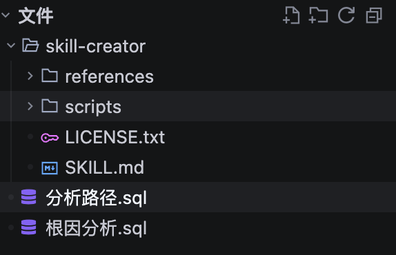
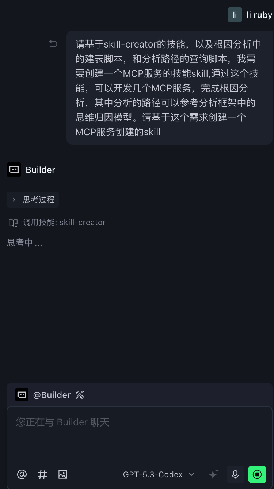
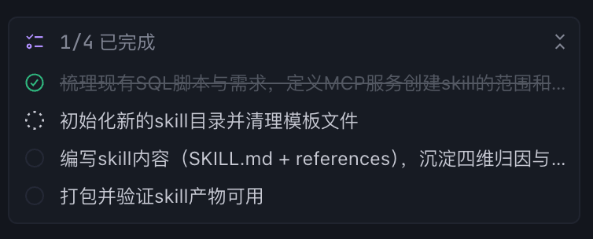
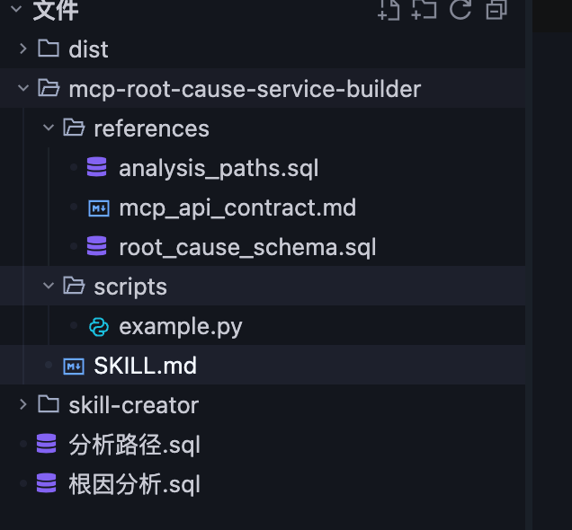
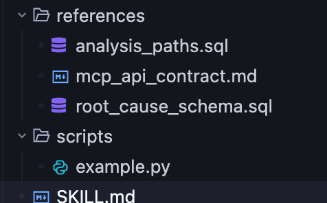

> 📎 来源: [ruby的数据漫谈](https://mp.weixin.qq.com/s?__biz=MzA4ODAyNzA4MQ==&mid=2247494484&idx=1&sn=5d73c0513496d73bd6cbd7e642fc20c3&chksm=91ed981ae5bf03e76e58bc433b94269e3eb24de4281255379f693b397771171a98d3a3100390&mpshare=1&scene=1&srcid=0429uydIe1OrA1ET33fN2kem&sharer_shareinfo=b4b44cecf0fc22d731233ea003079cbd&sharer_shareinfo_first=b4b44cecf0fc22d731233ea003079cbd) | 时间: 2026-04-29 14:07

---

摘要：你是否遇到过这样的情况：让 AI 帮你写一个 MCP 服务，结果它每次都给你不同的代码结构，有时忘了错误处理，有时漏了关键配置，你还得反复提醒它“加上 stdio 传输”、“记得写 README”？这不是 AI 不够聪明，而是它缺少一套可复用的标准化工作流。

Anthropic 推出的 **Skills**功能，就是为解决这个问题而生的。而 **Skill Creator**，则是一个教你“如何教 AI”的元技能。今天，我将以创建一个 **MCP 服务开发技能**为例，把创建思路、核心技巧和每个文件的作用，一次性给你讲透。

---

## 一、先想清楚：什么才算“真正能干活的 Skill”？

在动手写一个 `SKILL.md`之前，我们得先回答一个本质问题：**这个技能到底要替代什么？**

对于 MCP 服务开发来说，一个“能干活的技能”应该做到：

| 没有技能时 AI 的表现 | 有技能后 AI 的表现 |
| --- | --- |
| 每次生成的代码结构不同 | 遵循固定的项目模板和文件结构 |
| 可能忘记关键配置（如 `mcp`依赖） | 自动包含所有必需依赖 |
| 错误处理参差不齐 | 强制包含标准错误处理和日志 |
| 需要你反复提醒相同的事情 | 一次性走完完整流程，只问你业务相关的问题 |

**核心思路**：Skill 的本质是把你的隐性知识和最佳实践，**固化为 AI 的显性行为规范**。你不是在写一个“提示词”，而是在设计一套 AI 能够理解并执行的“标准操作程序”（SOP）。

## 二、Skill 的完整文件结构——每个文件都有它的使命

根据 Skill Creator 的规范，一个完整的 Skill 目录结构是这样的：

mcp-service-builder/

├── SKILL.md          # 必需：核心指令文件

└── 可选资源/

    ├── scripts/      # 可执行脚本（让 AI 调用而非重写）

    ├── references/   # 参考文档（按需加载，节省上下文）

    └── assets/       # 模板、图标等输出用的资源文件

让我逐一解释每个部分的真正作用：

### 1. SKILL.md——技能的“大脑”

这是唯一必需的文件，包含两部分：

**YAML 前置元数据：**

---

name: mcp-service-builder

description: |

  指导创建 MCP (Model Context Protocol) 服务的完整工作流。

  当用户需要创建新的 MCP 服务、编写 MCP 工具、搭建 MCP Server 骨架，

  或提到 "MCP"、"Model Context Protocol"、"扩展 Claude 能力" 时使用此技能。

---

**关键技巧：`description`是技能的**唯一触发机制**。Claude 根据这段文字判断是否调用你的技能。因此，它必须：**

- 既说明技能做什么
- 又明确**什么情况下该用它**
- 要稍微“激进”一点——宁可多用，不要漏用

**Markdown 指令正文：**
这是 AI 真正“阅读并执行”的内容。好的指令有几个特征：

- **用祈使句，清晰直接**：`先询问用户偏好的编程语言和项目名称。`
- **解释“为什么”，而不只是“做什么”**：`必须使用 stdio 传输，因为这是 MCP 协议的标准通信方式，其他传输方式需要额外配置。`
- **包含可复用的模板和示例**：把完整的代码模板放在指令里，AI 可以直接复制填充。

### 2. scripts/——让 AI“调用”而非“重写”

这是很多技能被用废掉的地方。假设你的 MCP 服务需要一段复杂的样板代码生成逻辑，你有两个选择：

- ❌ **把代码写在 SKILL.md 里**：AI 每次都会读一遍，浪费上下文，还可能在执行时“发挥创造力”改写出 bug。
- ✅ **把代码放在 `scripts/generate_server.py`里**：在 SKILL.md 中写 `运行 python scripts/generate_server.py --name {{project_name}}`。

这样，AI 只需要**执行**一个确定性脚本，而不是**重新发明**它。这不仅节省 Token，更重要的是**保证了输出的一致性**。

### 3. references/——按需加载的知识库

对于 MCP 服务开发，可能涉及不同语言的实现细节。如果把 Python 和 Node.js 的指南全塞进 SKILL.md，文件会臃肿不堪。

正确的做法是采用 **渐进式披露**：

```
mcp-service-builder/
```

```
├── SKILL.md                # 只写通用工作流 + 指引
```

```
└── references/
```

```
├── python-guide.md     # Python 实现细节
```

```
└── nodejs-guide.md     # Node.js 实现细节
```

**在 SKILL.md 中这样写：**

## 语言特定实现

根据用户选择的语言，读取对应的参考文件：

- 如果用户选择 Python，请阅读 `references/python-guide.md` 获取完整的代码模板和依赖清单。

- 如果用户选择 Node.js，请阅读 `references/nodejs-guide.md`。

这样，AI 只在需要时才加载对应的参考文件，**把宝贵的上下文留给真正的任务**。

### 4. assets/——直接输出给用户的资源

如果你的 MCP 服务模板包含一些静态文件（比如一个标准的 `README.md`模板、一个默认的图标），把它们放在 `assets/`里。AI 可以直接复制这些文件到用户的输出目录，而不需要现场生成。

---

## 三、实战：利用 Skill Creator 制作一个**MCP 服务开发技能**

**首先我们用trea 来做skills的创建，我们从github下载一下这个skill,下载链接为：**

https://github.com/anthropics/skills

**下载后，我们把skills-creator这个目录拷贝出来，放到一个目录下，如下图所示：**



现在我们把mcp服务的需求文件放到skill-creator的同一个目录下。其中根因分析里面是建表脚本，分析路径是查询脚本，我们需要创建这个分析路径的MCP服务的skill.

其中根因分析的sql为：

于是我们在trea中给大模型这样的提示词：

**请基于skill-creator的技能，以及根因分析中的建表脚本，和分析路径的查询脚本，我需要创建一个MCP服务的技能skill,通过这个技能，可以开发几个MCP服务，完成根因分析，其中分析的路径可以参考分析框架中的思维归因模型。请基于这个需求创建一个MCP服务创建的skill**

在这个提示词中，我们给我们开发mcp服务的需求，让它先创建一个技能。模型我们采用的是gpt-5.3



然后它梳理了4个任务：



然后我来来看一下生成的skills



我们来看看skill.md的内容

---

name: mcp-root-cause-service-builder

description: Build and split MCP services for advertising root cause analysis with a four-dimension attribution model. Use when Claude needs to design or implement one or more MCP services for ROI drop diagnosis, service contracts, SQL-driven evidence extraction, root cause synthesis, and result persistence.

---

# MCP Root Cause Service Builder

将广告投放根因分析拆解为可组合的 MCP 服务集合，并让每个服务拥有清晰输入、输出、证据 SQL 与容错策略。

## Workflow

1. 明确分析目标：campaign\_id、分析日期、行业类目、渠道范围。

2. 使用 `references/root\_cause\_schema.sql` 确认可用表、字段和关联键。

3. 使用 `references/analysis\_paths.sql` 选择四维路径中的一个或多个诊断分支。

4. 按 `references/mcp\_api\_contract.md` 设计服务契约。

5. 将服务拆成独立 MCP 能力并定义调用顺序：

- 指标快照服务

- 素材诊断服务

- 人群诊断服务

- 竞争诊断服务

- 渠道诊断服务

- 结论聚合服务

- 结果落库服务

6. 先返回结构化证据，再生成可解释结论与优化建议。

## Service Composition Rules

- 每个服务只负责一个维度，跨维度结论只在聚合服务生成。

- 每个服务输出统一结构：`status`、`confidence\_score`、`evidence\_data`、`finding`、`suggestion`。

- 维度服务只输出“证据+判定”，不得直接修改上游输入。

- 所有阈值写入服务配置，不硬编码在路由层。

- 维度判定冲突时，聚合服务按置信度和影响面排序输出主因与次因。

## Suggested MCP Services

1.`campaign\_metric\_snapshot\_service`

- 输入：`campaign\_id`, `analysis\_date`

- 输出：ROI/ROAS、CTR、CVR、CPC 的当日值与基线差异

2.`creative\_diagnosis\_service`

- 使用素材路径 SQL 识别创意疲劳、点击疲劳、转化衰减

3.`audience\_diagnosis\_service`

- 使用人群路径 SQL 识别 CPC 抬升、人群匹配度下降

4.`competition\_diagnosis\_service`

- 使用竞争路径 SQL 识别出价竞争、曝光份额流失

5.`channel\_diagnosis\_service`

- 使用渠道路径 SQL 识别流量质量变化、广告位波动

6.`root\_cause\_synthesis\_service`

- 聚合四维证据并给出主次根因、置信度、建议优先级

7.`analysis\_result\_persist\_service`

- 将结果写入 `root\_cause\_analysis\_result`

## Execution Template

- 若用户要求“快速定位 ROI 下降原因”，先调用 `campaign\_metric\_snapshot\_service`。

- 若发现 ROI 异常，再并行调用四维诊断服务。

- 将四维诊断结果传入 `root\_cause\_synthesis\_service`。

- 最后调用 `analysis\_result\_persist\_service` 固化报告。

## Bundled Resources

-`references/root\_cause\_schema.sql`：建表脚本，定义分析数据域。

-`references/analysis\_paths.sql`：四维归因查询路径与综合诊断 SQL。

-`references/mcp\_api\_contract.md`：MCP 服务接口约束、输入输出规范、错误模型。

-`scripts/example.py`：生成 MCP 服务蓝图 JSON，便于快速启动服务开发。

然后我们来看看脚本目录：



包含了MCP服务生成的必要的脚本。而且人工检查了这个mcp服务的业务逻辑和工作步骤都是正确，所以这里是一个可用的skills。

这个分享了一个基于skill-creator快速创建一个mcp服务的skills的方法，下一篇文章我们将继续分享，如何利用这个技能创建当前的mcp服务。

**欢迎加入免费【数据&AIGC交流群】社群，长按以下二维码加入专业微信群****，商务合作加微信备注商务合作，**AIGC应用开发交流入群备注AIGC应用，****如果需要进入VIP群，可以登录公众号首页选择VIP按钮。********


添加微信备注：企业+职业+昵称

**往期AI+数据历史热门文章：**

[AI 数据治理3 大核心策略 + 4 大技术抓手](https://mp.weixin.qq.com/s?__biz=MzA4ODAyNzA4MQ==&mid=2247493153&idx=1&sn=adf2510b6e3103d1ac1bc1d4acbc5488&scene=21#wechat_redirect)

[湖仓数据模型：设计与治理的深度剖析](https://mp.weixin.qq.com/s?__biz=MzA4ODAyNzA4MQ==&mid=2247492585&idx=1&sn=598c66f89d6f983a5b45d20a870cdc18&scene=21#wechat_redirect)
‍‍‍‍‍

[解锁数据新动能：从统一数据治理迈向企业级Data Agent](https://mp.weixin.qq.com/s?__biz=MzA4ODAyNzA4MQ==&mid=2247492548&idx=1&sn=25187b2a914a4d69058fc19c6b13635c&scene=21#wechat_redirect)

[AI 时代下湖仓一体的未来趋势：从技术融合到价值重构](https://mp.weixin.qq.com/s?__biz=MzA4ODAyNzA4MQ==&mid=2247493385&idx=1&sn=c0b387a00555bc56701beac7bbe39578&scene=21#wechat_redirect)

[用户行为数据治理：企业数字化转型的关键密码](https://mp.weixin.qq.com/s?__biz=MzA4ODAyNzA4MQ==&mid=2247492643&idx=1&sn=08aa8dd980773de6641da99866e8e996&scene=21#wechat_redirect)

[一文读懂可信数据空间，带你解锁数据新世界](https://mp.weixin.qq.com/s?__biz=MzA4ODAyNzA4MQ==&mid=2247492223&idx=1&sn=f9fefe34895633f5c9cc31eefb8abdc3&scene=21#wechat_redirect)

[大模型协助数据治理：解锁大模型的变革力量](https://mp.weixin.qq.com/s?__biz=MzA4ODAyNzA4MQ==&mid=2247492172&idx=1&sn=412d890e7ad9e16b552d7484acd4cfd5&scene=21#wechat_redirect)

**往期AI大模型技术历史热门文章：**

[知识图谱：AI时代的知识密码](https://mp.weixin.qq.com/s?__biz=MzA4ODAyNzA4MQ==&mid=2247492785&idx=1&sn=a59f0b58d0b7c6b588cb9b0a9f52e0c7&scene=21#wechat_redirect)

[Text-to-SQL准确率破局之道：从基础优化到前沿技术](https://mp.weixin.qq.com/s?__biz=MzA4ODAyNzA4MQ==&mid=2247492724&idx=1&sn=6e0a99b9c90d1fda589d2b8425f02cdc&scene=21#wechat_redirect)

[Deepseek+RAGflow 2个小时搭建text-to-sql的AI研发助手，真有这么神？](https://mp.weixin.qq.com/s?__biz=MzA4ODAyNzA4MQ==&mid=2247492565&idx=1&sn=76c6de60d230e3305a2052ff7876148f&scene=21#wechat_redirect)

[RAGFlow：一键搭建你的专属知识库](https://mp.weixin.qq.com/s?__biz=MzA4ODAyNzA4MQ==&mid=2247492667&idx=1&sn=bf1b635434f3d5b427f7699ec1688288&scene=21#wechat_redirect)

[Deepseek+RAGflow 2个小时搭建text-to-sql的AI研发助手，真有这么神？](https://mp.weixin.qq.com/s?__biz=MzA4ODAyNzA4MQ==&mid=2247492565&idx=1&sn=76c6de60d230e3305a2052ff7876148f&scene=21#wechat_redirect)

[DeepSeek+扣子：10分钟搭建一个智能体](https://mp.weixin.qq.com/s?__biz=MzA4ODAyNzA4MQ==&mid=2247492102&idx=1&sn=f439d5713bf7aad50ab9b82a16b7d576&scene=21#wechat_redirect)

[AI大模型应用技术栈：从底层到前沿的AI之旅](https://mp.weixin.qq.com/s?__biz=MzA4ODAyNzA4MQ==&mid=2247492478&idx=1&sn=3878e89f4f14c1c6656fa065071b52f7&scene=21#wechat_redirect)

[DeepSeek技术全景解析](https://mp.weixin.qq.com/s?__biz=MzA4ODAyNzA4MQ==&mid=2247492473&idx=1&sn=7212d060457287e219322b6382490602&scene=21#wechat_redirect)

[中国-Al-Agent应用研究报告](https://mp.weixin.qq.com/s?__biz=MzA4ODAyNzA4MQ==&mid=2247493463&idx=1&sn=6e90b88abf961681c19dea0ce2932c95&scene=21#wechat_redirect)

[一文解锁Dify关键组件，开启AI应用开发新世界](https://mp.weixin.qq.com/s?__biz=MzA4ODAyNzA4MQ==&mid=2247493352&idx=1&sn=561a6b804fae3f380895e4591501a108&scene=21#wechat_redirect)

[大模型链式思维：解析Deepseek大模型的如何思考](https://mp.weixin.qq.com/s?__biz=MzA4ODAyNzA4MQ==&mid=2247492180&idx=1&sn=d4040eab7eee18507f595119ad6645d3&scene=21#wechat_redirect)
