> 📎 来源: [数字生命卡兹克](https://mp.weixin.qq.com/s?__biz=MzIyMzA5NjEyMA==&mid=2647682618&idx=1&sn=c1ad0582d8a18c9b233d20aa7bf7977b&chksm=f18cd92b0d5782f1a51be83efcd527f7af45ad242c9fceb8f63e86817e172961323a703ae2d8&mpshare=1&scene=1&srcid=0526wkryf0xYg7yTA6JchowS&sharer_shareinfo=8ee1c6382813ebca087eb401130aef84&sharer_shareinfo_first=8ee1c6382813ebca087eb401130aef84) | 时间: 2026-05-26 15:31

---

我们公司之前一直有件让我头疼的事，就是怎么让Skills在团队里流通起来。

让大家能最低成本的进行团队内部的Skills同步。

也没有找到什么特别好的方案，为此我都被逼到自己vibe coding了一个Skills Hub出来给公司内部同事用。

现在已经有19个小伙伴，共享了几十个他们的创作的Skills了。

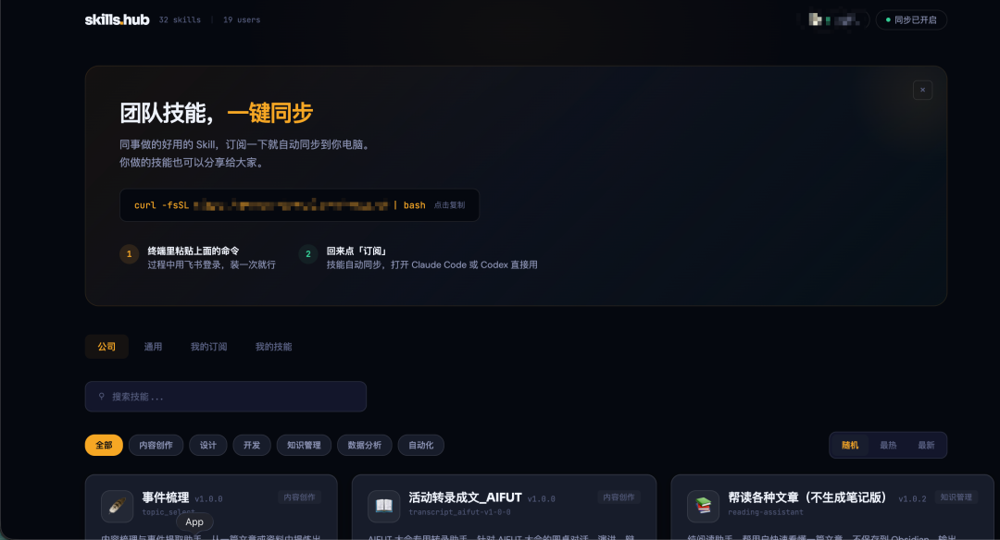

但说实话，搞这玩意是真的折腾，用户认证、权限管理、Skills订阅、脚本自动同步啥的。

我其实也不太理解，为啥现在绝大多数的Agent产品，都不支持团队版这么个小功能，因为对我们这种小公司来说，这玩意真的是刚需。

直到昨天，发现，阿里的Accio Work，居然把这个功能给做了。。。

关于Accio Work，我上个月写了一篇用他复刻多Agent协同的文章：[我用1400年前的三省六部制，搞了一套很酷的多Agent协同方案。](https://mp.weixin.qq.com/s?__biz=MzIyMzA5NjEyMA==&mid=2647681276&idx=1&sn=3de558e3dc50c467321022e9617b07d0&scene=21#wechat_redirect)这个产品还是有点意思的，在一众还在玩小龙虾的时候，他们先做了多Agent协同的功能，算是最先做的了。

当时还挺火的，昨天他们推出了企业版。

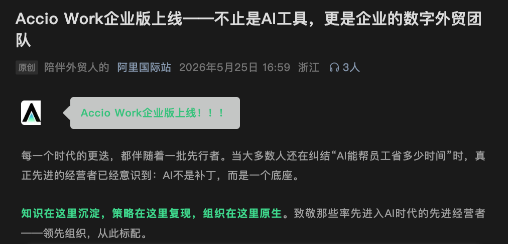

然后，支持了让团队的每个成员都可以共享Skills。

说实话，就像我前面说的，Skills这玩意，想让公司几十号人一起协同且同步Agent，其实并不是一件简单的事。

很多小伙伴共享的方式其实就是一个压缩包丢过去，或者直接发一个Github链接让其他人下载。

但后面要是新增了什么功能，要想更新的话，那又得丢新的，又得打包新的压缩包再发过去，然后同事在自己的电脑上再重新安装。并且谁用的哪个版本，也根本搞不清楚。。。

要是只有两三个人，只有两三个Skills还行，数量一多简直了。。。

我当时开发Skills Hub的过程中，也是让同事测了又测，改了一堆bug，反复迭代，才最后让全公司都用上。

做的时候我就很疑惑，因为这个东西在我看来真的是小团队的刚需。但你去看市面上的Agent产品，大家都在卷单个Agent的能力，团队怎么协作用Agent，似乎真没太多人在意。

所以我很高兴看到Accio Work能做出这个功能。

但不得不说，这事真挺抽象的。

一个做生意领域Agent的产品，总是能引领版本。。。

之前他们是最先做了多Agent协同群聊的，做完之后大概一个月，一堆国产Agent的新功能基本都是围绕这个去的。

然后现在，又搞了企业版，让团队里面的Skills和Agent的共享。

而且体验还很不错。

我给大家看看他实现Skills同步的实操过程。

首先就是基本的安装登录了，我们先从个人空间切换到企业版。

在左下角点击头像，然后选择切换空间，切换到团队的工作空间。

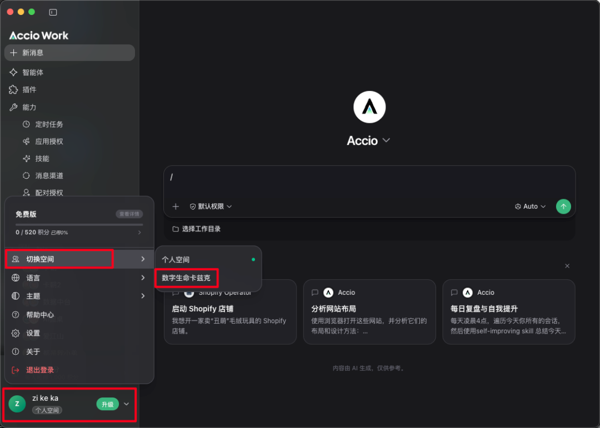

切换之后，我们就能在左下角看到现在已经是团队空间，以及这个账号的身份了。

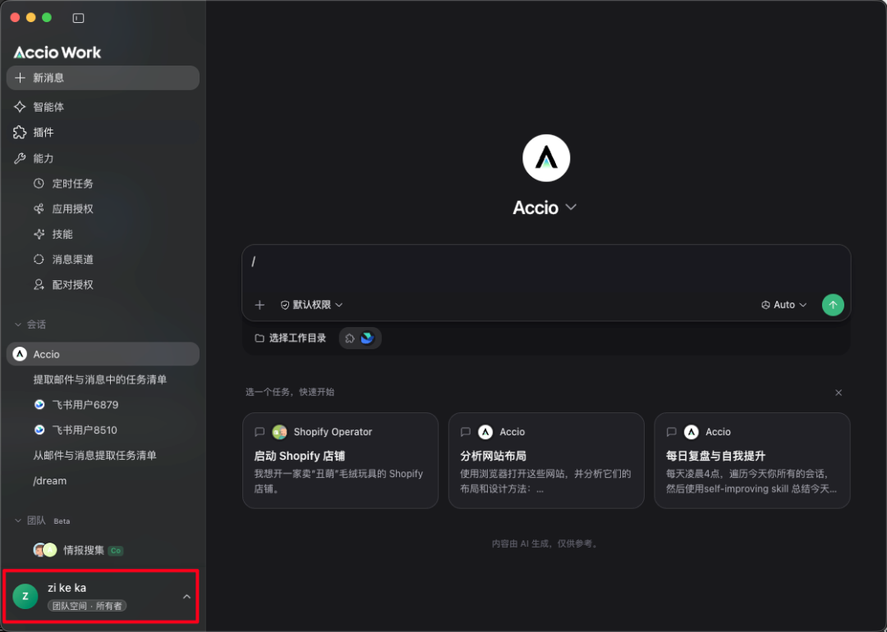

然后我们打开左下角的头像，点击团队订阅的查看详情，就能进入团队的工作空间。

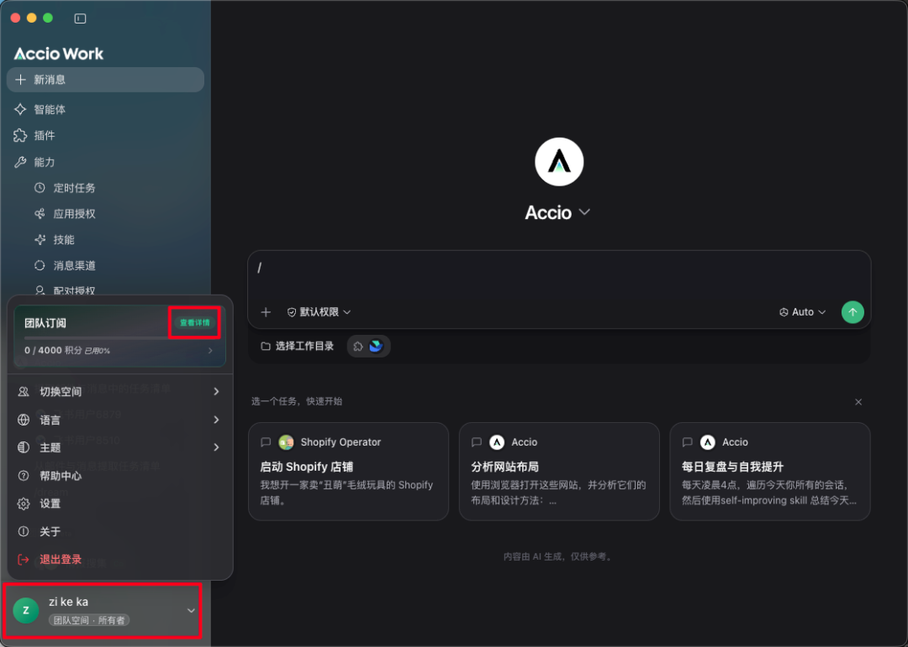

团队的工作空间的主要功能包括了成员管理，权限管理，资产管理，也就是公司共享的Skills和Agent，还有积分计费等等等等。

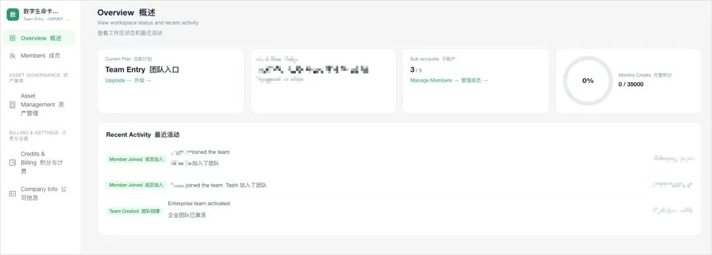

我们先来说最核心的Skills同步。

打开应用，我们在侧边栏的能力下找到技能，然后点击右上角上传。

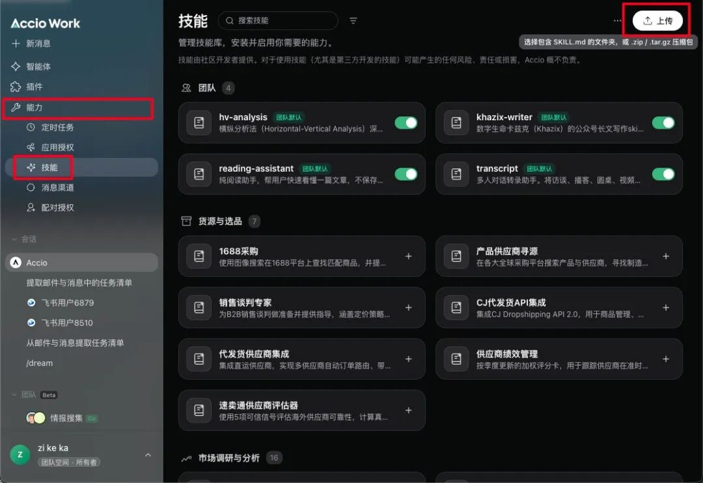

选择要上传的Skill，这里我拿AIHot的Skill演示。

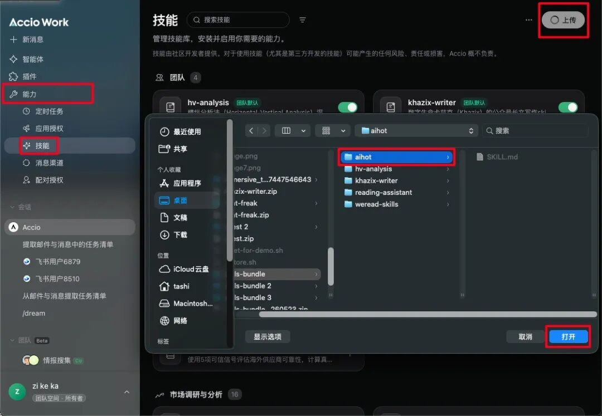

上传之后，就会在团队的工作空间列表里显示了，管理员可以设置要不要设置成全员可见，也就是共享给团队。

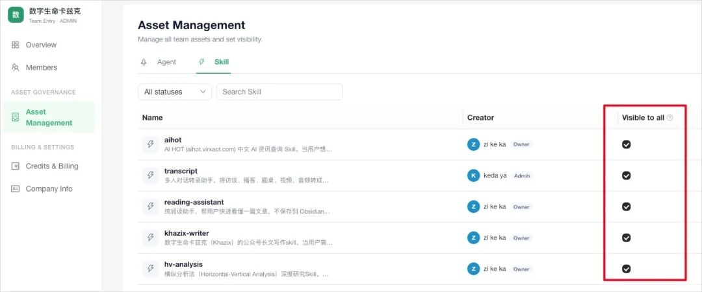

如果选择共享的话，这个Skill就会出现在每个团队成员的Skills列表里。

比如，在我同事的号上，就会出现一个未安装的，带团队默认tag的新Skill。

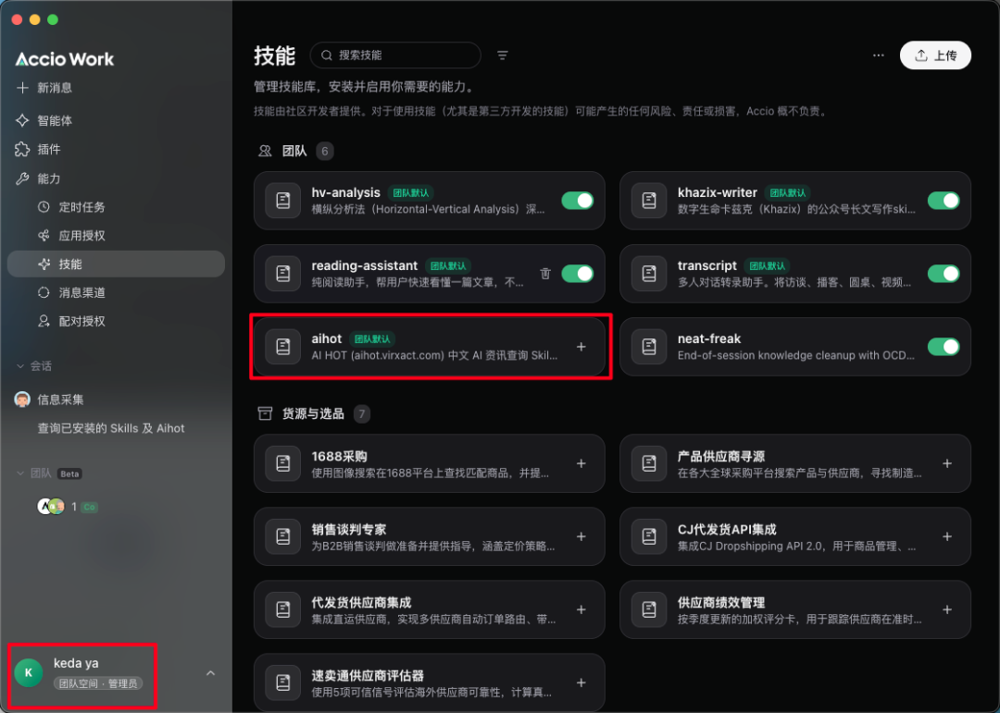

点一下加号，就装上了。

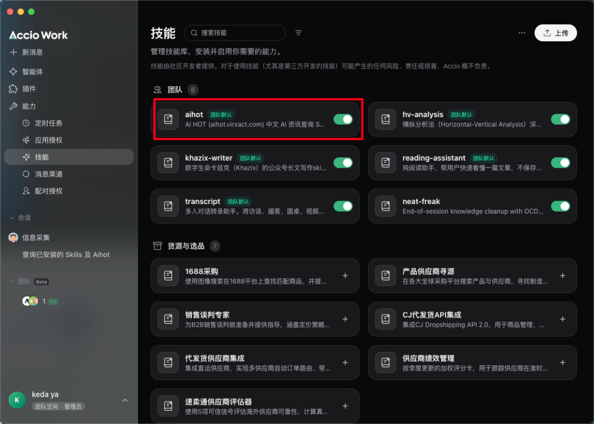

装完直接在自己的Agent上用，非常方便。

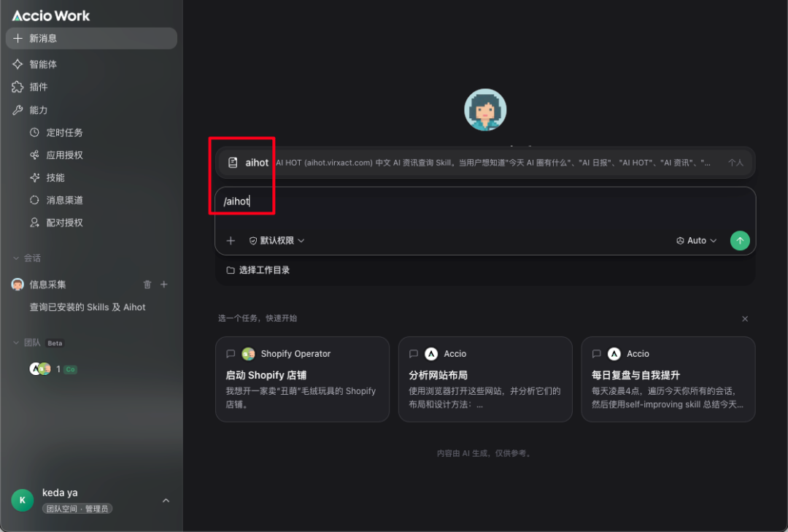

除了安装，Skills的同步更新也是很必要的一点。

像我做的把应用部署到公司内部服务器的Skill，开发初期迭代的就很频繁，已经更到v2.0.6版了。

如果按打包发送安装的古法，那测试的时候我改完一次就要打包发给我们测试的同事们，让他们重新安装一次，再测试。

太呆逼了。。。

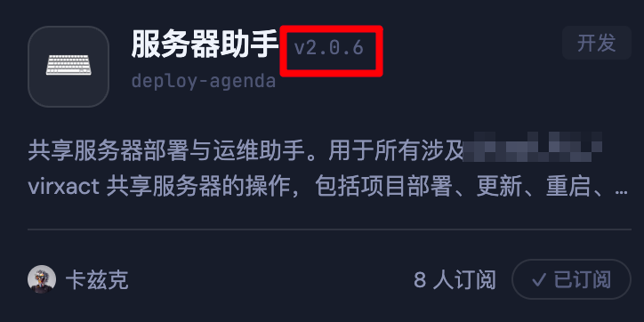

所以我一开始在Skills Hub上做的就是让Skills完全自动更新的。

同事上传的Skill有改动会自动更新到Skills Hub上，然后有脚本在本地轮询，大概几分钟后，最新版Skill就会从Skills Hub被自动更新到订阅了这个Skill的同事电脑上，不需要任何手动操作。

那在Accio Work里面，他们的做法是，无论是谁更新了Skills，同事只需要在右上角的更多里面，点一下一键更新，就完事了。

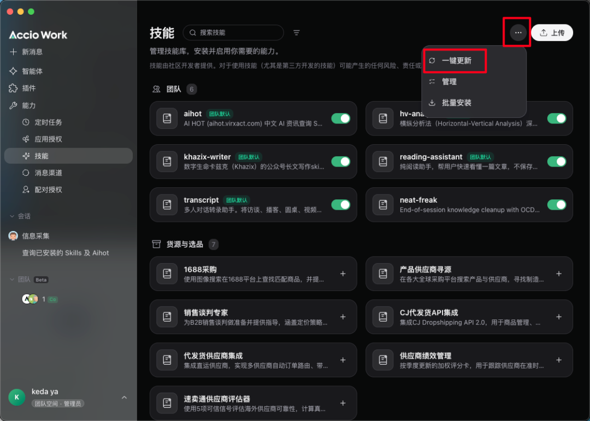

虽然弄起来也不复杂，但是我觉得后续他们其实也可以把这个东西进行自动化，比如说用户登录应用的时候，团队的技能就会进行自动的check需不需要更新。

除了我，具有管理员权限账号的同事也可以通过同样的操作上传他们的Skills到团队工作空间给别人用。

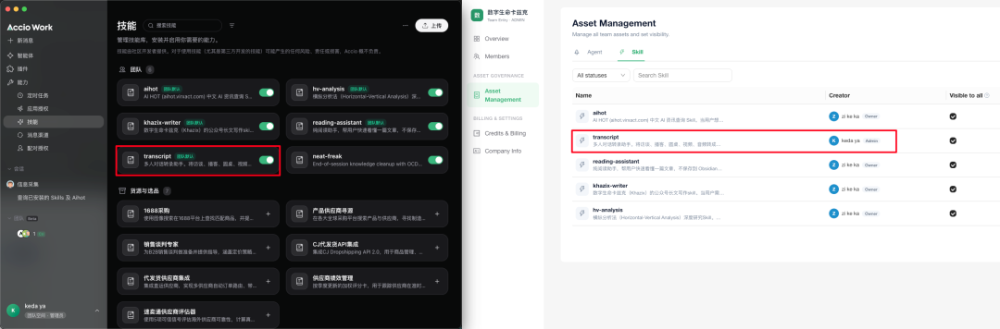

除了Skills能同步，Agent也能共享。

团队里任何一个成员都可以把自己觉得好用的Agent共享给团队其他人。

这里我拿同事的一个普通成员号演示。

在侧边栏找到智能体列表，然后在对应智能体的右上角点一下推荐，就能上传到团队工作空间。

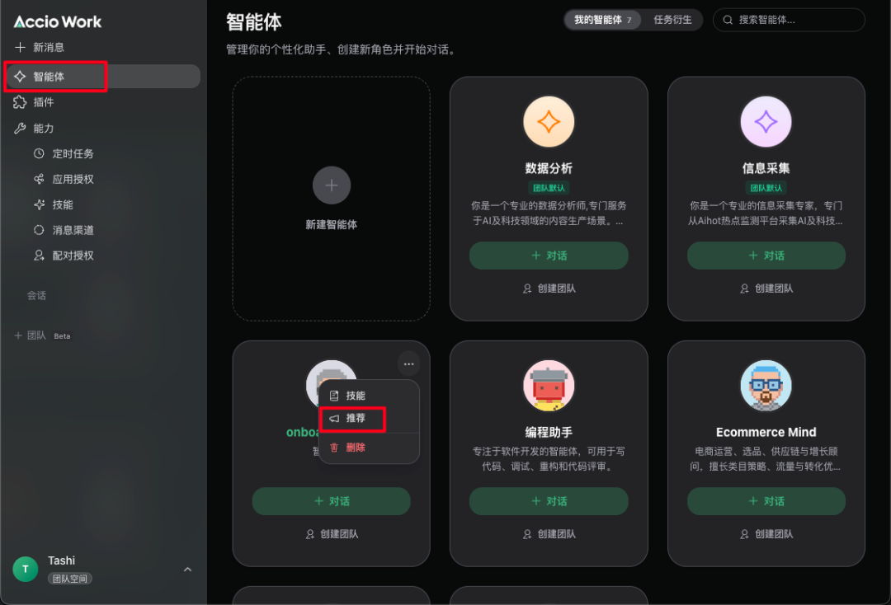

不过普通成员推荐的Agent是默认为其他人不可见的。需要管理员设置成共享，也就是勾选所有人可见的框。

勾选之后，其他人就能在自己的智能体列表里面直接就能跟这个Agent对话，不用自己重新搭了。

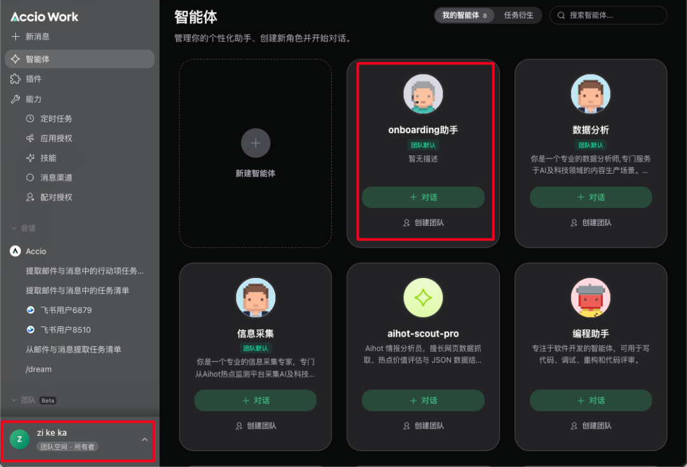

最核心的Skills和Agent共享说完了，再简单说一下团队工作空间的成员管理。

在侧边栏成员下，点击右上角的添加成员，可以通过电子邮件邀请同事加入，并且给他们分配积分点数。

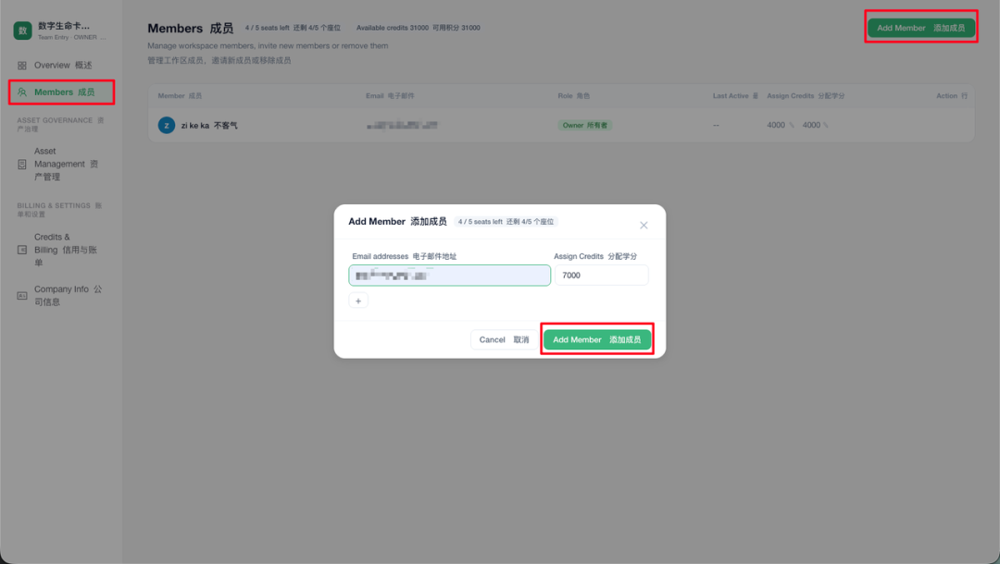

因为我这是入门版，所以一个团队最多5个成员，还有15人、50人的版本，对中小团队或者是搭一个部门完全够用。

对每一个成员，所有者和管理员可以更改下一级的权限，权限等级从高到低是所有者，管理员，普通成员。

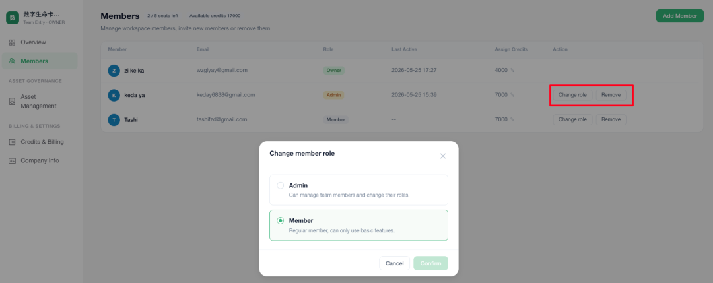

真的还挺有用的。

感觉很多做生意的小伙伴，都可以去试试。

所以我还挺高兴看到，有产品愿意去做中小团队协作的功能的。

我也越来越觉得，Agent产品下一个战场，就在团队协同这一层。

虽然OPC的概念那么火。

但是我还是觉得，单兵作战的时代快过去了。

一个团队能不能像呼吸一样自然地共享彼此的能力，可能被很多人所忽视了。

也许再过几个月，团队协同就会变成所有Agent产品的标配功能。

到那个时候回头看，可能会觉得这不是理所当然的吗。

但现在，好像，还真不是。

******以上，既然看到这里了，如果觉得不错，随手点个赞、在看、转发三连吧，如果想第一时间收到推送，也可以给我个星标⭐～谢谢你看我的文章，我们，下次再见。******

>/ 作者：卡兹克、tashi

>/ 投稿或爆料，请联系邮箱：wzglyay@virxact.com
