> 📎 来源: [科技小亮AGI](https://mp.weixin.qq.com/s?__biz=MzYzNDQ2NTc4Ng==&mid=2247486370&idx=1&sn=35327d74ff774abea9aa0c0df6e1b0f4&chksm=f15bbeb9262db1d0d9e52cb6ab7792c83b5ef0fd0860918d6aa2b13fe3067aeeb112f5bd07bb&mpshare=1&scene=1&srcid=0509e9hRUDrZ1vgWSttGGgKC&sharer_shareinfo=b604cfa59fb0fbf4b458985456a711c2&sharer_shareinfo_first=b604cfa59fb0fbf4b458985456a711c2) | 时间: 2026-05-09 14:08

---

**大家好，我是用AI做PPT的小亮。**

龙虾是真的能干活。写稿、爬数据、做分析，小亮自己很多日常工作都丢给它了。但有一类东西，用龙虾做完以后，我每次打开文件都有种说不出来的憋屈感。

它就是PPT。

龙虾随便安装的PPT Skill做出来的东西，你看一眼就知道这是 AI 出的。

白底黑字，字号一致，每一页的布局都像是同一个模子扣出来的。偶尔拜托它弄个好看一点的配色，它给你整一个绿蓝撞色，旁边配一个不知道从哪来的剪贴画风格图标。你发出去之前还得花一大半时间手动修，改到最后怀疑自己当初为什么要用 AI。

它们交出来的东西，尤其是 PPT，还是离能用差了几个 level。就像白底黑字的 Word 文档，丑到必须花跟生成差不多的时间去手动调格式。

最近小亮在龙虾里接入Skywork Skill后，直接让做PPT的能力让了一个新台阶。

## //01-PPT测试案例

小亮做了几个测试案例，带大家看看这套Skill的水平。

**case ①：手绘插画风格 PPT**

提示词：帮我做一份旅行攻略 PPT，主题是《48 小时玩转哈尔滨》。风格要有烟火气，插画 + 手写字体风，暖橙色系为主。内容：交通落地、必吃清单、打卡路线、住宿推荐。

比如，我想让龙虾生成一份哈尔滨旅游攻略，发送提示词，龙虾会自动调用Skywork PPT skill，启动任务，完成规划。

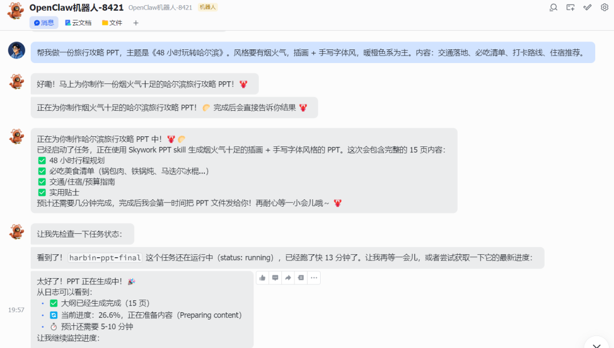

最后它以链接的形式，把生成的PPT发给我们，点击就能直接下载使用。

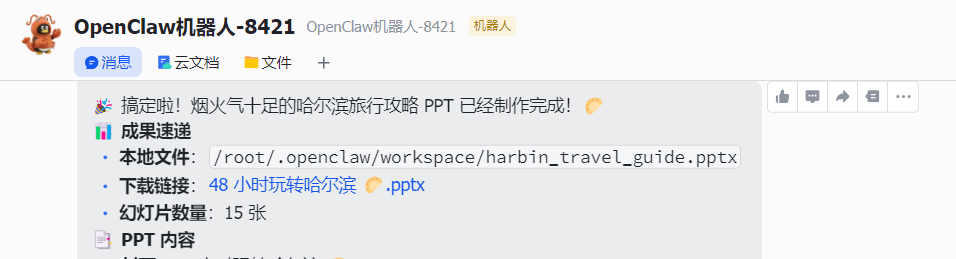

一起来看看PPT的效果，封面左侧是暖米黄手账风排版，右侧是手绘水彩风的索菲亚教堂夜景，灯串、雪花、红肠插画点缀四角。翻到内页，城市印象页三张手绘插画并排，必吃清单页里的马迭尔冰棍、烤冷面、冻梨冻柿子、冰糖葫芦都是实实在在的东北特色。

PPT不仅颜值在线，内容也很丰富，真的就能直接拿来当攻略。

下面几个案例都是用同样的方法制作。

**case ②：Sketchnote 风格**

这是一个科普绘本风格的 PPT，内容丰富、视觉导向强，

提示词：帮我做一份手绘插画风 PPT，主题是《AI 是怎么读懂你说的话的》。整体采用温暖手绘配色，线条插画和简洁版式，通过流程图和场景插图解释Tokenization、Embedding、Attention 这几个核心概念。要求图文结合，信息层级清晰，像一本写给普通人看的 AI 科普绘本。

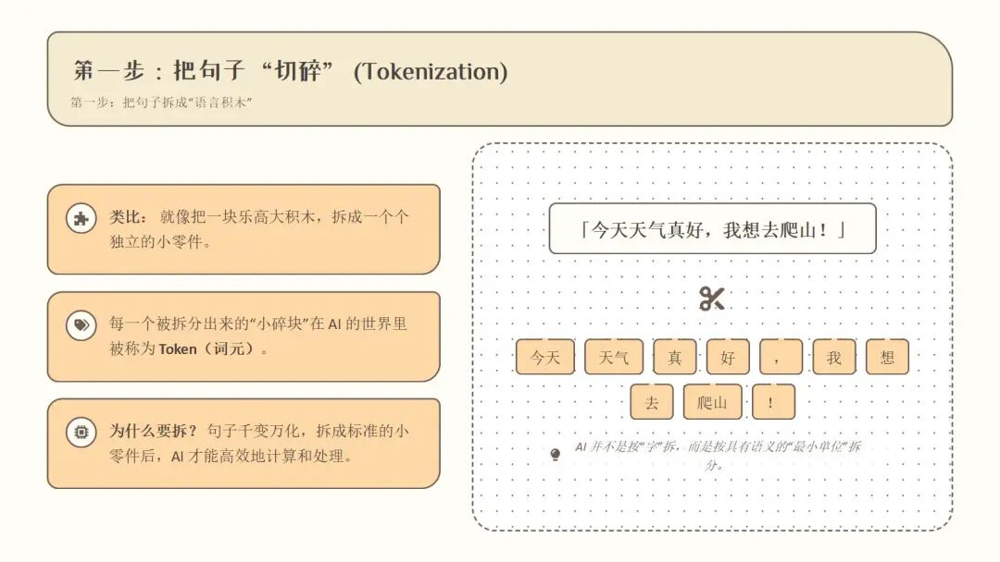

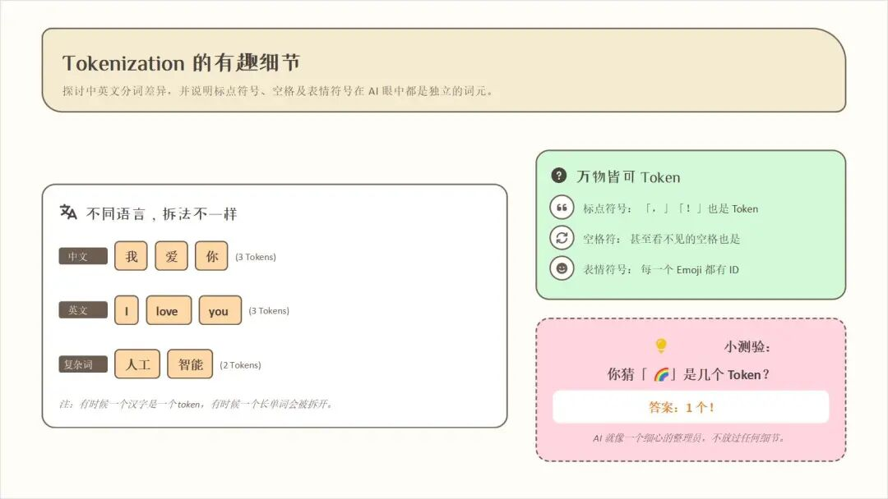

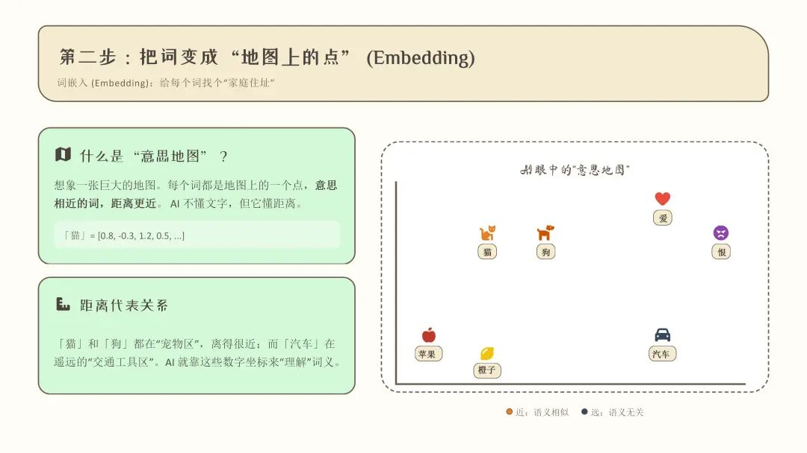

奶油米白底，橙绿粉三色卡片系统，13 页翻下来没有一页布局重复。Tokenization 那页把「今天天气真好，我想去爬山！」真的拆成键盘按键风格的词块并排展示。Embedding 那页画了一张「意思地图」，猫和狗挨在一起，爱和恨在另一个角落，比教科书的理论讲解直观多了。

而且，这些内容都是可以直接编辑的，用来做科普很方便。

**case ③：深度研究内容 PPT**

接下来，做一份投研报告PPT。

提示词：帮我做一份投研报告 PPT，主题是《大模型公司的护城河在哪里》。风格参考高盛 / 中金的研究报告，极度克制，深色封面，正文白底黑字配折线图。内容：竞争格局分析、各家差异化壁垒、风险因素、投资建议。

这是 Skywork PPT Skill 和普通 Skill 差距最大的地方。

Skywork 背后接了他们自己的 Deep Research 引擎，它不是凭空编，它会利用Search Web这个MCP工具去搜，把搜到的信息整合进来，生成的每一页数据都有出处可查。

Skywork的PPT **这个差别，在做行业分析、客户提案这类需要数据支撑的场景里，相当关键。**

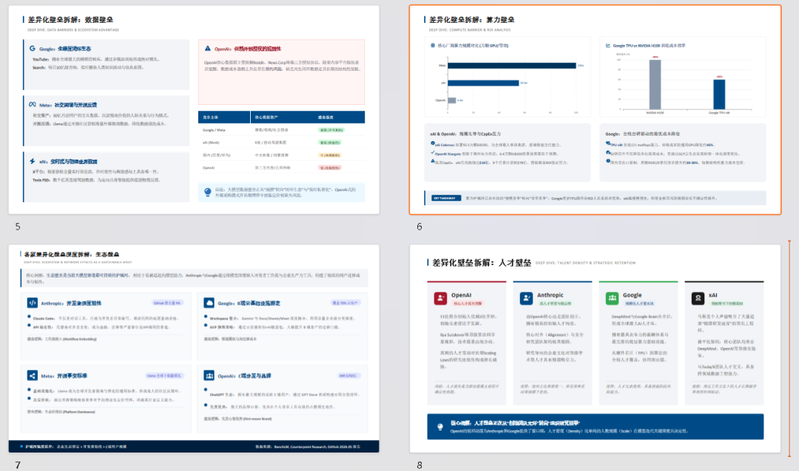

出来的东西：深色封面，白底正文。差异化壁垒那页把 Google / Meta / xAI / OpenAI 四家用彩色对比模块并排拆解，对比清晰。

## //02-安装方式

**这套 Skills 是开放的，支持接入 Claude Code、Codex****CLI****、OpenClaw，任何支持 Skills 的Agent产品都能用。**

安装方式极其简单。

在Skywork官方的设置中选择API密钥，然后点击按钮自动生成密钥并获取安装指令。

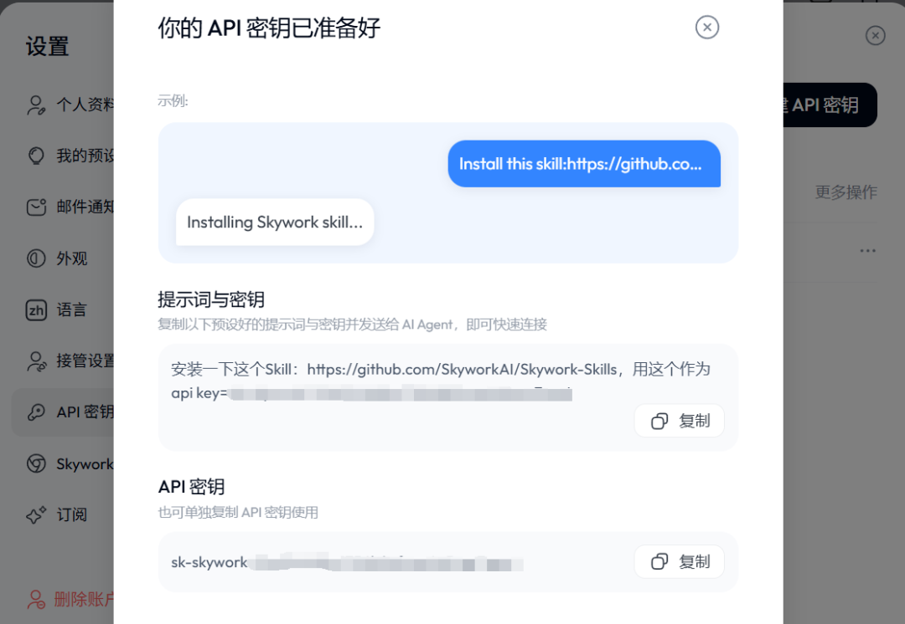

复制预设好的提示词与密钥并发送给 AI Agent，即可快速连接。比如，小亮之前部署过小龙虾，然后通过飞书链接对话，我就在飞书中发送预设好的提示词，小龙虾就开始自动安装Skywork的各种Skill。

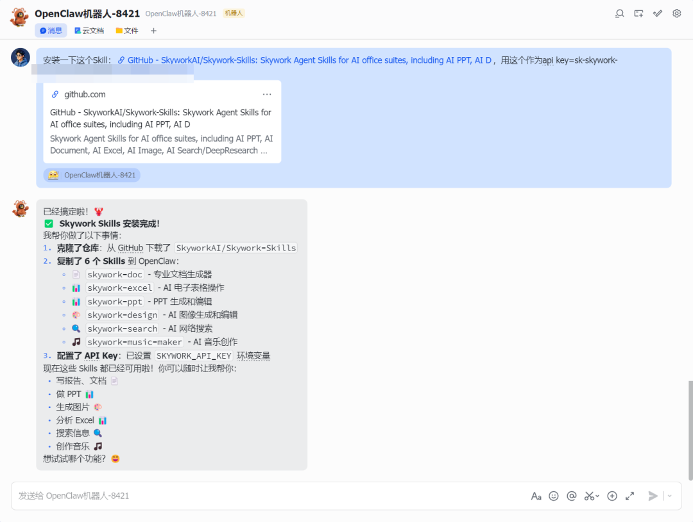

安装成功后，就能在我们的各种AI Agent里用Skywork Skills直接写报告、文档；做 PPT；生成图片；分析 Excel；搜索信息。

## //03-不止 PPT

Skywork Skills 是一整套的全面的Skill，除了PPT，小亮顺带再说一下其他几个。

① **Skywork Excel Skill**

数据分析和表格生成，支持全网搜索拉数据，生成的图表颜值同样在线。不是那种帮你做了个表格，是帮你做了个可以直接发给老板看的表格。

提示词：帮我搜索 2026 年主流大模型（GPT、Claude、Gemini、Qwen、DeepSeek）的API定价，生成一份对比分析表格，包含输入/输出价格、上下文窗口、适用场景，并生成价格趋势对比图表。

Skywork开始并行搜索各大模型的最新 API 定价信息。搜到关键信息后，再抓取几个权威定价页面补全细节。数据收集完成开始生成 Excel 对比分析表格。

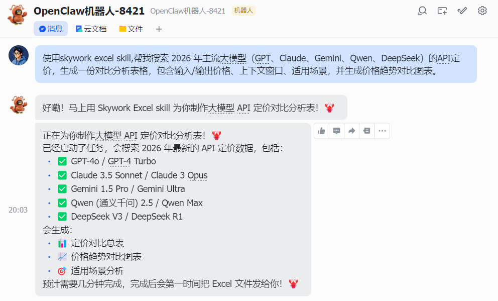

出来的是一个 5 个 sheet 的完整工作簿。主对比表覆盖 GPT / Claude / Gemini / Qwen / DeepSeek 全系 20 款模型，价格趋势 sheet 把各厂商旗舰从 2022 到 2026 的降幅全拉出来，场景选型 sheet 直接告诉你哪个场景选哪款模型。

最后竟然还附了成本计算器，填入每日请求量，各模型月成本自动算出来。

这不只是简简单单做了个表格，还是一份可以直接发给老板的竞品分析报告。而且结合定时任务，可以让Skywork的Excel Skill每天早上自动帮我看完所有数据，只有出问题的时候才会通知我

② **Skywork Design Skill**

这个Skill可以直接使用 GPT Images 2模型，海报、社媒物料、Logo 这些，尺寸和风格直接在对话里说清楚，出来可以直接发布的那种。上面我们说过，这套Skills，可以在多种Agent中使用，比如ClaudeCode、Codex、龙虾。比如在Codex安装好skill后，直接发句话。

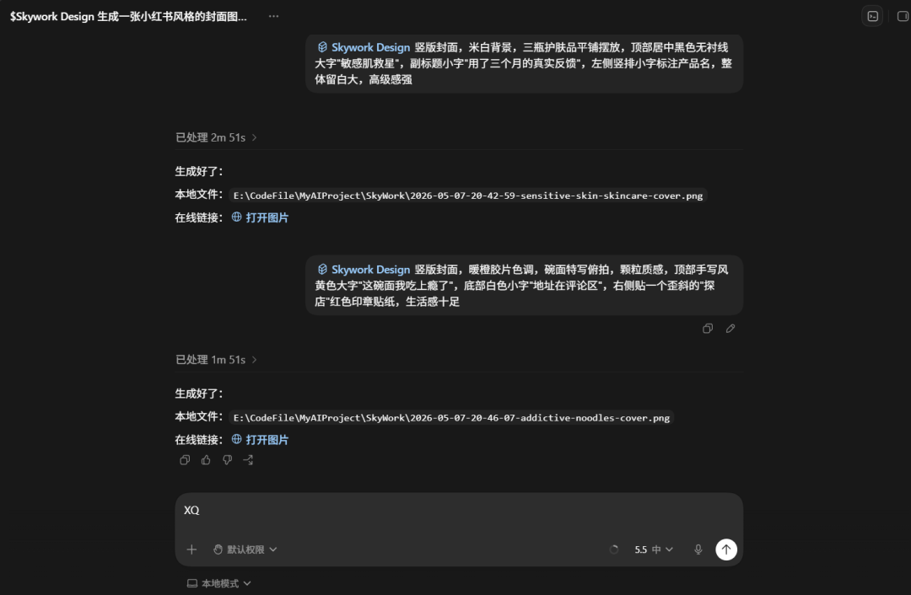

一个人运营多个平台、每天需要批量出内容物料的，这个 Skill 基本上是必装的。

③ **Skywork Document Skill**

文档生成，封面和排版都有做过专门的优化，比龙虾默认吐出来的 Markdown 好看太多。也支持深度研究，做行业报告可以考虑。

提示词：帮我写一份行业报告：《2026 年 AI Agent 赛道全景分析》，包含市场规模、核心玩家、技术路线、投资热点、未来趋势，要求有封面、目录、图表

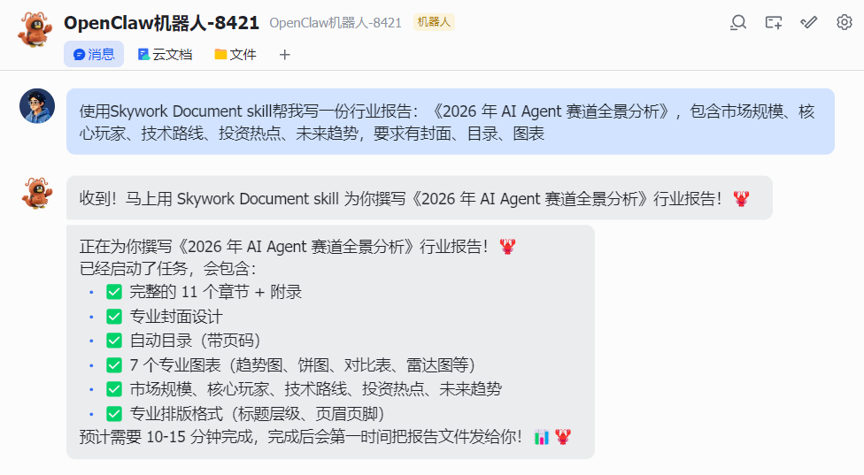

出来的是一份 16 页的研究报告。有封面、有目录、有数据图表，市场规模引用了 Grand View Research 和 Fortune Business Insights 的数据，核心玩家覆盖 OpenAI / Anthropic / 字节 / 阿里等全球主要选手。

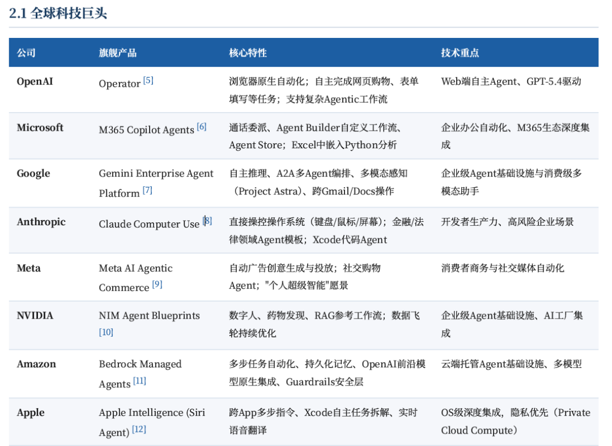

而且参考文献 37 条全部附上原始链接。

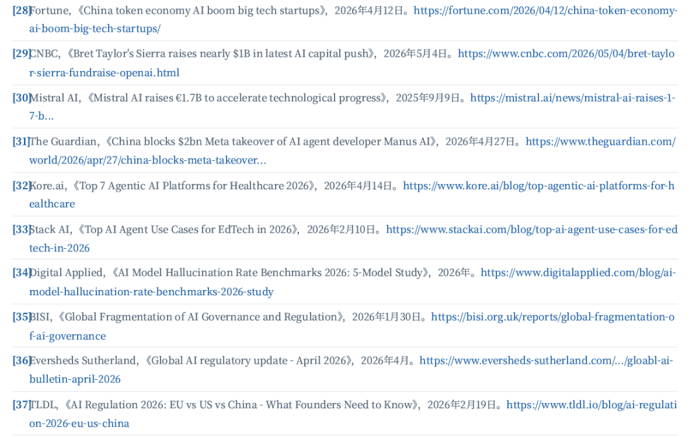

你问普通的龙虾默认能做到这个水平吗？

**能做，但它吐出来的是****Markdown****，是纯文字，没有封面，没有排版，没有图表，发给别人之前你还得自己套模板。**

还有一件事顺便带一嘴。

Skywork 的 Skills 调用，用的是 Skywork 自己的 API，你有Skywork账号就能用，和以往的各种制作PPT的Skill需要配置很多环境大有不同。

注册账号以后，你可以在里面选择调用的底层模型，目前包括 Claude Opus 4.7、Gemini 3.1 Pro、ChatGPT 5.5 这些。

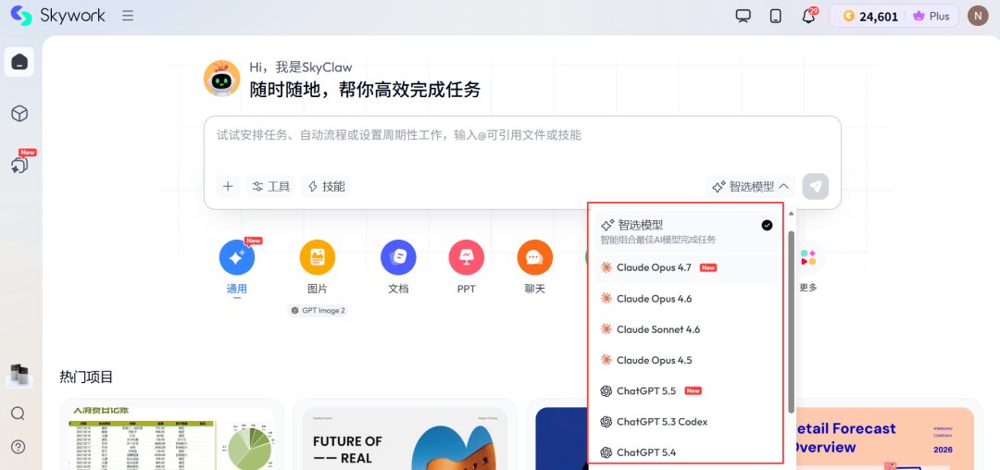

说白了，想用哪个旗舰模型跑 Skills，直接选就行。

Skills 的颜值上限，加上顶配模型的推理能力，这个组合小亮觉得是目前最顺手的方案。

## //04-写在最后

做自媒体这段时间，有一件事越来越让我在意：

AI 能做的事越来越多，但好看这件事，一直是它的软肋。

代码能跑，文章能写，数据能分析。但做出来的东西摆在那里，你一眼就能认出来这是机器出的。

**这让龙虾的效率优势，消耗在了打磨 AI 产出物颜值这件事上。**

而真正让 AI 好用的，从来不只是它能做什么，还有它做出来的东西，我们愿不愿意用。

**Skywork Skills 做对的这件事，就是让AI制作的内容值得使用。**

**以上就是本文的全部内容啦！如果觉得这篇文章有帮助，希望您能点个赞、点个推荐，给公众号点个星标⭐，还可以转发给身边的朋友，我们下期再见**

这里是科技小亮

持续分享AI等有趣内容

欢迎点击下方卡片关注小亮
