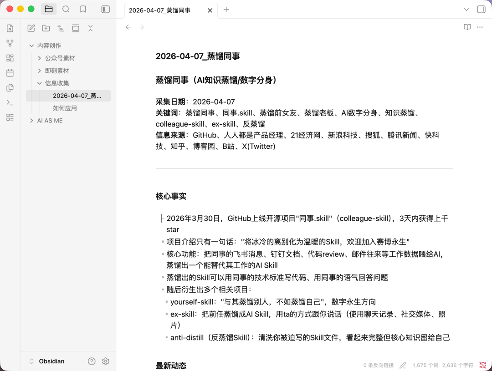
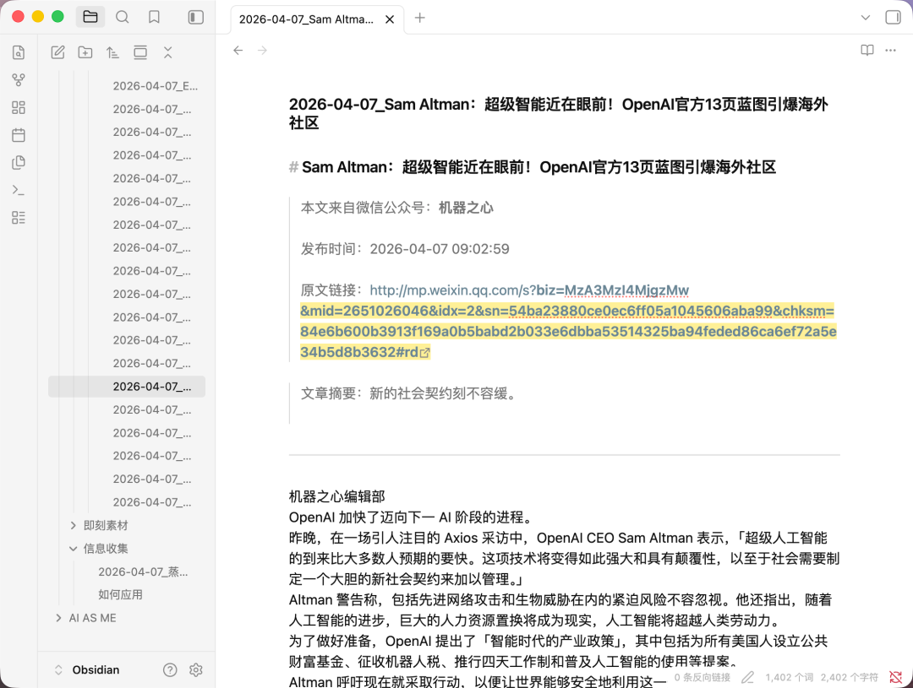
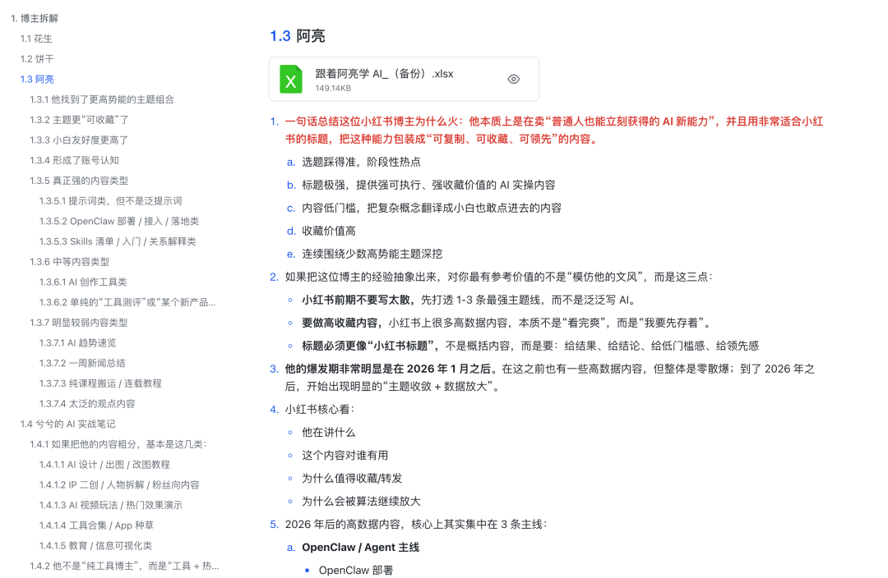
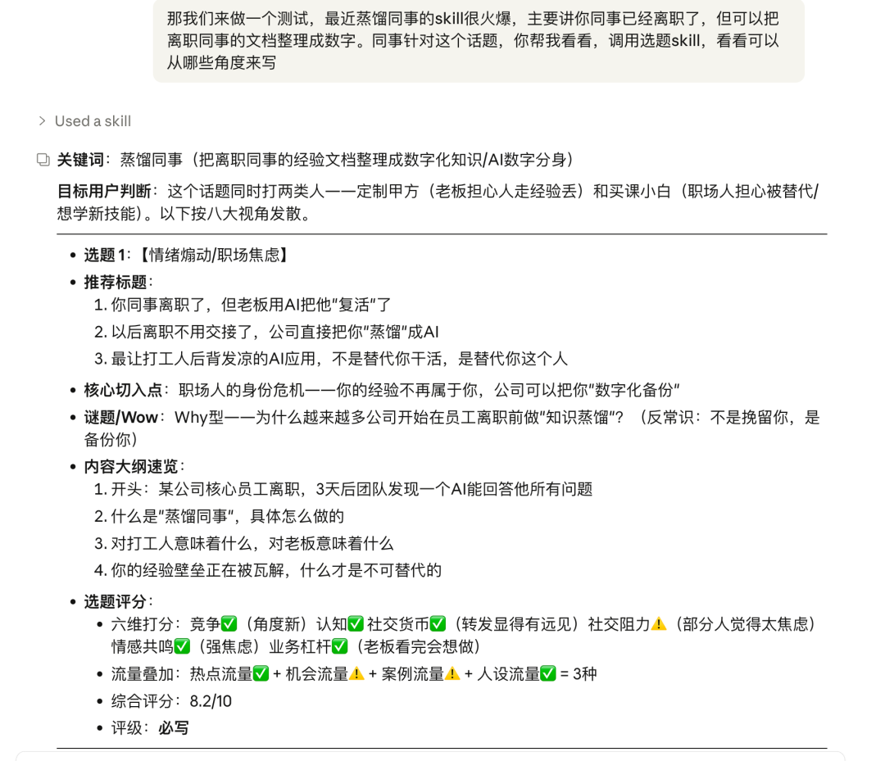
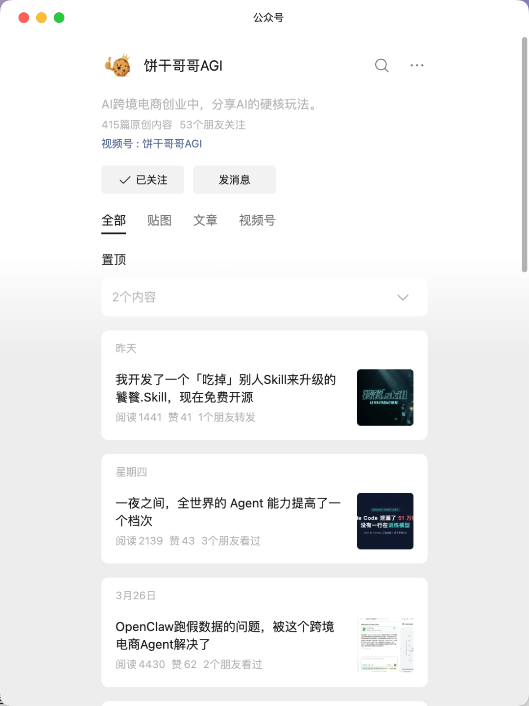
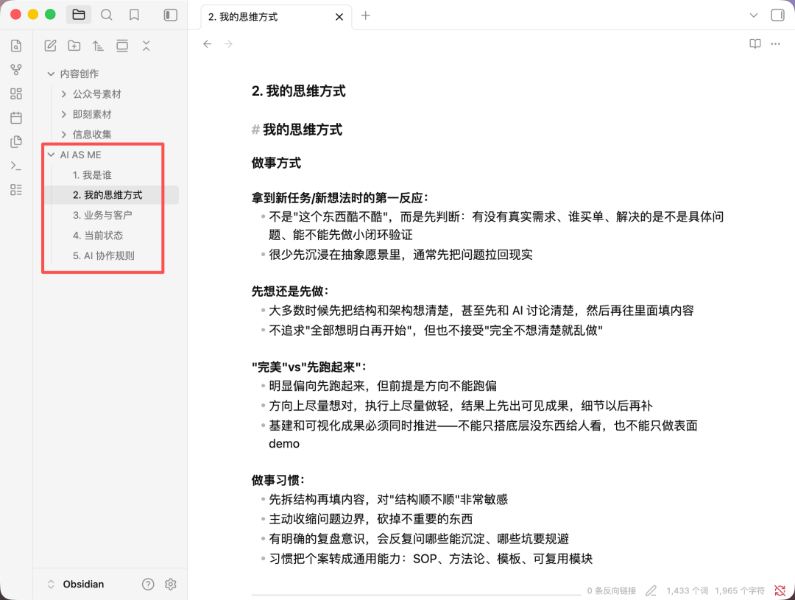
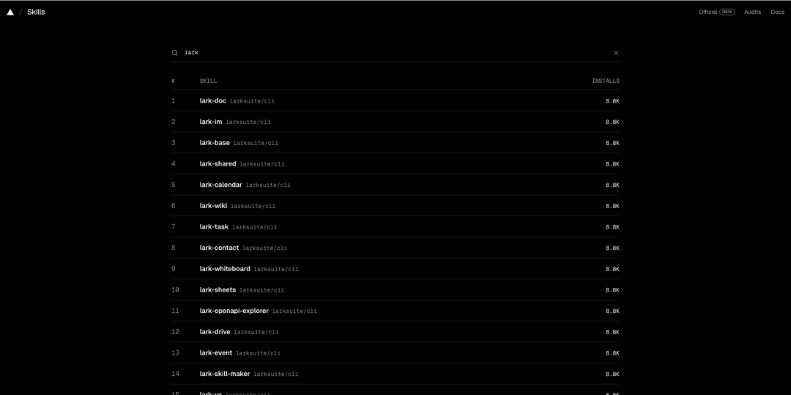
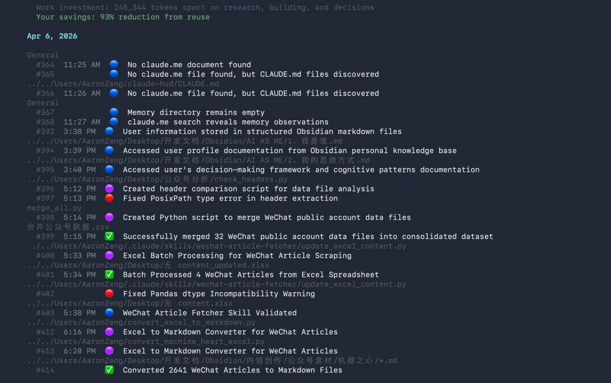
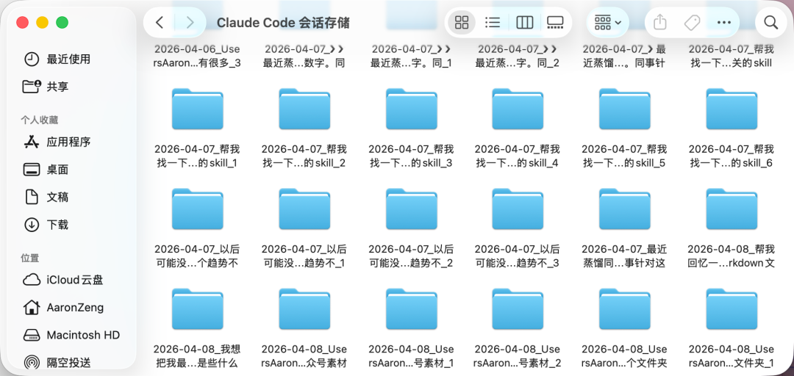

> 📎 来源: [曾俊AI实战笔记](https://mp.weixin.qq.com/s?__biz=MzIyMzYzNjg2Mg==&mid=2247486871&idx=1&sn=3d8382582d5f40bcbbfe6fd7e24a8913&chksm=e925aed1f84ca497836a16cb5673115b34afd1c88d7307d4a1d85ade155bad4c09110449da55&mpshare=1&scene=1&srcid=0430tJuqf2lZpCb64AuTdLcw&sharer_shareinfo=99e5f02494548d5a74273e4757fe0b70&sharer_shareinfo_first=99e5f02494548d5a74273e4757fe0b70) | 时间: 2026-04-30 01:07

---

去年开始用Claude Code时，不断的安装卸载 skills，累计安装过的 skills 可能超过 1000 个了。

但很多公开的 skills 都是安装后可能跑不通、只用一次就不用了、skills 之间能力太重复等，所以最终保留下来的只有这 34 个常用 skills。

这些 skills 按用途分7类，覆盖内容选题、内容创作、飞书办公、浏览器自动化、文件处理、开发设计、系统增强模块。

下面我来逐一介绍下这些 skills 是干嘛用的。一些是从网络安装的，我会提供安装路径，一些是我自己搭建的，我会告诉你 skills 的大致逻辑，你也可以自己搭建。

一、内容创作链条（9个）

这是核心生产线，都是内容创作链条上的 skills，从信息采集到选题到写作到审稿的完整链条。

| Skill | 功能 |
| --- | --- |
| `content-knowledge-collector` | 围绕话题采集信息，整理成md存本地 |
| `content-wechat-fetcher` | 公众号文章抓取（单篇/批量） |
| `content-xhs-crawler` | 小红书笔记抓取 |
| `content-video-parser` | 视频逐镜头拆解（豆包API） |
| `content-csv-to-markdown` | 公众号文章CSV转Markdown存Obsidian |
| `content-topic-generator` | 八大视角选题+标题优化+评分筛选 |
| `content-topic-ecommerce` | AI出海电商专项选题 |
| `content-article-writer` | 曾俊风格文章生成（5种结构+口播+GitHub视频） |
| `content-article-reviewer` | 三步审稿+内容评分 |

这些全都是我自己搭建的，从上到下的作用分别是

content-knowledge-collector：根据一个关键词，用搜索工具去搜索这个话题相关的材料，以及去我自己历史知识库里面收集材料，整理到一个 markdown 文档里，例如下图，针对“蒸馏同事”收集相关的材料，以便于用于我后续写文章参考。

content-wechat-fetcher：抓取公众号文章，因为我会 40+ 把 AI 博主每天发布的文章全部整理到知识库，方便我参考选题，所以会把他们内容全部抓下来，例如下图。

content-xhs-crawler：这个类似公众号抓取，因为有时还需要采集小红书的内容做参考，以及分析博主，例如下方去分析这些博主

content-video-parser：这个是用来拆解短视频的，将一个视频上传上去，然后调用豆包视觉模型的 API，解析视频的脚本、hook、CTA 等，以及告诉我应该如何模仿生成。

content-csv-to-markdown：结合第二个使用，因为抓取的公众号文章是.csv 格式，我需要把他转换成 .md 格式，更方便大模型使用，也更方便放在 Obsidian 里应用。

content-topic-generator：选题相关 skills，输入一个话题，他会去查找知识库相关材料，然后提供一堆好用的选题，如下图

content-topic-ecommerce：电商专用选题 skills，当我要写出海、TikTok 相关文章时，会用这个 skills，这个 skills 的逻辑是，我把“饼干哥哥 AGI”的所有文章喂给 AI，他在出海方便的选题、写标题内容都写的很好，所以相当于蒸馏了这位博主的选题逻辑。

content-article-writer：以我自己风格生成口播稿，相当于蒸馏我自己。

content-article-reviewer：在内容创作完成之后需要再让 AI 来审稿，去除 AI 味、是否有事实性错误、给内容从多个维度评分等。

以上 9 个 skills 都是我自己搭建的，没有直接安装逻辑。

二、创作参考（3个）

不直接参与生产，但写作时可调用的知识库和参考工具。

| Skill | 功能 |
| --- | --- |
| `ai-as-me` | 曾俊个人数字分身知识库（人设/思维方式/业务背景） |
| `marketing-psychology` | 营销心理学知识库（50+模型：锚定效应/损失厌恶/社会证明等） |
| `khazix-writer` | 卡兹克风格写作Skill（四层自检体系、风格示例库） |

ai-as-me：相当于我的数字分身，搭建了五层记忆体系，每一层都包含我大量信息，让 AI 足够理解我做决策逻辑，然后可以让他帮我做一些工作。

这个数字分身的搭建逻辑分为几步：

1）把“余一”最近一年的内容导出来，丢给 Claude Code，让他总结 AI AS ME 如何搭建。这样做是因为她搭建了一个 AI AS ME，并且经常在即刻分享她的搭建经验。

2）让 Claude Code 结合我在用的工具帮我设计“AI AS ME”架构，以及搭建好一个 skills。

3）Claude Code 帮我把每个文档的 prompt 写好，我丢给 GPT、Gemini，提取对应的记忆。

4）把记忆提出来放文档中，让 Claude code 更新记忆。

marketing-psychology：没多大用处，营销相关心理学知识库，当遇到营销问题时，他会告诉你可能是触发了什么模型。

khazix-writer：卡兹克风格的写作skill，因为前两天他发了篇文章，里面有提到他的他自己蒸馏的skill，我把那个安装上，暂时还没有去应用。和我自己搭建的 content-topic-generator 这个 skills 逻辑大差不差 [今天，我决定把「卡兹克风格创作.skill」开源了。](https://mp.weixin.qq.com/s?__biz=MzIyMzA5NjEyMA==&mid=2647681343&idx=1&sn=5d8f0ed39a3cc8d9593367251a136fdd&scene=21#wechat_redirect)

三、飞书办公（3个）

这几个是可以直接操作飞书文档的skills，但在使用它之前，需要先安装飞书 CLI 才能使用。

| Skill | 功能 |
| --- | --- |
| `lark-doc` | 飞书云文档操作（创建/编辑/搜索） |
| `lark-base` | 飞书多维表格操作（建表/字段/记录） |
| `lark-wiki` | 飞书知识库管理（知识空间/节点） |

这几个 skills 以及下面的 skills，都可以直接去 https://skills.sh/?q=lark 这个网站是什对应的名称，能够直接安装，非常方便。例如直接是什 lark 就能看到很多飞书相关的 skills。

四、浏览器自动化（4个）

这几个都是和浏览器自动化相关的 skills，就是 Claude code 本来不具备的一些功能，比如说去抓取或者做浏览器交互上的操作都做不了，但是安装上这几个skill就可以操作了。

安装方法同前面飞书 skills。

| Skill | 功能 |
| --- | --- |
| `web-access` | 联网操作（搜索/抓取/登录/CDP代理） |
| `agent-browser` | 浏览器自动化CLI |
| `browser-use` | 浏览器交互自动化 |
| `chrome-cdp` | Chrome调试交互 |

五、文件处理（4个）

这几个skill分别可以用来处理PDF、word、PPT和表格,因为 claude code 默认没有这些能力，需要你单独安装skill才能有这些能力去操作。

安装方法同前面飞书 skills。

| Skill | 功能 |
| --- | --- |
| `pdf` | PDF读取/合并/拆分/水印 |
| `docx` | Word文档操作 |
| `pptx` | PPT操作 |
| `xlsx` | Excel操作 |

六、开发与设计（3个）

这几个skills就是在你用 Claude code 去做开发的时候，它能让前端页面开发的更好看更规范。

安装方法同前面飞书 skills。

| Skill | 功能 |
| --- | --- |
| `frontend-design` | 前端UI设计/生成代码 |
| `web-design-guidelines` | Web界面规范审查 |
| `distill` | UI简化/去噪 |

###

七、系统增强（9个）

| Skill | 功能 |
| --- | --- |
| `claude-mem` | 跨会话记忆/计划/执行 |
| `claude-session-manager` | 会话自动保存到本地 |
| `planning-with-files` | 复杂任务文件化规划 |
| `connect` | 连接1000+外部应用 |
| `find-skills` | 搜索和安装新Skill |
| `security-scan` | Claude Code安全扫描 |
| `pua` | 高压式问题解决（多种大厂风格） |
| `zlib-download` | Z-Library搜书/下载 |
| `--help` | Skill帮助说明 |

claude-mem：这个skill可以跨绘画记忆，然后做一些计划和执行，因为在终端使用的时候会有一个缺点，你关掉窗口之后就再也找不到历史会话了，这个 skills 可以让你能够看到历史会话信息。安装方法同前面飞书 skills。

claude-session-manager：这个工具是可以将历史所有绘画都保存到电脑本地，因为AI的能力越来越强，上下文窗口也越来越长，所以做一个类似日志保存的工具，将历史所有会话都保持下来，之后在喂给最强大的模型，或许可以有一些新发现，例如下图这样，可以把需求讲清楚，让 Claude code 自己搭建这样一个 skills。

planning-with-files：可以将复杂任务拆分规划执行

find-skills：可以通过这个 skills 根据你的需求去寻找到相关的 skills

zlib-download：这是一个可以去网上下载各类电子书到本地的 skills

这三个安装方法同前面飞书 skills。

## 关于我

曾俊，硅基行动 CEO，**前大厂产品负责人**

专注 AI 智能体定制服务

已落地 **20+ 智能体案例**，帮助企业实现业务提效。

欢迎交流：**ZF1235813266**
