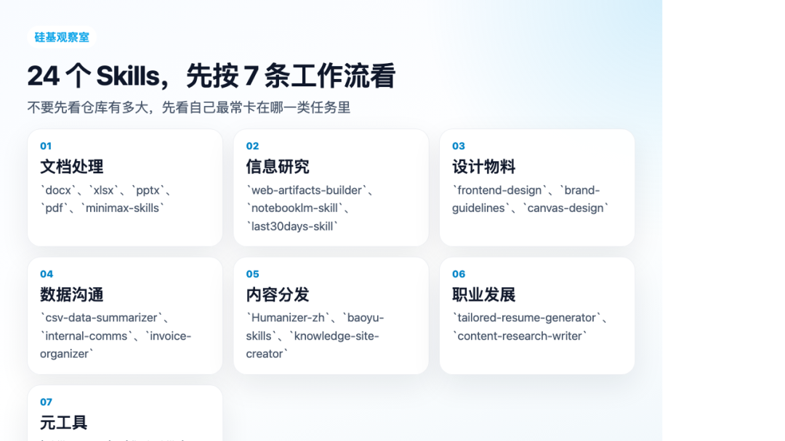
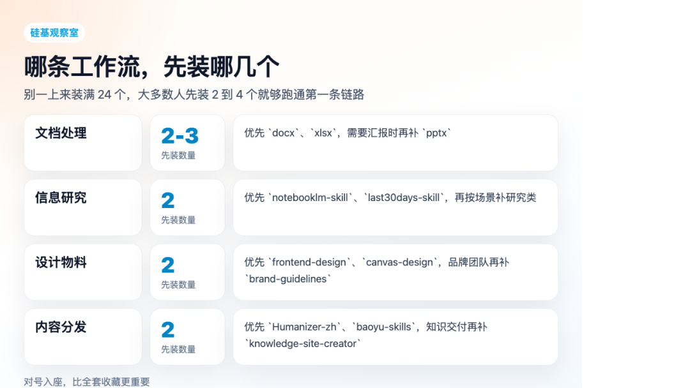
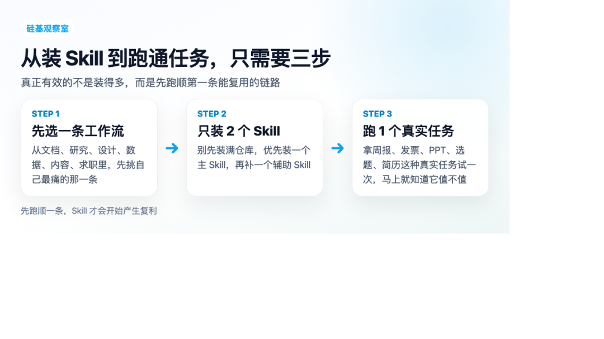

> 📎 来源: [智见-硅基观察室](https://mp.weixin.qq.com/s?__biz=MzY5MzE4NDE4OQ==&mid=2247484470&idx=1&sn=2875ba4aa9f03d5e13bb4e94781953e3&chksm=f5e17b21f4d22fef959ace7a08d221387495c114eaabc1bc32bf94e4edacfedb9ad1a9bc0ed9&mpshare=1&scene=1&srcid=0430wZ2e4UfTzIbVWaWemLGy&sharer_shareinfo=ef398d2d270a5c7330e1f7d3bea8b47c&sharer_shareinfo_first=ef398d2d270a5c7330e1f7d3bea8b47c) | 时间: 2026-04-30 19:10

---

# 我高频在用的 24 个 Skills，按 7 条工作流一次讲清楚

这篇我想直接给一份能落地的清单。

不是讲概念，也不是泛泛聊趋势。

如果你已经开始用 Claude Code、Codex、OpenClaw 这一类 agent 工具，你很快就会发现，真正拉开效率差距的，已经不只是模型本身了，而是你手里有没有一套能复用的 Skills。

现在市面上的 Skills 已经多到有点夸张。

官方的、社区的、垂直场景的、中文优化的，认真找一圈，数量早就不是几十上百，而是成千上万。

问题不是没有工具。

问题是，面对这么多 Skills，普通人最容易卡住的不是不会装，而是不知道先装哪几个，不知道哪些是真能进入高频工作流的。

所以这篇我不打算做大而全盘点。

我更想做一件具体的事，把我认为真正值得装、而且大多数人装完就能立刻用起来的 24 个 Skills，按 7 条常见工作流整理成一张清单。

你可以把它理解成一份入门到进阶之间的过渡版本。

不是给极客玩的收藏夹。

而是给已经开始用 agent，但还没把 Skills 用顺的人，一份尽量少踩坑的装机建议。

先说一个原则。

这篇不是要你 24 个全装。

真正更有效的做法，是先找到和你工作最相关的那一条工作流，然后从里面装 2 到 4 个。只要有一条链路跑顺，你对 Skills 的理解就会完全不一样。

## 先说两件事，Skills 去哪找，怎么装

找 Skills，优先看这几个地方就够了。

第一类，官方仓库。

Anthropic 官方 Skills 仓库是最稳的入口，很多通用型能力，比如 `docx`、`xlsx`、`pptx`、`pdf`、`frontend-design`、`internal-comms`，都适合从这里起步。

第二类，社区导航和精选合集。

像 `skills.sh`、`skillhub.club`、`clawhub.ai`，还有 GitHub 上各类 `awesome-claude-skills` 清单，本质上解决的是发现效率问题。你不需要一个个翻仓库，先从这些导航站看就行。

第三类，垂直作者仓库。

有些技能不是大而全平台做出来的，而是长期在某个场景打磨出来的，比如内容创作、数据整理、知识站点、求职简历，这类仓库往往更接近真实工作流。

安装其实也很简单。

最省事的方式，就是直接把 skill 地址丢给 agent，让它帮你装。

`帮我安装这个 Skill：`

如果你习惯命令行，也可以直接走：

`npx clawhub@latest install <名称>`

或者：

`npx skills add `

对大多数人来说，这一步没必要研究太久。真正重要的是，装完之后你要立刻找一个真实任务跑一遍，不然很容易又回到收藏型学习。

## 工作流 1，文档处理组

很多人一提 agent，先想到的是写代码。

但说真的，对绝大多数白领来说，最先被 Skills 改造的，根本不是代码，而是文档。

Word、Excel、PPT、PDF，这四件事几乎每个岗位都躲不开。

### 1. `docx`

适合需要高频生成、修改、审阅 Word 文档的人。

HR 写制度，法务对合同，行政出纪要，市场改方案，这类场景里最烦的不是写内容，而是格式、批注、修订、结构反复来回改。`docx` 的价值就在这里，它不是帮你写一段话，而是开始接管 Word 这种高频但琐碎的文档劳动。

### 2. `xlsx`

如果你工作里离不开 Excel，这个 Skill 基本属于优先级很高的那一类。

它更适合预算、汇总、分析、对账、清单整理这些任务。很多人以前查函数、调格式、补公式要来回折腾半小时，现在更像是在描述目标，让 agent 帮你把表格逻辑搭起来。

### 3. `pptx`

这个 Skill 补的是很多职场人最烦但又无法逃掉的那部分体力活。

提案、汇报、培训、复盘、项目路演，真正耗人的往往不是想内容，而是把内容变成一页页能看的东西。`pptx` 值钱的地方，就是把母版、版式、图表、演示结构这一层开始自动化。

### 4. `pdf`

如果你经常跟合同、论文、报告、发票、审计材料打交道，这个 Skill 会很实用。

它解决的是 PDF 不好读、不好抠、不好整理的问题。尤其是表格抽取、重点段落提取、结构化摘要，这些过去很像体力活的动作，现在终于可以被 Skills 接过去。

### 5. `minimax-skills`

这套我会把它放进文档组，不是因为它更全面，而是因为它在中文场景下经常更顺手。

像中文模板、人民币格式、国内职场常见版式、本地化细节，这些地方它的表现通常会更贴近中文用户。我的建议很简单，如果你中英双语场景都多，官方和国产这两套可以一起留着，按任务切换。

## 工作流 2，信息整理与研究组

很多人的真实困境，不是不会搜资料，而是被资料淹没。

网页、群聊、笔记、PDF、视频、报告、评论区，信息太多之后，人最稀缺的能力不再是获取，而是筛选、整合和提炼。

这一组 Skills，补的就是这一层。

### 6. `web-artifacts-builder`

如果你需要把资料、数据、结论变成一个能交互展示的网页，这个 Skill 很值得装。

产品、运营、咨询、教育这几类人会特别受益。以前很多汇报最后只能交一张静态图或者一份平面报告，现在你可以直接交一个能点、能看、能交互的 dashboard。这不是炫技，它会明显提高结果的可传播性。

### 7. `notebooklm-skill`

这是我很看重的一类能力，把资料灌进去，然后围绕资料继续研究。

它更像是给 NotebookLM 补了一层接入和自动化能力。适合论文综述、行业报告、案卷整理、课程复习、选题研究这种资料量非常大的任务。它真正接住的，不是搜索，而是消化。

### 8. `lead-research-assistant`

这个 Skill 很适合销售、招商、猎头、BD、自雇服务者。

它不是泛研究，而是更偏线索研究。你给行业、公司、方向，它帮你扒潜在客户、组织信息、联系人和需求线索。对很多需要冷启动的人来说，这类 Skill 的价值非常直接，因为它能把原本分散的人肉搜索，变成更稳定的线索生成流程。

### 9. `meeting-insights-analyzer`

如果你开会很多，这个 Skill 几乎没有什么理解门槛。

把会议录音或者转录丢进去，让它整理成纪要、决策点、行动项和风险点，这件事本身就值回票价。很多团队的会不是没结论，而是结论散了、动作丢了、责任人没跟住。这种 Skill 真正节省的，是会后混乱。

### 10. `last30days-skill`

这个 Skill 的意思很明确，不看官稿，看真实讨论。

它适合出海产品、市场、咨询、内容团队、创始人去看海外用户最近 30 天到底在怎么聊某个产品、某个品牌、某个议题。很多时候，你缺的不是一篇行业分析，而是用户最直接的原话。这个 Skill 接的就是那一层。

## 工作流 3，设计与物料组

现在的现实是，越来越多不会设计的人，也必须不断产出视觉物料。

海报、封面、页面、横幅、品牌色、活动图，这些事以前是设计部门专属，现在几乎变成所有团队的基础技能。

如果没有合适的 Skill，最后很容易落进两种状态，要么一直等设计师，要么做出一堆很重 AI 味的廉价视觉。

### 11. `frontend-design`

这是我会优先推荐的一类设计型 Skill。

它补的不是图片，而是界面和前端视觉表达。适合做产品原型、活动页、展示页、招聘页、概念稿。它最值钱的地方在于，很多人第一次意识到，AI 做设计不一定只能出那种模板味很重的东西。

### 12. `brand-guidelines`

对团队来说，审美统一比单次惊艳更重要。

这个 Skill 更适合品牌、市场、HR、运营这种长期做对外物料的人。你把品牌规范、字体、颜色、调性输入进去，后面很多产出会自动往同一个风格上靠。它不是最炸的那个 Skill，但非常适合做长期协作。

### 13. `canvas-design`

如果你要做的是海报、邀请函、节日图、封面图、活动物料，这个 Skill 会更对路。

它更偏图像设计和画面风格。适合那些不想自己去折腾 Photoshop 或 Figma，但又确实需要一批能用的视觉资产的人。对内容团队来说，这种 Skill 会很快进入高频区。

## 工作流 4，数据分析与沟通组

很多人的问题不是没数据。

而是拿着一堆数据，不知道怎么把它讲清楚。

会做表，不等于会汇报。

会出图，也不等于会解释。

这一组 Skills，本质上是在把数据工作从整理，往表达和沟通再推一步。

### 14. `csv-data-summarizer`

这个 Skill 很适合做运营、财务、市场、人事、产品分析的人。

你丢一个 CSV 给它，它帮你出摘要、出图、出结论，重点是开始把分析语言也一起补上。很多时候老板真正要的不是那张表，而是表后面的判断句。这个 Skill 接住的就是那句话。

### 15. `internal-comms`

这个 Skill 很容易被低估。

因为很多人觉得写内部通知、全员信、项目公告，好像不算高技术任务。但恰恰是这种稿子最容易高频消耗人，而且写不好特别影响组织感受。`internal-comms` 的好，在于它能在正式和有人味之间找到一个比较稳的平衡。

### 16. `invoice-organizer`

发票、报销、归档、对账，这些动作的痛感不用多解释。

对财务、行政、老板、自由职业者来说，这类 Skill 的价值很朴素，就是把一堆零散票据整理成一个清晰的结构。不是最性感，但特别实用。

## 工作流 5，内容创作与分发组

我一直觉得，现在几乎每个白领都在做某种意义上的内容工作。

写周报是内容，写公告是内容，写说明书是内容，做培训课件也是内容。

问题从来不只是写。

还包括整理、去 AI 味、适配平台、分发出去。

### 17. `Humanizer-zh`

这类 Skill 现在真的越来越刚需了。

不是因为大家都在偷懒，而是因为越来越多人已经在现实工作里用 AI 起草。问题是，很多稿子不经过二次处理，读起来就是很重的机器味。`Humanizer-zh` 接的不是写作本身，而是最后那层清洗和还原活人感。

### 18. `baoyu-skills`

如果你做公众号、小红书、X、Threads、知识内容或者品牌内容，这个仓库非常值得留。

它的价值不在单一 Skill，而在于它是一整套围绕内容创作沉淀出来的能力集合。很多人需要的不是一个点状工具，而是一整套在不同平台之间可迁移的内容工作流。

### 19. `knowledge-site-creator`

这个 Skill 很适合把资料和知识变成网站。

老师、培训团队、产品经理、咨询顾问、研究者都能用。它的好处是，很多原本只能躺在文档里的内容，突然有了一个更适合浏览和传播的形态。尤其在对外展示和知识交付场景里，这类 Skill 很能打。

## 工作流 6，个人职业发展组

前面五组，更多是在帮你把工作做得更稳、更快、更完整。

但 Skills 还有一个很容易被忽略的用途，就是直接帮你自己。

求职、研究、个人表达、职业跃迁，这些事情也完全可以被 Skills 接住。

### 20. `tailored-resume-generator`

这个 Skill 的逻辑很好理解。

不是让你写一份通用简历，而是围绕不同 JD 自动调整表达重点。对于求职者来说，这件事特别重要，因为很多人不是能力不够，而是不会把已有经历翻译成对岗位更友好的版本。

### 21. `content-research-writer`

如果你经常要围绕一个主题做研究、搭提纲、找资料、出初稿，这个 Skill 会很顺手。

编辑、自媒体、咨询、研究员、老师都适合。它的价值在于把研究和写作这两件原本断开的事，开始往一起收。你不需要自己先翻几十个页面，再手工拼出第一版骨架。

## 工作流 7，元工具组

前面那些 Skills，解决的是具体任务。

而这一组更有意思，它们开始处理另一个更上层的问题。

Skills 太多了，怎么找。

没有合适的，怎么造。

有很多候选的时候，怎么选。

这就是元工具真正开始发力的地方。

### 22. `skill-creator`

这个 Skill 非常适合那些已经跑出重复工作流的人。

你每周都在重复的动作，只要已经足够稳定，就值得被封装成一个新的 Skill。周报、客户报告、月度对账、课程反馈、项目巡检，这些事一旦被做成自己的 Skill，效率会直接进入复利状态。

### 23. `find-skills`

这个 Skill 补的是搜索成本。

仓库和导航站越来越多之后，最大的问题不是没有 Skill，而是你很难迅速判断某个任务该去装哪一个。`find-skills` 这类能力很像一个路由器，让你不用每次都重新在技能海里迷路。

### 24. `SkillsVote`

这是我觉得特别像下一阶段会越来越重要的一类 Skill。

当 Skills 足够多之后，Agent 不一定会自动选对。选错 Skill，不只是浪费 token，更会把任务拖慢，甚至把流程带偏。`SkillsVote` 的价值就在于，让 agent 在多个候选能力里更稳地选出当下更适合的那几个。

## 最后，把这 24 个 Skills 浓缩成一张表

如果你只想先拿走最核心的信息，记住下面这张对照关系就够了。

- 文档处理：`docx` / `xlsx` / `pptx` / `pdf` / `minimax-skills`
- 信息整理与研究：`web-artifacts-builder` / `notebooklm-skill` / `lead-research-assistant` / `meeting-insights-analyzer` / `last30days-skill`
- 设计与物料：`frontend-design` / `brand-guidelines` / `canvas-design`
- 数据分析与沟通：`csv-data-summarizer` / `internal-comms` / `invoice-organizer`
- 内容创作与分发：`Humanizer-zh` / `baoyu-skills` / `knowledge-site-creator`
- 个人职业发展：`tailored-resume-generator` / `content-research-writer`
- 元工具：`skill-creator` / `find-skills` / `SkillsVote`

如果你问我，这篇真正想表达的判断是什么。

不是 Skills 越多越好。

也不是每个人都该把自己变成工具收藏家。

我更想说的是，AI 这两年最实际的一次变化，不是模型更会说了，而是越来越多真实工作的中间环节，终于开始有人帮你拆出来、封装好、做成可以复用的能力包了。

以前很多工具只能服务程序员。

现在不是了。

做文档的人、做表的人、做汇报的人、做研究的人、做内容的人、找工作的人，都开始有了对应的一把钥匙。

这件事真正有价值的地方，不在于新鲜。

而在于它让 AI 第一次更大范围地进入了普通人的工作流。

不是看热闹的进入。

而是那种，真的能帮你少做一点重复劳动，少耗一点脑力，少在低价值动作上打转的进入。

所以最后给一个很实用的建议。

别上来就装 24 个。

先找你最痛的一条工作流。

文档、研究、设计、数据、内容、求职，或者元工具管理，任选一条。

然后从里面装 2 个，拿一个真实任务跑通。

只要你真的跑顺一次，你后面再看 Skills，就不会把它们当成好玩的插件目录了。

你会开始把它们当成工作流本身的一部分。

这才是 Skills 真正开始有复利的时刻。
