> 📎 来源: [MojoAI](https://mp.weixin.qq.com/s?__biz=MzkzNjc5NjU5MQ==&mid=2247484396&idx=1&sn=02388a1c22d86b810c9f80b27d3ba329&chksm=c34439daaea315bea8e7748deb7659f1752be36796593c3709ffbd5c660378000c8ecc038d14&mpshare=1&scene=1&srcid=0526ZY3Puk0Ukq5UcE54s6jR&sharer_shareinfo=f0f44b44e0ec21841c4f6c1327bd7e8e&sharer_shareinfo_first=f0f44b44e0ec21841c4f6c1327bd7e8e) | 时间: 2026-05-26 17:16

---

**在「Garden Skills」**

**播撒创意的种子**

**口播视频/APP/网页设计/PPT 让微小的idea**

**开出绚丽的花**

过去一个月，我养成了一种「数字园艺」的习惯。每天早上打开电脑，第一件事不是刷热搜，而是打开我的「Garden Skills」，像侍弄花草一样，用 AI 把脑子里那些灵光乍现的点子，变成能在浏览器里直接跑起来的东西。

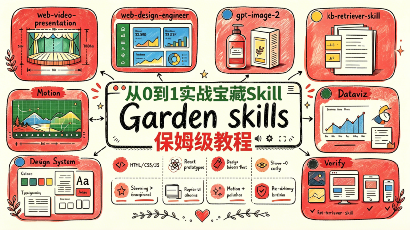

懂不懂代码都没关系，打开浏览器上网总没什么难度吧？对，就是那些能直接打开浏览的HTML文件。一旦有了 HTML，任何想法都有了实体：不管是精美的口播视频，还是酷炫的PPT，复刻一个你收藏夹里的宝藏网站，或者干脆是陪你聊天的AI情感助手APP原型，只要播撒创意的种子，统统都可以在你的「数字花园」里长成绚丽多彩的花草。

「Garden Skills」目前在Github上斩获5.9K Star，妥妥的神级Skill。

今天这篇文章，我会带大家使用Trae平台，从0到1实战「Garden Skills」，读完你也能立刻上手。

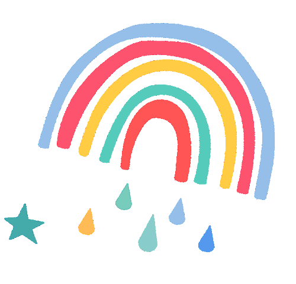

01

口播视频神器：web-video-presentation

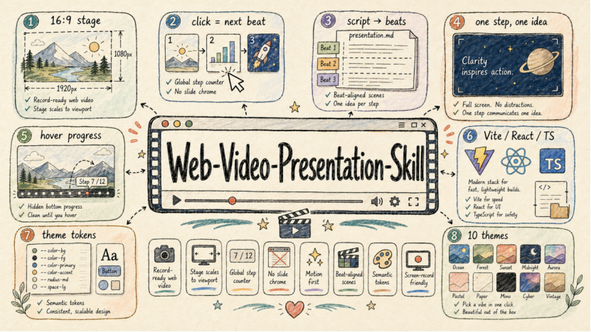

很多做自媒体的朋友可能都有这个痛点：写好了口播稿，想快速看看节奏、时长和语气，但自己录一遍太耗时。我就在想，能不能做一个只需要输入文案，就能生成模拟播放口播视频的HTML 页面，可以用鼠标或键盘随意控制播放节奏，这种特别适合录屏的「口播视频网页」效果？

没错，「Garden Skills」神器之一：web-video-presentation就是为此而生。

打开Trae的solo模式，点击左上菜单栏的小齿轮进入「设置页面」，在左侧菜单栏中选择「技能与命令」：

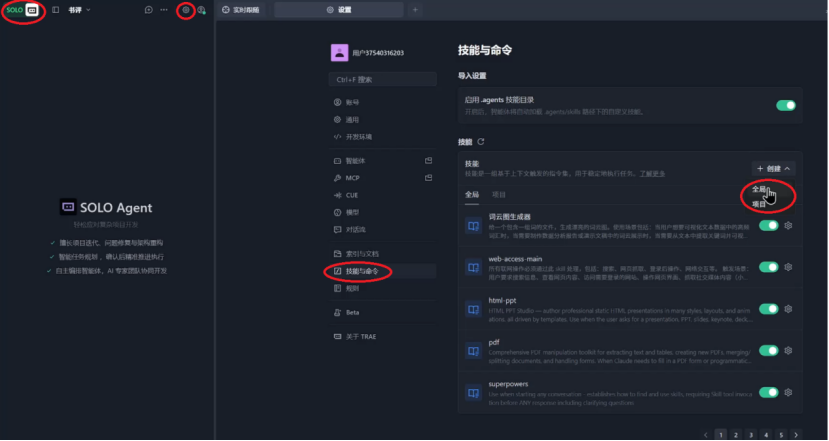

点击技能选项卡右侧的「创建」，选择「全局」模式，选择web-video-presentation所在的文件夹中的「SKILL.MD」文件，从而加载这个Skill：

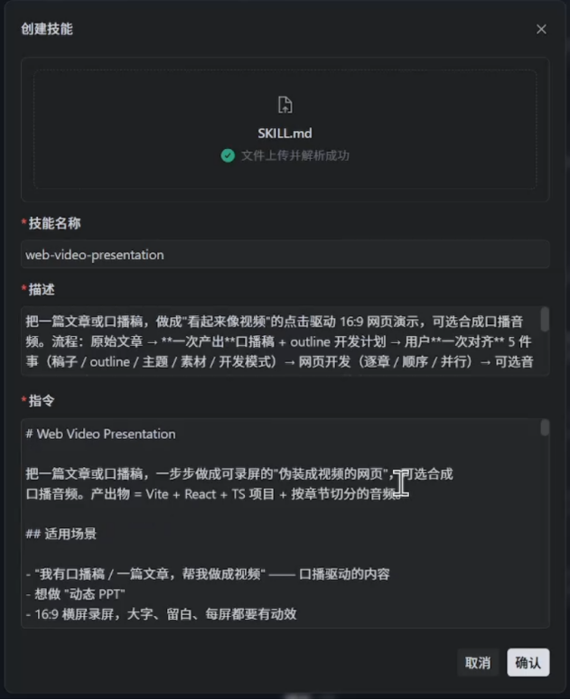

安装好Skill，就可以指定使用Skill帮你写一个口播视频网页了，比如我让AI生成一个「Superpower-skill」的口播稿：

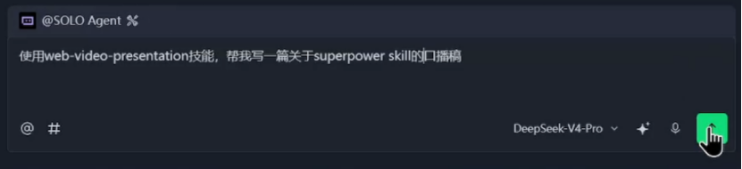

等它思考一会儿，AI会给我们完整的内容计划：

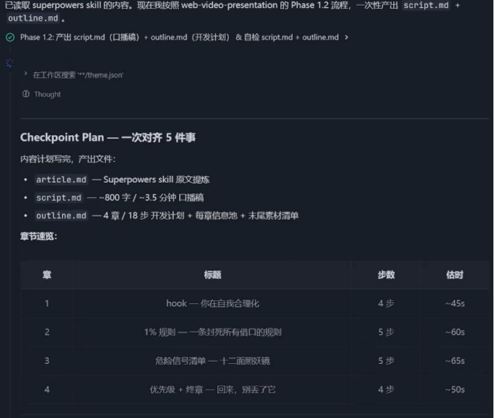

接下来我们要与AI一次对齐 5 件事：

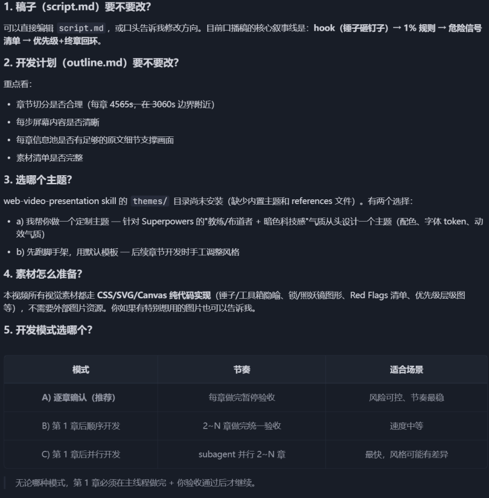

我想偷个懒，让AI帮我选，但又不想生成完所有内容后再反悔，因此开发模式我选择了「逐章确认」，这样至少在某章效果不理想时，可以及时让AI修改或重新生成。

果然第2 章有几次不满意，多生成几次就好了：

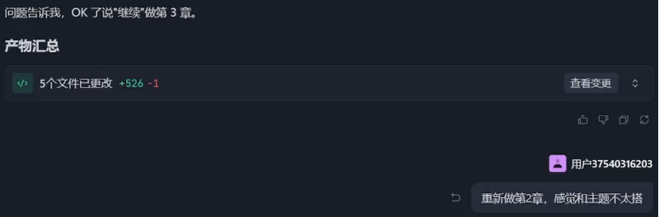

后面可以用剪映配口播或AI语音，效果简直不要太好：

**本篇文章涉及的所有完整代码文件以及Garden Skills已经打包，欢迎关注后领取。**

02

前端设计神器：web-design-engineer

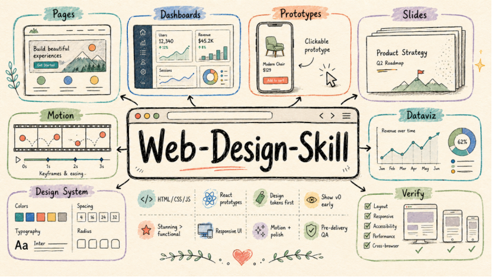

我敢说，「Garden Skills」里面的web-design-engineer skill，对于我这种不懂复杂前端代码的小白，用好了绝对可以成为前端工程师的噩梦。

**01**

**情感助手APP原型**

我的需求是这样的，设计一款陪伴型AI数字人互动的APP首页UI交互设计原型，可以根据性别、年龄、风格、声音等特征选择AI情感助手。

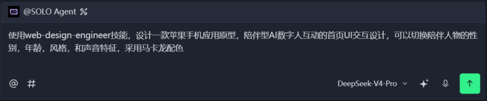

等待Trae创建好APP的PRD和技术架构文档，我们确认「继续」后进入开发阶段：

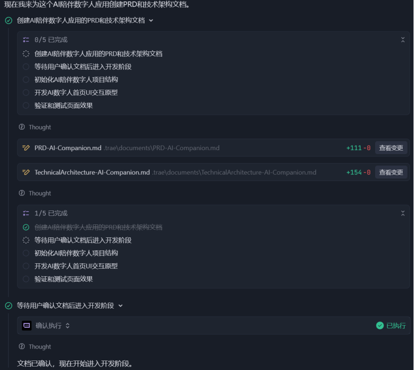

第一版的人物头像给我逗乐了，怎么是只狗？

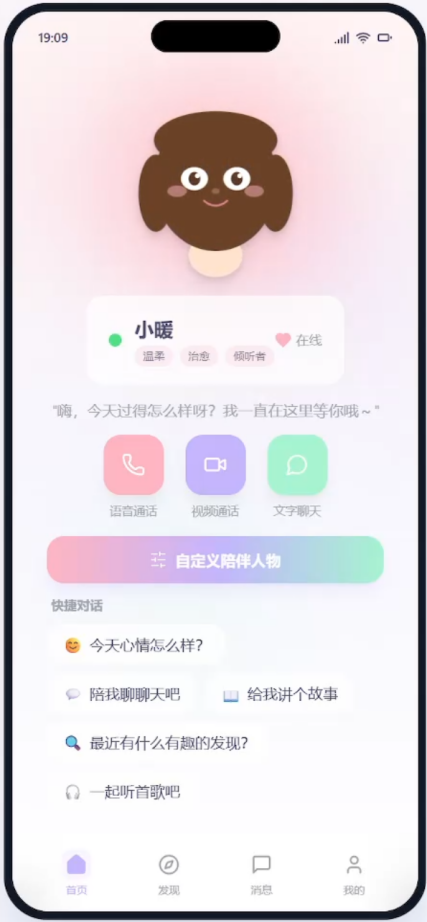

又生成了几版，始终不满意，看来用HTML画头像并不是web-design-engineer的强项，可以另辟蹊径，头像变成可设定的图片，再告诉我存放路径，这样就可以自定义头像了：

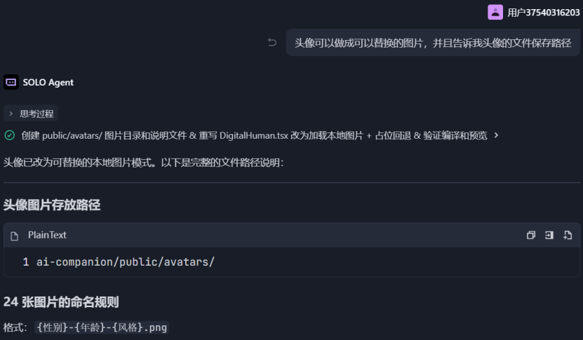

剩下的就好办了，让Chatgpt images2.0生成一批帅哥/美女的头像，用规定好的格式命名，存放到指定路径就可以了：

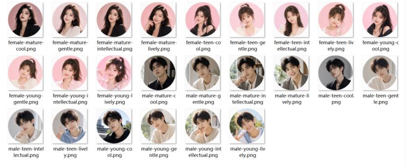

成品效果不错，后面再用AI生成后端，真可以做一款不错的情感聊天APP：

**02**

**复刻心仪网站**

不是专业的网站前端开发工程师，总描述不清楚需求，开发出的网站一股AI味儿，怎么办？

没关系，我们可以简单两步走，复刻心仪网站的前端UI设计风格。

**第一步，生成网站需求**

比方说我要复刻下面这个网站：

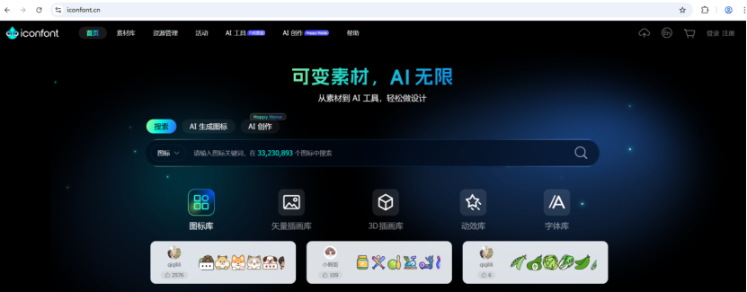

首先需要将首页和其他关键页面整页截图。如果你没有趁手的截图工具，推荐Chrome浏览器的Fireshot插件。

可以在Chrome商店里面下载，也可以在第三方获取fireshot.crx文件，然后在Chrome浏览器地址栏输入：chrome://extensions

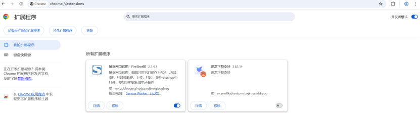

注意确保右上角的「开发者模式」是开启的状态，然后将下载好的插件直接拖进浏览器，再重新打开Chrome即可。

点击右上角的Fireshot插件，就可以捕捉整个页面了：

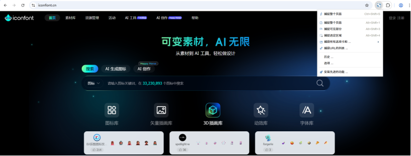

还可以用鼠标直接复制网站的所有文字，保存成TXT文本，把截图和文本直接投喂给Chatgpt，要求生成一份网站需求文档：

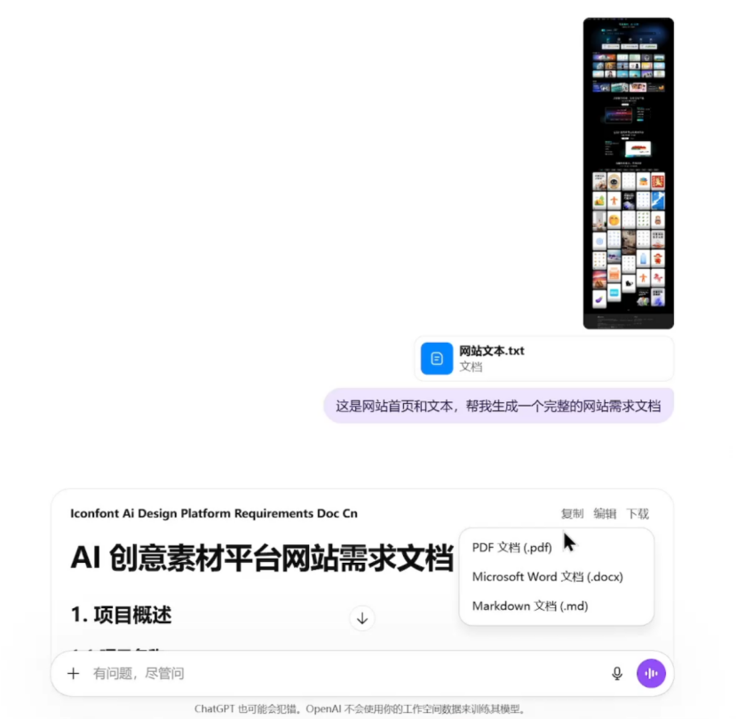

**第二步，使用web-design-engineer设计网页**

让Trae根据生成的需求文档设计网页：

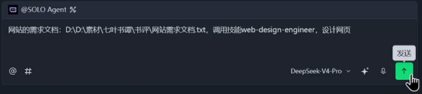

我们可以将原网站和复刻的网页设计效果进行比对，风格还原度还是非常高的：

**03**

**精美专业PPT**

让Trae调用web-design-engineer skill，轻松生成科技感十足的Gemini新产品宣传专业级PPT：

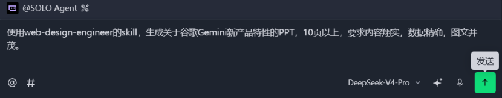

够严谨！AI同样先给你设计，确认后再干活：

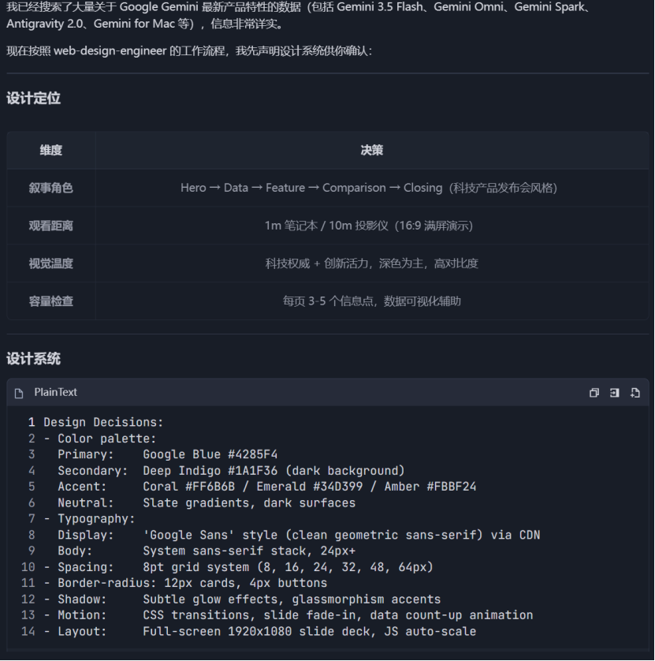

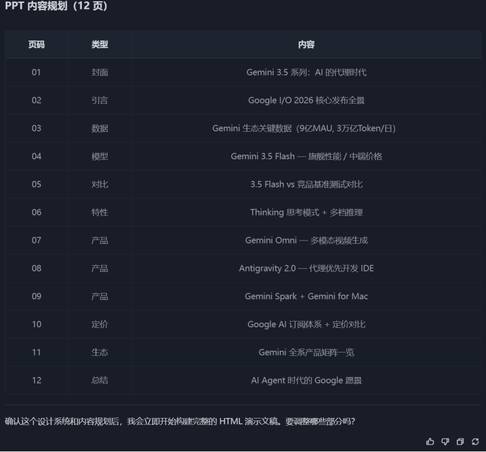

生成的Gemini新产品宣传PPT也是科技感十足，不知道的以为是谷歌发布会的官方作品：

**04**

**炫酷专业动画**

家里的领导有个需求，需要做一段纳斯达克指数2026年以来运行的轨迹动画，关键时间节点的大事件要暂停标注出来：

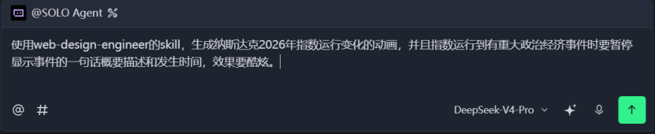

动画很快就生成出来了，整体看还可以，但第一个大事件就卡住不动了，让AI修复一下：

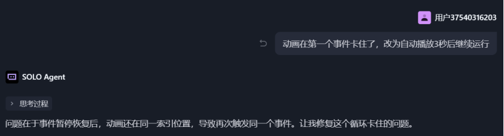

这次存在跳过关键事件的bug，同样交给AI修复：

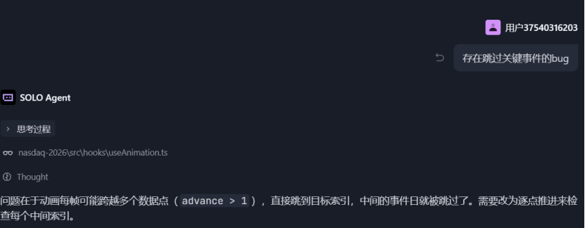

再次启动动画，发现指数运行卡顿：

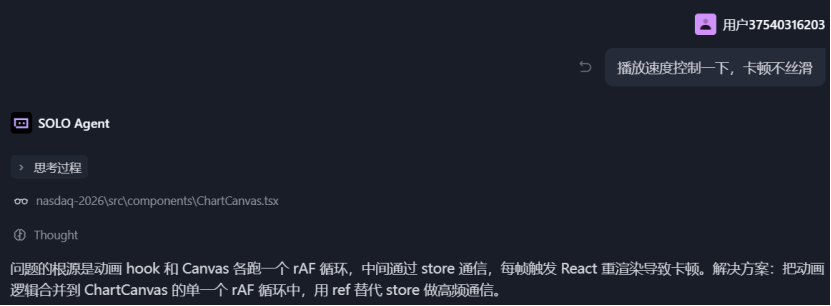

这样反复折腾几次之后，画面终于正常，效果比较酷炫，家里领导很满意。

web-design-engineer 把 AI 生成的 Web 产物从「能用」推进到「精致、克制、真正有设计判断」。它把 Agent 当作设计工程师来约束：先理解产品上下文，再声明设计系统，尽早展示第一版，让用户体验后确认效果，然后完整构建并验证结果。

web-design-engineer除了设计网页、PPT、APP、动画这些以外，还可以设计仪表盘、UI 样机、数据可视化和设计系统探索，可以说是前端设计领域妥妥的神器了。

03

绘图神器：gpt-image-2

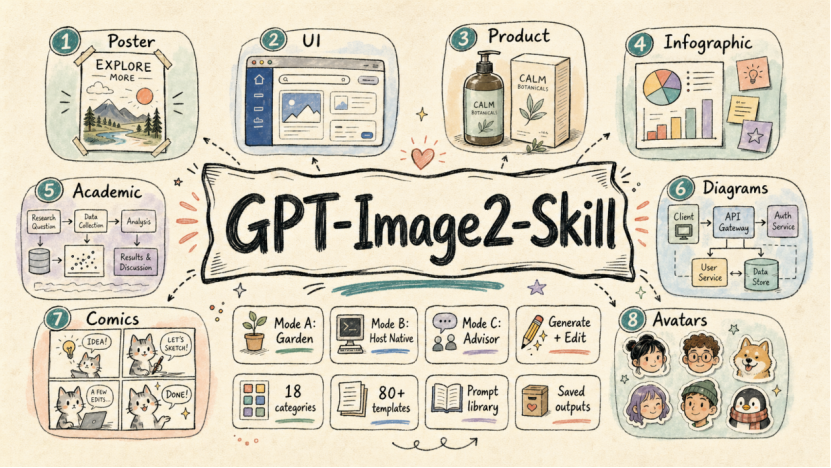

gpt-image-2 是面向 GPT Image 2 与 OpenAI 兼容图像接口的聚焦型图像生成 Skill，它能适配不同 Agent 环境：Garden 本地完整出图、委托宿主原生图像工具、或在没有图像工具时退化为纯提示词顾问。

由于我的电脑没有安装图像工具，一般在网页上使用Chatgpt，可以把它当做纯提示词顾问试试：

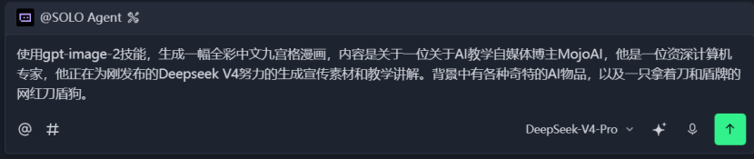

Trae给出了一个MD文件，作为Chatgpt Image2的提示词：

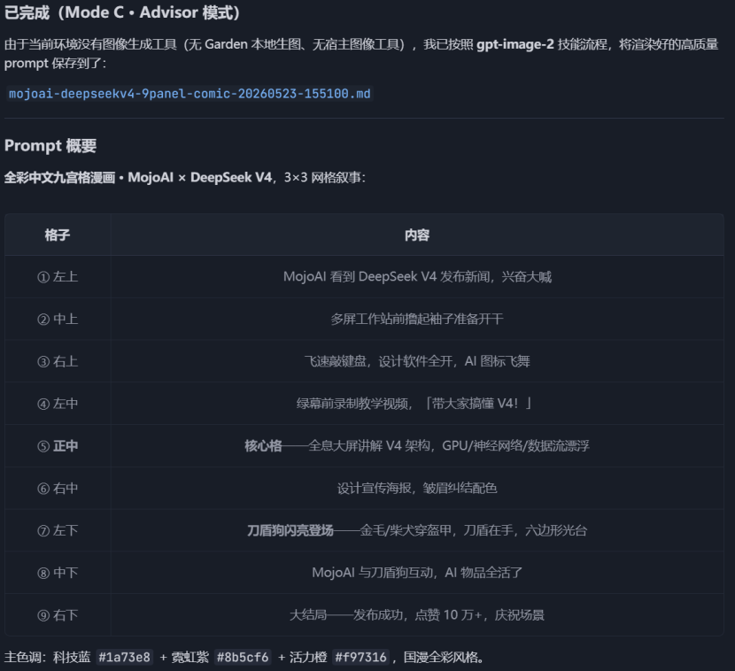

打开Chatgpt，复制MD文件中的提示词到对话框中：

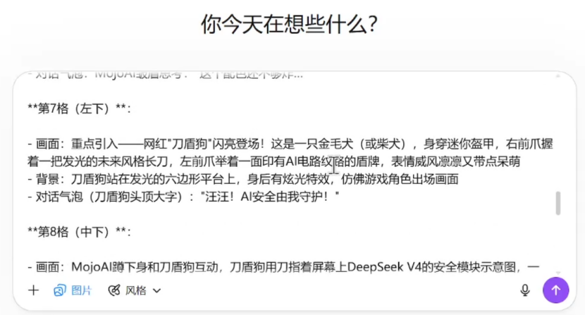

生成的结果：

04

Garden Skills教会我的事

回顾上面的项目，我发现它们共享同一套培育流程：

**1.选种**——找到一个具体的、可感知的需求或好奇心点。

**2.播种**——写一个精准的Prompt，把视觉、交互、技术边界都描述清楚。

**3.育苗**——拿到 AI 生成的V0初版代码，保存为 HTML，双击打开看效果。

**4.修剪**——找到那些「看起来差不多但就是不对劲」的地方，手动调整或者让 AI 针对性修改。

**5.收获**——把成品分享出去，收集反馈，然后开始种下一棵。

在这个过程中，我始终遵循着一个原则：**让输出物是可触摸的 HTML。** 因为 HTML 是互联网世界最基本的格式，它不需要安装任何环境，不需要服务器，不需要打包工具。你种出来的东西，任何人都能立刻打开访问。

Garden Skills 的核心不是直接产出专业级产品，而是培养一种「我可以把想法种成现实」的直觉和手感。当你习惯了这种创造方式，你就会发现，**从前那些只在脑子里闪过的点子、想法、念头，现在都有了生根发芽的可能**。

所以，不妨今天就打开你的 AI 工具，试试看，把你脑子里的那个想法种出来。也许它不够完美，也许它只能在浏览器里存活5分钟，但那种亲眼看着它从0到1长出来的成就感，只有亲自种过的人才知道。

**MojoAI**

专注于AI+硬核科技

长按二维码关注我
