> 📎 来源: [晓来在进化](https://mp.weixin.qq.com/s?__biz=MzkyMjMzMzc1Mg==&mid=2247486111&idx=1&sn=8d9748d85da156969143b87a1fe414f3&chksm=c07e9118935b08a72e9955110a9a49cbd23e2667f8207baa0f316bff57e01dd9e56af193f6cf&mpshare=1&scene=1&srcid=0511NLTeJ2DWAvxs92sOvvva&sharer_shareinfo=b54f3f188b1dc685c8a6b7cdd44384d3&sharer_shareinfo_first=b54f3f188b1dc685c8a6b7cdd44384d3) | 时间: 2026-05-11 08:16

---

hi～我是晓来！

现在，要想 Agent 干活干的好，Skills 技能肯定是少不的。

今天过来分享 9 个我认为不错的 Skills，而且也会说一下使用方式。

01 find-skills

find-skills 这个技能，我想应该是每个人必备的。

见名知义，寻找 Skills 的 Skill。

当你需要某个功能的 Skill，但是又不知道具体的 Skill 时，这个技能就十分有用了。

比如我需要数据分析相关的 Skill，可以这样说：

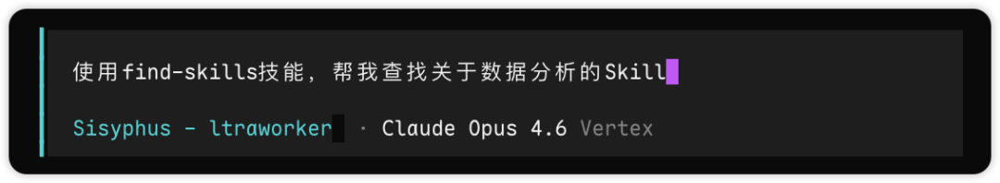

这个 Skill 可以这个开源仓库找到，地址：https://github.com/vercel-labs/skills

也可以通过这个链接：https://skills.sh/vercel-labs/skills/find-skills，看到它详细的说明

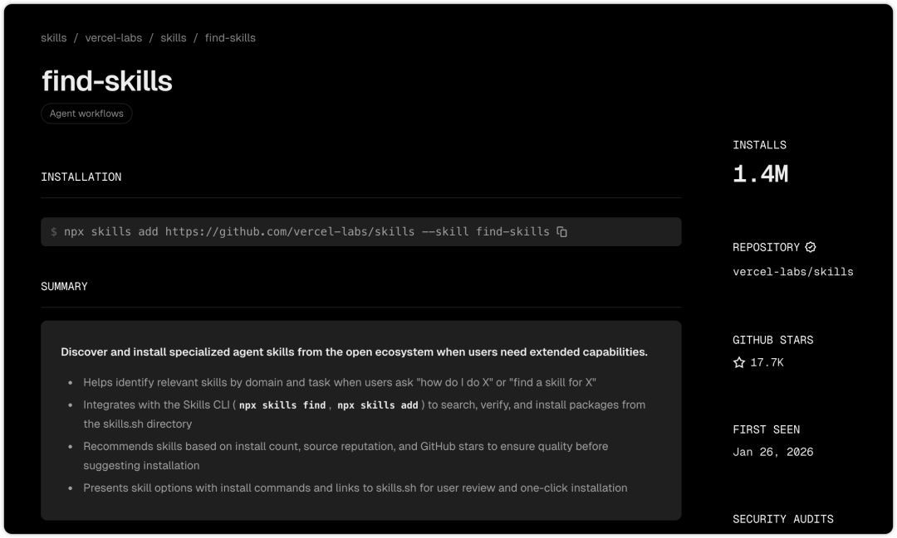

02 skill-vetter

现在，开源社区或者网上有各式各样的 Skill，而这些 Skills 有没有可能存在的安全问题，我们都不知道。

这个时候，skill-vetter 技能就很有用了，在我们不清楚某个 Skill 是否有安全隐患时，可以使用这个 Skill 先来做个安全校验。

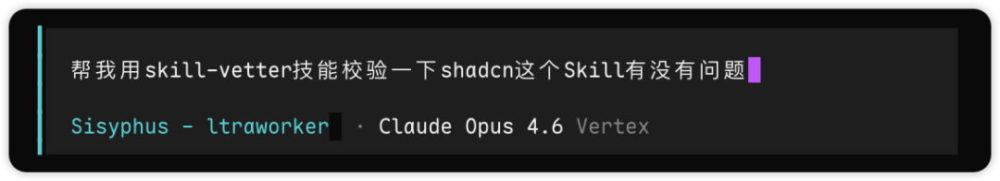

这个 Skill 的链接：https://clawhub.ai/spclaudehome/skill-vetter

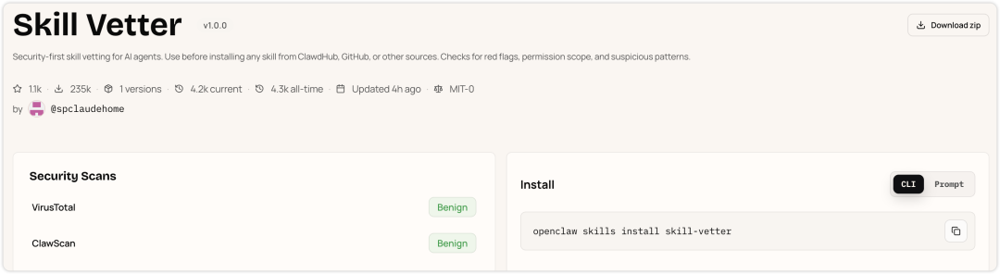

03 docx/xlsx/pptx/pdf

办公四件套，四个技能 docx、xlsx、pptx、pdf，分别用来处理 Word 文档、表格、PPT 和 PDF 文档。

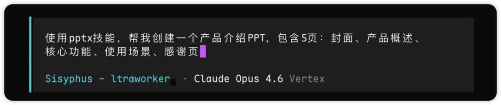

这四个技能是 Anthropic 官方出的，开源地址为：https://github.com/anthropics/skills

也可以这个链接：https://skills.sh/anthropics/skills

依次单击每个技能，可以查看详细说明。

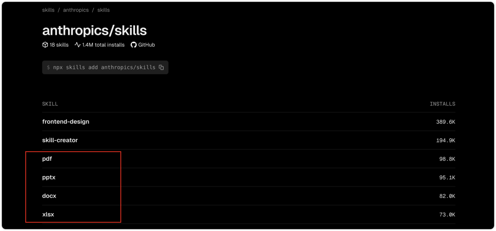

04 lark-cli

这个是飞书开源的一套 CLI 工具套装，里面有 200+ 命令和 24 个操作飞书的 Skills。

能做的事涵盖消息、文档、多维表格、电子表格、幻灯片、日历、邮箱、任务、会议等等。

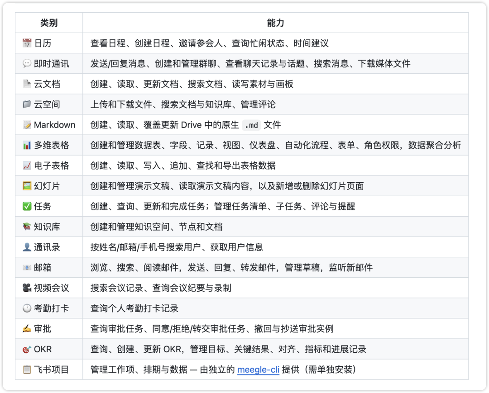

开源地址：https://github.com/larksuite/cli

05 frontend-design

直接使用 AI 开发网页，一般都带有浓浓的渐变色 AI 味，千篇一律，没有特色。

想要开发的页面有点品味？

这个 frontend-design 技能就很有用了。

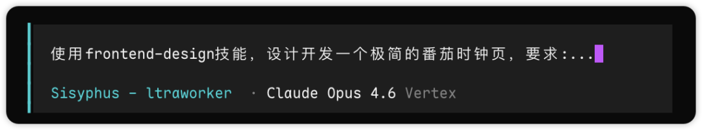

这个技能也是 Anthropic 官方出的。

可以通过这个链接查看详细说明：https://skills.sh/anthropics/skills/frontend-design

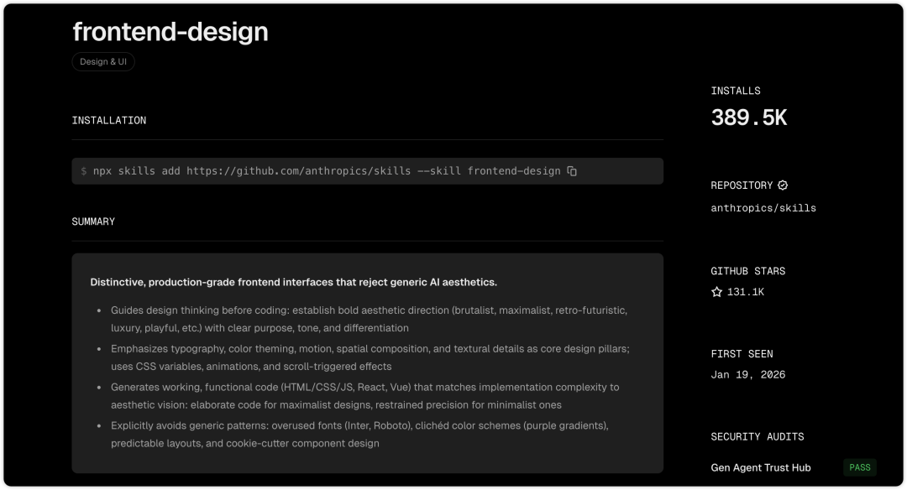

06 remotion-best-practices

如果你有创建视频的需求，我非常推荐 remotion-best-practices 这个技能。

这个 Skill 可以说是最受欢迎的技能之一了。

它是通过 React 的 Remotion 框架，来生成视频。

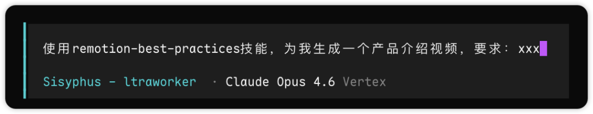

这个 Skill 的开源地址为：https://github.com/remotion-dev/skills

你可以通过这个链接查看详情说明：https://skills.sh/remotion-dev/skills/remotion-best-practices

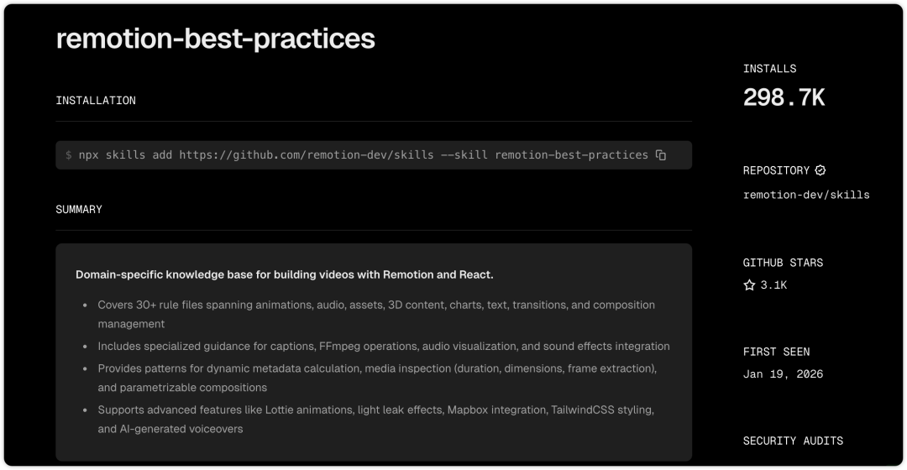

07 superpowers

这是一个 Skills 套装，里面包含多个技能，可以看作是「智能体技能框架 + 软件开发方法论」的技能组合。

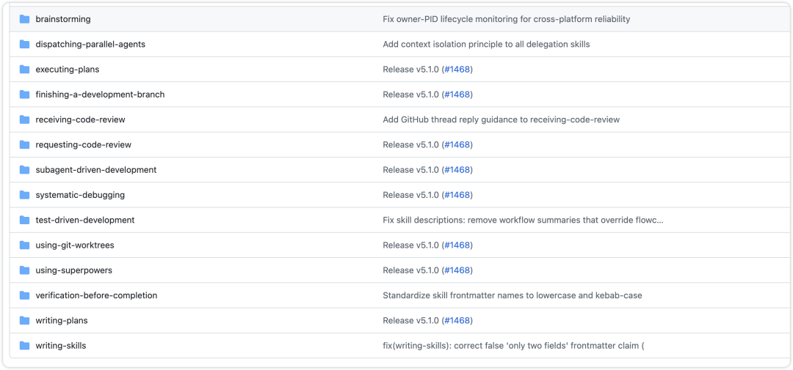

像 brainstorming 技能，在开始写代码之前，先做个头脑风暴。

然后还有技术规格规划 Skill、测试驱动开发 Skill、代码审查 Skill 等等，一套相对完整的开发流程的 Skill 套装。

开源地址为：https://github.com/obra/superpowers

也可以通过这个链接：https://skills.sh/obra/superpowers

单击每一个 Skill 查看详细说明。

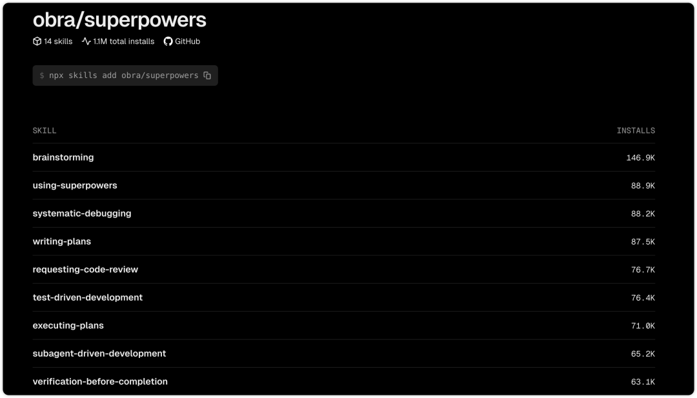

08 dokobot

我们都知道，有的时间，AI Agent 读取网页一般是通过 http 请求去获取网页的内容，实际上这种方式读取的是未渲染出来的页面代码，而并不是像我们人看到的渲染后的精美页面。

那这个时候，Agent 就没办法做到对页面的完全了解。

dokobot 就是为了解决这个问题的，它相当于给 Agent 一双真正的「眼睛」，让 Agent 通过真实的浏览器，去「真正」看到网页。

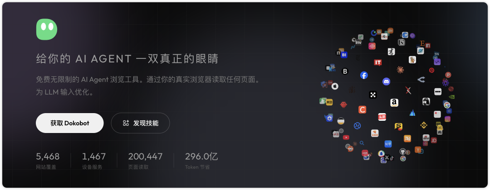

官网链接：https://dokobot.ai/zh-CN

开源地址：https://github.com/dokobot/skills

你也可以通过这个链接详细说明：https://skills.sh/dokobot/skills/dokobot

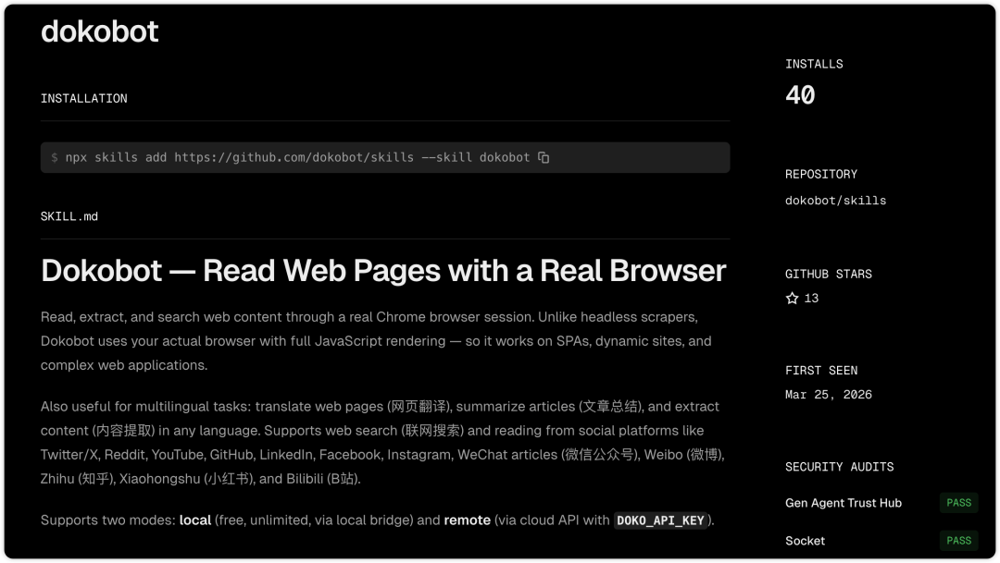

09 skill-creator

如果你对已有的 Skills 都不满意，那就自己来造一个。

skill-creator 这个技能可以帮助你以标准的 Skill 规范来创建相应的技能。

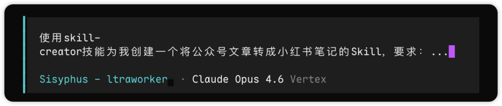

这个 Skill 也是 Anthropic 官方给出的，开源地址为：https://github.com/anthropics/skills

也可以通过这个链接查看详细使用说明：https://skills.sh/anthropics/skills/skill-creator

当下，Skills 的安装非常简单，我们可以使用任何一个 Coding Agent，如 Claude Code、Codex、OpenCode等等，或者开发工具，像字节的 Trae、腾讯的 CodeBuddy 等，来帮助我们快捷安装。

只要在对话窗口里输入命令：帮我安装 xxx 技能。

比如：

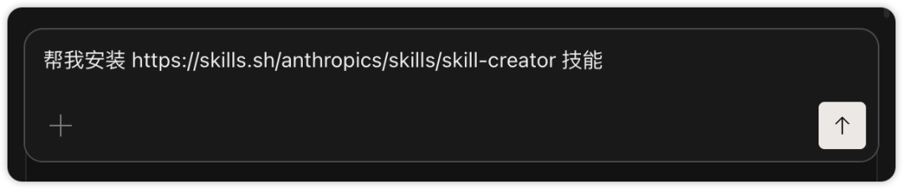

AI 会完全自动化帮你安装好。

使用的时候，只要输入命令：使用 xxx 技能，帮我做 xxx 事。

比如：

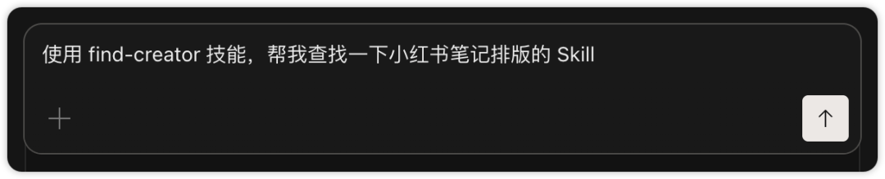

就是这么简单！

然后，如果小伙伴还有技能的需求，可以到这 3 个网站去查找：

1. https://skillsmp.com/
2. https://skills.sh/
3. https://clawhub.ai/

好了，就分享到这里，后面我也会分享更多 Skills 的相关内容，欢迎关注。

以上，如果本期内容你觉得不错，可以随手点个赞、在看，也欢迎转发给有需要的朋友，创作不易，感谢喜欢～我是晓来，再会。
