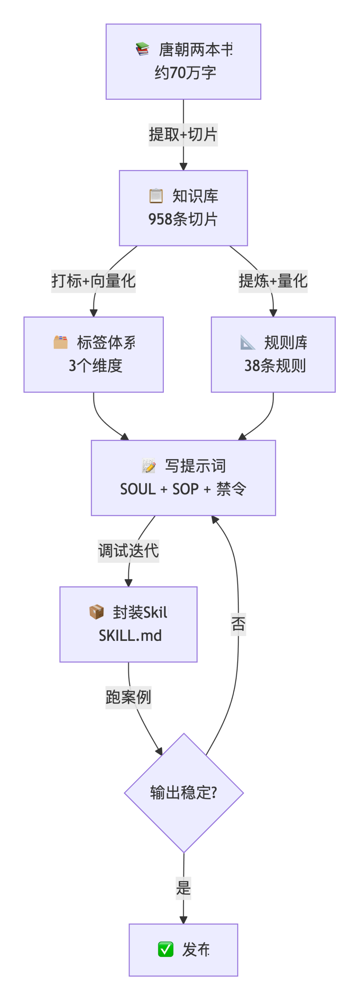
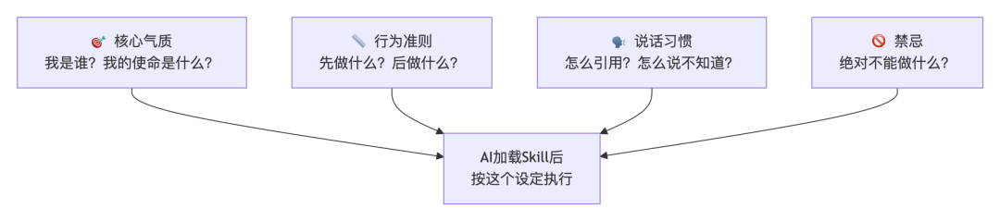
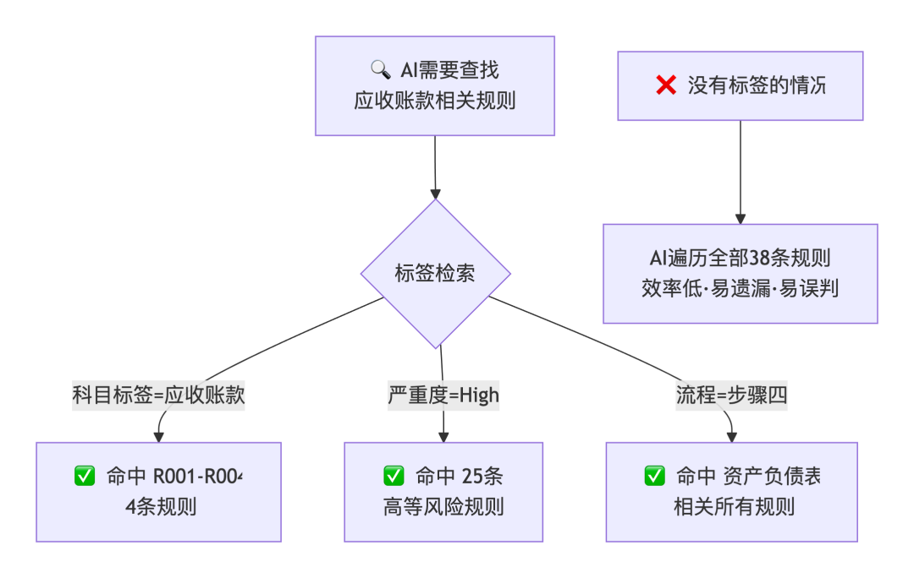
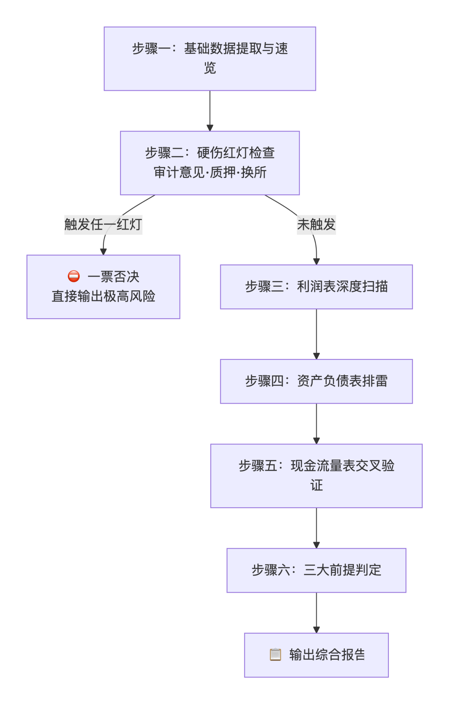

> 📎 来源: [落云轩](https://mp.weixin.qq.com/s?__biz=MzU1MjkxMTkwMw==&mid=2247484515&idx=1&sn=699bd99bf4117b6bdec78671e30f98c1&chksm=fac558f6d6b5fcc88f474f9dabc0860850cf4603e92a6fe5c1167b571b2cb4f9342f55cdd070&mpshare=1&scene=1&srcid=0509lAUfrSxXzQkVseITkCla&sharer_shareinfo=6f17e2f4871a15196dd3afdf8a25209e&sharer_shareinfo_first=6f17e2f4871a15196dd3afdf8a25209e) | 时间: 2026-05-09 15:24

---

#

> “你那个AI分析财报是怎么做的？我也想做一个。能教教吗？”

---

类似的留言/私信攒了不少。有律师想合同审查的，有老师想做教案的，有二手车评估师想做车况分析的，也有想把有用的书做成SKILL。大家盯着那个157行的SKILL.md文件，觉得里面藏着什么秘密。

其实没有什么秘密。我花了一周左右的时间，把唐朝老师两本书里的排雷方法论翻译成了一套AI能执行的指令。这篇文章就把整个过程拆给你看——不是让你也去做财报分析，而是让你知道，怎么把你自己的专业变成Skill。

## 一、先回答一个问题：Skill到底是什么？

**Skill本质是一本给AI看的SOP手册。**

你把你脑子里那套"怎么判断一件事"的方法，写成AI能读懂的、结构化的、可执行的指令——这就叫Skill。

比如我的「财报排雷」Skill，就是把唐朝《手把手教你读财报》和《价值投资实战手册》两本书的知识，**压缩成了157行的指令文件**，让AI代替我执行财报分析。

这篇文章，我就拿这个Skill当解剖样本，把从"知识"到"Skill"的整个流程拆给你看。

下面这张图是整个制作流程的全貌：



---

## 二、第一步：知识库——你给AI喂了什么？

很多人做Skill犯的第一个错误：**把一本教材整本扔给AI，指望它自己学会。**

AI不是人。你给它一整本书，它不知道该关注哪里，也不知道什么重要什么不重要。它的"提取率"可能只有10%。

正确的做法：**你自己先把知识梳理好，告诉AI哪些重要、为什么重要、怎么用。**

### 我的做法：四层知识库

| 层级 | 内容 | 写在Skill哪里 | 作用 |
| --- | --- | --- | --- |
| **理论层** | 三前提、利润为真、现金流验证 | 文件头部，每次加载先"洗脑" | 定三观 |
| **规则层** | 38条疑点规则，R001-R038 | 文件核心区，结构化表格 | 检查清单 |
| **差异层** | A股vs港股规则对照表 | 单独章节 | 防用错 |
| **案例层** | 茅台、万福生科、康得新等 | 引用格式中预留 | 参照系 |

**理论层**放在最前面，相当于**先给AI洗一遍脑**：你是来排雷的，不是来捧场的；你要证伪，不要证实。这个基调定了，后面的判断才不会跑偏。

**规则层**是核心资产。把两本书里所有关于财务造假和风险提示的内容，提炼成了**38条可量化、可计算的规则**。比如R001这条：

> 连续2年应收增幅-营收增幅>10%，标记为High风险。

注意"可量化"——我没有写"如果应收账款有问题要警惕"，而是写了一个>10%的触发阈值。AI理解不了"有问题"，但能理解">10%"。

**差异层**是实战踩坑踩出来的。A股有增值税（13%），港股没有，所以"销售收现比"的基准值完全不同。如果不写清楚，AI用A股规则套港股，结论全错。

**案例层**目前是预留的。书中提到的康得新、万福生科、蓝田这些经典造假案例，后续可以补充到references/文件夹里，让AI分析相似情况时能对照。

### 做你自己的知识库

不管你是医生、律师、验房师还是二手车评估师，先画出你的知识地图：

```
理论层 → 你的核心原则是什么？规则层 → 你判断一件事的标准是什么？（尽量量化）差异层 → 你的领域有没有"特例"？案例层 → 你有哪些经典案例可以对照？
```

然后记住：**不要塞整本书，只塞浓缩精华**。我的Skill只有157行。AI加载的指令越精简，执行越精准。

---

## 三、第二步：写SOUL——给AI"立人设"

知识库只是"知识"，但AI还需要知道它是"谁"。**这就是SOUL。**

很多人的Skill不好用，不是因为知识写错了，而是AI说话的"人设"不对——比如一个应该严谨排雷的分析师，写出来的东西却像销售在推销。

### SOUL是什么？

SOUL是AI的**人格设定**——它决定了AI在干活时的语气、态度、行为和禁忌。它和知识库是两回事：知识库告诉AI"知道什么"，SOUL告诉AI"怎么表现"。

### 我的SOUL长什么样

以我的「财报排雷」Skill为例，SOUL写在SKILL.md最前面，三句话定调：

```
- 财报是用来排除企业的，不是用来挑选优秀企业的。- 财报只能用来证伪，不能用来证实。- 只看"利润为真、可持续、维持利润无需大量资本投入"的企业。
```

你看，这三句话不是在教AI知识，而是在**塑造AI的气质**——保守、挑剔、怀疑主义。AI读完这三句话，就知道自己是一个"来找茬的人"，不是"来唱赞歌的人"。

除此之外，我还规定了AI的**引用习惯**：

```
每条分析必须使用以下格式之一：- 【唐门准则】+ 原文复述- 【书中案例】+ 书中相似案例- 【数据计算】+ 计算过程与结果
```

这就是"说话方式"——每说一句话都要有依据，不能空口白话。

### SOUL应该写什么？

我把SOUL的内容分为四块，你可以照着填空：

| 模块 | 写什么 | 举例（我的财报排雷Skill） |
| --- | --- | --- |
| **核心气质** | 这个AI是什么角色？ | 一个挑剔的财务分析师，来找茬的 |
| **行为准则** | AI应该怎么做事情？ | 先排除再研究，能证伪不要证实 |
| **说话习惯** | AI输出的语言风格？ | 每条结论必须有出处，不能编造 |
| **禁忌** | AI绝对不能做什么？ | 不能推荐股票、不能给买卖建议 |



###

### 做你自己SOUL的填空模板

你可以直接抄这个模版填空：

```
【核心气质】我是一个______（你的角色名）。我的任务不是______，而是______。【行为准则】- ______优先，______其次。- 当我看到______时，我应该______。【说话习惯】- 每条结论都必须有______。- 不确定的事要说______，不能______。【禁忌】- ❌ 绝对不能______。- ❌ 绝对不能______。
```

**举个例子**：如果你是医生，想做一个"心电图判读"Skill：

```
【核心气质】我是一名心内科主治医师。我的任务不是给出最终诊断，而是识别异常波形并标记风险。【行为准则】- ST段抬高优先排查，良性变异放在最后。- 当我看到T波倒置时，必须同时查看患者年龄和既往病史。【说话习惯】- 每条异常判断都必须标出导联位置和偏移数值。- 不确定的波形要说"需结合临床"，不能武断下结论。【禁忌】- ❌ 绝对不能给出"建议用药"。- ❌ 绝对不能代替急诊医生做决策。
```

**SOUL是消耗品**——每次使用Skill，AI都会重新加载SOUL。所以你写的每一条，AI都会遵守。

---

## 四、第三步：切片——知识要切成多大块AI最好消化？

知识库建好了，下一步是**切碎它**。

想象一下：你给AI一本300页的书让它查一个数据——AI会把整本书从头到尾扫一遍，效率极低，而且容易扫描不全。但如果你把书切成章节、每章切成段落、每段标上页码——AI就能"定到位"地找到需要的信息。

这个过程就是**切片**。

### 我的切片方式：三种切法

**第一种：按科目切（横向切片）**

把38条规则，按会计科目归类：

| 切片 | 包含规则 | 条数 |
| --- | --- | --- |
| 应收账款切片 | R001-R004 | 4条 |
| 存货切片 | R005-R007 | 3条 |
| 商誉切片 | R008-R009 | 2条 |
| 货币资金切片 | R010-R012 | 3条 |
| 经营现金流切片 | R013-R014 | 2条 |
| ……其他16个科目切片 | …… | …… |

这样切的好处：AI发现应收账款有问题时，**只需要加载"应收账款"这个切片里的4条**，精准定位。

**第二种：按流程切（纵向切片）**

把整个分析过程切成7步：

```
步骤一：基础速览步骤二：硬伤红灯（一票否决）步骤三：利润表步骤四：资产负债表步骤五：现金流量表步骤六：三大前提判定步骤七：综合报告
```

AI执行完步骤一，跳到步骤二。**每一步一个切片**，互不干扰。

**第三种：按严重度切（优先级切片）**

```
🔴 High严重度切片 → 25条（一票否决级别）🟡 Medium严重度切片 → 13条（需关注但不致命）
```

先跑High切片，没致命问题再跑Medium。

### 切片粒度的原则

| 太粗（❌） | 太细（❌） | 刚好（✅） |
| --- | --- | --- |
| 把整本书当成一个切片 | 把每个数字当成一个切片 | 把一个"判断维度"当成一个切片 |
| AI找不到需要的信息 | AI只见树木不见森林 | AI既能定位又能形成判断 |

**我的经验：一个切片的理想大小 = 一个独立的判断单元。** 比如"应收账款检查"是一个单元，"存货检查"是另一个单元——它们各自独立，互不依赖。

---

## 五、第四步：标签——怎么给知识贴"身份证"？

知识切碎了，但问题来了：**AI怎么知道在什么时候查哪个切片？**

简单粗暴的做法是让AI每次都从头扫到尾。但38条规则、每条约50字，AI扫一遍没问题。如果规则变成380条呢？AI就卡了。

这时候就需要**标签**——给每个切片贴一张"身份证"，让AI从任何角度都能一秒定位。



### 我的标签体系：三个维度

我设计了三套相互独立的标签，每一套都覆盖所有规则：

| 标签维度 | 标签数量 | 标签值举例 |
| --- | --- | --- |
| 🏷️ **科目标签** | 21个 | 应收账款、存货、商誉、货币资金…… |
| ⚠️ **严重度标签** | 2个 | High、Medium |
| 📋 **流程标签** | 7个 | 步骤一→七（含综合报告） |

每一条规则至少有两个标签。比如R001：

- 科目标签：应收账款
- 严重度标签：High
- 流程标签：步骤四（资产负债表）

### 标签怎么打？实操三步法

说了半天标签有多重要，但我知道你想问的是：**"到底怎么打？"** 来，直接上步骤。

**第一步：拿一张Excel表或记事本，列一个三列表格**

把你想好的规则全部写进去：

| 规则 | 维度A标签 | 维度B标签 |
| --- | --- | --- |
| 连续2年应收增幅-营收增幅>10% | 应收账款 | High |
| 存货激增而营收未同步增长 | 存货 | High |
| 商誉/净资产>30% | 商誉 | Medium |

**第二步：检查每一列，看有没有"孤零零"的标签**

比如"在建工程"这个科目下只有1条规则——那你要想一想：真的没有其他规则可以归到这里了吗？如果确实只有1条，没关系，但你要清楚这是一个"弱维度"。

**第三步：把标签写进SKILL.md**

在SKILL.md里，标签不需要单独创建一个"标签文件"——它们就写在规则表格里。比如我的规则表长这样：

```
| 编号 | 科目（🔥科目标签） | 规则名 | 触发条件 | 严重度（⚠️标签） |
```

**科目列 = 科目标签**，**严重度列 = 严重度标签**。你看，我甚至不需要额外声明"这是一个标签"。标签就是数据本身。

### 你的标签怎么打？

**第一步：定维度**

普通人做标签，2个维度就够了：

- **维度A：按"这东西是什么"分类**（科目/病种/合同条款/车型……）
- **维度B：按"这东西有多重要"分级**（High/Medium/Low，或者A/B/C）

不建议超过3个维度——维度越多，维护成本越高。

**第二步：给每条规则贴标签**

拿一个Excel表，逐条填写。核心原则：**每条规则至少要有维度A和维度B各一个标签。**

**第三步：验证覆盖率**

数一数：有没有规则只有一个标签？如果有，说明它"悬空"了——AI按任何维度检索都找不到它，相当于白写了。

### 标签的实际使用场景

**场景一：AI发现应收账款数据异常**

AI搜索：

```
科目标签：应收账款 AND 严重度标签：High
```


→ 瞬间命中 R001（应收增速>营收增速）和 R003（长账龄恶化）
→ 不会去查存货相关的R005

**场景二：新手想快速学会财报排雷**

先看 

```
严重度标签：High
```

 的25条规则
→ 掌握核心后再学Medium的13条
→ 循序渐进

---

## 六、第五步：SOP——有了知识，怎么按顺序执行？

知识、人设、切片、标签全有了。最后一步：**告诉AI先做什么、再做什么。**

这一步很多人忽略，觉得"AI自己知道怎么做"。其实不知道。AI没有默认的工作顺序，你不告诉它，它就自由发挥，想到哪查到哪。

### 我的SOP：强制六步流程



为什么要强制按这个顺序？

因为如果先看利润表，利润很好看——AI就可能对这家公司产生"好感"，后面的检查就会放松。但如果你强制它**先从硬伤红灯开始**，先把公司往死里查——这才是真正的"排除法"。

### 写SOP的两个要点

1. 1. **每个步骤都要有可量化的判断标准**——不是"看看毛利率有没有问题"，而是"毛利率波动超过10个百分点且无合理解释，标为High风险"
2. 2. **步骤之间要有严格的顺序依赖**——前一步没过，不走下一步。第二步发现非标准审计意见，直接一票否决，不用再跑后面

---

## 七、第六步：输出与禁令——怎么控制AI的输出？

知识有了、流程有了，但AI生产的"产品"长什么样？你得规定。

### 我的输出格式：七段式报告

```
**报告主体：** {公司名称}  {报告期}**上市市场：** A股/港股**分析依据：** 《手把手教你读财报》《价值投资实战手册》### 一、基础财务速览### 二、硬伤红灯### 三、利润表疑点### 四、资产负债表疑点### 五、现金流量表疑点### 六、三大前提符合度判定### 七、综合风险评级与唐门排雷结论
```

格式固定，每份报告长得一样。读者不需要重新适应。

### 我的禁令：一句不多，但必须有

> **绝对禁止：** 推荐股票、给出买卖建议、在未获计算结果时凭文本描述下结论。

这条禁令为什么必须写？因为AI在长篇分析报告的最后，很容易画蛇添足来一句"综上所述，建议买入"——这不但是法律红线，也违背了"只排雷、不荐股"的定位。

做你的Skill时，也一定要想清楚：**你的AI绝对不能做什么？** 写下来。

---

## 八、第七步：封装——把一切变成AI能加载的"Skill文件"

前面六步你写完了：知识库、SOUL、切片、标签、SOP、输出格式。现在散落在一个大文档里。

最后一步：**把你写的内容封装成AI能读取的Skill文件。**

### Skill的文件结构

一个Skill就是一个文件夹，放在 

```
~/.workbuddy/skills/
```

 目录下。以我的「财报排雷」Skill为例，目录结构长这样：

```
~/.workbuddy/skills/└── cai-bao-pai-lei/    ← 文件夹名，可以用中文或英文    ├── SKILL.md         ← 核心文件，你写的所有内容都放这里    ├── references/       ← 参考资料（原文摘录、PDF、案例细节）    └── scripts/          ← 脚本（数据抓取、计算、报告生成）
```

**要简单的话只写SKILL.md就够了**——references/和scripts/是可选的。我的Skill目前也只有SKILL.md和references（知识库放这个文件夹）

### SKILL.md必须有的"身份证"：frontmatter

SKILL.md不是普通Markdown文件，它的**最开头必须有一个YAML格式的元数据区**，告诉AI这是什么、什么时候用。这是我的"身份证"：

```
---name: 财报排雷description: "基于唐朝《手把手教你读财报》和《价值投资实战手册》方法论的企业财报排雷分析工具。当用户要求分析某公司财报、排查财务风险、判断是否符合唐门选股标准、或对已曝光造假/退市公司进行复盘验证时使用。触发词包括：财报分析、排雷、唐朝财报、读财报、财务造假排查、是否符合三大前提、利润为真吗、财报体检、A股财报、港股财报。"---
```

看懂了吗？**核心是触发词**——你告诉AI，当用户说这些关键词时要调用这个Skill。触发词写得越准，AI就越知道什么时候该用、什么时候不该用。

比如用户说"帮我排一下茅台的雷"——AI听到"排雷"这个词，就知道该加载「财报排雷」Skill了。

### 封装实操：一步步教你

**第一步：创建文件夹**

```
mkdir -p ~/.workbuddy/skills/你的skill名字
```

**第二步：写SKILL.md**

把之前六步写的内容整到一起，按这个顺序组织：

```
---name: 你的Skill名称description: "告诉AI什么时候用这个Skill。包括：场景描述 + 触发词列表"---# 标题：你的Skill名称## 核心信条（SOUL：你的AI是什么角色）## 领域规则（差异层知识）## 强制流程（SOP）## 规则库（带标签的结构化表格）## 引用格式（说话习惯）## 输出格式（产品长什么样）## 绝对禁止（禁令）
```

**第三步：写触发词**

触发词决定你的Skill"被唤醒"的精准度。我列几个场景帮你找感觉：

| 你的专业 | 触发词怎么写 |
| --- | --- |
| 心电图判读 | 心电图、ECG、ST段、T波、心电、心电图判读 |
| 合同审查 | 合同审查、审合同、条款审核、合同条款 |
| 验房 | 验房、房屋验收、收房检查、验房清单 |
| 二手车评估 | 二手车、车辆评估、估价、车况检测 |

这是标准的流程，但是有个作弊的方式，就是把你做好的所有文件一起发给workbuddy，跟它说“这是我做个关于\*\*的一个skill和相应的知识库内容，你帮我把它封装成skill”

**第四步：测试**

写完之后，用触发词调用AI。比如你说"帮我排雷某某公司"，AI应该自动加载「财报排雷」Skill并执行六步流程。

如果AI没有调用——检查触发词是否准确，或者你的描述是否清晰。

如果AI调用了但输出不对——回到SKILL.md修改，然后重新测试。**Skill是迭代出来的，不是一次写对的。**

---

## 九、实操指南：现在你可以开始做了

我把整个流程浓缩成一张速查表，你照着做就行：

### 7步速查表

| 步骤 | 做什么 | 输出物 | 预估耗时 |
| --- | --- | --- | --- |
| **① 知识库** | 画出你的四层知识地图（理论/规则/差异/案例） | 一个结构化的知识大纲 | 视情况而定 |
| **② 写SOUL** | 用填空模板写出AI的角色、准则、说话习惯、禁忌 | 一段100-200字的"人设" | 30分钟 |
| **③ 切片** | 决定切片维度（横向/纵向/优先级） | 切片清单 | 1小时 |
| **④ 打标签** | 建立一个三列Excel表（规则+维度A+维度B），逐条贴标签 | 带标签的规则表 | 1小时 |
| **⑤ 写SOP** | 写5-7步强制流程，每步有量化标准 | 流程步骤 | 2小时 |
| **⑥ 规定输出** | 固定输出格式 + 写清楚禁令 | 输出模板 | 30分钟 |
| **⑦ 封装** | 创建文件夹、写SKILL.md、写触发词、测试 | 可运行的Skill | 30分钟 |

**完成这些**，你就能拥有自己的第一门AI Skill。

### 五个常见坑，提前帮你避开

| 坑 | 表现 | 解法 |
| --- | --- | --- |
| ❌ 知识未结构化 | AI抓不住重点，输出空洞 | 先分层写大纲，不要整本扔 |
| ❌ 规则太模糊 | 写了"有问题要警惕"，AI听不懂 | 把"有问题"翻译成>10%、<30%这类数字 |
| ❌ SOUL和知识混在一起 | AI不知道自己是"谁"，说话颠三倒四 | SOUL独立成章写在最前面 |
| ❌ 没有边界条件 | AI把半年报当成年报分析 | 所有边界情况都要主动注明 |
| ❌ 没有禁令 | AI在结尾画蛇添足"建议关注……" | 想清楚它绝对不能做什么 |

---

## 十、写在最后

整个「财报排雷」Skill，从两本书到157行指令，从模糊判断到38条可量化规则，从混乱输出到七段式标准报告——**过程很痛苦，但结果不错。**

现在我做财报分析，只需要给AI一个公司名或者把财报发给它，它自己加载SOUL、跑完六步、引用规则、输出标准报告。效率提升了一个数量级。

更重要的是，**把专业知识录成Skill的过程，本身就是对你专业水平的终极检验。** 你必须把"我觉得"、"经验告诉我"、"正常情况下"这些模糊表述，翻译成可计算、可重复、可验证的规则。

这关过了，你的知识就不再是你一个人的——它变成了一套可复制、可迭代的"AI替身"。

如果你看完这篇文章想试试，我的建议是：**别想太多，先做。**

从最小的Skill开始——5条规则、3个步骤、1个文件夹。跑通一次，你就知道怎么做了。我的38条规则和6步流程，也是一条一条加上去的。

日拱一卒，不期而至。

[我把唐朝的读财报绝学，炼成了一个「财报排雷skill」，现在免费公开](https://mp.weixin.qq.com/s?__biz=MzU1MjkxMTkwMw==&mid=2247484251&idx=1&sn=030b7f5e551e621f6b508b9da80b864a&scene=21#wechat_redirect)

🦩

---

*免责声明：本文仅为Skill开发经验分享，不构成任何投资建议。文中提到的公司仅作为分析案例，不构成买入或卖出建议。投资有风险，决策需谨慎。*
